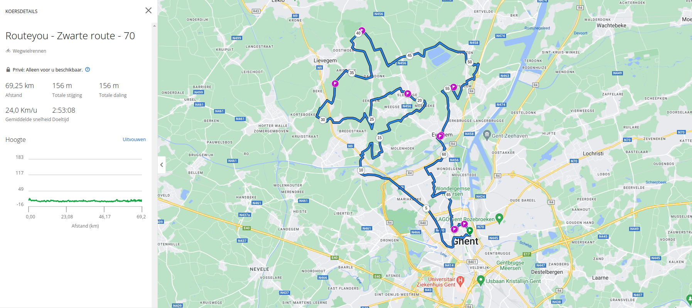

---
hide:
  - toc
---

# Bike routes around Gent.
## 20km
=== "Route1"
    Explain step.

    

=== "Route2"
    Explain step.

    

## 30km
=== "30km"
    Explain step.

    

## >=60km
=== "65km"
    Explain step.

    

