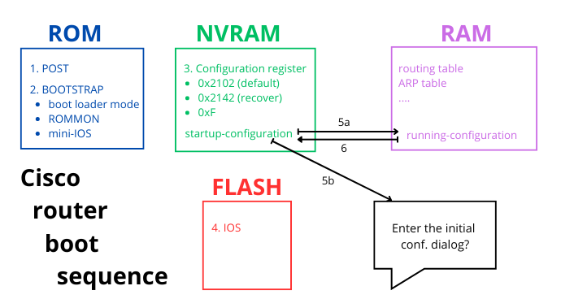

# Cisco switch and router boot sequence

## General overview




## Step-by-step boot process

### Power-On Self Test (POST)
- When a Cisco router or switch is powered on, it performs a Power-On Self Test (POST) to verify the integrity and functionality of its hardware components, including:
    - CPU
    - memory
    - network interfaces
    - detect new installed components (added memory, ...)

- A switch, for example, checks its system LEDs during this phase, and the System LED will initially be amber. Because a full operating system has not yet been loaded when the switch performs POST, it needs a way to tell the human user if POST worked well, if it failed partly, or if the switch is totally unusable. To communicate the status, the switch uses the light-emitting diodes (LEDs) on the front panel of the switch. During POST, these LEDs have one set of meanings; during normal operation, the LEDs are used for other purposes.

- The POST is stored in and run from ROM.

=== "Switch"
    POST messages on the console.

    ``` title='' hl_lines="0"
    POST: CPU MIC register Tests : Begin
    POST: CPU MIC register Tests : End, Status Passed

    POST: PortASIC Memory Tests : Begin
    POST: PortASIC Memory Tests : End, Status Passed

    POST: CPU MIC interface Loopback Tests : Begin
    POST: CPU MIC interface Loopback Tests : End, Status Passed

    POST: PortASIC RingLoopback Tests : Begin
    POST: PortASIC RingLoopback Tests : End, Status Passed

    POST: PortASIC CAM Subsystem Tests : Begin
    POST: PortASIC CAM Subsystem Tests : End, Status Passed

    POST: PortASIC Port Loopback Tests : Begin
    POST: PortASIC Port Loopback Tests : End, Status Passed
    ...
    ```

=== "Router"
    No such thing visible on a Cisco 1941 router.

    ``` title='' hl_lines="0"
    ...
    ...
    ```

### Boot loader initialization
- The "boot loader", also called "boot loader program" or "boot loader image" or "system bootstrap" or "bootstrap", is the first program executed after "POST". 
 It:
    - initializes the basic hardware components, including the CPU, memory and interfaces
    - provides basic system functions such as access to the file system in "flash" memory and network interfaces
    - locates the "IOS image" in a certain order, depending on the value of the "configuration register".

- It is a small, specialized piece of software/program (no IOS!) typically stored in and run from "flash" memory or a dedicated "boot ROM".

=== "Switch"
    Boot loader in action.

    ``` title='' hl_lines="0"
    Boot Sector Filesystem (bs) installed, fsid: 2
    Base ethernet MAC Address: b0:c5:3c:26:a0:80
    Xmodem file system is available.
    The password-recovery mechanism is enabled.
    ...
    ...
    Switch#show version
    ...
    ROM: Bootstrap program is C2960 boot loader
    BOOTLDR: C2960 Boot Loader (C2960-HBOOT-M) Version 15.0(2r)EZ1, RELEASE SOFTWARE (fc1)
    ...


    ...
    ```

=== "Router"
    Boot loader in action.

    ``` title='' hl_lines="0"
    System Bootstrap, Version 15.0(1r)M16, RELEASE SOFTWARE (fc1)
    Technical Support: http://www.cisco.com/techsupport
    Copyright (c) 2012 by cisco Systems, Inc.

    Total memory size = 512 MB - On-board = 512 MB, DIMM0 = 0 MB
    CISCO1941/K9 platform with 524288 Kbytes of main memory
    Main memory is configured to 64/-1(On-board/DIMM0) bit mode with ECC disabled


    Readonly ROMMON initialized
    program load complete, entry point: 0x80803000, size: 0x1b340
    program load complete, entry point: 0x80803000, size: 0x1b340
    ...
    ...
    Router#show version
    ...
    ROM: System Bootstrap, Version 15.0(1r)M16, RELEASE SOFTWARE (fc1)
    ...
    ```


### Read the configuration register

The "configuration register" is a special 16-bit value used to control various aspects of the device's behavior during the boot process. The purpose and functionality of the configuration register differ slightly between Cisco switches like the Catalyst 2960 and routers like the Cisco 1941. It is stored in NVRAM.

=== "Switch"
    Configuration register of a switch.

    ``` title='' hl_lines="0"
    Switch#show version | incl Configuration
    Configuration register is 0xF
    Switch#
    ```

=== "Router"
    Configuration register of a router.

    ``` title='' hl_lines="0"
    Router#show version | incl Configuration
    Configuration register is 0x2102
    Router#
    ```

#### Router
For Cisco routers, including the Cisco 1941, the configuration register plays a crucial role in various aspects of the device’s operation, including:

- Determining How the Router Boots
    - Booting into ROMMON Mode: setting the configuration register to a value such as 0x???? tells the router to boot into ROMMON mode, which is useful for recovery operations.
    - Booting from a Specific Image: Different values can instruct the router to boot from different IOS images or locations, such as from flash memory or a TFTP server.
- Specifying Baud Rate: certain configuration register settings can change the console port baud rate for communication.
- Controlling Boot Options
    - Controlling Boot Options
        - ignore NVRAM Contents: setting the configuration register to 0x2142 tells the router to ignore the saved configuration in NVRAM. This is commonly used for password recovery as it allows the router to boot with a default configuration without overwriting the existing saved configuration.
- Configuring Break Sequence Behavior: the configuration register can enable or disable the break sequence, allowing access to ROMMON mode during boot.

#### Switch
For Cisco Catalyst 2960 switches, the concept of a configuration register as seen in routers does not apply. Instead, similar functionalities are handled through different commands and settings.

- Boot Parameters and Environment Variables: Cisco 2960 switches use environment variables and specific boot commands to control boot behavior. Commands like `boot enable-break` or setting the `...` variable from ROMMON are used to control boot parameters and recovery options.
- Password Recovery Mechanism: the command `service password-recovery` within IOS is used to enable or disable the password recovery mechanism.

### Executing IOS

### System Initialization


## Recovery and troubleshooting
A Cisco router drops into "ROMMON-mode" or "ROM monitor MODE" (rommon 1> prompt). A switch "boot loader mode" is not the same as a router "ROMMON-mode"!

=== "Boot loader mode"
    The boot loader provides a command-line interface (CLI) that allows for recovery and diagnostic functions. If the main IOS image cannot be loaded, the "boot loader mode" can be used to perform tasks such as loading a new IOS image, recovering passwords, or formatting the flash memory.

    ``` title='' hl_lines="0"
    ...
    switch:
    ...
    ```

=== "ROMMON-mode"
    ROMMON-mode is a lower-level diagnostic and recovery environment than the "boot loader mode". It provides a more comprehensive set of commands for troubleshooting, hardware diagnostics, and recovery operations. It is used when the device fails to load the "boot loader" or "IOS", or when manually invoked for recovery purposes using "break" or via the "configuration register". "Break" (system interrupt) is always enabled for 60 seconds after the router reboots, regardless of whether it is configured on or off in the "configuration register". During this 60-second window, you can break to the ROM monitor prompt by pressing the "Break key".

    ``` title='' hl_lines="0"
    ...
    rommon 1>
    ...
    ```

=== "RXBOOT"
    Older routers (e.g. Cisco AS2511 or Cisco 1600) would actually run IOS straight from FLASH, so you could not overwrite it whilst running, they did not have the ability to load an IOS image via the network either, so you needed to use RXBOOT, a reduced command set image. It contains only IP-code (but no routing capabilities!) just to able to boot from tFTP and mainly used to download "system images" to a router. You can see it as an intermediate step between the ROMMON mode and the IOS mode.
    RXBOOT is also called:

    - a "mini operating system" (0x2101)
    - a "MINI-IOS"
    - a "limited functions IOS"
    - a "limited feature IOS"
    - a "partial IOS"
    - a "cut-down version of IOS"
    - a "stripped down version of IOS"
    - a "helper image"
    - a "subset of IOS image"

    Modern day routers don’t have that (0x2102). RXBOOT is stored in ROM (low-end routers) or bootflash (high-end routers).

    ``` title='' hl_lines="0"
    ...
    X
    ...
    ```