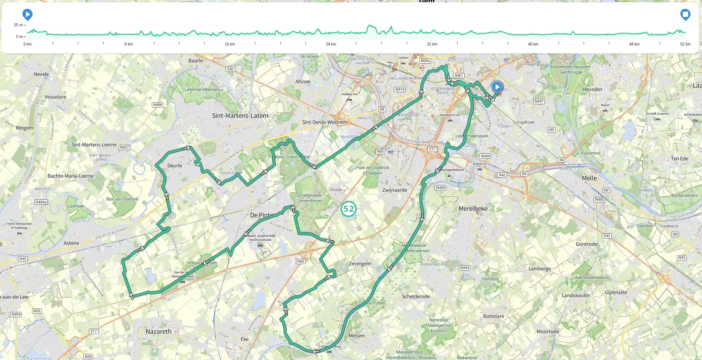
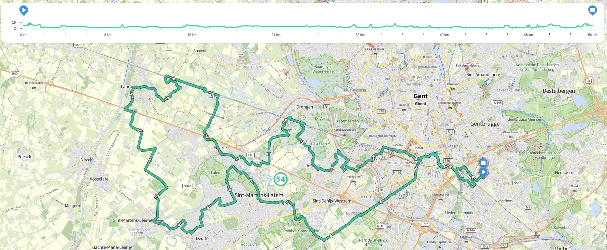
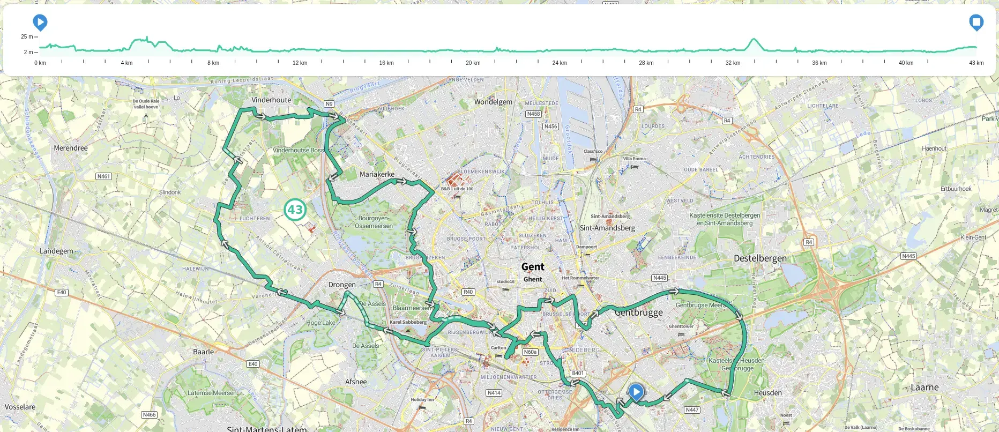

---
hide:
  - toc
---

# Gent in alle windrichtingen vanuit Kafé Kozak

## Gent Noord
[Download hier de .gpx](gent-noord.gpx)

## Gent Noord-Oost
[Download hier de .gpx](gent-noord-oost.gpx)

## Gent Oost
[Download hier de .gpx](gent-oost.gpx)

## Gent Zuid-Oost
[Download hier de .gpx](gent-zuid-oost.gpx)

## Gent Zuid
[Download hier de .gpx](gent-zuid.gpx)

## Gent Zuid-West
[Download hier de .gpx](gent-zuid-west.gpx)

## Gent West
[Download hier de .gpx](gent-west.gpx)

## Gent Noord-West
[Download hier de .gpx](gent-noord-west.gpx)

