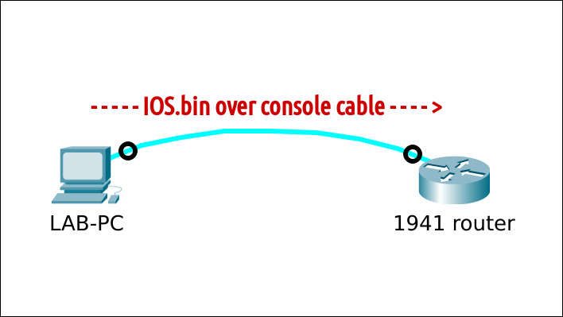
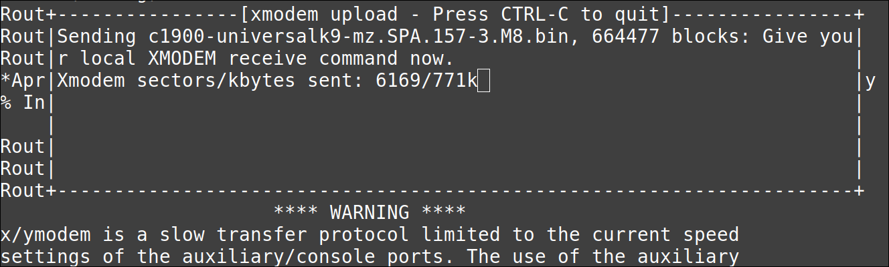
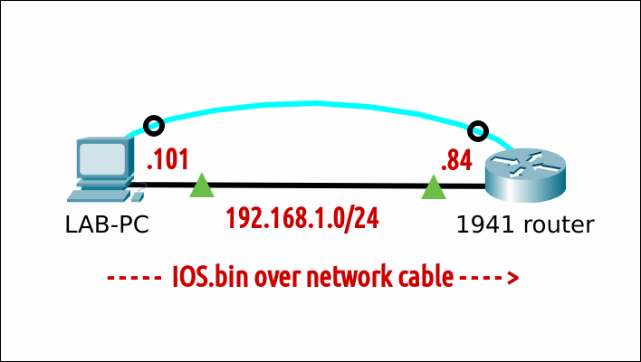

# (Re)install an IOS operating system on a Cisco 1941 router


## Prereqs
- a PC ([BIOS](../../tutorials/windows11-linuxmint21-dual-boot-bios-clonezilla/index.md){:target="_blank"}/[UEFI](../../tutorials/windows11-linuxmint21-dual-boot-uefi/index.md){:target="_blank"}) running Linux Mint 21
    - [minicom](../use-minicom-linux-mint/index.md){:target="_blank"} terminal emulation software
    - (a [tFTP service](../install-tftp-linux-mint/index.md){:target="_blank"})
- a console cable
- (a network cable)
- a Cisco 1941 router

## Situation
At the time of writing, the latest IOS for a Cisco 1941 router is c1900-universalk9-mz.SPA.157-3.M8.bin
I'll use that version for the examples.

## IOS transfer over serial (xmodem)


### From IOS
=== "Step1"
    Verify that there is enough space left on the Flash filesystem to add an (additional) IOS. In this example, I will simulate a missing IOS by deleting it. Do not reload!

    ``` title='' hl_lines="1 10"
    Router#dir flash:
    Directory of flash0:/

        1  -rw-    85053068  Nov 30 1983 00:00:00 +00:00  c1900-universalk9-mz.SPA.157-3.M8.bin
        2  -rw-          34   Apr 4 2022 10:30:50 +00:00  pnp-tech-time
        3  -rw-      138509   Apr 4 2022 10:31:02 +00:00  pnp-tech-discovery-summary

    256610304 bytes total (171413504 bytes free)
    Router#
    Router#delete flash:/c1900-universalk9-mz.SPA.157-3.M8.bin
    Delete filename [c1900-universalk9-mz.SPA.157-3.M8.bin]? 
    Delete flash0:/c1900-universalk9-mz.SPA.157-3.M8.bin? [confirm]
    Router#
    ```

=== "Step2"
    Set the baud rate to 115200 to speed up the transfer. You will lose the connection after the last command. Some gibberish characters can emerge.

    ``` title='' hl_lines="4" 
    Router#conf t
    Enter configuration commands, one per line.  End with CNTL/Z.
    Router(config)#line console 0
    Router(config-line)#speed 115200
    C�
    ```

=== "Step3"
    Adjust the settings in your terminal emulation program to match the new baud rate. For [minicom](../use-minicom-linux-mint/index.md), press ++control+a++ and then ++z++. 
    Type ++o++ and choose "Serial port setup". Change setting ++e++ and ++enter++ twice. Exit.

    ``` title='' hl_lines="5 11"
    Router#conf t                                                                                                    
    Enter configuration commands, one per line.  End with CNTL/Z.                                                    
    Rout+-----------------+---------[Comm Parameters]----------+----------------+                                    
    Rout| A -    Serial De|                                    |                |                                    
    C�  | B - Lockfile Loc|     Current:  9600 8N1             |                |                                    
        | C -   Callin Pro| Speed            Parity      Data  |                |                                    
        | D -  Callout Pro| A: <next>        L: None     S: 5  |                |                                    
        | E -    Bps/Par/B| B: <prev>        M: Even     T: 6  |                |                                    
        | F - Hardware Flo| C:   9600        N: Odd      U: 7  |                |                                    
        | G - Software Flo| D:  38400        O: Mark     V: 8  |                |                                    
        | H -     RS485 En| E: 115200        P: Space          |                |                                    
        | I -   RS485 Rts |                                    |                |                                    
        | J -  RS485 Rts A| Stopbits                           |                |                                    
        | K -  RS485 Rx Du| W: 1             Q: 8-N-1          |                |                                    
        | L -  RS485 Termi| X: 2             R: 7-E-1          |                |                                    
        | M - RS485 Delay |                                    |                |                                    
        | N - RS485 Delay |                                    |                |                                    
        |                 | Choice, or <Enter> to exit?        |                |                                    
        |    Change which +------------------------------------+                |                                    
        +-----------------------------------------------------------------------+
    ```

=== "Step4"
    Press ++enter++ The connection is back. Initiate an xMODEM transfer. Confirm the destination filename. The switch will then prompt you to start the transfer from your terminal emulator.

    ``` title='' hl_lines="2"
        Switch(config-line)#end
        Switch#copy xmodem: flash:c2960-lanbasek9-mz.150-2.SE11.bin
        Destination filename [c2960-lanbasek9-mz.150-2.SE11.bin]?     <----- press ENTER
        Begin the Xmodem or Xmodem-1K transfer now...
        CCC
    ```

=== "Step5"
    For minicom, press ++control+a++ and then ++z++. Type ++s++ (Send files) and select "xmodem". Navigate your way to the new [IOS file](../todo/index.md) (here /srv/tftp). Press ++space++ to tag the file and enter "Okay" to send.

    

=== "Step6"
    Grab a coffee. This can take a long time depending on the size of the IOS image. Wait for the transfer to complete and then press ++enter++ to quit.

    

=== "Step7"
    There is nu such thing as "boot system flash:/..." like with a Cisco 2960 switch. Just reload the router and it will find the IOS on flash.

    ``` title='' hl_lines="1 3 8"

    ```

=== "Step8"
    You have to adjust the settings in your terminal emulation program again, to match the default baud of 9600. Verify that the correct IOS image is loaded. Enjoy your new IOS!

    ``` title='' hl_lines="2 6 12"
    Switch#show version
    Cisco IOS Software, C2960 Software (C2960-LANBASEK9-M), Version 15.0(2)SE11, RELEASE SOFTWARE (fc3)
    ...
    ...
    System returned to ROM by power-on
    System image file is "flash:/c2960-lanbasek9-mz.150-2.SE11.bin"
    ...
    ...

    Switch Ports Model              SW Version            SW Image                 
    ------ ----- -----              ----------            ----------               
    *    1 26    WS-C2960+24TC-L    15.0(2)SE11           C2960-LANBASEK9-M        


    Configuration register is 0xF

    Switch#
    ```

### From ROMMON
Unlike with a Cisco 2960 switch, to my knowledge, it is not possible to use xmodem from the router in [ROMMON-mode](../access-cisco-device-rommon/index.md).


## IOS transfer over network protocol
Unlike with a Cisco 2960 switch, transfer using a network protocol is possible from IOS *and* from ROMMON-mode.



### From IOS

#### tFTP

=== "Step1"
    Verify that there is enough space left on the Flash filesystem to add an (additional) IOS. In this example, I will simulate a missing IOS by deleting it.

    ``` title='' hl_lines="1 10"
    Router#dir flash:
    Directory of flash0:/

        1  -rw-    85053068  Jun 21 2024 06:40:02 +00:00  c1900-universalk9-mz.SPA.157-3.M8.bin
        2  -rw-          35  Jul 10 2024 11:36:02 +00:00  pnp-tech-time
        3  -rw-        3883  Jul 10 2024 11:36:06 +00:00  pnp-tech-discovery-summary

    261189632 bytes total (176128000 bytes free)

    Router#delete flash:/c1900-universalk9-mz.SPA.157-3.M8.bin
    Delete filename [c1900-universalk9-mz.SPA.157-3.M8.bin]? 
    Delete flash0:/c1900-universalk9-mz.SPA.157-3.M8.bin? [confirm]
    Router#
    ```

=== "Step2"
    You need [a tFTP service](../todo/index.md) on the LAB-PC. Copy a [valid Cisco IOS image](../todo/index.md) file to the tFTP directory where files are served from. Adjust permissions.

    ``` title='' hl_lines="0"
    <TODO COPY AND PERMISSIONS>
    guru@lab:~$ ls -lh /srv/tftp/
    total 852M
    ...
    -rw-r--r-- 1 guru guru  82M sep  2  2021 c1900-universalk9-mz.SPA.157-3.M8.bin
    ...
    guru@lab:~$ 
    ```

=== "Step3"
    - Show the name of the network interface on the LAB-PC (in this case: enp0s25)
    - Configure an temporary IP address and subnet mask. 
    - Verify.

    ``` title='' hl_lines="1 8 10"
    guru@lab:~$ sudo ip link show
    [sudo] password for guru:     
    1: lo: <LOOPBACK,UP,LOWER_UP> mtu 65536 qdisc noqueue state UNKNOWN mode DEFAULT group default qlen 1000
        link/loopback 00:00:00:00:00:00 brd 00:00:00:00:00:00
    2: enp0s25: <BROADCAST,MULTICAST,UP,LOWER_UP> mtu 1500 qdisc fq_codel state UP mode DEFAULT group default qlen 1000
        link/ether 90:1b:0e:18:b9:8e brd ff:ff:ff:ff:ff:ff

    guru@lab:~$ sudo ip address add 192.168.1.101/24 dev enp0s25

    guru@lab:~$ ip a
    ...
    2: enp0s25: <BROADCAST,MULTICAST,UP,LOWER_UP> mtu 1500 qdisc fq_codel state UP group default qlen 1000
        link/ether 90:1b:0e:18:b9:8e brd ff:ff:ff:ff:ff:ff
        inet 192.168.1.101/24 scope global enp0s25
        valid_lft forever preferred_lft forever
    ```

=== "Step4"
    Configure an IP address and subnet mask on the router. Verify.

    ``` title='' hl_lines="0"
    Router#conf t
    Router(config)#int g0/0
    Router(config-if)#ip add 192.168.1.84 255.255.255.0
    Router(config-if)#no shut
    Router(config-if)#end
    Router#

    Router#show ip int br
    Interface                  IP-Address      OK? Method Status                Protocol
    ...   
    GigabitEthernet0/0         192.168.1.84    YES manual up                    up      
    ...
    Router#
    ```

=== "Step5"
    Verify connectivity between the LAB-PC and the router.

    ``` title='' hl_lines="0"
    Router#ping 192.168.1.101
    Type escape sequence to abort.
    Sending 5, 100-byte ICMP Echos to 192.168.1.101, timeout is 2 seconds:
    !!!!!
    Success rate is 100 percent (5/5), round-trip min/avg/max = 1/1/4 ms
    Router#
    ```

=== "Step6"
    Copy the IOS image from the TFTP server to the router's flash memory.

    ``` title='' hl_lines="1"
    Router#copy tftp://192.168.1.101/c1900-universalk9-mz.SPA.157-3.M8.bin flash:
    Destination filename [c1900-universalk9-mz.SPA.157-3.M8.bin]? 
    Accessing tftp://192.168.1.101/c1900-universalk9-mz.SPA.157-3.M8.bin...
    Loading c1900-universalk9-mz.SPA.157-3.M8.bin from 192.168.1.101 (via GigabitEthernet0/0): !!!!!!!!!!!!!!!!!!!!!!!!!!!!!!!!!!!!!!!!!!!!!
    [OK - 85053068 bytes]

    85053068 bytes copied in 125.316 secs (678709 bytes/sec)

    Router#
    ```

=== "Step7"
    Verify and reboot.

    ``` title='' hl_lines="1 11"
    Router#dir flash:
    Directory of flash0:/

        1  -rw-    85053068  Jul 10 2024 11:51:18 +00:00  c1900-universalk9-mz.SPA.157-3.M8.bin
        2  -rw-          35  Jul 10 2024 11:36:02 +00:00  pnp-tech-time
        3  -rw-       51320  Jul 10 2024 11:36:10 +00:00  pnp-tech-discovery-summary

    261189632 bytes total (176078848 bytes free)
    Router#

    Router#reload

    Proceed with reload? [confirm]

    *Jul 10 11:53:13.439: %SYS-5-RELOAD: Reload requested by console. Reload Reason: Reload Command.
    ```

=== "Step8"
    Verify that the correct IOS image is loaded. Enjoy your new IOS!

    ``` title='' hl_lines="5"
    Router#show version
    Cisco IOS Software, C1900 Software (C1900-UNIVERSALK9-M), Version 15.7(3)M8, RELEASE SOFTWARE (fc1)
    ...
    ...
    System image file is "flash0:c1900-universalk9-mz.SPA.157-3.M8.bin"
    ...
    ```

#### SSH (sFTP)
todo

#### HTTP
todo

### From ROMMON
First, [start the router in ROMMON-mode](../access-cisco-device-rommon/index.md).

#### tFTP

=== "Step1"
    Set the necessary parameters to make tFTP possible.

    ``` title='' hl_lines="0"
    rommon 1 > IP_ADDRESS=192.168.1.84
    rommon 2 > IP_SUBNET_MASK=255.255.255.0
    rommon 3 > DEFAULT_GATEWAY=192.168.1.254
    rommon 4 > TFTP_SERVER=192.168.1.101
    rommon 5 > TFTP_FILE=c1900-universalk9-mz.SPA.157-3.M8.bin
    rommon 6 >
    ```

=== "Step2"
    Start the tFTP transfer.

    ``` title='' hl_lines="0"
    rommon 6 > tftpdnld

            IP_ADDRESS: 192.168.1.84
        IP_SUBNET_MASK: 255.255.255.0
        DEFAULT_GATEWAY: 192.168.1.254
            TFTP_SERVER: 192.168.1.101
            TFTP_FILE: c1900-universalk9-mz.SPA.157-3.M8.bin
            TFTP_MACADDR: d8:b1:90:63:85:60
        TFTP_DESTINATION: flash0:
                GE_PORT: Ge0/0
        TFTP_MEDIA_TYPE: Copper
            TFTP_VERBOSE: Progress
        TFTP_RETRY_COUNT: 20
            TFTP_TIMEOUT: 7200
        TFTP_CHECKSUM: Yes
        GE_SPEED_MODE: Auto Detect

    Invoke this command for disaster recovery only.
    WARNING: all existing data in all partitions on flash will be lost!
    Do you wish to continue? y/n:  [n]:  y

    Receiving c1900-universalk9-mz.SPA.157-3.M8.bin from 192.168.1.101 !!!!!!!!!!!!!!!!!!!!!!!!!!!!!!!!!!!!!!!!!!!!!!!!!!!!!!!!!!!!!!!!!!!!!
    File reception completed.
    IOS Image Load Test 
    ___________________ 
    Digitally Signed Release Software 

    Validating checksum.
    Copying file c1900-universalk9-mz.SPA.157-3.M8.bin to flash0:.
    program load complete, entry point: 0x80803000, size: 0x1b340

    Format: All system sectors written. OK...

    Format: Total sectors in formatted partition: 510944
    Format: Total bytes in formatted partition: %llu
    Format: Operation completed successfully.
    program load complete, entry point: 0x80803000, size: 0x1b340

    rommon 7 > 
    ```

=== "Step3"
    Verify flash.

    ``` title='' hl_lines="0"
    rommon 7 > dir flash:
    program load complete, entry point: 0x80803000, size: 0x1b340
    Directory of flash:

    2      85053068  -rw-     c1900-universalk9-mz.SPA.157-3.M8.bin
    rommon 8 > 
    ```

=== "Step4"
    Reload the router.

    ``` title='' hl_lines="0"
    rommon 8 > reset

    System Bootstrap, Version 15.0(1r)M16, RELEASE SOFTWARE (fc1)
    ...
    ```
