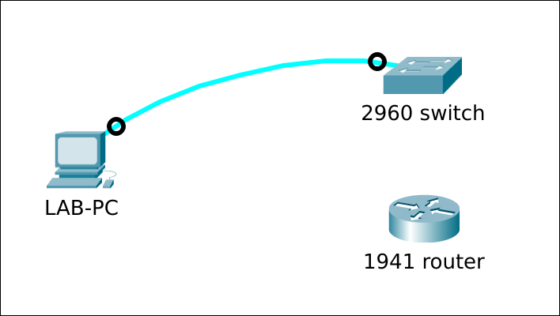

# Access a Cisco device in ROMMON-mode

## Prereqs
* a PC ([BIOS](../../tutorials/windows11-linuxmint21-dual-boot-bios-clonezilla/)/[UEFI](../../tutorials/windows11-linuxmint21-dual-boot-uefi/)) running Linux Mint 21
    * [minicom](../use-minicom-linux-mint/index.md) terminal emulation software
* a console cable
* a Cisco 2960 24TT-L or 24TC-L Plus switch
* a Cisco 1941 router

## Setup



## Cisco 2960 switch
### From IOS

=== "Step1"
    By default, the switch will boot the configured boot image (line2) automatically, without waiting for user input (line6).

    ``` title='' hl_lines="2 6"
    Switch#show boot
    BOOT path-list      : flash:c2960-lanbasek9-mz.152-7.E8.bin
    Config file         : flash:/config.text
    Private Config file : flash:/private-config.text
    Enable Break        : yes
    Manual Boot         : no
    ...
    ```

=== "Step2"
    Bypass the normal boot process (line3) and enter ROMMON mode directly upon the next reboot (line5).

    ``` title='' hl_lines="3 5"
    Switch#configure terminal
    Enter configuration commands, one per line.  End with CNTL/Z.
    Switch(config)#boot manual 
    Switch(config)#end
    Switch#reload

    System configuration has been modified. Save? [yes/no]: no      <----- if asked
    Proceed with reload? [confirm]                                  <----- press <Enter>

    *Mar  1 16:21:22.615: %SYS-5-RELOAD: Reload requested by console. Reload Reason: Reload command.
    ...
    ```

=== "Step3"
    We're in ROMMON-mode.

    ``` title='' hl_lines="22"
    Boot Sector Filesystem (bs) installed, fsid: 2
    Base ethernet MAC Address: bc:f1:f2:59:06:00
    Xmodem file system is available.
    The password-recovery mechanism is disabled.
    Initializing Flash...
    flashfs[0]: 6 files, 3 directories
    flashfs[0]: 0 orphaned files, 0 orphaned directories
    flashfs[0]: Total bytes: 65544192
    flashfs[0]: Bytes used: 16074240
    flashfs[0]: Bytes available: 49469952
    flashfs[0]: flashfs fsck took 18 seconds.
    ...done Initializing Flash.
    done.

    The system is not configured to boot automatically.  The
    following command will finish loading the operating system
    software:

        boot


    switch: 
    ```

### Missing or corrupt IOS

=== "Step1"
    Let's simulate a non-working IOS by "accidently" erasing the "flash" filesystem instead of the "nvram". Restart the switch afterwards.

    ``` title='' hl_lines="0"
    Switch#erase flash:
    Erasing the flash filesystem will remove all files! Continue? [confirm]
    flashfs[2]: 0 files, 1 directories
    flashfs[2]: 0 orphaned files, 0 orphaned directories
    flashfs[2]: Total bytes: 65544192
    flashfs[2]: Bytes used: 1024
    flashfs[2]: Bytes available: 65543168
    flashfs[2]: flashfs fsck took 25 seconds.
    Erase of flash: complete
    Switch#
    Switch#reload

    System configuration has been modified. Save? [yes/no]: no          <----- if asked
    Proceed with reload? [confirm]                                      <----- press <Enter>

    *Mar  1 00:28:22.946: %SYS-5-RELOAD: Reload requested by console. Reload Reason: Reload command.
    ...
    ```

=== "Step2"
    The BOOT environment variable is still set to boot c2960-lanbasek9-mz.152-7.E8.bin but it's not there. The switch will not be able to boot and will enter ROMMON-mode automatically.

    ``` title='' hl_lines="0"
    Welcome to minicom 2.8

    OPTIONS: I18n 
    Port /dev/ttyUSB0, 09:36:24

    Press CTRL-A Z for help on special keys


    Boot Sector Filesystem (bs) installed, fsid: 2
    Base ethernet MAC Address: bc:f1:f2:59:06:00
    Xmodem file system is available.
    The password-recovery mechanism is enabled.                     ---> or "disabled"
    Initializing Flash...
    flashfs[0]: 3 files, 1 directories
    flashfs[0]: 0 orphaned files, 0 orphaned directories
    flashfs[0]: Total bytes: 65544192
    flashfs[0]: Bytes used: 12800
    flashfs[0]: Bytes available: 65531392
    flashfs[0]: flashfs fsck took 18 seconds.
    ...done Initializing Flash.
    done.
    Loading "flash:c2960-lanbasek9-mz.152-7.E8.bin"...flash:c2960-lanbasek9-mz.152-7.E8.bin: no such file or directory

    Error loading "flash:c2960-lanbasek9-mz.152-7.E8.bin"

    Interrupt within 5 seconds to abort boot process.
    Boot process failed...

    The system is unable to boot automatically.  The BOOT
    environment variable needs to be set to a bootable
    image.


    switch: 

    ```

### Cold start

=== "Step1"
    First disconnect the power cable from the switch. Minicom gives no output yet.

    ``` title='' hl_lines="0"
    Welcome to minicom 2.8

    OPTIONS: I18n 
    Port /dev/ttyUSB0, 13:50:27

    Press CTRL-A Z for help on special keys

    <blinking_cursor>
    ```

=== "Step2"
    Now reconnect the power cable. The switch boots and while doing the POST, the SYST LED blinks green.
    This takes about X seconds. After POST, the blinking LED changes pattern. Press the Mode button once.

    -> insert image MODE button

=== "Step3a"
    If the password recovery mechanism is enabled (line12), you have to manually initialize flash (line28).

    ``` title='' hl_lines="12 28"
    Welcome to minicom 2.8

    OPTIONS: I18n 
    Port /dev/ttyUSB0, 09:44:08

    Press CTRL-A Z for help on special keys


    Boot Sector Filesystem (bs) installed, fsid: 2
    Base ethernet MAC Address: bc:f1:f2:59:06:00
    Xmodem file system is available.
    The password-recovery mechanism is enabled.
    Initializing Flash...
    flashfs[0]: filesystem check interrupted!
    ...done Initializing Flash.

    The system has been interrupted, or encountered an error
    during initialization of the flash filesystem.  The following
    commands will initialize the flash filesystem, and finish
    loading the operating system software:

        flash_init
        boot


    switch: 

    switch: flash_init
    Initializing Flash...
    flashfs[0]: 6 files, 3 directories
    flashfs[0]: 0 orphaned files, 0 orphaned directories
    flashfs[0]: Total bytes: 65544192
    flashfs[0]: Bytes used: 16081408
    flashfs[0]: Bytes available: 49462784
    flashfs[0]: flashfs fsck took 19 seconds.
    ...done Initializing Flash.

    switch: 
    ```

=== "Step3b"
    If the password recovery mechanism is disabled (line12), you will lose all the configuration. Flash is initialised for you. Choose "y" at the prompt (line31).

    ``` title='' hl_lines="12 31"
    Welcome to minicom 2.8

    OPTIONS: I18n 
    Port /dev/ttyUSB0, 09:44:08

    Press CTRL-A Z for help on special keys


    Boot Sector Filesystem (bs) installed, fsid: 2
    Base ethernet MAC Address: bc:f1:f2:59:06:00
    Xmodem file system is available.
    The password-recovery mechanism is disabled.
    Initializing Flash...
    flashfs[0]: 6 files, 3 directories
    flashfs[0]: 0 orphaned files, 0 orphaned directories
    flashfs[0]: Total bytes: 65544192
    flashfs[0]: Bytes used: 16131584
    flashfs[0]: Bytes available: 49412608
    flashfs[0]: flashfs fsck took 19 seconds.
    ...done Initializing Flash.
    done.


    The password-recovery mechanism has been triggered, but
    is currently disabled.  Access to the boot loader prompt
    through the password-recovery mechanism is disallowed at
    this point.  However, if you agree to let the system be
    reset back to the default system configuration, access
    to the boot loader prompt can still be allowed.

    Would you like to reset the system back to the default configuration (y/n)?y            ---> answer "y"

    The system has been interrupted, and the config file
    has been deleted.  The following command will finish
    loading the operating system software:

    boot


    switch: 
    ```


## Cisco 1941 router