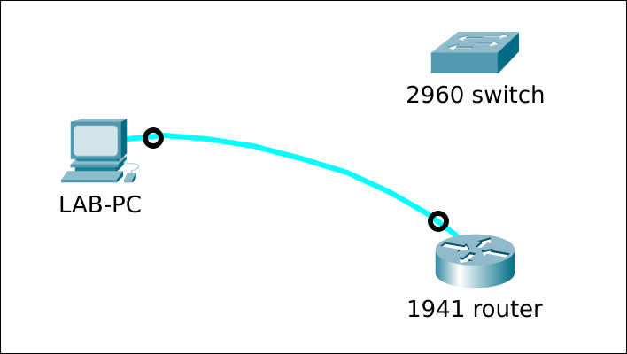

# Access a Cisco device in ROMMON-mode

## Prereqs
* a PC ([BIOS](../../tutorials/windows11-linuxmint21-dual-boot-bios-clonezilla/)/[UEFI](../../tutorials/windows11-linuxmint21-dual-boot-uefi/)) running Linux Mint 21
    * [minicom](../use-minicom-linux-mint/index.md) terminal emulation software
* a console cable
* a Cisco 2960 24TT-L or 24TC-L Plus switch
* a Cisco 1941 router

## Cisco 2960 switch
### Setup


### From IOS

=== "Step1"
    By default, the switch will boot the configured boot image automatically, without waiting for user input.

    ``` title='' hl_lines="2 6"
    Switch#show boot
    BOOT path-list      : flash:c2960-lanbasek9-mz.150-2.SE11.bin
    Config file         : flash:/config.text
    Private Config file : flash:/private-config.text
    Enable Break        : yes
    Manual Boot         : no
    ...
    ```

=== "Step2"
    Bypass the normal boot process and enter ROMMON mode directly upon the next reboot.

    ``` title='' hl_lines="3 11"
    Switch#configure terminal
    Enter configuration commands, one per line.  End with CNTL/Z.
    Switch(config)#boot manual 
    Switch(config)#end
    
    Switch#show boot
    BOOT path-list      : flash:c2960-lanbasek9-mz.150-2.SE11.bin
    Config file         : flash:/config.text
    Private Config file : flash:/private-config.text
    Enable Break        : yes
    Manual Boot         : yes
    ...

    Switch#reload

    System configuration has been modified. Save? [yes/no]: no      <----- if asked
    Proceed with reload? [confirm]                                  <----- press <Enter>

    *Mar  1 16:21:22.615: %SYS-5-RELOAD: Reload requested by console. Reload Reason: Reload command.
    ...
    ```

=== "Step3"
    We're in ROMMON-mode.

    ``` title='' hl_lines="22"
    Boot Sector Filesystem (bs) installed, fsid: 2
    Base ethernet MAC Address: bc:f1:f2:59:06:00
    Xmodem file system is available.
    The password-recovery mechanism is disabled.
    Initializing Flash...
    flashfs[0]: 6 files, 3 directories
    flashfs[0]: 0 orphaned files, 0 orphaned directories
    flashfs[0]: Total bytes: 65544192
    flashfs[0]: Bytes used: 16074240
    flashfs[0]: Bytes available: 49469952
    flashfs[0]: flashfs fsck took 18 seconds.
    ...done Initializing Flash.
    done.

    The system is not configured to boot automatically.  The
    following command will finish loading the operating system
    software:

        boot


    switch: 
    ```
=== "(Step4)"
    To "undo" the manual boot and return to IOS, you have 2 options. Either

    - first unset the variable from within ROMMON and boot into IOS
    - boot into IOS and unset the boot variable from within IOS

    ``` title='' hl_lines="1 13"
    # option1
    switch: set
    !=-
    ...
    MANUAL_BOOT=yes
    ...
    switch: unset MANUAL_BOOT
    switch: boot
    Loading "flash:c2960-lanbasek9-mz.150-2.SE11.bin"...@@@@@@@@
    ...
    Switch#

    # option2
    switch: boot
    Loading "flash:c2960-lanbasek9-mz.150-2.SE11.bin"...@@@@@@@@
    ...

    Switch#configure terminal
    Switch(config)#no boot manual
    Switch(config)#end
    Switch#
    ```


### Missing or corrupt IOS

=== "Step1"
    Let's simulate a non-working IOS by "accidently" erasing the "flash" filesystem. Restart the switch afterwards.

    ``` title='' hl_lines="1 14"
    Switch#erase flash:
    Erasing the flash filesystem will remove all files! Continue? [confirm]
    flashfs[2]: 0 files, 1 directories
    flashfs[2]: 0 orphaned files, 0 orphaned directories
    flashfs[2]: Total bytes: 65544192
    flashfs[2]: Bytes used: 1024
    flashfs[2]: Bytes available: 65543168
    flashfs[2]: flashfs fsck took 25 seconds.
    Erase of flash: complete
    
    Switch#dir flash:
    Directory of flash:/

    No files in directory

    65544192 bytes total (65543168 bytes free)

    Switch#reload

    System configuration has been modified. Save? [yes/no]: no          <----- if asked
    Proceed with reload? [confirm]                                      <----- press <Enter>

    *Mar  1 00:28:22.946: %SYS-5-RELOAD: Reload requested by console. Reload Reason: Reload command.
    ...
    ```

=== "Step2"
    The BOOT environment variable is still set to boot c2960-lanbasek9-mz.150-2.SE11.bin but it's not there. The switch will not be able to boot and will enter ROMMON-mode automatically.

    ``` title='' hl_lines="24 34"
    Welcome to minicom 2.8

    OPTIONS: I18n 
    Port /dev/ttyUSB0, 09:36:24

    Press CTRL-A Z for help on special keys


    Boot Sector Filesystem (bs) installed, fsid: 2
    Base ethernet MAC Address: bc:f1:f2:59:06:00
    Xmodem file system is available.
    The password-recovery mechanism is enabled.                     ---> or "disabled"
    Initializing Flash...
    flashfs[0]: 3 files, 1 directories
    flashfs[0]: 0 orphaned files, 0 orphaned directories
    flashfs[0]: Total bytes: 65544192
    flashfs[0]: Bytes used: 12800
    flashfs[0]: Bytes available: 65531392
    flashfs[0]: flashfs fsck took 18 seconds.
    ...done Initializing Flash.
    done.
    Loading "flash:c2960-lanbasek9-mz.150-2.SE11.bin"...flash:c2960-lanbasek9-mz.150-2.SE11.bin: no such file or directory

    Error loading "flash:c2960-lanbasek9-mz.150-2.SE11.bin"

    Interrupt within 5 seconds to abort boot process.
    Boot process failed...

    The system is unable to boot automatically.  The BOOT
    environment variable needs to be set to a bootable
    image.


    switch: 

    ```

=== "(Step3)"
    To be able to boot again, you have to [reinstall IOS](../reinstall-ios-cisco2960/index.md).

### Break sequence

=== "Step1"
    - If you have access to a working IOS, verify if the break sequence mechanism is enabled or not. If not, enable it.
    - If you do not have access to a working IOS, you can only "try" if the break sequence works. If not, you have to use the "cold start" method.
    

    ``` title='' hl_lines="1 6"
    Switch#show boot | include Break
    Enable Break        : no
    
    Switch#configure terminal 
    Enter configuration commands, one per line.  End with CNTL/Z.
    Switch(config)#boot enable-break 
    Switch(config)#end

    Switch#show boot | include Break
    Enable Break        : yes
    ```


=== "Step2"
    Power cycle the switch or "reload" from within a running IOS. Immediately after the switch starts booting (within the first X seconds), send the [break sequence](../../references/index.md#break-sequence-mechanism) from your terminal emulator. For Minicom, press ++ctrl++ + ++a++ then ++f++. The switch should respond by stopping the boot process and entering ROMMON mode, indicated by the switch: prompt.

    ``` title='' hl_lines="1 8"
    Switch#reload
    Proceed with reload? [confirm]

    *Mar  1 00:13:45.539: %SYS-5-RELOAD: Reload requested by console. Reload Reason: Reload command.
    Boot Sector Filesystem (bs) installed, fsid: 2
    Base ethernet MAC Address: b0:c5:3c:26:a0:80
    Xmodem file system is available.
    ### I sent the break signal about here ###
    The password-recovery mechanism is enabled.
    Initializing Flash...
    flashfs[0]: filesystem check interrupted!
    ...done Initializing Flash.

    The system has been interrupted, or encountered an error
    during initialization of the flash filesystem.  The following
    commands will initialize the flash filesystem, and finish
    loading the operating system software:

        flash_init
        boot


    switch: 
    ```

=== "Step3"
    Flash did not get initialized. You have to do that manually.

    ``` title='' hl_lines="1"
    switch: flash_init
    Initializing Flash...
    flashfs[0]: 2 files, 1 directories
    flashfs[0]: 0 orphaned files, 0 orphaned directories
    flashfs[0]: Total bytes: 65544192
    flashfs[0]: Bytes used: 11835904
    flashfs[0]: Bytes available: 53708288
    flashfs[0]: flashfs fsck took 19 seconds.
    ...done Initializing Flash.

    switch: 
    ```

=== "(Step4)"
    To return to IOS, just boot the switch.

    ``` title='' hl_lines="1"
    switch: boot
    Loading "flash:c2960-lanbasek9-mz.150-2.SE11.bin"...@@@@@@@
    ...
    Switch#
    ```

### Cold start

=== "Step1"
    First disconnect the power cable from the switch. Minicom gives no output yet.

    ``` title='' hl_lines="0"
    Welcome to minicom 2.8

    OPTIONS: I18n 
    Port /dev/ttyUSB0, 13:50:27

    Press CTRL-A Z for help on special keys

    <blinking_cursor>
    ```

=== "Step2"
    Now reconnect the power cable. The switch boots and while doing the POST, the SYST LED blinks green.
    This takes about X seconds. After POST, the blinking LED changes pattern. Press the Mode button once.

    

=== "Step3a"
    If the password recovery mechanism is enabled, you have to manually initialize flash.

    ``` title='' hl_lines="12 28"
    Welcome to minicom 2.8

    OPTIONS: I18n 
    Port /dev/ttyUSB0, 09:44:08

    Press CTRL-A Z for help on special keys


    Boot Sector Filesystem (bs) installed, fsid: 2
    Base ethernet MAC Address: bc:f1:f2:59:06:00
    Xmodem file system is available.
    The password-recovery mechanism is enabled.
    Initializing Flash...
    flashfs[0]: filesystem check interrupted!
    ...done Initializing Flash.

    The system has been interrupted, or encountered an error
    during initialization of the flash filesystem.  The following
    commands will initialize the flash filesystem, and finish
    loading the operating system software:

        flash_init
        boot


    switch: 

    switch: flash_init
    Initializing Flash...
    flashfs[0]: 6 files, 3 directories
    flashfs[0]: 0 orphaned files, 0 orphaned directories
    flashfs[0]: Total bytes: 65544192
    flashfs[0]: Bytes used: 16081408
    flashfs[0]: Bytes available: 49462784
    flashfs[0]: flashfs fsck took 19 seconds.
    ...done Initializing Flash.

    switch: 
    ```

=== "Step3b"
    If the password recovery mechanism is disabled, you will lose all the configuration. Flash is initialised for you. Choose "y" at the prompt.

    ``` title='' hl_lines="12 31"
    Welcome to minicom 2.8

    OPTIONS: I18n 
    Port /dev/ttyUSB0, 09:44:08

    Press CTRL-A Z for help on special keys


    Boot Sector Filesystem (bs) installed, fsid: 2
    Base ethernet MAC Address: bc:f1:f2:59:06:00
    Xmodem file system is available.
    The password-recovery mechanism is disabled.
    Initializing Flash...
    flashfs[0]: 6 files, 3 directories
    flashfs[0]: 0 orphaned files, 0 orphaned directories
    flashfs[0]: Total bytes: 65544192
    flashfs[0]: Bytes used: 16131584
    flashfs[0]: Bytes available: 49412608
    flashfs[0]: flashfs fsck took 19 seconds.
    ...done Initializing Flash.
    done.


    The password-recovery mechanism has been triggered, but
    is currently disabled.  Access to the boot loader prompt
    through the password-recovery mechanism is disallowed at
    this point.  However, if you agree to let the system be
    reset back to the default system configuration, access
    to the boot loader prompt can still be allowed.

    Would you like to reset the system back to the default configuration (y/n)?y            ---> answer "y"

    The system has been interrupted, and the config file
    has been deleted.  The following command will finish
    loading the operating system software:

    boot


    switch: 
    ```
=== "(Step4)"
    To return to IOS, just boot the switch.

    ``` title='' hl_lines="1"
    switch: boot
    Loading "flash:c2960-lanbasek9-mz.150-2.SE11.bin"...@@@@@@@
    ...
    Switch#
    ```


## Cisco 1941 router
### Setup



### From IOS

=== "Step1"
    The "show boot" command is not available on a Cisco 1941 router, like it is for a Cisco 2960 switch. You can still display the boot system commands in the running configuration, if any.

    ``` title='' hl_lines="1 6"
    # if no boot statement is present, an IOS will be searched on flash
    Router#show running-config | include boot
    boot-start-marker
    boot-end-marker

    # if a boot statement is present, that IOS will be booted
    Router#configure terminal
    Enter configuration commands, one per line.  End with CNTL/Z.
    Router(config)#boot system flash:c1900-universalk9-mz.SPA.157-3.M8.bin
    Router(config)#end

    Router#show running-config | include boot
    boot-start-marker
    boot system flash:c1900-universalk9-mz.SPA.157-3.M8.bin
    boot-end-marker
    Router#
    ```

=== "Step2"
    There is also no "boot manual" command; you have to change the configuration register from within IOS to boot into ROMMON.

    ``` title='' hl_lines="1 6 10"
    Router#show version | include Configuration register
    Configuration register is 0x2102

    Router#configure terminal 
    Enter configuration commands, one per line.  End with CNTL/Z.
    Router(config)#config-register 0x0
    Router(config)#end
    
    Router#show version | include Configuration register
    Configuration register is 0x2102 (will be 0x0 at next reload)

    Router#reload

    System configuration has been modified. Save? [yes/no]: no          <--- I won't save the "boot system" command for now
    Proceed with reload? [confirm]                                      <--- press <Enter>
    ```

=== "Step3"
    We're in ROMMON-mode.

    ``` title='' hl_lines="11"
    System Bootstrap, Version 15.0(1r)M16, RELEASE SOFTWARE (fc1)
    Technical Support: http://www.cisco.com/techsupport
    Copyright (c) 2012 by cisco Systems, Inc.

    Total memory size = 512 MB - On-board = 512 MB, DIMM0 = 0 MB
    CISCO1941/K9 platform with 524288 Kbytes of main memory
    Main memory is configured to 64/-1(On-board/DIMM0) bit mode with ECC disabled


    Readonly ROMMON initialized
    rommon 1 > 
    ```

=== "(Step4)"
    To return to IOS, you have 2 options. Either

    - first set the configuration register back to its initial value from within ROMMON and then boot into IOS (fastest)
    - boot into IOS, set the configuration register back to its initial value from within IOS and reload again (slowest)

    ``` title='' hl_lines="1 10"
    # option1
    rommon 1 > confreg 0x2102

    You must reset or power cycle for new config to take effect

    rommon 2 > reset
    ...
    Router#

    # option2
    rommon 1 > boot
    program load complete, entry point: 0x80803000, size: 0x1b340
    program load complete, entry point: 0x80803000, size: 0x1b340
    ...

    Router#show version | include Configuration register
    Configuration register is 0x0

    Router#configure terminal
    Enter configuration commands, one per line.  End with CNTL/Z.
    Router(config)#config-register 0x2102
    Router(config)#end
    
    Router#show ver | include Configuration register
    Configuration register is 0x0 (will be 0x2102 at next reload)
    
    Router#reload
    ...
    ```


### Missing or corrupt IOS

=== "Step1"
    Let's simulate a non-working IOS by "accidently" erasing the "flash" filesystem. You cannot use the "erase (/all) flash:" command like with a Cisco 2960 switch. You have to "format" it. Restart the router afterwards.

    ``` title='' hl_lines="1 15 22"
    Router#format flash:
    Format operation may take a while. Continue? [confirm]
    Format operation will destroy all data in "flash:".  Continue? [confirm]
    Writing Monlib sectors.....
    Monlib write complete 

    Format: All system sectors written. OK...

    Format: Total sectors in formatted partition: 501728
    Format: Total bytes in formatted partition: 256884736
    Format: Operation completed successfully.

    Format of flash0: complete

    Router#dir flash:
    Directory of flash0:/

    No files in directory

    256475136 bytes total (256475136 bytes free)

    Router#reload
    ...
    ```

=== "Step2"
    The router will not be able to boot and will enter ROMMON-mode automatically.

    ``` title='' hl_lines="12 15"
    System Bootstrap, Version 15.0(1r)M16, RELEASE SOFTWARE (fc1)
    Technical Support: http://www.cisco.com/techsupport
    Copyright (c) 2012 by cisco Systems, Inc.

    Total memory size = 512 MB - On-board = 512 MB, DIMM0 = 0 MB
    CISCO1941/K9 platform with 524288 Kbytes of main memory
    Main memory is configured to 64/-1(On-board/DIMM0) bit mode with ECC disabled


    Readonly ROMMON initialized
    program load complete, entry point: 0x80803000, size: 0x1b340
    boot: cannot determine first executable file name ondevice "flash0:"
    ...
    ...
    rommon 1 >
    ```

### Break sequence

=== "Step1"
    To my knowledge, there is no break sequence mechanism on a Cisco 1941 router like there is on a Cisco 2960 switch. There is no such thing as "boot enable-break" to en/disable the break sequence behavior. Just poower cycle the router or "reload" from within a running IOS.

    ``` title='' hl_lines="0"
    Router#reload
    Proceed with reload? [confirm]

    *Mar 16 14:04:39.603: %SYS-5-RELOAD: Reload requested by console. Reload Reason: Reload Command.
    ```

=== "Step2"
    Immediately after the router starts booting (within the first X seconds), send the [break sequence](../../references/index.md#break-sequence-mechanism) from your terminal emulator. For Minicom, press ++ctrl++ + ++a++ then ++f++. The router should respond by stopping the boot process and entering ROMMON mode, indicated by the rommon X> prompt.

    ``` title='' hl_lines="6"
    System Bootstrap, Version 15.0(1r)M16, RELEASE SOFTWARE (fc1)
    Technical Support: http://www.cisco.com/techsupport
    Copyright (c) 2012 by cisco Systems, Inc.

    Total memory size = 512 MB - On-board = 512 MB, DIMM0 = 0 MB
    ### I sent the break signal about here ###
    CISCO1941/K9 platform with 524288 Kbytes of main memory
    Main memory is configured to 64/-1(On-board/DIMM0) bit mode with ECC disabled


    Readonly ROMMON initialized
    rommon 1 > 
    ```


### Cold start
There is no "MODE button" like with a Cisco 2960 switch to interrupt the boot sequence with.