# Clone Windows 11 in VirtualBox 6.1.44

## Prereqs
- an existing [Windows 11 virtual machine](../../tutorials/windows11-virtualbox/index.md)

## VirtualBox
=== "StepX"
    In this example, the "Current state" equals the "Clean install" snapshot (otherwise it would have been "Current state (Changed)")

    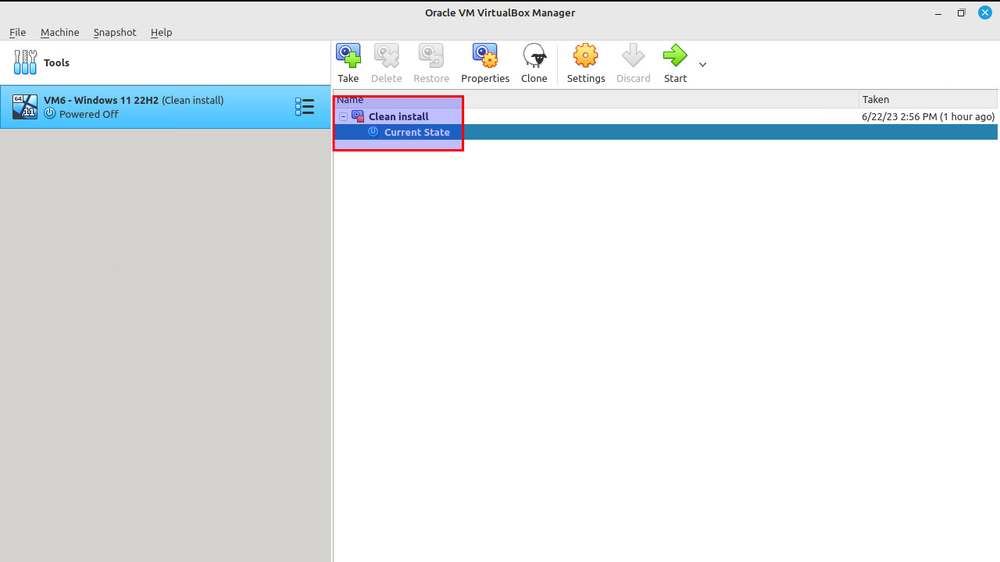

=== "StepX"
    Select "Machine -> Clone".

    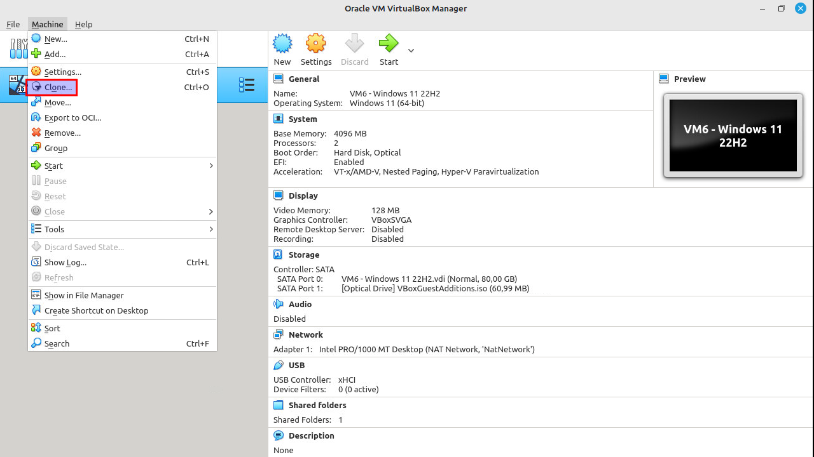

=== "StepX"
    Click on the "Expert mode" button to show extra options.

    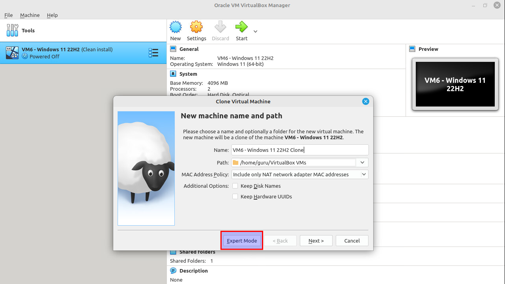

=== "StepX"
    Change the name of the virtual machine. Clone type: full clone. Snapshots: current machine state. Be sure to generate new MAC addresses for all network adapters. Look at the screenshot below.

    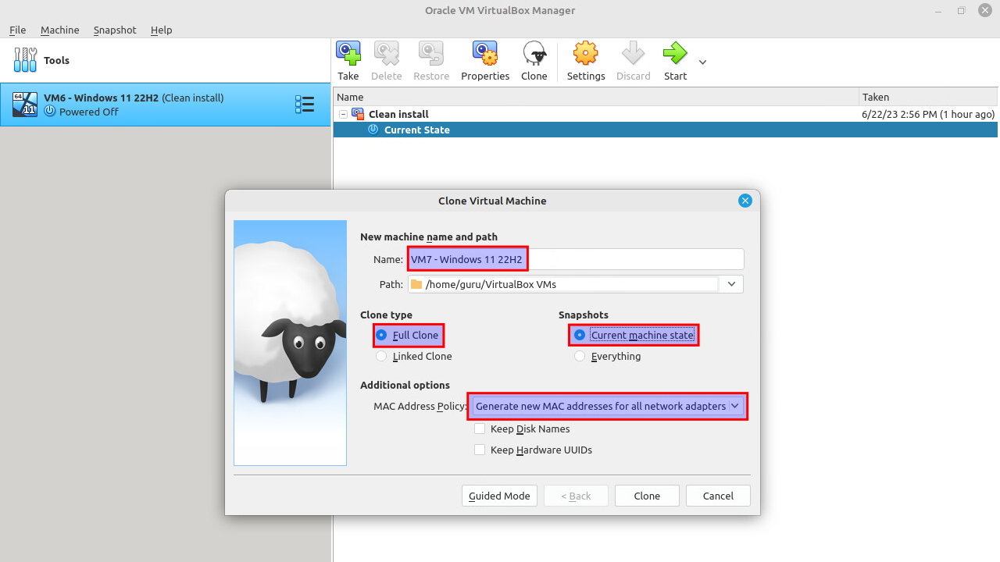

=== "StepX"
    Click "Clone". This won't take too long.

    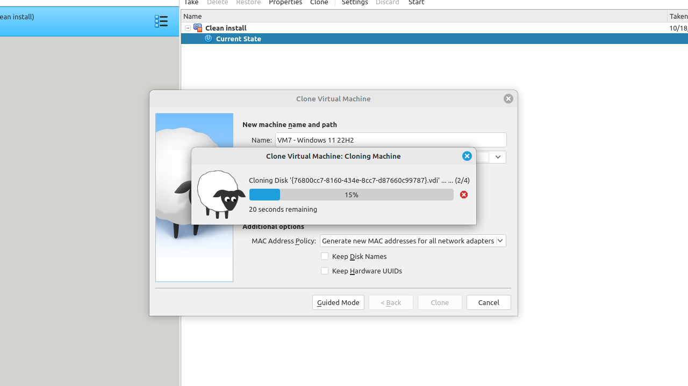

=== "StepX"
    Endresult: a clone of vm6 without snapshot(s).

    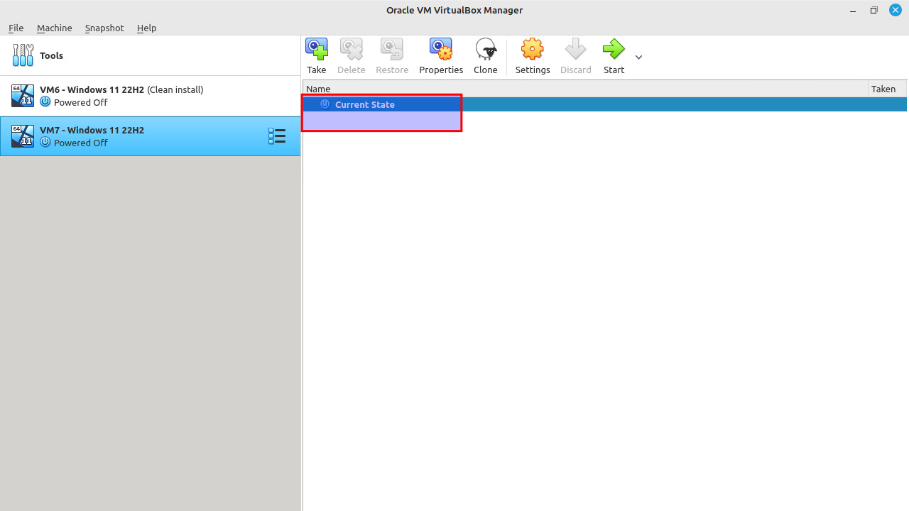

## IP address
=== "Step1"
    Start the cloned virtual machine "vm7" and login. Right-click on the network icon on the bottom-right taskbar -> Network and Internet settings.

    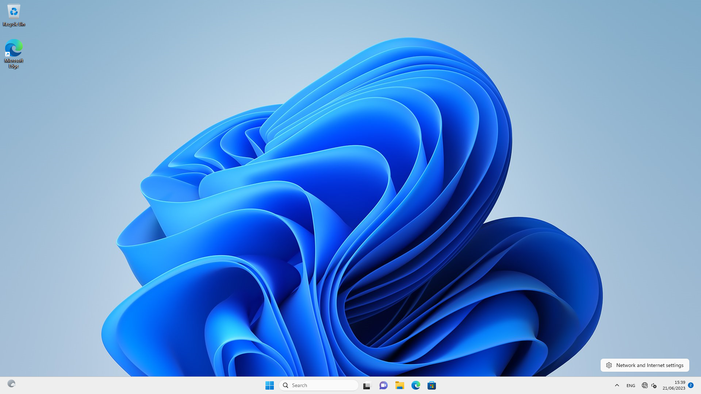

=== "Step2"
    Select “Ethernet”.

    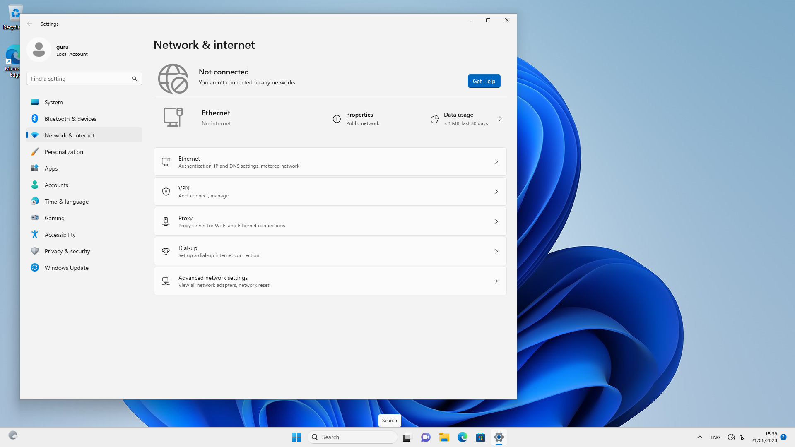

=== "Step3"
    Select “Edit”. Change the IP address.

    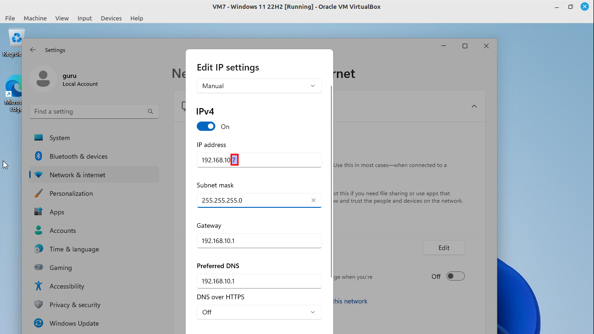

=== "Step4"
    Click "Start" and typ "cmd" to open a command prompt: verify the internet connection.

    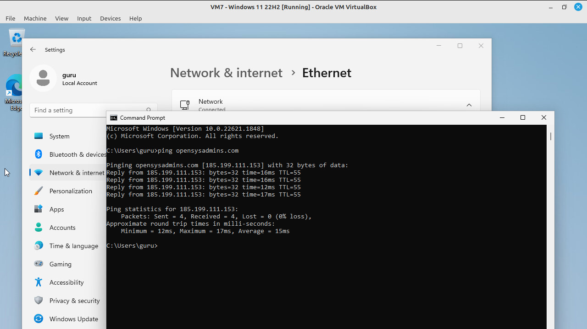

=== "Step5"
    The network icon on the bottom-right taskbar will soon change to this:

    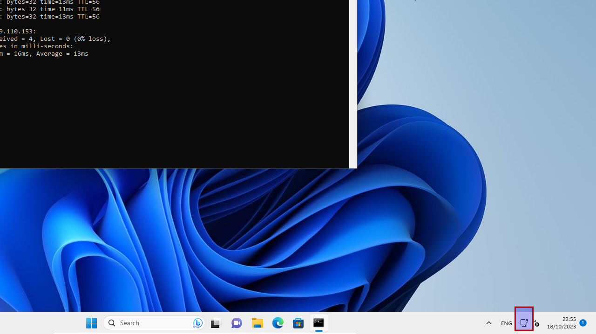

## Computername
=== "Step1"
    Go to "Settings -> About" and change the computer name to “vm7”. Restart now.

    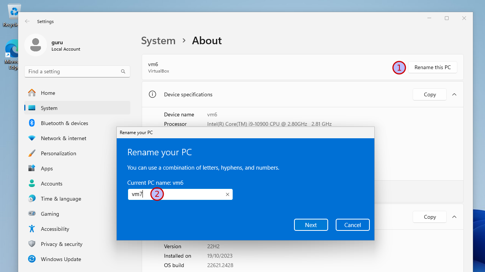

=== "Step2"
    Login after reboot and shutdown Windows.

    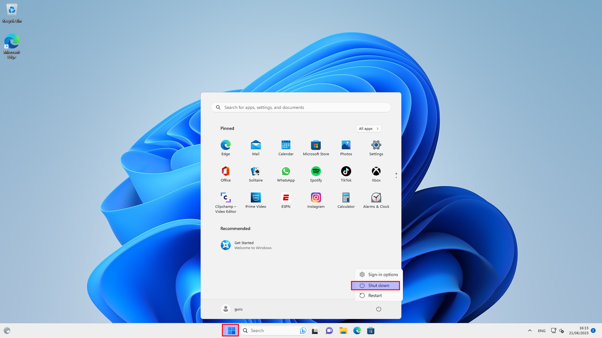

## Snapshot
=== "Step1"
    Select "Machine -> Tools -> Snapshots".

    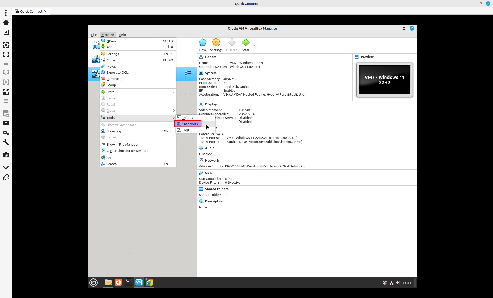

=== "Step2"
    Select "Current State" and click "Take". Give a proper name, like "Clean install". A good "Snapshot Description" can be handy!

    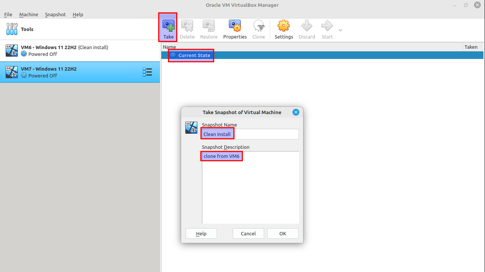

=== "Step3"
    If you change "something" in this virtual machine, you will get "Current State (changed)". Want to revert those changes? Select "Clean install" and click "Restore". Be sure to remove the checkbox at "Create a snapshot of the current machine state" or you'll end up with another snapshot.

    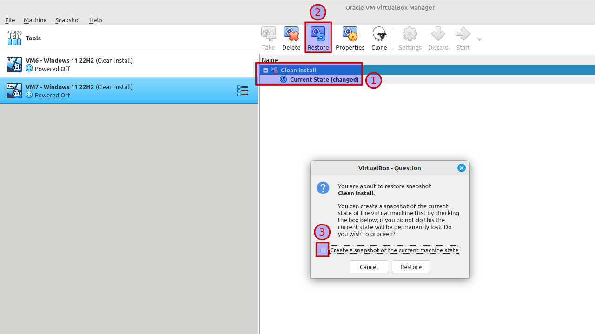

=== "Step4"
    You know if the snapshot has been properly restored, if the "Current State" equals the "Clean install" again.

    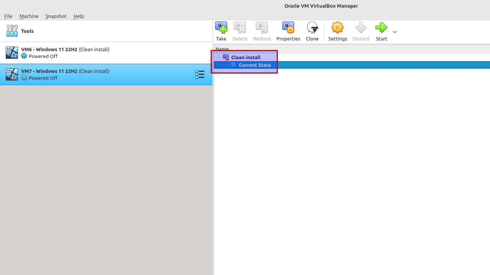
