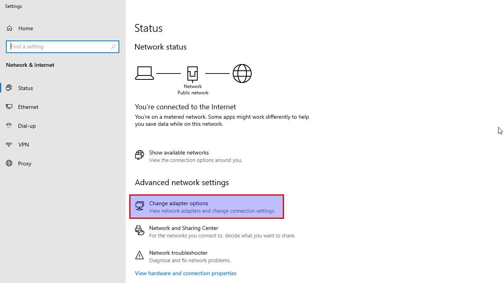

# Clone a Windows Server 2022 virtual machine in VirtualBox 6.1.44

## Prereqs
- an existing [Windows Server 2022 virtual machine](../../tutorials/windows-server-2022-virtualbox/index.md)

## VirtualBox
=== "Step1"
    In this example, the "Current state" equals the "Clean install" snapshot (otherwise it would have been "Current state (Changed)")

    

=== "Step2"
    Select "Machine -> Clone".

    

=== "Step3"
    Click on the "Expert mode" button to show extra options.

    

=== "Step4"
    Change the name of the virtual machine. Clone type: full clone. Snapshots: current machine state. Be sure to generate new MAC addresses for all network adapters. Look at the screenshot below.

    

=== "Step5"
    Click "Clone". This won't take too long.

    

=== "Step6"
    Endresult: a clone of "vm16" without snapshot(s).

    

## Sysprep
Sysprep is used to remove system-specific information from a Windows installation, such as the computer name and security identifier (SID). This is necessary, if you want to add a cloned Windows machine to a Windows active directory domain.

=== "Step1"
    Boot the newly cloned VM and login. Start Explorer and navigate to "c:\Windows\System32\Sysprep". Right-click on "sysprep" and select "Run as Administrator".

    

=== "Step2"
    Select "Enter System Out-of-Box Experience (OOBE)" and put a check next to "Generalize". Select "Reboot" as shutdown option.

    

=== "Step3"
    Sysprep is now running and will reboot Windows afterwards.

    

=== "Step4"
    You are greeted with a welcome screen. Personal preference here.

    

=== "Step5"
    Accept the license terms.

    

=== "Step6"
    Configure the password for the built-in administrator account ("Admin123" for this lab environment). Windows reboots afterwards.

    

## IP address
=== "Step1"
    Login. Right-click on the network icon on the bottom-right taskbar -> Open Network and Internet settings.

    

=== "Step2"
    Select "Change adapter options".

    

=== "Step3"
    Double-click on "Ethernet", select "Properties", double-click on "Internet Protocol Version 4 (TCP/IPv4)" and configure IP settings.

    

=== "Step4"
    Close all windows. Click "Start" and typ "cmd" to open a command prompt: verify the internet connection.  The network icon on the bottom-right taskbar will show connectivity.

    

## Computername
=== "Step1"
    Right-click on "Start -> System". Change the computer name from "vm16" to "vm17". Restart now.

    

=== "Step2"
    Login after reboot and shutdown Windows.

    

## Snapshot
=== "Step1"
    Select "Machine -> Tools -> Snapshots".

    

=== "Step2"
    Select "Current State" and click "Take". Give a proper name, like "Clean install". A good "Snapshot Description" can be handy!

    

=== "Step3"
    If you change "something" in this virtual machine, you will get "Current State (changed)". Want to revert those changes? Select "Clean install" and click "Restore". Be sure to remove the checkbox at "Create a snapshot of the current machine state" or you'll end up with another snapshot.

    

=== "Step4"
    You know if the snapshot has been properly restored, if the "Current State" equals the "Clean install" again.

    