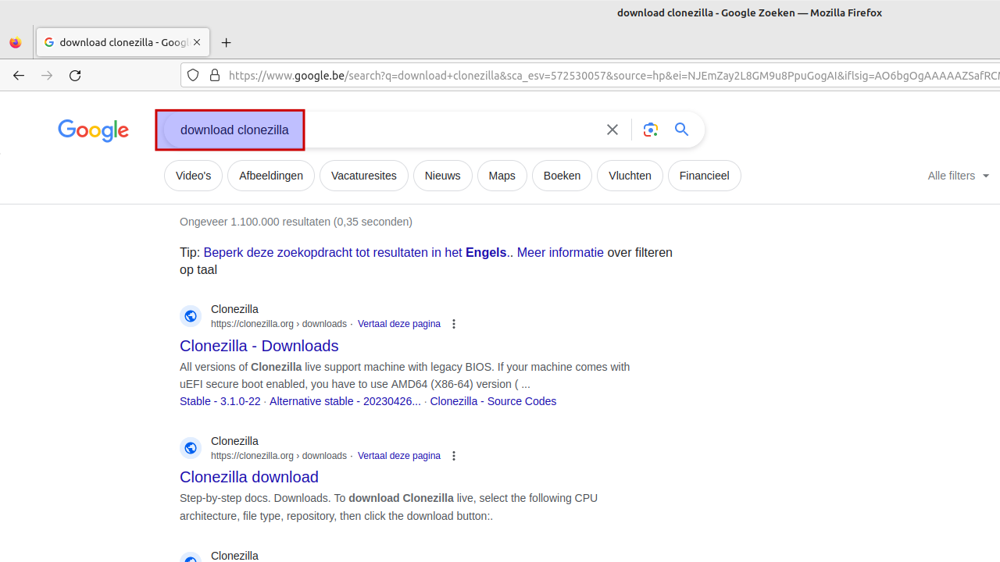
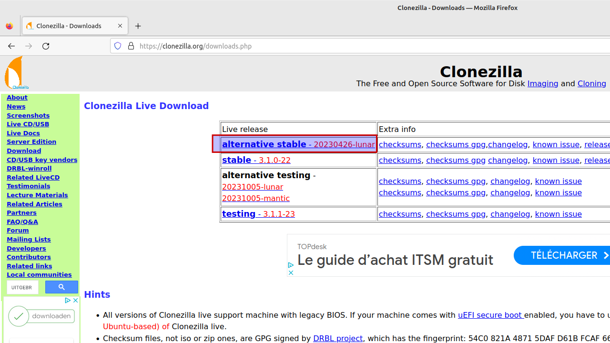
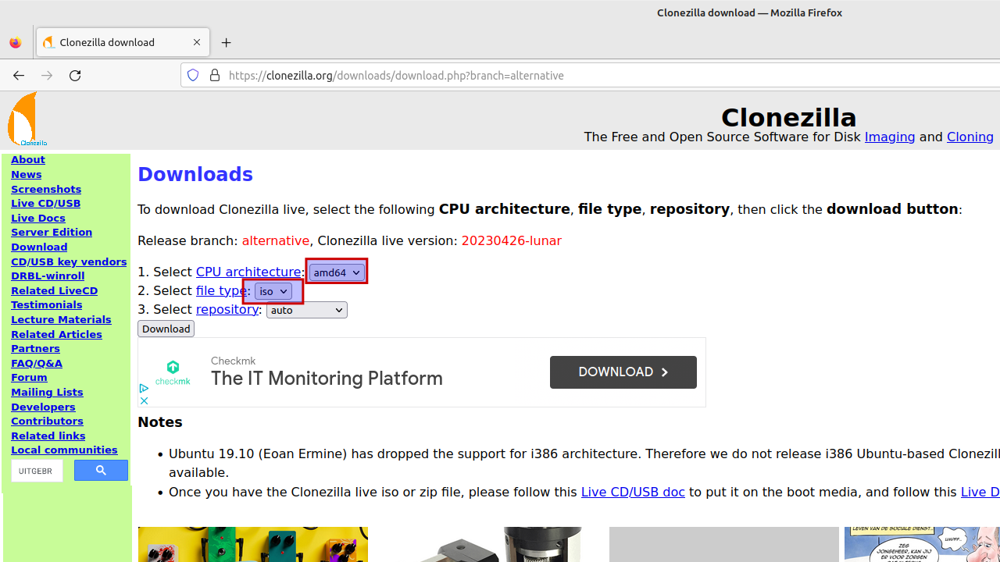
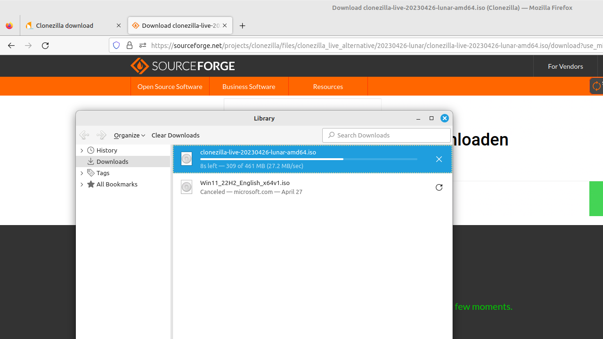
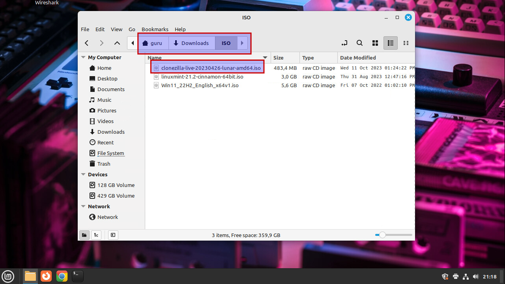

# Create a Clonezilla bootable USB flash drive
todo...

## Download ISO

=== "Step1"
    Use your favorite search engine to search for "Clonezilla" and choose the official website.

    

=== "Step2"
    Choose the "Ubuntu-based alternative stable" version.

    

=== "Step3"
    Make sure the CPU archictecture is "amd64" and the file type is "iso". Click "Download".

    

=== "Step4"
    The file will be downloaded to the "Downloads" folder.

    

=== "Step5"
    Create a directory "ISO" and move the file into that directory.

    