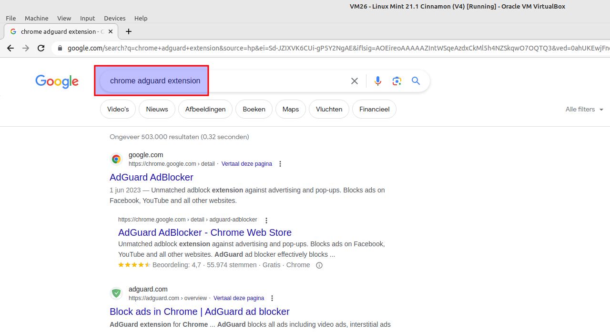

# Install Google Chrome browser on Linux Mint 21

## Download and import Google's signed key
Signing keys are used to verify the authenticity and integrity of packages from repositories. Download Google's and import at once.

=== "guru@hp:~/Downloads$_"

    ``` title='' hl_lines="0"
    curl -sS https://dl.google.com/linux/linux_signing_key.pub | gpg --dearmor | sudo tee /etc/apt/trusted.gpg.d/google-chrome.gpg &> /dev/null
    ```

=== "output"

    ``` title='' hl_lines="0"
    # No output here
    guru@hp:~/Downloads$ curl -sS https://dl.google.com/linux/linux_signing_key.pub | gpg --dearmor | sudo tee /etc/apt/trusted.gpg.d/google-chrome.gpg &> /dev/null
    guru@hp:~/Downloads$
    ```

## Add Google's Chrome repository

=== "guru@hp:~/Downloads$_"

    ``` title='' hl_lines="0"
    sudo sh -c 'echo "deb [arch=amd64 signed-by=/etc/apt/trusted.gpg.d/google-chrome.gpg] http://dl.google.com/linux/chrome/deb/ stable main" > /etc/apt/sources.list.d/google-chrome.list'
    ```

=== "output"

    ``` title='' hl_lines="0"
    # No output here
    guru@hp:~/Downloads$ sudo sh -c 'echo "deb [arch=amd64 signed-by=/etc/apt/trusted.gpg.d/google-chrome.gpg] http://dl.google.com/linux/chrome/deb/ stable main" > /etc/apt/sources.list.d/google-chrome.list'
    guru@hp:~/Downloads$ 
    ```

## Update package list

=== "guru@hp:~/Downloads$_"

    ``` title='' hl_lines="0"
    sudo apt update
    ```

=== "output"

    ``` title='' hl_lines="4 7"
    guru@hp:~/Downloads$ sudo apt update
    Ign:1 https://mintlinux.mirror.wearetriple.com/packages vera InRelease
    Hit:2 https://mintlinux.mirror.wearetriple.com/packages vera Release                                        
    Get:3 http://dl.google.com/linux/chrome/deb stable InRelease [1.825 B]                                      
    Hit:4 http://archive.ubuntu.com/ubuntu jammy InRelease                                                        
    Hit:6 http://archive.ubuntu.com/ubuntu jammy-updates InRelease             
    Get:7 http://dl.google.com/linux/chrome/deb stable/main amd64 Packages [1.079 B]
    Hit:8 http://security.ubuntu.com/ubuntu jammy-security InRelease                
    Get:9 http://archive.ubuntu.com/ubuntu jammy-backports InRelease [108 kB]
    Fetched 111 kB in 1s (114 kB/s)    
    Reading package lists... Done
    Building dependency tree... Done
    Reading state information... Done
    175 packages can be upgraded. Run 'apt list --upgradable' to see them.
    ```

## Install Chrome


=== "guru@hp:~/Downloads$_"

    ``` title='' hl_lines="0"
    sudo apt install google-chrome-stable
    ```

=== "output"

    ``` title='' hl_lines="0"
    guru@hp:~/Downloads$ sudo apt install google-chrome-stable
    Reading package lists... Done
    Building dependency tree... Done
    Reading state information... Done
    The following additional packages will be installed:
    libu2f-udev
    The following NEW packages will be installed:
    google-chrome-stable libu2f-udev
    0 upgraded, 2 newly installed, 0 to remove and 175 not upgraded.
    Need to get 94,4 MB of archives.
    After this operation, 322 MB of additional disk space will be used.
    Do you want to continue? [Y/n] y
    Get:1 http://dl.google.com/linux/chrome/deb stable/main amd64 google-chrome-stable amd64 114.0.5735.133-1 [94,4 MB]
    Get:2 http://archive.ubuntu.com/ubuntu jammy/main amd64 libu2f-udev all 1.1.10-3build2 [4.190 B]
    Fetched 94,4 MB in 4s (24,2 MB/s)                                                 
    Selecting previously unselected package libu2f-udev.
    (Reading database ... 610101 files and directories currently installed.)
    Preparing to unpack .../libu2f-udev_1.1.10-3build2_all.deb ...
    Unpacking libu2f-udev (1.1.10-3build2) ...
    Selecting previously unselected package google-chrome-stable.
    Preparing to unpack .../google-chrome-stable_114.0.5735.133-1_amd64.deb ...
    Unpacking google-chrome-stable (114.0.5735.133-1) ...
    Setting up libu2f-udev (1.1.10-3build2) ...
    Setting up google-chrome-stable (114.0.5735.133-1) ...
    update-alternatives: using /usr/bin/google-chrome-stable to provide /usr/bin/x-www-browser (x-www-browser) in auto mode
    update-alternatives: using /usr/bin/google-chrome-stable to provide /usr/bin/gnome-www-browser (gnome-www-browser) in auto mode
    update-alternatives: using /usr/bin/google-chrome-stable to provide /usr/bin/google-chrome (google-chrome) in auto mode
    Processing triggers for gnome-menus (3.36.0-1ubuntu3) ...
    Processing triggers for man-db (2.10.2-1) ...
    Processing triggers for mailcap (3.70+nmu1ubuntu1) ...
    Processing triggers for desktop-file-utils (0.26+mint2+vera) ...
    guru@hp:~/Downloads$ 
    ```

## Start Chrome
Select "Menu" and start typing "chr". Start "Google Chrome".


## Preferences
Do not send any stats or crash reports for now.


## Adguard

=== "Step1"
    Use your favorite search engine to search for "adguard chrome extension"

    

=== "Step2"
    Click "Add to Chrome" and follow the steps.

    

=== "Step3"
    Finally, enable the first 4 buttons. Restart the browser. It's now ready for use.

    


