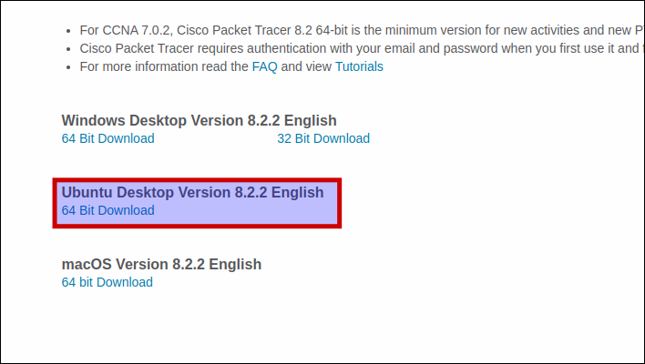
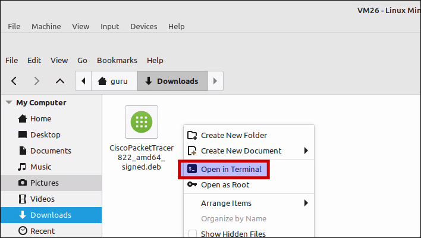
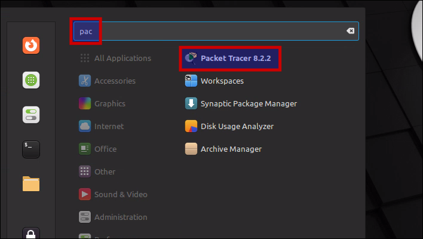

# Install PacketTracer 8.2.1 on Linux Mint 21

## Download
Download PacketTracer from an official Cisco location (e.g Netacad.com, Skillsforall.com) and save it to disk (here: "Downloads")



## Open Terminal
Right-click on an empty space in the "Nemo" file manager and select "Open in Terminal".



## Install
Install the .deb package using the "apt install" command with the relative path to the package file. APT will recognize it and install the package along with its dependencies, if any.

=== "guru@hp:~/Downloads$_"

    ``` title='' hl_lines="0"
    sudo apt install ./CiscoPacketTracer_821_Ubuntu_64bit.deb
    ```

=== "output"

    ``` title='' hl_lines="0"
    guru@hp:~/Downloads$ sudo apt install ./CiscoPacketTracer_821_Ubuntu_64bit.deb
    [sudo] password for guru:     
    Reading package lists... Done
    Building dependency tree... Done
    Reading state information... Done
    Note, selecting 'packettracer' instead of './CiscoPacketTracer_821_Ubuntu_64bit.deb'
    The following additional packages will be installed:
    libgl1-mesa-glx libpthread-stubs0-dev libxau-dev libxcb-xinerama0-dev libxcb1-dev libxdmcp-dev x11proto-dev xorg-sgml-doctools
    Suggested packages:
    libxcb-doc
    The following NEW packages will be installed:
    libgl1-mesa-glx libpthread-stubs0-dev libxau-dev libxcb-xinerama0-dev libxcb1-dev libxdmcp-dev packettracer x11proto-dev
    xorg-sgml-doctools
    0 upgraded, 9 newly installed, 0 to remove and 171 not upgraded.
    Need to get 755 kB/324 MB of archives.
    After this operation, 2.763 kB of additional disk space will be used.
    Do you want to continue? [Y/n] y
    Get:1 http://archive.ubuntu.com/ubuntu jammy-updates/universe amd64 libgl1-mesa-glx amd64 22.2.5-0ubuntu0.1~22.04.1 [5.466 B]
    Get:2 http://archive.ubuntu.com/ubuntu jammy/main amd64 libpthread-stubs0-dev amd64 0.4-1build2 [5.516 B]
    Get:3 http://archive.ubuntu.com/ubuntu jammy/main amd64 xorg-sgml-doctools all 1:1.11-1.1 [10,9 kB]
    Get:4 http://archive.ubuntu.com/ubuntu jammy/main amd64 x11proto-dev all 2021.5-1 [604 kB]
    Get:5 http://archive.ubuntu.com/ubuntu jammy/main amd64 libxau-dev amd64 1:1.0.9-1build5 [9.724 B]
    <snip>
    guru@vm26:~/Downloads$ 
    ```

## License agreement
Read the license agreement :p and select "OK".


## EULA terms
Accept the terms.


## Notice
Ignore the "Notice" warning at the end of the installation. All went well.

``` title='' hl_lines="6"
Setting up libxdmcp-dev:amd64 (1:1.1.3-0ubuntu5) ...
Setting up libxcb1-dev:amd64 (1.14-3ubuntu3) ...
Setting up libxcb-xinerama0-dev:amd64 (1.14-3ubuntu3) ...
Setting up packettracer (8.2.1) ...
gtk-update-icon-cache: Cache file created successfully.
N: Download is performed unsandboxed as root as file '/home/guru/Downloads/CiscoPacketTracer_821_Ubuntu_64bit.deb' couldn't be accessed by user '_apt'. - pkgAcquire::Run (13: Permission denied)
```

## Activation link
Member of Cisco Network Academy? You should have received an activation link on your private e-mail. Activate your account.


## Mint menu
Select "Menu" and start typing "pac". Start "PacketTracer 8.2.1".



## Multi-user
Answer "no".


## Sign-in
First choose "Keep me logged in (for 3 months) and then select "Cisco Networking Academy".


## Login
First accept "cookies" and then login with your private e-mailadress and password.


## Font configuration
Personal preference here. Select "Options -> Preferences -> Font". Increase the fontsize to 12 and click "Apply".
Then close the window.


