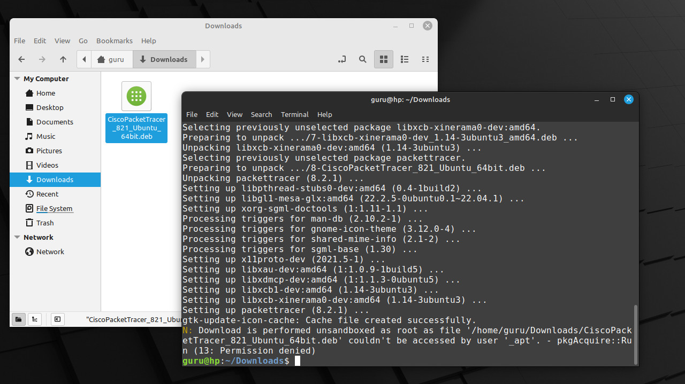

# Install PacketTracer 8.2.1 on Linux Mint 21

## Download
Download PacketTracer from an official Cisco location (e.g Netacad.com, Skillsforall.com) and save it to disk (here: "Downloads")

## Open Terminal
Right-click on an empty space in the "Nemo" file manager and select "Open in Terminal".

## Install
Install the .deb package using the "apt install" command with the relative path to the package file. APT will recognize it and install the package along with its dependencies, if any.

## License agreement
Read the license agreement :p and select "OK".

## EULA terms
Accept the terms.

## Notice
Ignore the "Notice" warning at the end of the installation. All went well.

## Activation link
Member of Cisco Network Academy? You should have received an activation link on your private e-mail. Activate your account.

## Mint menu
Select "Menu" and start typing "pac". Start "PacketTracer 8.2.1".

## Multi-user
Answer "no".

## Sign-in
First choose "Keep me logged in (for 3 months) and then select "Cisco Networking Academy".

## Login
First accept "cookies" and then login with your private e-mailadress and password.

## Font configuration
Personal preference here. Select "Options -> Preferences -> Font". Increase the fontsize to 12 and click "Apply".
Then close the window.

