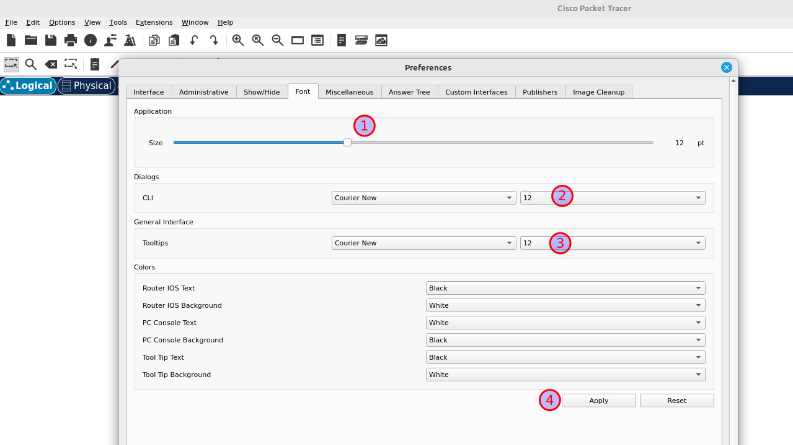

# Install PacketTracer 8.2.2 on Linux Mint 21

## Prereqs
- a PC ([BIOS](../../tutorials/windows11-linuxmint21-dual-boot-bios-clonezilla/)/[UEFI](../../tutorials/windows11-linuxmint21-dual-boot-uefi/)) running Linux Mint 21

## Download
Download PacketTracer from an official Cisco location (e.g Netacad.com, Skillsforall.com) and save it to disk (here: "Downloads")


## Open Terminal
Right-click on an empty space in the "Nemo" file manager and select "Open in Terminal".


## Install
Install the .deb package using the "apt install" command with the relative path to the package file. APT will recognize it and install the package along with its dependencies, if any.

=== "guru@hp:~/Downloads$_"

    ``` title='' hl_lines="0"
    sudo apt install ./CiscoPacketTracer822_amd64_signed.deb
    ```

=== "output"

    ``` title='' hl_lines="2 18"
    guru@vm26:~/Downloads$ sudo apt install ./CiscoPacketTracer822_amd64_signed.deb
    [sudo] password for guru:     
    Reading package lists... Done
    Building dependency tree... Done
    Reading state information... Done
    Note, selecting 'packettracer' instead of './CiscoPacketTracer822_amd64_signed.deb'
    The following additional packages will be installed:
      libgl1-mesa-glx libpthread-stubs0-dev libxau-dev libxcb-xinerama0-dev libxcb1-dev libxdmcp-dev
      x11proto-dev xorg-sgml-doctools
    Suggested packages:
      libxcb-doc
    The following NEW packages will be installed:
      libgl1-mesa-glx libpthread-stubs0-dev libxau-dev libxcb-xinerama0-dev libxcb1-dev libxdmcp-dev
      packettracer x11proto-dev xorg-sgml-doctools
    0 upgraded, 9 newly installed, 0 to remove and 1 not upgraded.
    Need to get 755 kB/284 MB of archives.
    After this operation, 2.765 kB of additional disk space will be used.
    Do you want to continue? [Y/n] y
    Get:1 http://archive.ubuntu.com/ubuntu jammy-updates/universe amd64 libgl1-mesa-glx amd64 23.0.4-0ubuntu1~22.04.1 [5.584 B]
    ...
    ...
    ```

## License agreement
Read the license agreement :p and select "OK".


## EULA terms
Accept the terms.


## Notice
Ignore the "Notice" warning at the end of the installation. All went well.

``` title='' hl_lines="1"
N: Download is performed unsandboxed as root as file '/home/guru/Downloads/CiscoPacketTracer822_amd64_signed.deb' couldn't be accessed by user '_apt'. - pkgAcquire::Run (13: Permission denied)
guru@vm26:~/Downloads$ 
```

## Activation link
Member of Cisco Network Academy? You should have received an activation link on your private e-mail. Activate your account.


## Mint menu
Select "Menu" and start typing "pac". Start "PacketTracer 8.2.2".


## Multi-user
Answer "no".


## Sign-in
First choose "Keep me logged in (for 3 months) and then select "Cisco Networking Academy".


## Login
Type your private e-mailadress. Put a checkmark next to "Remember me".


## Font configuration
Personal preference here. Select "Options -> Preferences -> Font". Increase the fontsize to 12 and click "Apply".
Then close the window.




