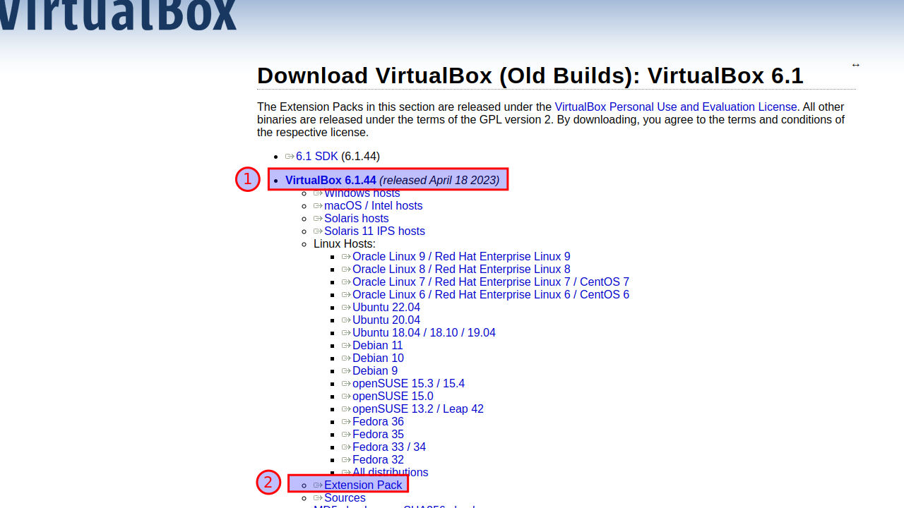
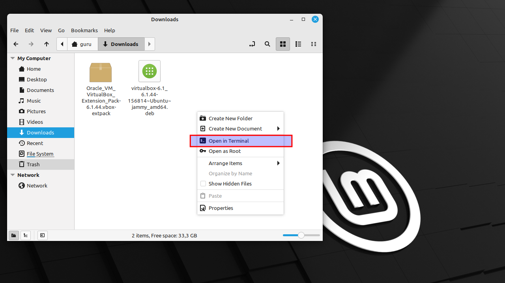
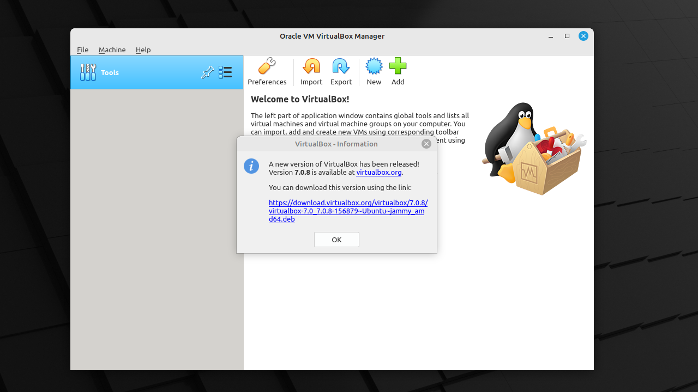
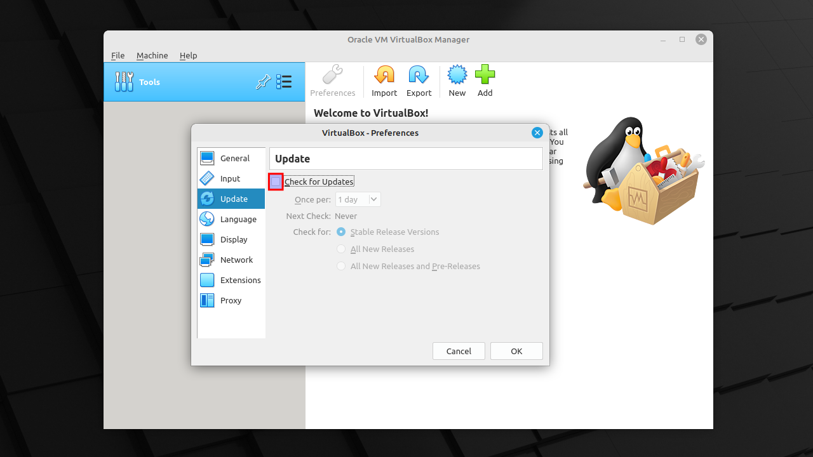
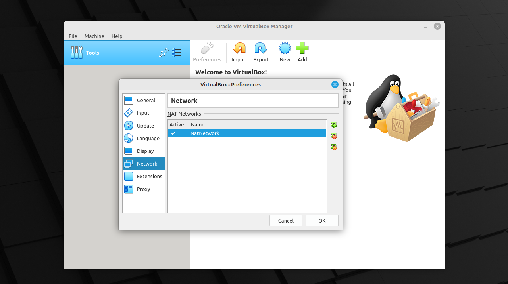
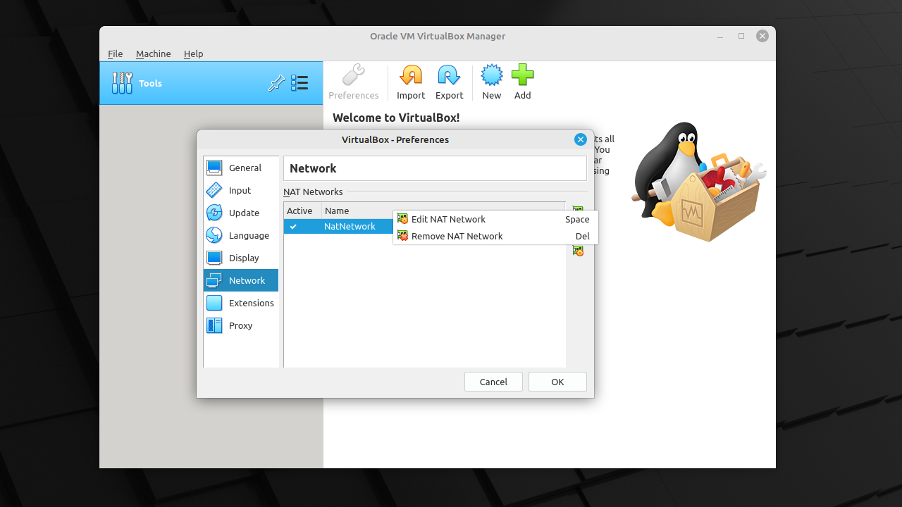
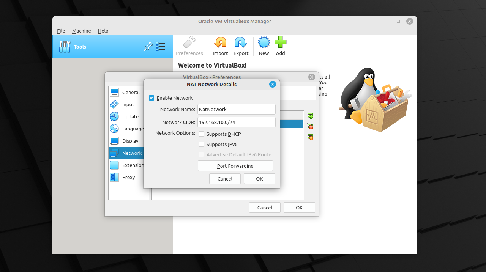

# Install VirtualBox 6.1.44 on Linux Mint 21

## Prereqs
- a PC ([BIOS](../../tutorials/windows11-linuxmint21-dual-boot-bios-clonezilla/)/[UEFI](../../tutorials/windows11-linuxmint21-dual-boot-uefi/)) running Linux Mint 21

## Download
Download "VirtualBox 6.1.44" and the "Extension Pack" from the [official website](https://www.virtualbox.org/wiki/Download_Old_Builds_6_1).



## Open Terminal
Right-click on an empty space in the "Nemo" file manager and select "Open in Terminal".



## Install VirtualBox
Use "dpkg" if you want to install a specific package version from a .deb file without repository interference. It's worth noting that when you use "dpkg" to install a package, it does not automatically resolve dependencies!

=== "guru@hp:~/Downloads$_"

    ``` title='' hl_lines="0"
    sudo dpkg -i virtualbox-6.1_6.1.44-156814~Ubuntu~jammy_amd64.deb
    ```

=== "output"

    ``` title='' hl_lines="0"
    guru@hp:~/Downloads$ sudo dpkg -i virtualbox-6.1_6.1.44-156814~Ubuntu~jammy_amd64.deb 
    Selecting previously unselected package virtualbox-6.1.
    (Reading database ... 610101 files and directories currently installed.)
    Preparing to unpack virtualbox-6.1_6.1.44-156814~Ubuntu~jammy_amd64.deb ...
    Unpacking virtualbox-6.1 (6.1.44-156814~Ubuntu~jammy) ...
    dpkg: dependency problems prevent configuration of virtualbox-6.1:
    virtualbox-6.1 depends on libqt5opengl5 (>= 5.0.2); however:
    Package libqt5opengl5 is not installed.
    virtualbox-6.1 depends on libqt5printsupport5 (>= 5.0.2); however:
    Package libqt5printsupport5 is not installed.
    virtualbox-6.1 depends on libqt5x11extras5 (>= 5.6.0); however:
    Package libqt5x11extras5 is not installed.
    virtualbox-6.1 depends on libsdl1.2debian (>= 1.2.11); however:
    Package libsdl1.2debian is not installed.

    dpkg: error processing package virtualbox-6.1 (--install):
    dependency problems - leaving unconfigured
    Processing triggers for gnome-menus (3.36.0-1ubuntu3) ...
    Processing triggers for desktop-file-utils (0.26+mint2+vera) ...
    Processing triggers for mailcap (3.70+nmu1ubuntu1) ...
    Processing triggers for hicolor-icon-theme (0.17-2) ...
    Processing triggers for shared-mime-info (2.1-2) ...
    Errors were encountered while processing:
    virtualbox-6.1
    guru@hp:~/Downloads$
    ```

## Fix broken dependencies
 This command will attempt to install any missing dependencies required by the package you installed via "dpkg".

=== "guru@hp:~/Downloads$_"

    ``` title='' hl_lines="0"
    sudo apt install -f
    ```

=== "output"

    ``` title='' hl_lines="0"
    guru@hp:~/Downloads$ sudo apt install -f
    Reading package lists... Done
    Building dependency tree... Done
    Reading state information... Done
    Correcting dependencies... Done
    The following additional packages will be installed:
    libqt5opengl5 libqt5printsupport5 libqt5x11extras5 libsdl1.2debian
    The following NEW packages will be installed:
    libqt5opengl5 libqt5printsupport5 libqt5x11extras5 libsdl1.2debian
    0 upgraded, 4 newly installed, 0 to remove and 171 not upgraded.
    1 not fully installed or removed.
    Need to get 556 kB of archives.
    After this operation, 1.966 kB of additional disk space will be used.
    Do you want to continue? [Y/n] y
    Get:1 http://archive.ubuntu.com/ubuntu jammy-updates/universe amd64 libqt5opengl5 amd64 5.15.3+dfsg-2ubuntu0.2 [153 kB]
    Get:2 http://archive.ubuntu.com/ubuntu jammy-updates/universe amd64 libqt5printsupport5 amd64 5.15.3+dfsg-2ubuntu0.2 [214 kB]
    Get:3 http://archive.ubuntu.com/ubuntu jammy/universe amd64 libqt5x11extras5 amd64 5.15.3-1 [10,9 kB]
    Get:4 http://archive.ubuntu.com/ubuntu jammy/universe amd64 libsdl1.2debian amd64 1.2.15+dfsg2-6 [177 kB]
    Fetched 556 kB in 1s (504 kB/s)        
    Selecting previously unselected package libqt5opengl5:amd64.
    (Reading database ... 610864 files and directories currently installed.)
    Preparing to unpack .../libqt5opengl5_5.15.3+dfsg-2ubuntu0.2_amd64.deb ...
    Unpacking libqt5opengl5:amd64 (5.15.3+dfsg-2ubuntu0.2) ...
    Selecting previously unselected package libqt5printsupport5:amd64.
    Preparing to unpack .../libqt5printsupport5_5.15.3+dfsg-2ubuntu0.2_amd64.deb ...
    Unpacking libqt5printsupport5:amd64 (5.15.3+dfsg-2ubuntu0.2) ...
    Selecting previously unselected package libqt5x11extras5:amd64.
    Preparing to unpack .../libqt5x11extras5_5.15.3-1_amd64.deb ...
    Unpacking libqt5x11extras5:amd64 (5.15.3-1) ...
    Selecting previously unselected package libsdl1.2debian:amd64.
    Preparing to unpack .../libsdl1.2debian_1.2.15+dfsg2-6_amd64.deb ...
    Unpacking libsdl1.2debian:amd64 (1.2.15+dfsg2-6) ...
    Setting up libqt5x11extras5:amd64 (5.15.3-1) ...
    Setting up libqt5printsupport5:amd64 (5.15.3+dfsg-2ubuntu0.2) ...
    Setting up libsdl1.2debian:amd64 (1.2.15+dfsg2-6) ...
    Setting up libqt5opengl5:amd64 (5.15.3+dfsg-2ubuntu0.2) ...
    Setting up virtualbox-6.1 (6.1.44-156814~Ubuntu~jammy) ...
    Adding group `vboxusers' (GID 138) ...
    Done.
    Processing triggers for libc-bin (2.35-0ubuntu3.1) ...
    guru@hp:~/Downloads$ 
    ```

## Install Extension pack

=== "guru@hp:~/Downloads$_"

    ``` title='' hl_lines="0"
    sudo VBoxManage extpack install Oracle_VM_VirtualBox_Extension_Pack-6.1.44.vbox-extpack
    ```

=== "output"

    ``` title='' hl_lines="0"
    guru@hp:~/Downloads$ sudo VBoxManage extpack install Oracle_VM_VirtualBox_Extension_Pack-6.1.44.vbox-extpack
    VirtualBox Extension Pack Personal Use and Evaluation License (PUEL)

    License version 11, 21 May 2020

    PLEASE READ THE FOLLOWING ORACLE VM VIRTUALBOX EXTENSION PACK PERSONAL
    <snip>

    Do you agree to these license terms and conditions (y/n)? y

    License accepted. For batch installation add
    --accept-license=33d7284dc4a0ece381196fda3cfe2ed0e1e8e7ed7f27b9a9ebc4ee22e24bd23c
    to the VBoxManage command line.

    0%...10%...20%...30%...40%...50%...60%...70%...80%...90%...100%
    Successfully installed "Oracle VM VirtualBox Extension Pack".
    guru@hp:~/Downloads$ 
    ```

## Start VirtualBox
Select "Menu" and start typing "vir". Start "Oracle VM VirtualBox".


## Ignore new version
Version 7 is available, but let's use the most stable version 6.1.44 for now.



## Disable update check
Select "File -> Preferences -> Update". Disable "Check for Updates".



## NAT configuration
=== "Step1"
    Select "File -> Preferences -> Network". Click on the + to create a NAT Network.

    

=== "Step2"
    Mouse right-click "Edit NAT Network".

    

=== "Step3"
    Change the network CIDR to "192.168.10.0/24" and remove the check "Supports DHCP". Close all screens with "OK".

    
