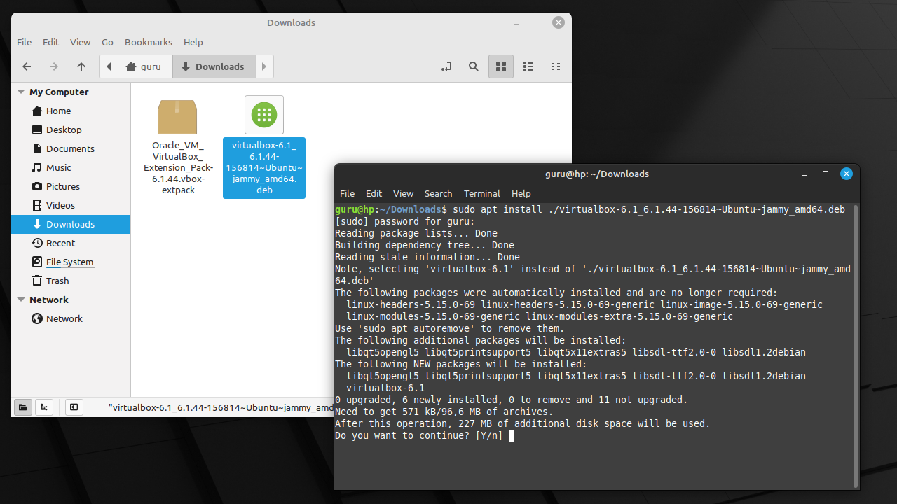
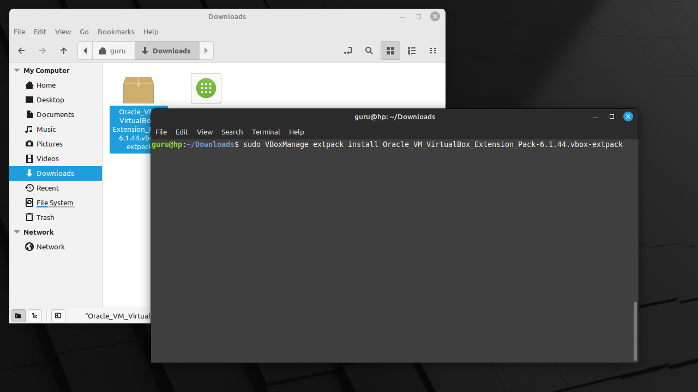
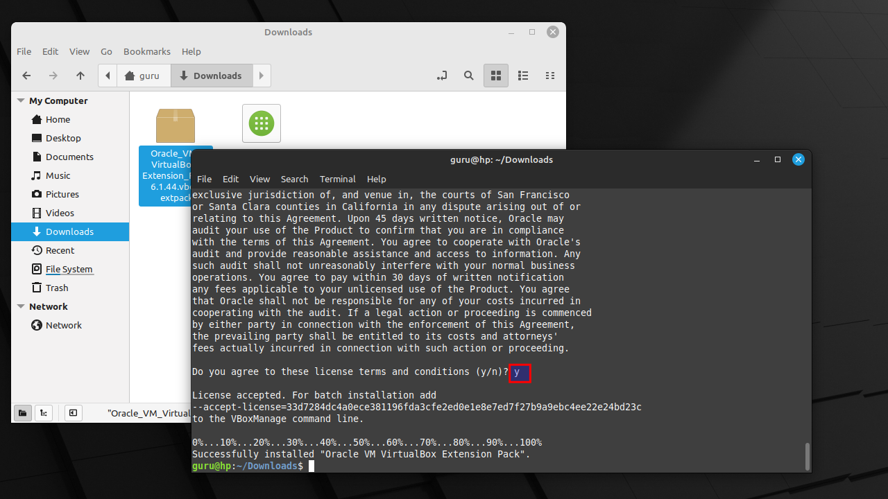

# Install VirtualBox 6.1.44 on Linux Mint 21

## Download
Download "VirtualBox 6.1.44" and the "Extension Pack" from the official website.

## Open Terminal
Right-click on an empty space in the "Nemo" file manager and select "Open in Terminal".

## Install VirtualBox and Extension pack
=== "Step1"
    Install the .deb package using the "apt install" command with the relative path to the package file. APT will recognize it and install the package along with its dependencies, if any.

    

=== "Step2"
    Install the "Extension pack" using command with the relative path to the package file. APT will recognize it and install the package along with its dependencies, if any.

    

=== "Step3"
    Read the license agreement :p and typ "y".

    

## Start VirtualBox
Select "Menu" and start typing "vir". Start "Oracle VM VirtualBox".

## Ignore new version
Version 7 is available, but let's use the most stable version 6.1.44 for now.

## Disable update check
Select "File -> Preferences -> Update". Disable "Check for Updates".

## NAT configuration
=== "Step1"
    Select "File -> Preferences -> Network". Click on the + to create a NAT Network.

    

=== "Step2"
    Mouse right-click "Edit NAT Network".

    

=== "Step3"
    Change the network CIDR to "192.168.10.0/24" and remove the check "Supports DHCP". Close all screens with "OK".

    
