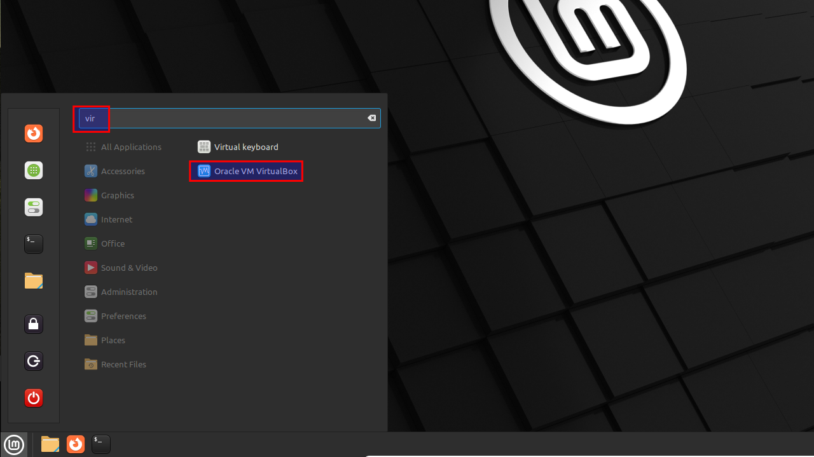

# Install VirtualBox 7 on Linux Mint 21

## Prereqs
- a PC ([BIOS](../../tutorials/windows11-linuxmint21-dual-boot-bios-clonezilla/)/[UEFI](../../tutorials/windows11-linuxmint21-dual-boot-uefi/)) running Linux Mint 21

## Import GPG key
By default, VirtualBox 6 is available in the Linux Mint 21 repo, not VirtualBox 7. In the next step, we'll add it to our system. First, let's import the Oracle VirtualBox GPG keys that sign the software.

=== "guru@lab:~$_"

    ``` title='' hl_lines="0"
    wget -q -O- https://www.virtualbox.org/download/oracle_vbox_2016.asc | sudo gpg --dearmor --yes --output /usr/share/keyrings/oracle-virtualbox-2016.gpg
    ```

=== "output"

    ``` title='' hl_lines="0"
    guru@lab:~$ wget -q -O- https://www.virtualbox.org/download/oracle_vbox_2016.asc | sudo gpg --dearmor --yes --output /usr/share/keyrings/oracle-virtualbox-2016.gpg
    [sudo] password for guru:     
    guru@lab:~$ 
    ```

## Add repository
Add the official VirtualBox repository to Linux mint 21. New versions will be available when you update the Linux Mint system.

=== "guru@lab:~$_"

    ``` title='' hl_lines="0"
    echo "deb [arch=amd64 signed-by=/usr/share/keyrings/oracle-virtualbox-2016.gpg] http://download.virtualbox.org/virtualbox/debian jammy contrib" | sudo tee /etc/apt/sources.list.d/virtualbox.list
    ```

=== "output"

    ``` title='' hl_lines="0"
    guru@lab:~$ echo "deb [arch=amd64 signed-by=/usr/share/keyrings/oracle-virtualbox-2016.gpg] http://download.virtualbox.org/virtualbox/debian jammy contrib" | sudo tee /etc/apt/sources.list.d/virtualbox.list  
    deb [arch=amd64 signed-by=/usr/share/keyrings/oracle-virtualbox-2016.gpg] http://download.virtualbox.org/virtualbox/debian jammy contrib
    guru@lab:~$ 
    ```

## Update package list

=== "guru@lab:~$_"

    ``` title='' hl_lines="0"
    sudo apt update
    ```

=== "output"

    ``` title='' hl_lines="6 9"
    guru@lab:~$ sudo apt update
    Ign:1 https://mintlinux.mirror.wearetriple.com/packages virginia InRelease
    Hit:2 https://mintlinux.mirror.wearetriple.com/packages virginia Release                            
    Hit:3 http://security.ubuntu.com/ubuntu jammy-security InRelease                                                     
    Hit:4 http://archive.ubuntu.com/ubuntu jammy InRelease                                                               
    Get:5 http://download.virtualbox.org/virtualbox/debian jammy InRelease [4.428 B]
    Hit:6 http://archive.ubuntu.com/ubuntu jammy-updates InRelease                  
    Hit:8 http://archive.ubuntu.com/ubuntu jammy-backports InRelease
    Get:9 http://download.virtualbox.org/virtualbox/debian jammy/contrib amd64 Packages [1.495 B]
    Fetched 5.923 B in 1s (5.015 B/s)     
    Reading package lists... Done
    Building dependency tree... Done
    Reading state information... Done
    All packages are up to date.
    guru@lab:~$ 
    ```

## Install VirtualBox
Notice in the output, a group `vboxusers` will be created.
=== "guru@lab:~$_"

    ``` title='' hl_lines="0"
    sudo apt install virtualbox-7.0
    ```

=== "output"

    ``` title='' hl_lines="16"
    guru@lab:~$ sudo apt install virtualbox-7.0 -y
    Reading package lists... Done
    Building dependency tree... Done
    Reading state information... Done
    The following additional packages will be installed:
    libqt5help5 libqt5opengl5 libqt5printsupport5 libqt5sql5 libqt5sql5-sqlite libqt5x11extras5 libqt5xml5 libsdl-ttf2.0-0 libsdl1.2debian
    The following NEW packages will be installed:
    libqt5help5 libqt5opengl5 libqt5printsupport5 libqt5sql5 libqt5sql5-sqlite libqt5x11extras5 libqt5xml5 libsdl-ttf2.0-0 libsdl1.2debian virtualbox-7.0
    0 upgraded, 10 newly installed, 0 to remove and 0 not upgraded.
    Need to get 93,9 MB of archives.
    After this operation, 224 MB of additional disk space will be used.
    Get:1 http://archive.ubuntu.com/ubuntu jammy-updates/universe amd64 libqt5sql5 amd64 5.15.3+dfsg-2ubuntu0.2 [123 kB]
    ...
    ...
    Setting up virtualbox-7.0 (7.0.20-163906~Ubuntu~jammy) ...
    Adding group `vboxusers' (GID 138) ...
    Done.
    Processing triggers for desktop-file-utils (0.26+mint3+victoria) ...
    ...
    guru@lab:~$ 
    ```

## Verify installed version
In a next step, we'll install the `VirtualBox Extension Pack`. It is important that the version matches the version of VirtualBox. Let's checkout the version of VirtualBox.

=== "guru@lab:~$_"

    ``` title='' hl_lines="0"
    vboxmanage -v | cut -dr -f1
    ```

=== "output"

    ``` title='' hl_lines="0"
    guru@lab:~$ vboxmanage -v | cut -dr -f1
    7.0.20
    guru@lab:~$ 
    ```

## Download extension pack
In this case, the version is 7.0.20. Download the Extension Pack with the same version.

=== "guru@lab:~$_"

    ``` title='' hl_lines="0"
    wget https://download.virtualbox.org/virtualbox/7.0.20/Oracle_VM_VirtualBox_Extension_Pack-7.0.20.vbox-extpack
    ```

=== "output"

    ``` title='' hl_lines="0" 
    guru@lab:~$ wget https://download.virtualbox.org/virtualbox/7.0.20/Oracle_VM_VirtualBox_Extension_Pack-7.0.20.vbox-extpack
    --2024-07-18 14:59:08--  https://download.virtualbox.org/virtualbox/7.0.20/Oracle_VM_VirtualBox_Extension_Pack-7.0.20.vbox-extpack
    Resolving download.virtualbox.org (download.virtualbox.org)... 92.123.50.125
    Connecting to download.virtualbox.org (download.virtualbox.org)|92.123.50.125|:443... connected.
    HTTP request sent, awaiting response... 200 OK
    Length: 18263914 (17M) [text/plain]
    Saving to: ‘Oracle_VM_VirtualBox_Extension_Pack-7.0.20.vbox-extpack’

    Oracle_VM_VirtualBox_Extension_Pack-7.0.20.vbox-extpack     100%[=========================================================================================================================================>]  17,42M  56,5MB/s    in 0,3s    

    2024-07-18 14:59:09 (56,5 MB/s) - ‘Oracle_VM_VirtualBox_Extension_Pack-7.0.20.vbox-extpack’ saved [18263914/18263914]

    guru@lab:~$
    ```

## Install extension pack
You will be prompted to agree to the Oracle’s license terms and conditions.
=== "guru@lab:~$_"

    ``` title='' hl_lines="0"
    sudo vboxmanage extpack install Oracle_VM_VirtualBox_Extension_Pack-7.0.20.vbox-extpack
    ```

=== "output"

    ``` title='' hl_lines="11"
    guru@lab:~$ sudo vboxmanage extpack install Oracle_VM_VirtualBox_Extension_Pack-7.0.20.vbox-extpack 
    VirtualBox Extension Pack Personal Use and Evaluation License (PUEL)

    License version 11, 21 May 2020

    PLEASE READ THE FOLLOWING ORACLE VM VIRTUALBOX EXTENSION PACK PERSONAL
    USE AND EVALUATION LICENSE CAREFULLY BEFORE DOWNLOADING OR USING THE
    ORACLE SOFTWARE...
    ...
    ...
    Do you agree to these license terms and conditions (y/n)? y

    License accepted. For batch installation add
    --accept-license=33d7284dc4a0ece381196fda3cfe2ed0e1e8e7ed7f27b9a9ebc4ee22e24bd23c
    to the VBoxManage command line.

    0%...10%...20%...30%...40%...50%...60%...70%...80%...90%...100%
    Successfully installed "Oracle VM VirtualBox Extension Pack".
    guru@lab:~$ 

    ```

## Verify extension pack

=== "guru@lab:~$_"

    ``` title='' hl_lines="0"
    vboxmanage list extpacks | grep "Version"
    ```

=== "output"

    ``` title='' hl_lines="0"
    guru@lab:~$ vboxmanage list extpacks | grep "Version"
    Version:        7.0.20
    guru@lab:~$ 
    ```

## Add user to vboxusers group

=== "guru@lab:~$_"

    ``` title='' hl_lines="0"
    sudo usermod -aG vboxusers guru
    ```

=== "output"

    ``` title='' hl_lines="0"
    guru@lab:~$ sudo usermod -aG vboxusers guru
    guru@lab:~$ 
    ```

## Reboot + verify group membership
The user's current session doesn't automatically update with the new group memberships. The `id` command only reflects the groups that the current session is aware of. The easiest way is to do a reboot first. Then check if the user is member of the group.

=== "guru@lab:~$_"

    ``` title='' hl_lines="0"
    sudo reboot
    id
    ```

=== "output"

    ``` title='' hl_lines="0"
    guru@lab:~$ id
    uid=1000(guru) gid=1000(guru) groups=1000(guru),4(adm),24(cdrom),27(sudo),30(dip),46(plugdev),115(lpadmin),136(sambashare),138(vboxusers),999(vboxsf)
    guru@lab:~$ 
    ```

## Start VirtualBox
Select "Menu" and start typing "vir". Start "Oracle VM VirtualBox".


