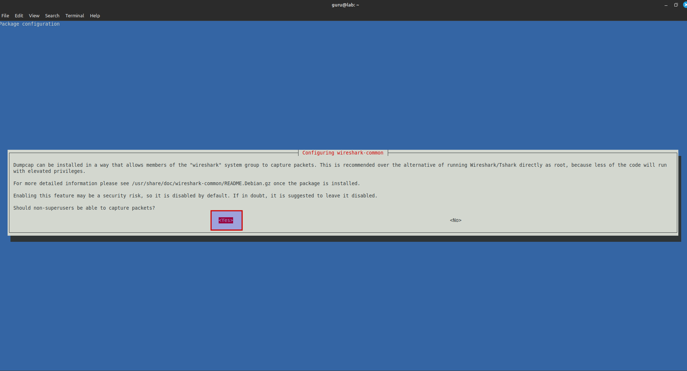
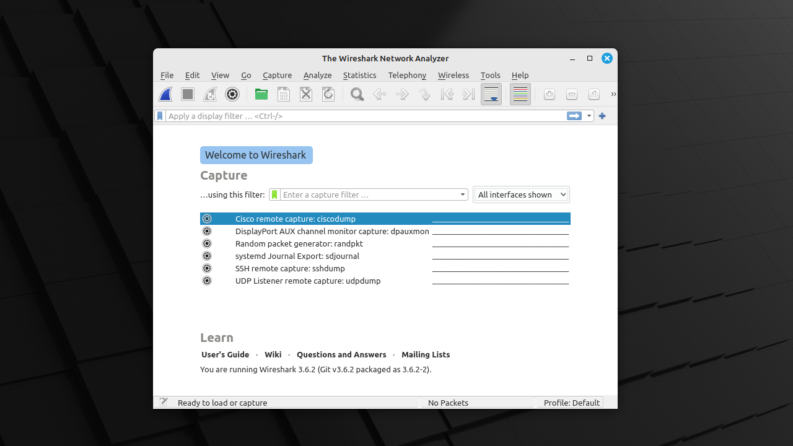

# Install Wireshark on Linux Mint 21

## Prereqs
- a PC ([BIOS](../../tutorials/windows11-linuxmint21-dual-boot-bios-clonezilla/index.md){:target="_blank"}/[UEFI](../../tutorials/windows11-linuxmint21-dual-boot-uefi/index.md){:target="_blank"}) running Linux Mint 21

## Update package list

=== "guru@lab:~$_"

    ``` title='' hl_lines="0"
    sudo apt update
    ```

=== "output"

    ``` title='' hl_lines="0"
    guru@lab:~$ sudo apt update
    [sudo] password for guru:     
    Ign:1 https://linuxmint-packages.mirror.liteserver.nl victoria InRelease
    Hit:2 http://archive.ubuntu.com/ubuntu jammy InRelease                     
    Hit:3 https://linuxmint-packages.mirror.liteserver.nl victoria Release     
    Hit:4 http://security.ubuntu.com/ubuntu jammy-security InRelease
    Hit:5 http://archive.ubuntu.com/ubuntu jammy-updates InRelease
    Hit:6 http://archive.ubuntu.com/ubuntu jammy-backports InRelease
    Reading package lists... Done
    Building dependency tree... Done
    Reading state information... Done
    All packages are up to date.
    guru@lab:~$  
    ```

## Install Wireshark

=== "step1 (guru@lab:~$_)"

    ``` title='' hl_lines="0"
    sudo apt install wireshark -y
    ```

=== "step2"
    Let's allow non-superusers to capture packets.

    

=== "step3 (output)"

    ``` title='' hl_lines="0"
    guru@lab:~$ sudo apt install wireshark -y
    Reading package lists... Done
    Building dependency tree... Done
    Reading state information... Done
    The following additional packages will be installed:
    libbcg729-0 libminizip1 libqt5multimedia5 libqt5multimedia5-plugins libqt5multimediagsttools5 libqt5multimediawidgets5 libqt5printsupport5 libsmi2ldbl libwireshark-data libwireshark15 libwiretap12 libwsutil13 wireshark-common
    wireshark-qt
    Suggested packages:
    snmp-mibs-downloader geoipupdate geoip-database-extra libjs-leaflet libjs-leaflet.markercluster wireshark-doc
    The following NEW packages will be installed:
    libbcg729-0 libminizip1 libqt5multimedia5 libqt5multimedia5-plugins libqt5multimediagsttools5 libqt5multimediawidgets5 libqt5printsupport5 libsmi2ldbl libwireshark-data libwireshark15 libwiretap12 libwsutil13 wireshark
    wireshark-common wireshark-qt
    0 upgraded, 15 newly installed, 0 to remove and 0 not upgraded.
    Need to get 27,3 MB of archives.
    After this operation, 131 MB of additional disk space will be used.
    Get:1 http://archive.ubuntu.com/ubuntu jammy/universe amd64 libbcg729-0 amd64 1.1.1-2 [32,9 kB]
    Get:2 http://archive.ubuntu.com/ubuntu jammy/universe amd64 libminizip1 amd64 1.1-8build1 [20,2 kB]
    Get:3 http://archive.ubuntu.com/ubuntu jammy/universe amd64 libqt5multimedia5 amd64 5.15.3-1 [320 kB]
    Get:4 http://archive.ubuntu.com/ubuntu jammy/universe amd64 libqt5multimediawidgets5 amd64 5.15.3-1 [42,6 kB]
    Get:5 http://archive.ubuntu.com/ubuntu jammy/universe amd64 libqt5multimediagsttools5 amd64 5.15.3-1 [112 kB]
    Get:6 http://archive.ubuntu.com/ubuntu jammy/universe amd64 libqt5multimedia5-plugins amd64 5.15.3-1 [178 kB]
    Get:7 http://archive.ubuntu.com/ubuntu jammy-updates/universe amd64 libqt5printsupport5 amd64 5.15.3+dfsg-2ubuntu0.2 [214 kB]
    Get:8 http://archive.ubuntu.com/ubuntu jammy/universe amd64 libsmi2ldbl amd64 0.4.8+dfsg2-16 [100 kB]
    Get:9 http://archive.ubuntu.com/ubuntu jammy/universe amd64 libwireshark-data all 3.6.2-2 [1.647 kB]
    Get:10 http://archive.ubuntu.com/ubuntu jammy/universe amd64 libwsutil13 amd64 3.6.2-2 [99,2 kB]
    Get:11 http://archive.ubuntu.com/ubuntu jammy/universe amd64 libwiretap12 amd64 3.6.2-2 [255 kB]
    Get:12 http://archive.ubuntu.com/ubuntu jammy/universe amd64 libwireshark15 amd64 3.6.2-2 [19,5 MB]
    Get:13 http://archive.ubuntu.com/ubuntu jammy/universe amd64 wireshark-common amd64 3.6.2-2 [473 kB]
    Get:14 http://archive.ubuntu.com/ubuntu jammy/universe amd64 wireshark-qt amd64 3.6.2-2 [4.269 kB]
    Get:15 http://archive.ubuntu.com/ubuntu jammy/universe amd64 wireshark amd64 3.6.2-2 [4.992 B]
    Fetched 27,3 MB in 2s (13,0 MB/s)      
    Preconfiguring packages ...
    Selecting previously unselected package libbcg729-0:amd64.
    (Reading database ... 560791 files and directories currently installed.)
    Preparing to unpack .../00-libbcg729-0_1.1.1-2_amd64.deb ...
    Unpacking libbcg729-0:amd64 (1.1.1-2) ...
    Selecting previously unselected package libminizip1:amd64.
    Preparing to unpack .../01-libminizip1_1.1-8build1_amd64.deb ...
    Unpacking libminizip1:amd64 (1.1-8build1) ...
    Selecting previously unselected package libqt5multimedia5:amd64.
    Preparing to unpack .../02-libqt5multimedia5_5.15.3-1_amd64.deb ...
    Unpacking libqt5multimedia5:amd64 (5.15.3-1) ...
    Selecting previously unselected package libqt5multimediawidgets5:amd64.
    Preparing to unpack .../03-libqt5multimediawidgets5_5.15.3-1_amd64.deb ...
    Unpacking libqt5multimediawidgets5:amd64 (5.15.3-1) ...
    Selecting previously unselected package libqt5multimediagsttools5:amd64.
    Preparing to unpack .../04-libqt5multimediagsttools5_5.15.3-1_amd64.deb ...
    Unpacking libqt5multimediagsttools5:amd64 (5.15.3-1) ...
    Selecting previously unselected package libqt5multimedia5-plugins:amd64.
    Preparing to unpack .../05-libqt5multimedia5-plugins_5.15.3-1_amd64.deb ...
    Unpacking libqt5multimedia5-plugins:amd64 (5.15.3-1) ...
    Selecting previously unselected package libqt5printsupport5:amd64.
    Preparing to unpack .../06-libqt5printsupport5_5.15.3+dfsg-2ubuntu0.2_amd64.deb ...
    Unpacking libqt5printsupport5:amd64 (5.15.3+dfsg-2ubuntu0.2) ...
    Selecting previously unselected package libsmi2ldbl:amd64.
    Preparing to unpack .../07-libsmi2ldbl_0.4.8+dfsg2-16_amd64.deb ...
    Unpacking libsmi2ldbl:amd64 (0.4.8+dfsg2-16) ...
    Selecting previously unselected package libwireshark-data.
    Preparing to unpack .../08-libwireshark-data_3.6.2-2_all.deb ...
    Unpacking libwireshark-data (3.6.2-2) ...
    Selecting previously unselected package libwsutil13:amd64.
    Preparing to unpack .../09-libwsutil13_3.6.2-2_amd64.deb ...
    Unpacking libwsutil13:amd64 (3.6.2-2) ...
    Selecting previously unselected package libwiretap12:amd64.
    Preparing to unpack .../10-libwiretap12_3.6.2-2_amd64.deb ...
    Unpacking libwiretap12:amd64 (3.6.2-2) ...
    Selecting previously unselected package libwireshark15:amd64.
    Preparing to unpack .../11-libwireshark15_3.6.2-2_amd64.deb ...
    Unpacking libwireshark15:amd64 (3.6.2-2) ...
    Selecting previously unselected package wireshark-common.
    Preparing to unpack .../12-wireshark-common_3.6.2-2_amd64.deb ...
    Unpacking wireshark-common (3.6.2-2) ...
    Selecting previously unselected package wireshark-qt.
    Preparing to unpack .../13-wireshark-qt_3.6.2-2_amd64.deb ...
    Unpacking wireshark-qt (3.6.2-2) ...
    Selecting previously unselected package wireshark.
    Preparing to unpack .../14-wireshark_3.6.2-2_amd64.deb ...
    Unpacking wireshark (3.6.2-2) ...
    Setting up libbcg729-0:amd64 (1.1.1-2) ...
    Setting up libminizip1:amd64 (1.1-8build1) ...
    Setting up libqt5multimedia5:amd64 (5.15.3-1) ...
    Setting up libqt5printsupport5:amd64 (5.15.3+dfsg-2ubuntu0.2) ...
    Setting up libsmi2ldbl:amd64 (0.4.8+dfsg2-16) ...
    Setting up libwsutil13:amd64 (3.6.2-2) ...
    Setting up libwiretap12:amd64 (3.6.2-2) ...
    Setting up libqt5multimediawidgets5:amd64 (5.15.3-1) ...
    Setting up libwireshark-data (3.6.2-2) ...
    Setting up libqt5multimediagsttools5:amd64 (5.15.3-1) ...
    Setting up libqt5multimedia5-plugins:amd64 (5.15.3-1) ...
    Setting up libwireshark15:amd64 (3.6.2-2) ...
    Setting up wireshark-common (3.6.2-2) ...
    Setting up wireshark-qt (3.6.2-2) ...
    Setting up wireshark (3.6.2-2) ...
    Processing triggers for libc-bin (2.35-0ubuntu3.1) ...
    Processing triggers for man-db (2.10.2-1) ...
    Processing triggers for shared-mime-info (2.1-2) ...
    Processing triggers for mailcap (3.70+nmu1ubuntu1) ...
    Processing triggers for desktop-file-utils (0.26+mint3+victoria) ...
    Processing triggers for hicolor-icon-theme (0.17-2) ...
    Processing triggers for gnome-menus (3.36.0-1ubuntu3) ...
    guru@lab:~$  
    ```

## Fix stuff

=== "step1"
    When you start Wireshark, no interfaces are listed (bug?)

    

=== "step2 (guru@lab:~$_)"
    Let's add the user "guru" to the existing group "wireshark".

    ``` title='' hl_lines="0"
    sudo usermod -a -G wireshark guru
    ```

=== "step3 (output)"

    ``` title='' hl_lines="0"
    guru@lab:~$ sudo usermod -a -G wireshark guru
    [sudo] password for guru:     
    guru@lab:~$
    ```

=== "step4"
    Log off and log in. Start Wireshark. The network card(s) should be listed now.

    
