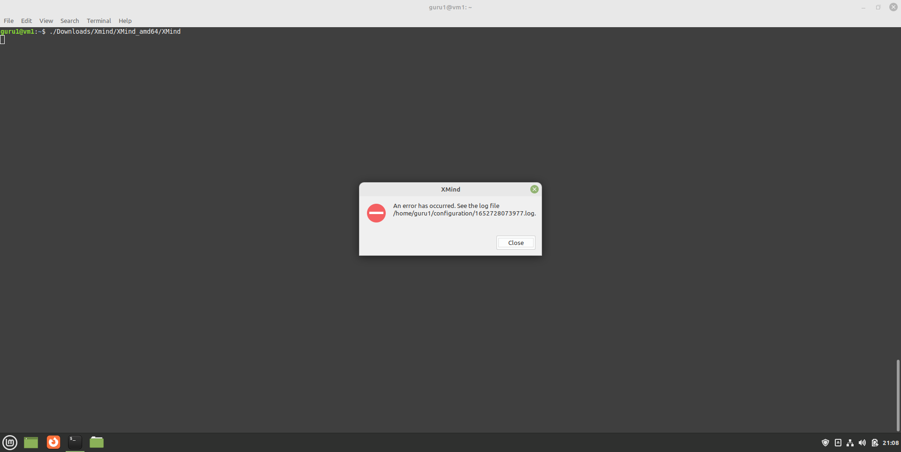
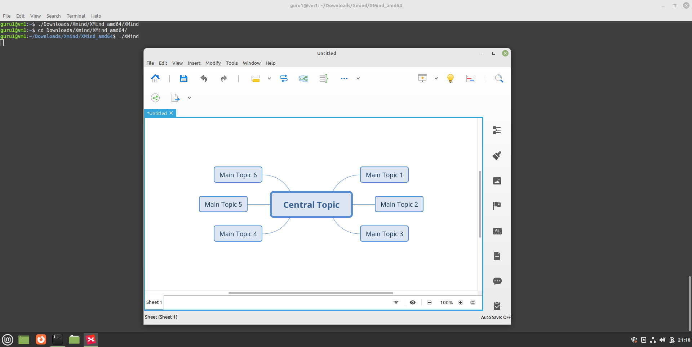

---
hide:
    - toc
---

# Install Xmind 8 on Linux Mint 21.x
XMind is a mind mapping and brainstorming software. At the time of writing, the current downloadable version is XMind 2022 (12.0.2 evaluation version).
If you happen to have some old .xmind files lying around (#like me), created in the award winning version XMind 8 v3.7.9, you can open them with the newer version without a problem. But if you are familiar with the "legacy" interface, you can still download and make that version work on a modern Linux system.

## Download
=== "guru@vm26:~$_"

    ``` title=''
    # directory Downloads/XMind will be created
    wget https://www.xmind.net/xmind/downloads/xmind-8-update9-linux.zip -P Downloads/Xmind/
    ```

=== "output"

    ``` title='' hl_lines="17"
    guru@vm26:~$ wget https://www.xmind.net/xmind/downloads/xmind-8-update9-linux.zip -P Downloads/Xmind/
    --2022-05-13 14:09:16--  https://www.xmind.net/xmind/downloads/xmind-8-update9-linux.zip
    Resolving www.xmind.net (www.xmind.net)... 3.232.41.189, 44.194.150.33
    Connecting to www.xmind.net (www.xmind.net)|3.232.41.189|:443... connected.
    HTTP request sent, awaiting response... 302 Found
    Location: https://dl3.xmind.net/xmind-8-update9-linux.zip [following]
    --2022-05-13 14:09:16--  https://dl3.xmind.net/xmind-8-update9-linux.zip
    Resolving dl3.xmind.net (dl3.xmind.net)... 13.227.219.86, 13.227.219.108, 13.227.219.84, ...
    Connecting to dl3.xmind.net (dl3.xmind.net)|13.227.219.86|:443... connected.
    HTTP request sent, awaiting response... 200 OK
    Length: 120292589 (115M) [application/zip]
    Saving to: ‘Downloads/Xmind/xmind-8-update9-linux.zip’

    xmind-8-update9-linux.zip                                   100%[=========================================================================================================================================>] 114.72M  14.5MB/s    in 11s     

    2022-05-13 14:09:28 (9.98 MB/s) - ‘Downloads/Xmind/xmind-8-update9-linux.zip’ saved [120292589/120292589]

    guru@vm26:~$
    ```

## Unzip and remove zip file
=== "guru@vm26:~$_"

    ``` title=''
    unzip Downloads/Xmind/xmind-8-update9-linux.zip -d Downloads/Xmind/ > /dev/null 2>&1
    rm Downloads/Xmind/xmind-8-update9-linux.zip
    ```

=== "output"

    ``` title=''
    guru@vm26:~$ unzip Downloads/Xmind/xmind-8-update9-linux.zip -d Downloads/Xmind/ > /dev/null 2>&1
    guru@vm26:~$ rm Downloads/Xmind/xmind-8-update9-linux.zip
    guru@vm26:~$
    ```

## Check and adjust requirements
=== "Step1"
    List the contents of the installation directory. Notice setup.sh

    ``` title='' hl_lines="11"
    guru@vm26:~$ ls -lh Downloads/Xmind/
    total 676K
    -rw-r--r--  1 guru guru 403K Dec  9  2019 artifacts.xml
    drwxr-xr-x  2 guru guru 4.0K Dec  9  2019 configuration
    -rw-r--r--  1 guru guru  17K Mar 15  2017 epl-v10.html
    drwxr-xr-x 25 guru guru 4.0K Dec  9  2019 features
    drwxr-xr-x  2 guru guru 4.0K Mar 15  2017 fonts
    -rw-r--r--  1 guru guru 8.3K Mar 15  2017 lgpl-3.0.html
    drwxr-xr-x 21 guru guru 168K Dec  9  2019 plugins
    -rw-r--r--  1 guru guru  38K Dec  9  2019 readme.txt
    -rwxr-xr-x  1 guru guru  546 Jul  2  2018 setup.sh
    drwxr-xr-x  4 guru guru 4.0K Dec  9  2019 XMind_amd64
    drwxr-xr-x  4 guru guru 4.0K Dec  9  2019 XMind_i386
    -rw-r--r--  1 guru guru 3.2K Jul 23  2018 xpla.txt
    guru@vm26:~$
    ```

=== "Step2"
    Check the contents of that file. Notice the required packages.

    ``` title='' hl_lines="10"
    guru@vm26:~$ cat Downloads/Xmind/setup.sh
    #!/bin/bash

    set -e

    SCRIPT_NAME="$0"
    SCRIPT_DIR="$(cd "$(dirname "$SCRIPT_NAME")" && pwd)"

    echo "[setup] Installing dependencies...."
    apt-get install openjdk-8-jre libgtk2.0-0 libwebkitgtk-1.0-0 lame libc6 libglib2.0-0

    FONTS_DIR="$SCRIPT_DIR/fonts"
    if [ -d "$FONTS_DIR" ]; then
        echo "[setup] Installing custom fonts...."
        mkdir -p /usr/share/fonts/truetype/xmind
        rsync -av "$FONTS_DIR/" /usr/share/fonts/truetype/xmind/
        fc-cache -f
    else
        echo "[setup] WARNING: Custom fonts for XMind are not found."
    fi

    echo "[setup] Done."
    guru@vm26:~$
    ```

=== "Step3"
    Notice that package libwebkitgtk-1.0-0 is not available in the repository. There is a package libwebkit2gtk-4.0-37 already installed though...

    ``` title='' hl_lines="4 10"
    guru@vm26:~$ apt-cache policy openjdk-8-jre libgtk2.0-0 libwebkitgtk-1.0-0 lame libc6 libglib2.0-0 | grep "Candidate"
      Candidate: 8u312-b07-0ubuntu1~20.04
      Candidate: 2.24.32-4ubuntu4
      Candidate: (none)
      Candidate: 3.100-3
      Candidate: 2.31-0ubuntu9.9
      Candidate: 2.64.6-1~ubuntu20.04.4
    
    guru@vm26:~$ dpkg -l | grep libwebkit
    ii  libwebkit2gtk-4.0-37:amd64                 2.34.6-0ubuntu0.20.04.1             amd64        Web content engine library for GTK
    guru@vm26:~$ 
    ```

=== "Step4"
    And notice that packages libgtk2.0-0, libc6 and libglib2.0-0 are already installed.

    ``` title='' hl_lines="3 6 7"
    guru@vm26:~$ apt-cache policy openjdk-8-jre libgtk2.0-0 libwebkitgtk-1.0-0 lame libc6 libglib2.0-0 | grep "Installed"
      Installed: (none)
      Installed: 2.24.32-4ubuntu4
      Installed: (none)
      Installed: (none)
      Installed: 2.31-0ubuntu9.7
      Installed: 2.64.6-1~ubuntu20.04.4
    guru@vm26:~$ 
    ```

## Adjust setup.sh
=== "guru@vm26:~$_"
    I don't know why I would need lame. So we only need 1 package. This sed-oneliner makes the adjustment.

    ``` bash title=''
    sed -i '/apt-get/c\apt-get install openjdk-8-jre' Downloads/Xmind/setup.sh
    ```

=== "/home/guru/Downloads/Xmind/setup.sh"

    ``` title='' hl_lines="9"
    #!/bin/bash

    set -e

    SCRIPT_NAME="$0"
    SCRIPT_DIR="$(cd "$(dirname "$SCRIPT_NAME")" && pwd)"

    echo "[setup] Installing dependencies...."
    apt-get install openjdk-8-jre

    FONTS_DIR="$SCRIPT_DIR/fonts"
    if [ -d "$FONTS_DIR" ]; then
        echo "[setup] Installing custom fonts...."
        mkdir -p /usr/share/fonts/truetype/xmind
        rsync -av "$FONTS_DIR/" /usr/share/fonts/truetype/xmind/
        fc-cache -f
    else
        echo "[setup] WARNING: Custom fonts for XMind are not found."
    fi

    echo "[setup] Done."
    ```
## Execute setup.sh
=== "guru@vm26:~$_"

    ``` title=''
    sudo Downloads/Xmind/setup.sh
    ```

=== "output"

    ``` title=''
    guru@vm26:~$ sudo Downloads/Xmind/setup.sh
    [sudo] password for guru:     
    [setup] Installing dependencies....
    Reading package lists... Done
    Building dependency tree... Done
    Reading state information... Done
    The following additional packages will be installed:
    fonts-dejavu-extra libatk-wrapper-java libatk-wrapper-java-jni openjdk-8-jre-headless
    Suggested packages:
    fonts-ipafont-gothic fonts-ipafont-mincho fonts-wqy-microhei fonts-wqy-zenhei
    The following NEW packages will be installed:
    fonts-dejavu-extra libatk-wrapper-java libatk-wrapper-java-jni openjdk-8-jre openjdk-8-jre-headless
    0 upgraded, 5 newly installed, 0 to remove and 0 not upgraded.
    Need to get 33,0 MB of archives.
    After this operation, 112 MB of additional disk space will be used.
    Do you want to continue? [Y/n] y
    ...
    ```

## Find out the path for java-8
=== "guru@vm26:~$_"

    ``` bash title=''
    update-alternatives --display java
    ```

=== "output"

    ``` title='' hl_lines="9"
    guru@vm26:~$ update-alternatives --display java
    java - auto mode
      link best version is /usr/lib/jvm/java-11-openjdk-amd64/bin/java
      link currently points to /usr/lib/jvm/java-11-openjdk-amd64/bin/java
      link java is /usr/bin/java
      slave java.1.gz is /usr/share/man/man1/java.1.gz
    /usr/lib/jvm/java-11-openjdk-amd64/bin/java - priority 1111
      slave java.1.gz: /usr/lib/jvm/java-11-openjdk-amd64/man/man1/java.1.gz
    /usr/lib/jvm/java-8-openjdk-amd64/jre/bin/java - priority 1081
      slave java.1.gz: /usr/lib/jvm/java-8-openjdk-amd64/jre/man/man1/java.1.gz
    ```

## Adjust xmind.ini
=== "guru@vm26:~$_"
    This sed-onliner adds 2 lines at the beginning of the file. Xmind 8 needs the older java runtime.

    ``` bash title=''
    sudo sed -i '1i -vm\n/usr/lib/jvm/java-8-openjdk-amd64/jre/bin' Downloads/Xmind/XMind_amd64/XMind.ini
    ```

=== "/home/guru/Downloads/Xmind/XMind_amd64/XMind.ini"

    ``` title='' hl_lines="1 2"
    -vm
    /usr/lib/jvm/java-8-openjdk-amd64/jre/bin
    -configuration
    ./configuration
    -data
    ../workspace
    -startup
    ../plugins/org.eclipse.equinox.launcher_1.3.200.v20160318-1642.jar
    --launcher.library
    ../plugins/org.eclipse.equinox.launcher.gtk.linux.x86_64_1.1.400.v20160518-1444
    --launcher.defaultAction
    openFile
    --launcher.GTK_version
    2
    -eclipse.keyring
    @user.home/.xmind/secure_storage_linux
    -vmargs
    -Dfile.encoding=UTF-8
    ```

## Start Xmind the right way
=== "Step1"
    Starting Xmind like this, won't work.

    

=== "Step2"
    This will.

    