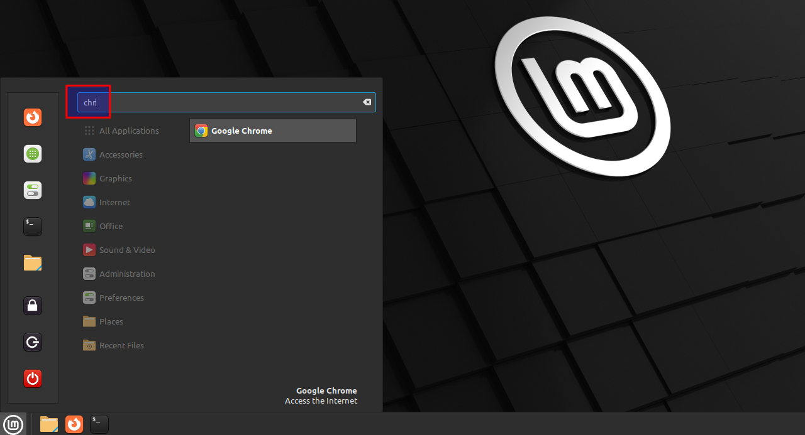

# Installeer Google Chrome op Linux Mint 22

Google Chrome is een snelle, gebruiksvriendelijke en gratis webbrowser ontwikkeld door Google. Hij werd in 2008 gelanceerd en is sindsdien uitgegroeid tot de meest gebruikte browser ter wereld.

## Vereisten
- een [PC met Linux](../../tutorials/setup-windows11-linuxmint22-dual-boot-uefi/index.md ){:target="_blank"}
- internet verbinding

## Download and importeer Google's signed key
Ondertekeningssleutels worden gebruikt om de authenticiteit en integriteit van pakketten uit repositories te verifiëren. Download die van Google en importeer ze direct.

=== "guru@hp:~$_"

    ``` title='' hl_lines="0"
    curl -sS https://dl.google.com/linux/linux_signing_key.pub | gpg --dearmor | sudo tee /etc/apt/trusted.gpg.d/google-chrome.gpg &> /dev/null
    ```

=== "output"

    ``` title='' hl_lines="0"
    guru@hp:~$ curl -sS https://dl.google.com/linux/linux_signing_key.pub | gpg --dearmor | sudo tee /etc/apt/trusted.gpg.d/google-chrome.gpg &> /dev/null
    [sudo] password for guru:     
    guru@hp:~$ 
    ```

## Voeg de Chrome-repository van Google toe

=== "guru@hp:~$_"

    ``` title='' hl_lines="0"
    sudo sh -c 'echo "deb [arch=amd64 signed-by=/etc/apt/trusted.gpg.d/google-chrome.gpg] http://dl.google.com/linux/chrome/deb/ stable main" > /etc/apt/sources.list.d/google-chrome.list'
    ```

=== "output"

    ``` title='' hl_lines="0"
    # No output here
    guru@hp:~$ sudo sh -c 'echo "deb [arch=amd64 signed-by=/etc/apt/trusted.gpg.d/google-chrome.gpg] http://dl.google.com/linux/chrome/deb/ stable main" > /etc/apt/sources.list.d/google-chrome.list'
    guru@hp:~$ 
    ```

## Werk de pakketlijst bij

=== "guru@hp:~$_"

    ``` title='' hl_lines="0"
    sudo apt update
    ```

=== "output"

    ``` title='' hl_lines="4 7"
    guru@hp:~$ sudo apt update
    Ign:1 http://linux-mint.froonix.org xia InRelease
    Hit:2 http://archive.ubuntu.com/ubuntu noble InRelease                                                    
    Hit:3 http://linux-mint.froonix.org xia Release                                                                                                  
    Hit:4 http://archive.ubuntu.com/ubuntu noble-updates InRelease                                                                                   
    Get:5 http://dl.google.com/linux/chrome/deb stable InRelease [1.825 B]                             
    Hit:6 http://archive.ubuntu.com/ubuntu noble-backports InRelease             
    Hit:7 http://security.ubuntu.com/ubuntu noble-security InRelease
    Hit:9 https://download.virtualbox.org/virtualbox/debian noble InRelease
    Get:10 http://dl.google.com/linux/chrome/deb stable/main amd64 Packages [1.216 B]
    Fetched 3.041 B in 1s (4.453 B/s)
    Reading package lists... Done
    Building dependency tree... Done
    Reading state information... Done
    All packages are up to date.
    guru@hp:~$ 
    ```

## Installeer Chrome

=== "guru@hp:~$_"

    ``` title='' hl_lines="0"
    sudo apt install google-chrome-stable
    ```

=== "output"

    ``` title='' hl_lines="0"
    guru@hp:~$ sudo apt install google-chrome-stable
    Reading package lists... Done
    Building dependency tree... Done
    Reading state information... Done
    The following NEW packages will be installed:
      google-chrome-stable
    0 upgraded, 1 newly installed, 0 to remove and 0 not upgraded.
    Need to get 119 MB of archives.
    After this operation, 387 MB of additional disk space will be used.
    Get:1 http://dl.google.com/linux/chrome/deb stable/main amd64 google-chrome-stable amd64 139.0.7258.154-1 [119 MB]
    Fetched 119 MB in 2s (68,8 MB/s)               
    Selecting previously unselected package google-chrome-stable.
    (Reading database ... 531778 files and directories currently installed.)
    Preparing to unpack .../google-chrome-stable_139.0.7258.154-1_amd64.deb ...
    Unpacking google-chrome-stable (139.0.7258.154-1) ...
    Setting up google-chrome-stable (139.0.7258.154-1) ...
    update-alternatives: using /usr/bin/google-chrome-stable to provide /usr/bin/x-www-browser (x-www-browser) in auto mode
    update-alternatives: using /usr/bin/google-chrome-stable to provide /usr/bin/gnome-www-browser (gnome-www-browser) in auto mode
    update-alternatives: using /usr/bin/google-chrome-stable to provide /usr/bin/google-chrome (google-chrome) in auto mode
    Processing triggers for gnome-menus (3.36.0-1.1ubuntu3) ...
    Processing triggers for mate-menus (1.26.1+mint1) ...
    Processing triggers for man-db (2.12.0-4build2) ...
    Processing triggers for mailcap (3.70+nmu1ubuntu1) ...
    Processing triggers for desktop-file-utils (0.27-2build1) ...
    guru@hp:~$ 
    ```

## Start Chrome
Selecteer "Menu" en typ "chr". Start "Google Chrome".




## Preferences
Verwijder het vinkje bij "Automatically send usage statistics..."

