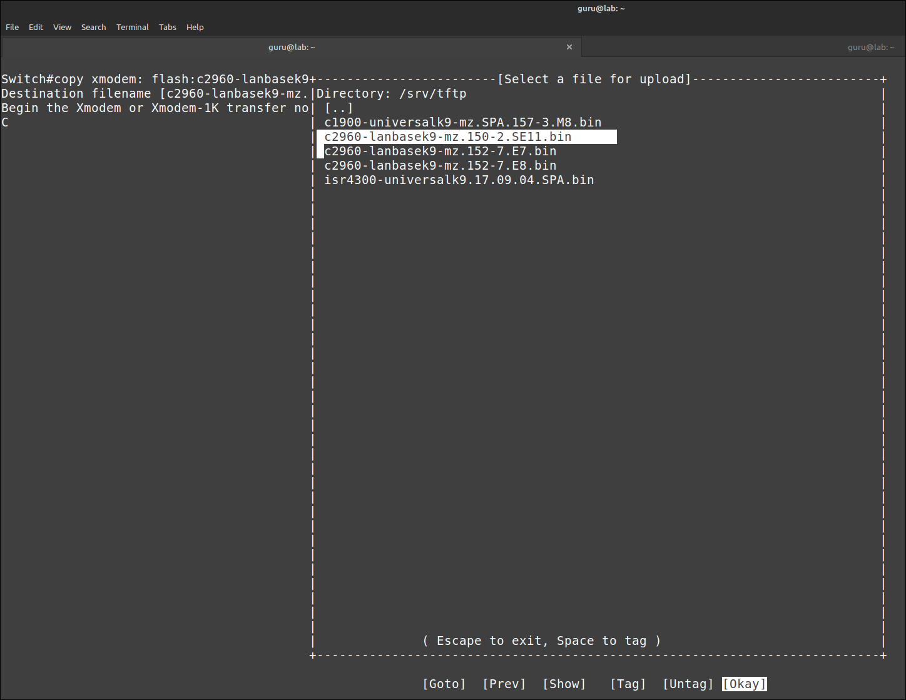
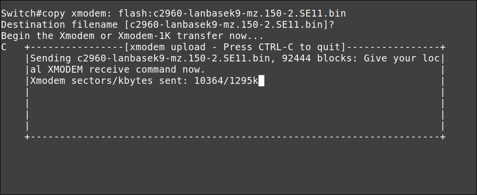

# Installeer een Cisco IOS besturingssysteem op een Cisco 2960 switch

Het installeren van het Cisco IOS besturingssysteem op een Cisco 2960 switch is een proces dat vaak een TFTP (Trivial File Transfer Protocol) server vereist en consoletoegang tot de switch. Dit wordt meestal gedaan om de IOS-versie te upgraden of te herstellen.

## Vereisten
- een [PC met Linux Mint 22](../../tutorials/setup-windows11-linuxmint22-dual-boot-uefi/index.md ){:target="_blank"}
- [minicom](../setup-minicom-linuxmint22/index.md){:target="_blank"} terminal emulatie software
- een [tFTP service](../setup-tftp-linuxmint22/index.md){:target="_blank"}
- een console kabel
- een netwerk kabel
- Cisco 2960 24TT-L of 24TC-L Plus switch

## Demo
<iframe width="560" height="315" src="https://www.youtube.com/embed/xiRsG7-qaQY?autoplay=0&loop=0&mute=0" title="YouTube video player" frameborder="0" allow="accelerometer; autoplay; clipboard-write; encrypted-media; gyroscope; picture-in-picture; web-share" referrerpolicy="strict-origin-when-cross-origin" allowfullscreen></iframe>


## Situatie
Op het moment van schrijven is de nieuwste iOS voor...

- een "Cisco 2960 24TT-L switch" versie "15.0(2)SE11"
- een "Cisco 24TC-L Plus switch" versie "15.2(7)E8"

Versie "15.2(7)E8" werkt NIET op een "Cisco 2960 24TT-L switch".
Versie 15.0(2)SE11 werkt op beide switches. Ik gebruik deze laatste versie voor de voorbeelden.

## IOS-overdracht via serieel (xmodem)


### Vanuit IOS
=== "Step1"
    Controleer of er voldoende ruimte over is op het Flash-bestandssysteem om een ​​(extra) iOS toe te voegen. In dit voorbeeld simuleer ik een ontbrekend iOS door het te verwijderen.

    ``` title='' hl_lines="1 11"
    Switch#dir flash:
    Directory of flash:/

        3  drwx         128  May 29 2024 10:34:46 +00:00  pnp-tech
        4  drwx           0   Mar 1 1993 00:01:03 +00:00  pnp-info
        9  -rwx    11832946  May 29 2024 11:35:59 +00:00  c2960-lanbasek9-mz.150-2.SE11.bin
    10  -rwx        1048  May 29 2024 11:37:31 +00:00  multiple-fs

    65544192 bytes total (53509632 bytes free)
    
    Switch#delete flash:/c2960-lanbasek9-mz.150-2.SE11.bin
    Delete filename [c2960-lanbasek9-mz.150-2.SE11.bin]? 
    Delete flash:/c2960-lanbasek9-mz.150-2.SE11.bin? [confirm]
    Switch#
    ```

=== "Step2"
    Stel de baudrate in op 115200 om de overdracht te versnellen. De verbinding wordt verbroken na de laatste opdracht. Er kunnen wat onzinnige tekens verschijnen.

    ``` title='' hl_lines="4" 
    Switch#configure terminal
    Enter configuration commands, one per line.  End with CNTL/Z.
    Switch(config)#line console 0
    Switch(config-line)#speed 115200
    C�
    ```

=== "Step3"
    Pas de instellingen in je terminal-emulatieprogramma aan de nieuwe baudrate (115200) aan. Voor [minicom](../setup-minicom-linuxmint22/index.md){:target="_blank"} druk je op ++control+a++ en vervolgens op ++z++.

    Typ ++o++ en kies "Serial port setup". Wijzig de instelling met ++e++ en druk tweemaal op ++enter++. Sluit af.

    ``` title='' hl_lines="5 11"
    Switch#conf t                                                                                                    
    Enter configuration commands, one per line.  End with CNTL/Z.                                                    
    Swit+-----------------+---------[Comm Parameters]----------+----------------+                                    
    Swit| A -    Serial De|                                    |                |                                    
    C�  | B - Lockfile Loc|     Current:  9600 8N1             |                |                                    
        | C -   Callin Pro| Speed            Parity      Data  |                |                                    
        | D -  Callout Pro| A: <next>        L: None     S: 5  |                |                                    
        | E -    Bps/Par/B| B: <prev>        M: Even     T: 6  |                |                                    
        | F - Hardware Flo| C:   9600        N: Odd      U: 7  |                |                                    
        | G - Software Flo| D:  38400        O: Mark     V: 8  |                |                                    
        | H -     RS485 En| E: 115200        P: Space          |                |                                    
        | I -   RS485 Rts |                                    |                |                                    
        | J -  RS485 Rts A| Stopbits                           |                |                                    
        | K -  RS485 Rx Du| W: 1             Q: 8-N-1          |                |                                    
        | L -  RS485 Termi| X: 2             R: 7-E-1          |                |                                    
        | M - RS485 Delay |                                    |                |                                    
        | N - RS485 Delay |                                    |                |                                    
        |                 | Choice, or <Enter> to exit?        |                |                                    
        |    Change which +------------------------------------+                |                                    
        +-----------------------------------------------------------------------+
    ```

=== "Step4"
    Druk op ++enter++. De verbinding is hersteld. Start een xMODEM-overdracht. Bevestig de doelbestandsnaam. De switch vraagt je vervolgens om de overdracht te starten vanuit je terminalemulator.

    ``` title='' hl_lines="2"
        Switch(config-line)#end
        Switch#copy xmodem: flash:c2960-lanbasek9-mz.150-2.SE11.bin
        Destination filename [c2960-lanbasek9-mz.150-2.SE11.bin]?     <----- press ENTER
        Begin the Xmodem or Xmodem-1K transfer now...
        CCC
    ```

=== "Step5"
    Voor minicom, druk op ++control+a++ en vervolgens op ++z++. Typ ++s++ (Send files) en selecteer "xmodem". Navigeer naar het nieuwe [IOS-bestand](../download-cisco-IOS/index.md){:target="_blank"} (hier `/srv/tftp`). Druk op ++space++ om het bestand te taggen en druk op "Okay" in om te verzenden.

    

=== "Step6"
    Tijd voor een ​​kop koffie. Dit kan lang duren, afhankelijk van de grootte van de IOS-image. Wacht tot de overdracht is voltooid en druk dan op ++enter++ om te stoppen.

    

=== "Step7"
    Zorg ervoor dat de switch opstart vanaf de zojuist overgedragen IOS-image, controleer dit en start opnieuw op.

    ``` title='' hl_lines="1 3 8"
    Switch(config)#boot system flash:/c2960-lanbasek9-mz.150-2.SE11.bin
    Switch(config)#end
    Switch#show boot
    BOOT path-list      : flash:/c2960-lanbasek9-mz.150-2.SE11.bin
    ...
    ...

    Switch#reload

    System configuration has been modified. Save? [yes/no]: no  <----- if asked
    Proceed with reload? [confirm]
    ```

=== "Step8"
    Je moet de instellingen in je terminal-emulatieprogramma opnieuw aanpassen aan de standaard baudrate van 9600. Controleer of de juiste iOS-image is geladen. Veel plezier met je nieuwe iOS!

    ``` title='' hl_lines="2 6 12"
    Switch#show version
    Cisco IOS Software, C2960 Software (C2960-LANBASEK9-M), Version 15.0(2)SE11, RELEASE SOFTWARE (fc3)
    ...
    ...
    System returned to ROM by power-on
    System image file is "flash:/c2960-lanbasek9-mz.150-2.SE11.bin"
    ...
    ...

    Switch Ports Model              SW Version            SW Image                 
    ------ ----- -----              ----------            ----------               
    *    1 26    WS-C2960+24TC-L    15.0(2)SE11           C2960-LANBASEK9-M        


    Configuration register is 0xF

    Switch#
    ```

### Vanuit ROMMON
Start eerst de switch op in [ROMMON-mode](../access-cisco-device-rommon/index.md){:target="_blank"}.

=== "Step1"
    Controleer of er voldoende ruimte over is op het Flash-bestandssysteem om een ​​(extra) IOS toe te voegen. In dit voorbeeld simuleer ik een ontbrekend IOS door het te verwijderen.

    ``` title='' hl_lines="1 11"
    switch: dir flash:
    Directory of flash:/

        2  -rwx  11832960  <date>               c2960-lanbasek9-mz.150-2.SE11.bin
        3  drwx  128       <date>               pnp-tech
        4  drwx  0         <date>               pnp-info
        10  -rwx  1048      <date>               multiple-fs

    53509632 bytes available (12034560 bytes used)

    switch: delete flash:c2960-lanbasek9-mz.150-2.SE11.bin
    Are you sure you want to delete "flash:c2960-lanbasek9-mz.150-2.SE11.bin" (y/n)?y
    File "flash:c2960-lanbasek9-mz.150-2.SE11.bin" deleted

    switch: 
    ```

=== "Step2"
    Stel de baudrate in op 115200 om de overdracht te versnellen. De verbinding wordt verbroken na de laatste opdracht. Er kunnen wat onzinnige tekens verschijnen.

    ``` title='' hl_lines="0"
    switch: set BAUD 115200
                       � 
    ```

=== "Step3"
    Pas de instellingen in je terminal-emulatieprogramma aan de nieuwe baudrate aan. Voor minicom, druk op ++control+a++ en vervolgens op ++z++.
    Typ ++o++ en kies "Serial port setup". Wijzig de instelling ++e++ in "115200" en druk tweemaal op ++enter++. Verlaat het configuratiemenu.

    ``` title='' hl_lines="3 9"
    swit+-----------------+---------[Comm Parameters]----------+----------------+                                    
    swit| A -    Serial De|                                    |                |                                    
    C�  | B - Lockfile Loc|     Current:  9600 8N1             |                |                                    
        | C -   Callin Pro| Speed            Parity      Data  |                |                                    
        | D -  Callout Pro| A: <next>        L: None     S: 5  |                |                                    
        | E -    Bps/Par/B| B: <prev>        M: Even     T: 6  |                |                                    
        | F - Hardware Flo| C:   9600        N: Odd      U: 7  |                |                                    
        | G - Software Flo| D:  38400        O: Mark     V: 8  |                |                                    
        | H -     RS485 En| E: 115200        P: Space          |                |                                    
        | I -   RS485 Rts |                                    |                |                                    
        | J -  RS485 Rts A| Stopbits                           |                |                                    
        | K -  RS485 Rx Du| W: 1             Q: 8-N-1          |                |                                    
        | L -  RS485 Termi| X: 2             R: 7-E-1          |                |                                    
        | M - RS485 Delay |                                    |                |                                    
        | N - RS485 Delay |                                    |                |                                    
        |                 | Choice, or <Enter> to exit?        |                |                                    
        |    Change which +------------------------------------+                |                                    
        +-----------------------------------------------------------------------+ 
    ```

=== "Step4"
    Druk op ++enter++. De verbinding is weer hersteld. Start een xMODEM-overdracht. De switch vraagt je vervolgens om de overdracht te starten vanuit je terminalemulator.

    ``` title='' hl_lines="0"
    switch: copy xmodem: flash:c2960-lanbasek9-mz.150-2.SE11.bin                                                            
    Begin the Xmodem or Xmodem-1K transfer now...                                                                         
    CCC
    ```

=== "Step5"
    Voor minicom, druk op ++control+a++ en vervolgens op ++z++. Typ ++s++ (Send files) en selecteer "xmodem". Navigeer naar het nieuwe [IOS-bestand](../download-cisco-IOS/index.md){:target="_blank"} (hier /home/guru/Downloads). Druk op ++space++ om het bestand te taggen en druk op "Okay" om te verzenden.

    

=== "Step6"
    Tijd voor een ​​kop koffie. Dit kan lang duren, afhankelijk van de grootte van de IOS-image. Wacht tot de overdracht is voltooid en druk dan op ++enter++ om te stoppen.

    

=== "Step7"
    Werk de BOOT-parameter bij zodat deze overeenkomt met het nieuwe IOS.

    ``` title='' hl_lines="6"
    switch: copy xmodem: flash:c2960-lanbasek9-mz.150-2.SE11.bin                                                            
    Begin the Xmodem or Xmodem-1K transfer now...                                                                         
    C...........................................................................................................................................................
    File "xmodem:" successfully copied to "flash:c2960-lanbasek9-mz.150-2.SE11.bin"                                         
                                                                                                                        
    switch: set BOOT flash:c2960-lanbasek9-mz.150-2.SE11.bin                                                                
                                                                                                                        
    switch: 
    ```

=== "Step8"
    Zet de BAUD-snelheid terug naar de standaardwaarde (9600 bps). Pas de instellingen in uw terminal-emulatieprogramma opnieuw aan. Druk op ++enter++. De verbinding is hersteld.

    ``` title='' hl_lines="0"
    switch: unset BAUD                                                                                                                                            
                    }                                                                                                                                           
                                                                                                                                                                
    switch:
    ```

=== "Step9"
    Start ten slotte de switch handmatig op.

    ``` title='' hl_lines="0"
    switch: boot                                                                                                                                                  
    Loading "flash:c2960-lanbasek9-mz.150-2.SE11.bin"...@@@@@@@@@@@@@@@@@
    ```

=== "Step10"
    Controleer of de juiste iOS-image is geladen. Veel plezier met je nieuwe iOS!

    ``` title='' hl_lines="2 6 12"
    Switch#show version
    Cisco IOS Software, C2960 Software (C2960-LANBASEK9-M), Version 15.0(2)SE11, RELEASE SOFTWARE (fc3)
    ...
    ...
    System returned to ROM by power-on
    System image file is "flash:/c2960-lanbasek9-mz.150-2.SE11.bin"
    ...
    ...

    Switch Ports Model              SW Version            SW Image                 
    ------ ----- -----              ----------            ----------               
    *    1 26    WS-C2960+24TC-L    15.0(2)SE11           C2960-LANBASEK9-M        


    Configuration register is 0xF

    Switch#
    ```

## IOS-overdracht via netwerkprotocol
Overdracht via een netwerkprotocol is alleen mogelijk vanuit IOS, niet vanuit de [ROMMON-mode](../access-cisco-device-rommon/index.md){:target="_blank"}.


### tFTP

=== "Step1"
    Je hebt [een tFTP-service](../setup-tftp-linuxmint22/index.md){:target="_blank"} nodig op de LAB PC, met een [geldige Cisco IOS-image](../download-cisco-IOS/index.md){:target="_blank"} met de correcte permissies.


    ``` title='' hl_lines="0"
    guru@lab:~$ ls -lh /srv/tftp/
    total 852M
    ...
    -rw-r--r-- 1 guru guru  12M sep  2  2021 c2960-lanbasek9-mz.150-2.SE11.bin
    ...
    guru@lab:~$ 
    ```

=== "Step2"
    Controleer of er voldoende ruimte over is op het Flash-bestandssysteem om een ​​(extra) IOS toe te voegen. In dit voorbeeld simuleer ik een ontbrekend IOS door het te verwijderen.

    ``` title='' hl_lines="1 10"
    Switch#dir flash:
    Directory of flash:/

        2  -rwx    11832946   Mar 1 1993 00:12:06 +00:00  c2960-lanbasek9-mz.150-2.SE11.bin
        3  -rwx        1048   Mar 1 1993 00:01:03 +00:00  multiple-fs

    32514048 bytes total (20678144 bytes free)


    Switch# delete flash:c2960-lanbasek9-mz.150-2.SE11.bin
    Are you sure you want to delete "flash:c2960-lanbasek9-mz.150-2.SE11.bin" (y/n)?y
    File "flash:c2960-lanbasek9-mz.150-2.SE11.bin" deleted

    Switch# 
    ```

=== "Step3"
    - Toon de naam van de netwerkinterface op de LAB PC (in dit geval: enp0s25)
    - Configureer een tijdelijk IP-adres en subnetmasker.
    - Controleer.

    ``` title='' hl_lines="1 8 10"
    guru@lab:~$ sudo ip link show
    [sudo] password for guru:     
    1: lo: <LOOPBACK,UP,LOWER_UP> mtu 65536 qdisc noqueue state UNKNOWN mode DEFAULT group default qlen 1000
        link/loopback 00:00:00:00:00:00 brd 00:00:00:00:00:00
    2: enp0s25: <BROADCAST,MULTICAST,UP,LOWER_UP> mtu 1500 qdisc fq_codel state UP mode DEFAULT group default qlen 1000
        link/ether 90:1b:0e:18:b9:8e brd ff:ff:ff:ff:ff:ff

    guru@lab:~$ sudo ip address add 192.168.1.101/24 dev enp0s25

    guru@lab:~$ ip a
    ...
    2: enp0s25: <BROADCAST,MULTICAST,UP,LOWER_UP> mtu 1500 qdisc fq_codel state UP group default qlen 1000
        link/ether 90:1b:0e:18:b9:8e brd ff:ff:ff:ff:ff:ff
        inet 192.168.1.101/24 scope global enp0s25
        valid_lft forever preferred_lft forever
    ```

=== "Step4"
    - Configureer een IP-adres en subnetmasker op de switch.
    - Controleer.

    ``` title='' hl_lines="4 7"
    Switch#conf t
    Enter configuration commands, one per line.  End with CNTL/Z.
    Switch(config)#int vlan 1
    Switch(config-if)#ip add 192.168.1.84 255.255.255.0
    Switch(config-if)#no shut

    Switch(config-if)#do show ip int br
    Interface              IP-Address      OK? Method Status                Protocol
    Vlan1                  192.168.1.84    YES manual up                    up      
    ...
    ```

=== "Step5"
    Optioneel (in dit geval): zorg ervoor dat de TFTP-sessie afkomstig is van de juiste interface (in dit geval: VLAN 1).

    ``` title='' hl_lines="0"
    Switch(config-if)#exit
    Switch(config)#ip tftp source-interface vlan 1
    Switch(config)#end
    Switch#
    ```

=== "Step6"
    Controleer de connectiviteit tussen de LAB PC en de switch.

    ``` title='' hl_lines="0"
    Switch#ping 192.168.1.101
    Type escape sequence to abort.
    Sending 5, 100-byte ICMP Echos to 192.168.1.101, timeout is 2 seconds:
    !!!!!
    Success rate is 100 percent (5/5), round-trip min/avg/max = 1/205/1015 ms
    Switch#
    ```

=== "Step7"
    Kopieer de IOS-image van de TFTP-server naar het flashgeheugen van de switch.

    ``` title='' hl_lines="1"
    Switch#copy tftp://192.168.1.101/c2960-lanbasek9-mz.150-2.SE11.bin flash:
    Destination filename [c2960-lanbasek9-mz.150-2.SE11.bin]? 
    Accessing tftp://192.168.1.101/c2960-lanbasek9-mz.150-2.SE11.bin...
    Loading c2960-lanbasek9-mz.150-2.SE11.bin from 192.168.1.101 (via Vlan1): !!!!!!!!!!!!!!!!!!!!!!!!!!!!!!!!!!!!!!!!!!!!!!!
    [OK - 11832946 bytes]

    11832946 bytes copied in 144.938 secs (81641 bytes/sec)
    Switch#
    ```

=== "Step8"
    - Zorg ervoor dat de switch opstart vanaf de zojuist overgedragen IOS-image.
    - Controleer.
    - Start opnieuw op.

    ``` title='' hl_lines="2"
    Switch#configure terminal
    Switch(config)#boot system flash:/c2960-lanbasek9-mz.150-2.SE11.bin
    Switch(config)#end
    Switch#
    
    Switch#show boot
    BOOT path-list      : flash:/c2960-lanbasek9-mz.150-2.SE11.bin
    ...
    ...
    Switch#reload

    System configuration has been modified. Save? [yes/no]: no
    Proceed with reload? [confirm]
    ...
    ```

=== "Step9"
    Controleer of de juiste iOS-image is geladen. Veel plezier met je nieuwe iOS!

    ``` title='' hl_lines="2 6 12"
    Switch#show version
    Cisco IOS Software, C2960 Software (C2960-LANBASEK9-M), Version 15.0(2)SE11, RELEASE SOFTWARE (fc3)
    ...
    ...
    System returned to ROM by power-on
    System image file is "flash:/c2960-lanbasek9-mz.150-2.SE11.bin"
    ...
    ...

    Switch Ports Model              SW Version            SW Image                 
    ------ ----- -----              ----------            ----------               
    *    1 26    WS-C2960+24TC-L    15.0(2)SE11           C2960-LANBASEK9-M        


    Configuration register is 0xF

    Switch#
    ```

### SSH (sFTP)
todo

### HTTP
todo