# Create a Linux Mint 21 bootable USB flash drive

## Prereqs
- USB flash drive that can hold the Linux Mint 21 installation files
- a PC ([BIOS](../../tutorials/windows11-linuxmint21-dual-boot-bios-clonezilla/)/[UEFI](../../tutorials/windows11-linuxmint21-dual-boot-uefi/)) running Windows 11 or Linux Mint 21
- internet connection

## Download ISO
=== "Step1"
    Use your favorite search engine to search for the Linux Mint 21 iso and choose the official Linux Mint website.
    **(VDAB users: download from your Google Drive!)**

    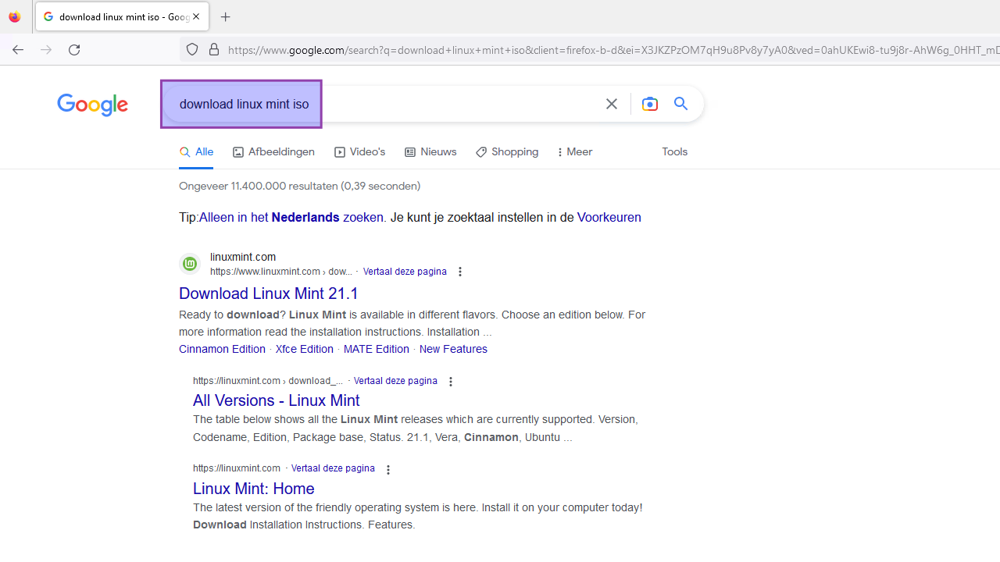

=== "Step2"
    Select the "Cinnamon Edition".

    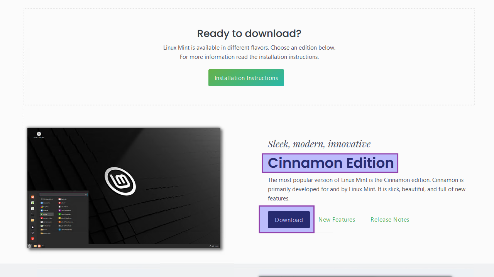

=== "Step3"
    Choose your favorite download mirror. The ISO file will be saved to your local disk.

    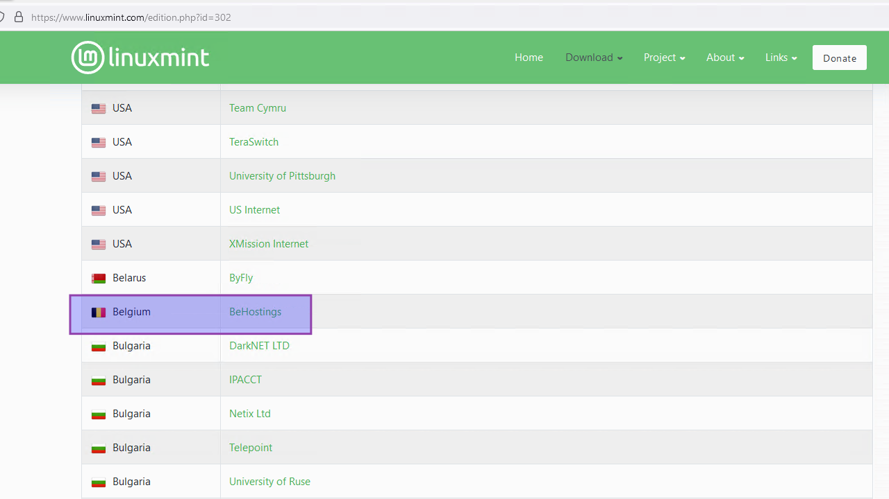

## On Windows 11
### With Rufus
#### Download and install Rufus
=== "Step1"
    Use your favorite search engine to search for Rufus and choose the official website.

    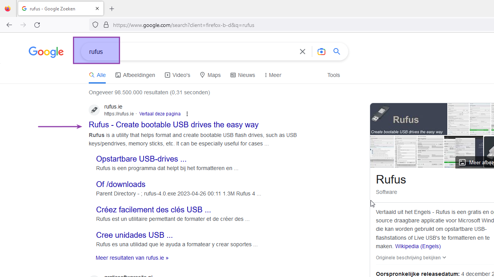

=== "Step2"
    Click the current "standard" installer version. The file will be saved to your local disk.

    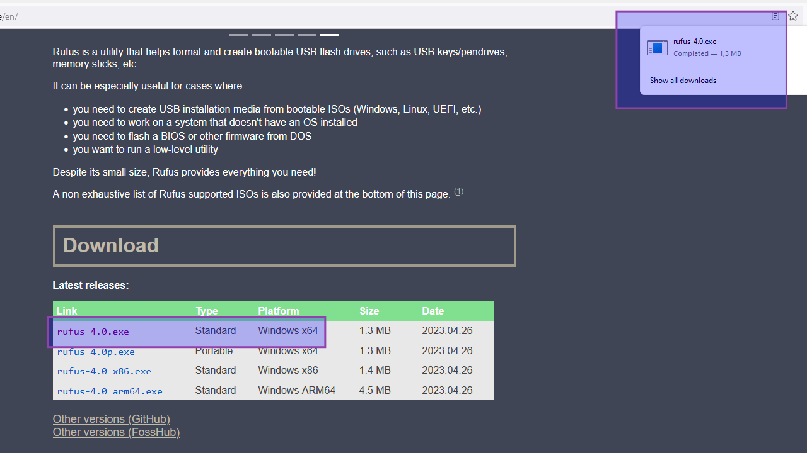

=== "Step3"
    Execute the installer and allow for changes.

    

=== "Step4"
    Allow Rufus to check for updates.

    

=== "Step5"
    Done. Installation finished.

    

#### For BIOS (or UEFI-CSM)
=== "Step1"
    
    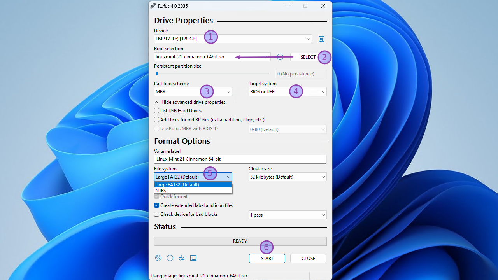
    
    1. Insert the USB flash drive
    2. Navigate to and select the Linux Mint 21 ISO file
    3. Choose "MBR" as partition scheme
    4. Select "BIOS or UEFI" as target system
    5. Select "Large FAT32 (Default)" as file system
    6. Click "Start"

=== "Step2"
    Select "Write in ISO Image mode (Recommended).

    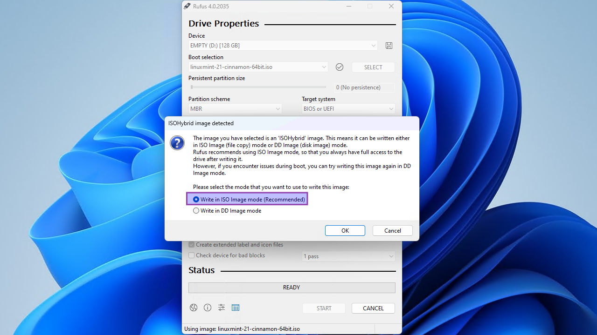

=== "Step3"
    Let Rufus download the latest syslinux files (if asked).

    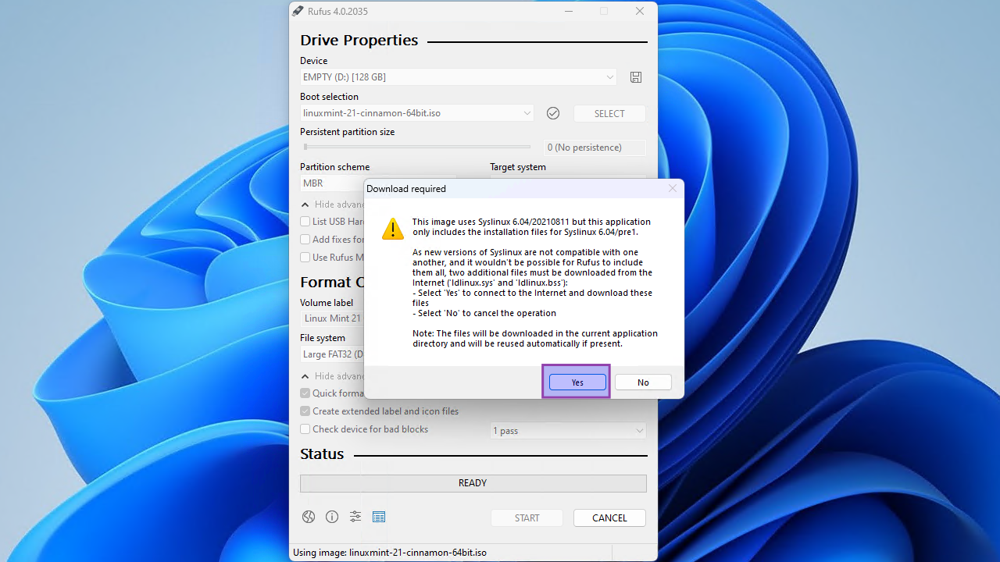

=== "Step4"
    Click "OK" to confirm the USB’s deletion and the bootable drive’s creation.

    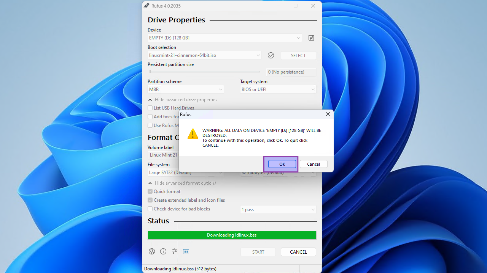

=== "Step5"
    Time to grab a coffee. Wait until the status is "Ready".

    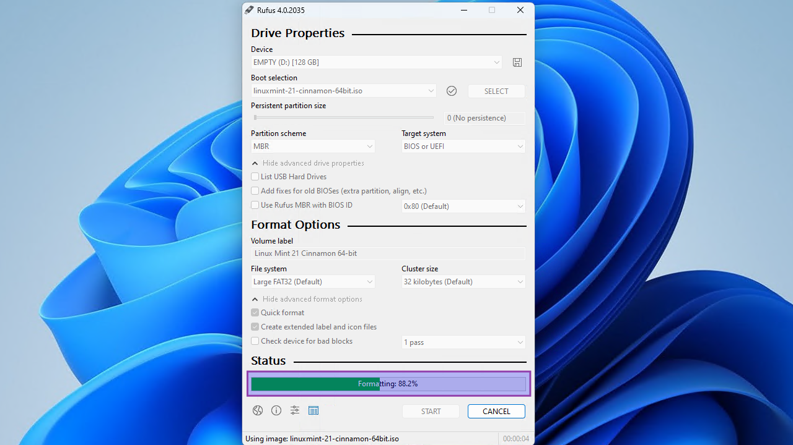

=== "Step6"
    Close Rufus and eject the USB media.

    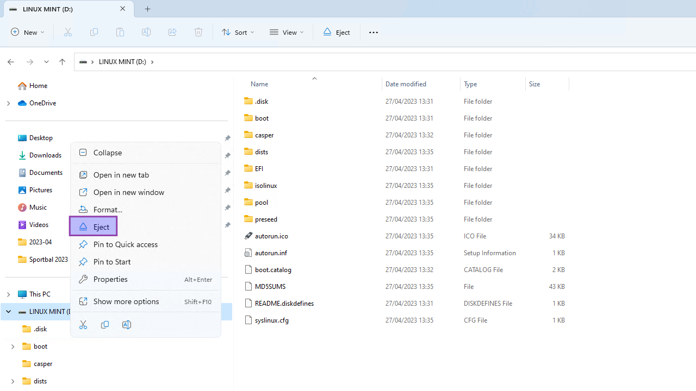

#### For UEFI (non-CSM)
=== "Step1"
    
    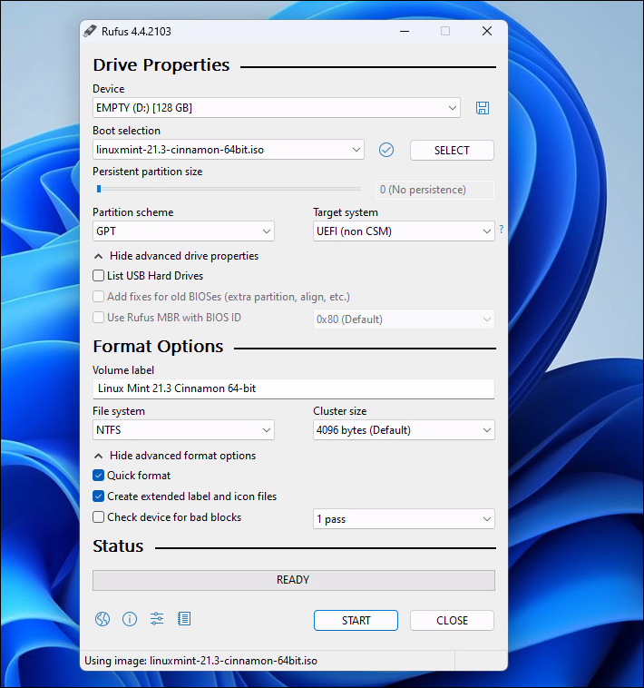
    
    1. Insert a USB flash drive with enough space
    2. Navigate to and select the Linux Mint 21 ISO file
    3. Choose "GPT" as partition scheme
    5. Select "UEFI (non-CSM)" as target system
    6. Select "NTFS" as file system
    7. Click "Start"

=== "Step2"
    Select "Write in ISO Image mode (Recommended)".

    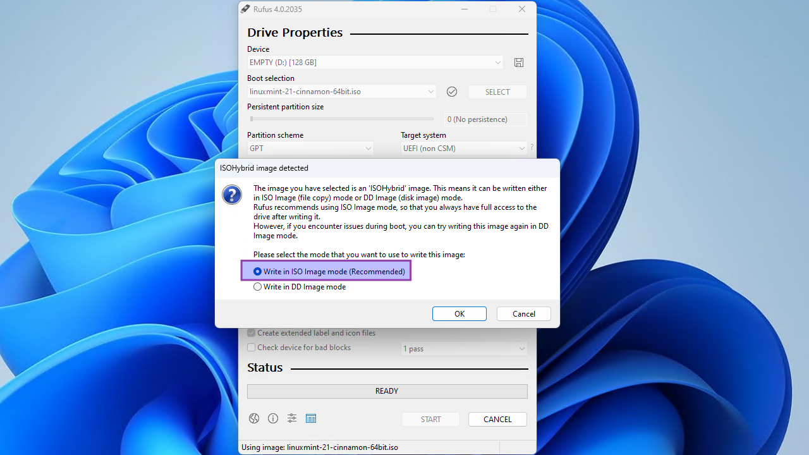

=== "Step3"
    If asked, let Rufus download the latest syslinux files. Otherwise, skip this step.

    

=== "Step4"
    Click "OK" to confirm the USB’s deletion and the bootable drive’s creation.

    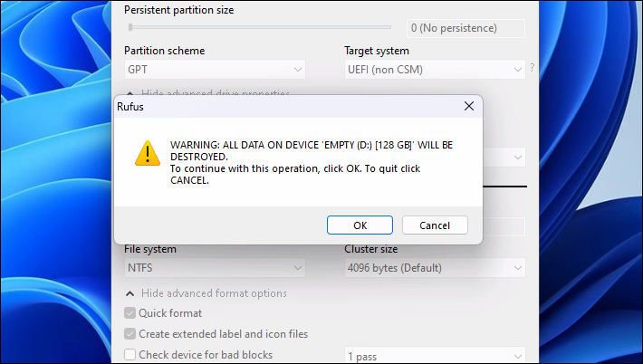

=== "Step5"
    Time to grab a coffee. Wait until the status is "Ready".

    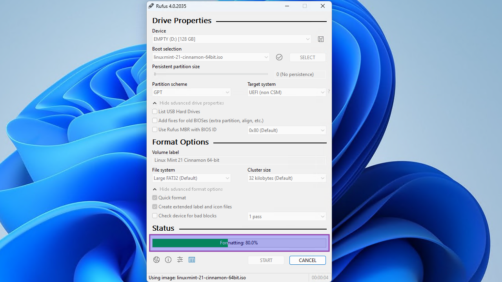

=== "Step6"
    Close Rufus and eject the USB media.

    

### With Etcher
Todo...
<!--- start comment
#### Download and install Etcher
tab1 screenshot
tab2 screenshot
tab3 screenshot
tab4 screenshot
#### For BIOS (or UEFI-CSM)
tab1 screenshot
tab2 screenshot
tab3 screenshot
tab4 screenshot
#### For UEFI (non-CSM)
tab1 screenshot
tab2 screenshot
tab3 screenshot
tab4 screenshot
-->

## On Linux Mint 21
Todo...
<!--- start comment
### With tool X
#### Download and install tool X
tab1 screenshot
tab2 screenshot
tab3 screenshot
tab4 screenshot
#### For BIOS (or UEFI-CSM)
tab1 screenshot
tab2 screenshot
tab3 screenshot
tab4 screenshot
#### For UEFI (non-CSM)
tab1 screenshot
tab2 screenshot
tab3 screenshot
tab4 screenshot
### With tool Y
#### Download and install tool Y
tab1 screenshot
tab2 screenshot
tab3 screenshot
tab4 screenshot
#### For BIOS (or UEFI-CSM)
tab1 screenshot
tab2 screenshot
tab3 screenshot
tab4 screenshot
#### For UEFI (non-CSM)
tab1 screenshot
tab2 screenshot
tab3 screenshot
tab4 screenshot
-->