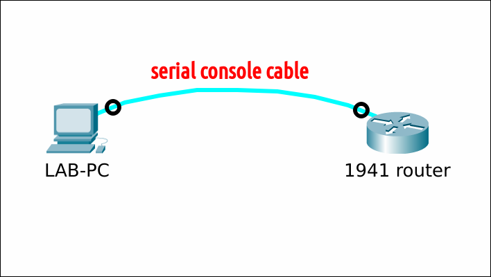

# Password recovery on a Cisco 1941 router

## Prereqs
* a PC ([BIOS](../../tutorials/windows11-linuxmint21-dual-boot-bios-clonezilla/){:target="_blank"}/[UEFI](../../tutorials/windows11-linuxmint21-dual-boot-uefi/){:target="_blank"}) running Linux Mint 21
    * [minicom](../use-minicom-linux-mint/index.md){:target="_blank"} terminal emulation software
* a serial console cable
* a Cisco 1941 router
    * a [working IOS](../reinstall-ios-cisco1941/index.md){:target="_blank"}, but inaccessible (forgotten console and/or enable password)

## Setup



## Situation
The "console password" and "enable password" (Privileged EXEC mode) are - amongst other router configuration settings - stored in startup-config (NVRAM). Recovery of a lost password is only useful if you have a inacessible (but working) IOS. If not, you have a bigger problem and have to [(re)install an IOS operating system](../reinstall-ios-cisco2960/index.md) first.

=== "Problem1"
    No access to the console.

    ``` title='' hl_lines="0"
    ...
    User Access Verification

    Password:           <--- enter wrong password
    Password:           <--- enter wrong password
    Password:           <--- enter wrong password
    % Bad passwords
    ```

=== "Problem2"
    Access to the console, but no access to privileged exec mode.

    ``` title='' hl_lines="0"
    Router>enable
    Password:           <--- enter wrong password
    Password:           <--- enter wrong password
    Password:           <--- enter wrong password
    % Bad secrets

    Router>
    ```

## ROMMON
[Boot the router in ROMMON-mode](../access-cisco-device-rommon/index.md){:target="_blank"} using the [break sequence mechanism](../../references/index.md). To my knowledge, there is no "password recovery mechanism" like on a Cisco 2960 switch.

=== "Step1"
    The configuration register is typically set to 0x2102. Let's change it to 0x2142. This will bypass the startup-configuration file.

    ``` title='' hl_lines="0"
    rommon 1 > confreg 0x2142 


    You must reset or power cycle for new config to take effect
    rommon 2 > 
    ```

=== "Step2"
    Reload the router.

    ``` title='' hl_lines="0"
    rommon 3 > reset
    
    System Bootstrap, Version 15.0(1r)M16, RELEASE SOFTWARE (fc1)
    ...
    ```

=== "Step3"
    You are greeted with the initial configuration dialog. Answer "no" and press ++enter++. Go to privileged exec mode.

    ``` title='' hl_lines="0"
    --- System Configuration Dialog ---

    Would you like to enter the initial configuration dialog? [yes/no]: no


    Press RETURN to get started!
    ...
    ...
    Router>enable
    Router#
    ```

=== "Step4a"
    Optional: if you do not want to keep the startup-configuration, delete it now. Else, skip this step.

    ``` title='' hl_lines="0"
    Router#erase startup-config 
    Erasing the nvram filesystem will remove all configuration files! Continue? [confirm]
    [OK]
    Erase of nvram: complete
    Router#
    ```

=== "Step4b"
    Optional: if you do want to keep the startup-configuration, copy it to memory. Else, skip this step.

    ``` title='' hl_lines="0"
    Router#copy startup-config running-config
    Destination filename [running-config]? 
    1170 bytes copied in 0.132 secs (8864 bytes/sec)

    Router#
    ```

=== "Step5"
    Configure the new privileged exec mode and console passwords. Change the configuration register back to 0x2102. Save the running-configuration and reload.

    ``` title='' hl_lines="0"
    Router#conf t
    Router(config)#enable secret cisco-EN-pass

    Router(config)#line console 0
    Router(config-line)#password cisco-CON-pass
    Router(config-line)#login
    Router(config-line)#exit

    Router(config)#config-register 0x2102
    Router(config)#end

    Router#copy running-config startup-config
    Destination filename [startup-config]? 
    Building configuration...
    [OK]

    Router#reload
    Proceed with reload? [confirm]

    *Apr  4 12:22:50.391: %SYS-5-RELOAD: Reload requested by console. Reload Reason: Reload Command.
    ```

=== "Step6"
    Login using the new console password. Enter privileged exec mode using the new "enable" password.

    ``` title='' hl_lines="0"
    User Access Verification

    Password:                                               ---> enter "cisco-CON-pass"

    Router>

    Router>enable
    Password:                                               ---> enter "cisco-EN-pass"
    Router#
    ```
