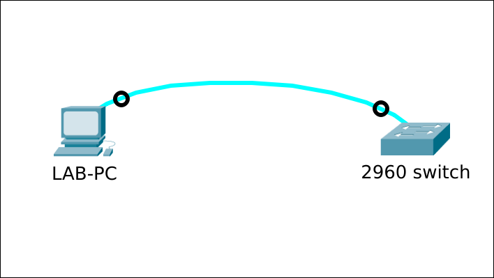

# Howto do a password recovery on a Cisco 2960 switch

## Prereqs
- a PC ([BIOS](../../tutorials/windows11-linuxmint21-dual-boot-bios-clonezilla/)/[UEFI](../../tutorials/windows11-linuxmint21-dual-boot-uefi/)) running Linux Mint 21
- [minicom](../install-minicom-linux-mint/index.md) terminal emulation software

## Console access



### Password recovery mechanism enabled

=== "Step1"
    The password recover mechanism is enabled by default. This is necessary to be able to recover the startup configuration file.

    ``` title='' hl_lines="0"
    Switch#show ver | incl password-recovery
    The password-recovery mechanism is enabled.
    Switch#
    ```

=== "Step2"
    Let's simulate a forgotten password.

    ``` title='' hl_lines="0"
    Switch#conf t
    Enter configuration commands, one per line.  End with CNTL/Z.
    Switch(config)#enable secret J3#C'7B0_1PlM
    Switch(config)#end
    Switch#wr
    Building configuration...
    [OK]
    Switch# exit
    Switch>ena
    Password:   -----> enter wrong password
    Password:   -----> enter wrong password
    Password:   -----> enter wrong password
    % Bad secrets

    Switch>
    ```

=== "Step3"
    Now [boot the switch in ROMMON-mode](../access-cisco-device-rommon/index.md) using a cold start.

    ``` title='' hl_lines="0"
    ...
    ...
    switch:
    ```

=== "Step4"
    Initialize Flash manually.

    ``` title='' hl_lines="0"
    switch: flash_init
    Initializing Flash...
    flashfs[0]: 1 files, 1 directories
    flashfs[0]: 0 orphaned files, 0 orphaned directories
    flashfs[0]: Total bytes: 65544192
    flashfs[0]: Bytes used: 3584
    flashfs[0]: Bytes available: 65540608
    flashfs[0]: flashfs fsck took 18 seconds.
    ...done Initializing Flash.

    switch:
    ```

=== "Step5"
    List the files stored in flash. The startup configuration is config.text. If you want to keep it, rename the file. If you want to discard all configuration, delete it. Then boot the switch.

    ``` title='' hl_lines="0"
    switch: dir flash:
    Directory of flash:/

        2  drwx  128       <date>               pnp-tech
        7  -rwx  1916      <date>               private-config.text
        4  drwx  0         <date>               pnp-info
        5  -rwx  15979077  <date>               c2960-lanbasek9-mz.152-7.E7.bin
        8  -rwx  1767      <date>               config.text
        9  -rwx  4120      <date>               multiple-fs

    49466880 bytes available (16077312 bytes used)

    switch: rename flash:config.text flash:config.text.bak      -----> or "delete flash:config.text"

    switch: boot
    Loading "flash:c2960-lanbasek9-mz.152-7.E7.bin"...@@@@@@@@@@@@@@@@@
    ...
    ```

=== "Step6"
    Enter "no" at the initial configuration setup prompt.

    ``` title='' hl_lines="0"
         --- System Configuration Dialog ---

    Would you like to enter the initial configuration dialog? [yes/no]:     -----> enter "no"
    Switch>
    ```

=== "Step7"
    Change to privileged exec mode. Copy the contents of the backup startup configuration to the running configuration.

    ``` title='' hl_lines="0"
    Switch>ena
    Switch#
    Switch#copy flash:config.text.bak run
    Destination filename [running-config]? 
    1767 bytes copied in 5.545 secs (319 bytes/sec)
    Switch#
    ```

=== "Step8"
    Change the privileged exec password and/or the console password. Restart the switch to verify if everything still works as expected.

    ``` title='' hl_lines="0"
    Switch#conf t
    Switch(config)#enable secret MyNewPassword
    Switch(config)#line con 0
    ...
    <todo>
    ...
    Switch(config)#end
    Switch#wr         
    Building configuration...
    [OK]
    Switch#reload
    ```

=== "Step9"
    Login using the new password. Delete the backup file (if not done already).

    ``` title='' hl_lines="0"
    Switch>ena
    Password:       -----> enter "MyNewPassword"
    Switch#delete flash:config.text.bak
    Delete filename [config.text.bak]? 
    Delete flash:/config.text.bak? [confirm]
    Switch#
    ```

### Password recovery mechanism disabled

=== "Step1"
    The password recovery mechanism is enabled by default. Disable it. It won't be possible to recover the startup configuration file.

    ``` title='' hl_lines="0"
    Switch#conf t
    Enter configuration commands, one per line.  End with CNTL/Z.
    Switch(config)#no service password-recovery
    Switch#show ver | incl password-recovery
    Switch#
    ```

=== "Step2"
    Let's simulate a forgotten password.

    ``` title='' hl_lines="0"
    Switch#conf t
    Enter configuration commands, one per line.  End with CNTL/Z.
    Switch(config)#enable secret J3#C'7B0_1PlM
    Switch(config)#end
    Switch#wr
    Building configuration...
    [OK]
    Switch# exit
    Switch>ena
    Password:   -----> enter wrong password
    Password:   -----> enter wrong password
    Password:   -----> enter wrong password
    % Bad secrets

    Switch>
    ```

=== "Step3"
    First disconnect the power cable from the switch. Minicom gives no output yet.

    ``` title='' hl_lines="0"
    Welcome to minicom 2.8

    OPTIONS: I18n 
    Port /dev/ttyUSB0, 13:50:27

    Press CTRL-A Z for help on special keys

    <blinking_cursor>
    ```

=== "Step4"
    Now reconnect the power cable. The switch boots and while doing the POST, the SYST LED blinks green.
    This takes about X seconds. After POST, the blinking LED changes pattern. Access to the boot loader prompt through the password-recovery mechanism is disallowed at this point.

    ``` title='' hl_lines="0"
    Welcome to minicom 2.8

    OPTIONS: I18n 
    Port /dev/ttyUSB0, 09:44:08

    Press CTRL-A Z for help on special keys


    Boot Sector Filesystem (bs) installed, fsid: 2
    Base ethernet MAC Address: 6c:41:0e:18:0b:00
    Xmodem file system is available.
    The password-recovery mechanism is disabled.
    Initializing Flash...
    flashfs[0]: 6 files, 3 directories
    flashfs[0]: 0 orphaned files, 0 orphaned directories
    flashfs[0]: Total bytes: 65544192
    flashfs[0]: Bytes used: 16098816
    flashfs[0]: Bytes available: 49445376
    flashfs[0]: flashfs fsck took 21 seconds.
    ...done Initializing Flash.
    done.

    The password-recovery mechanism has been triggered, but
    is currently disabled.  Access to the boot loader prompt
    through the password-recovery mechanism is disallowed at
    this point.  However, if you agree to let the system be
    reset back to the default system configuration, access
    to the boot loader prompt can still be allowed.

    Would you like to reset the system back to the default configuration (y/n)?     -----> enter "y"


    The system has been interrupted, and the config file
    has been deleted.  The following command will finish
    loading the operating system software:

        boot


    switch: boot
    Loading "flash:c2960-lanbasek9-mz.152-7.E8.bin"...@@@@@@@@@@@@@@@@@
    ```

=== "Step5"
    Once the switch is up, there is no password and no startup configuration. Enable the password-recovery mechanism again. Verify.

    ``` title='' hl_lines="0"
    Switch>ena
    Switch#show startup-config 
    startup-config is not present
    Switch#conf t
    Enter configuration commands, one per line.  End with CNTL/Z.
    Switch(config)#service password-recovery
    Switch#show ver | inc password-recovery
    The password-recovery mechanism is enabled.
    Switch#
    ```