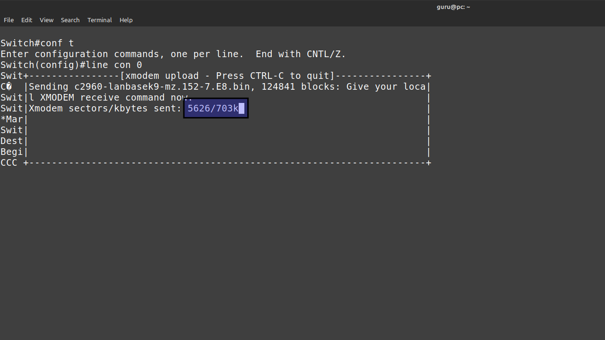

# Howto (re)install an IOS operating system on a Cisco 2960 switch

## Prereqs
- access to a running PC ([BIOS](../../tutorials/windows11-linuxmint21-dual-boot-bios-clonezilla/)/[UEFI](../../tutorials/windows11-linuxmint21-dual-boot-uefi/)) running Windows 11 or Linux Mint 21
- [direct local console access](../todo/)
- Cisco 2960-24TT-L or Cisco 2960-Plus 24TC-L switch
- a [valid Cisco IOS image](../todo/) stored on the PC's harddrive
- UTP network cable

## Console access


### Working IOS
Prerequisite: [privileged exec mode](../todo/index.md).

=== "Step1"
    Make sure you have enough space left on the Flash filesystem.

    ``` title='' hl_lines="9"
    Switch#dir flash:
    Directory of flash:/

        2  -rwx    15979136   Mar 1 1993 01:25:54 +00:00  c2960-lanbasek9-mz.152-7.E7.bin     <---- OLD image
        3  drwx         128   Mar 1 1993 00:06:45 +00:00  pnp-tech
        4  drwx           0   Mar 1 1993 00:01:03 +00:00  pnp-info
        5  -rwx        1048   Mar 1 1993 00:01:08 +00:00  multiple-fs

    65544192 bytes total (49417728 bytes free)
    Switch#
    ```

=== "Step2"
    Set the baud rate to 115200 to speed up the transfer. You will lose the connection after the last command. Some gibberish characters may occur.

    ``` title='' hl_lines="4" 
    Switch#conf t
    Enter configuration commands, one per line.  End with CNTL/Z.
    Switch(config)#line con 0
    Switch(config-line)#speed 115200
    C�
    ```

=== "Step3"
    Adjust the settings in your terminal emulation program to match the new baud rate. For minicom, press ++control+a++ and then ++z++. 
    Type ++o++ and choose "Serial port setup". Change setting ++e++ and ++enter++ twice. Exit.

    ``` title='' hl_lines="5 11"
    Switch#conf t                                                                                                    
    Enter configuration commands, one per line.  End with CNTL/Z.                                                    
    Swit+-----------------+---------[Comm Parameters]----------+----------------+                                    
    Swit| A -    Serial De|                                    |                |                                    
    C�  | B - Lockfile Loc|     Current:  9600 8N1             |                |                                    
        | C -   Callin Pro| Speed            Parity      Data  |                |                                    
        | D -  Callout Pro| A: <next>        L: None     S: 5  |                |                                    
        | E -    Bps/Par/B| B: <prev>        M: Even     T: 6  |                |                                    
        | F - Hardware Flo| C:   9600        N: Odd      U: 7  |                |                                    
        | G - Software Flo| D:  38400        O: Mark     V: 8  |                |                                    
        | H -     RS485 En| E: 115200        P: Space          |                |                                    
        | I -   RS485 Rts |                                    |                |                                    
        | J -  RS485 Rts A| Stopbits                           |                |                                    
        | K -  RS485 Rx Du| W: 1             Q: 8-N-1          |                |                                    
        | L -  RS485 Termi| X: 2             R: 7-E-1          |                |                                    
        | M - RS485 Delay |                                    |                |                                    
        | N - RS485 Delay |                                    |                |                                    
        |                 | Choice, or <Enter> to exit?        |                |                                    
        |    Change which +------------------------------------+                |                                    
        +-----------------------------------------------------------------------+
    ```

=== "Step4"
    Press ++enter++. The connection is back. Initiate an xMODEM transfer. Confirm the destination filename. The switch will then prompt you to start the transfer from your terminal emulator.

    ``` title=''
        Switch(config-line)#end
        Switch#copy xmodem: flash:c2960-lanbasek9-mz.152-7.E8.bin
        Destination filename [c2960-lanbasek9-mz.152-7.E8.bin]? 
        Begin the Xmodem or Xmodem-1K transfer now...
        CCC
    ```

=== "Step5"
    Now send the IOS file. Grab a coffee. Wait for the transfer to complete. This can take a long time depending on the size of the IOS image.

    

=== "Step6"
    After the transfer is complete, press ++enter++ to quit.

    ``` title='' hl_lines="9"
    Switch#conf t                                                                                                         
    Enter configuration commands, one per line.  End with CNTL/Z.                                                         
    Switch(config)#line con 0                                                                                             
    Swit+----------------[xmodem upload - Press CTRL-C to quit]----------------+                                          
    C�  |l XMODEM receive command now.                                         |                                          
    Swit|Xmodem sectors/kbytes sent: 109625/13703kRetry 0: NAK on sector       |                                          
    Swit|Bytes Sent:15979776   BPS:8950                                        |                                          
    *Mar|                                                                      |                                          
    Swit|Transfer complete                                                     |                                          
    Dest|                                                                      |                                          
    Begi| READY: press any key to continue...                                  |                                          
    CCC +----------------------------------------------------------------------+                                          
    ```

=== "Step7"
    Once the transfer is complete, make the switch boot from the newly transferred IOS image, verify and reboot.

    ``` title=''
    Switch(config)#boot system flash:/c2960-lanbasek9-mz.152-7.E8.bin
    Switch(config)#end
    Switch#show boot
    BOOT path-list      : flash:/c2960-lanbasek9-mz.152-7.E8.bin
    ...
    ...

    Switch#reload

    System configuration has been modified. Save? [yes/no]: no
    Proceed with reload? [confirm]
    ```

=== "Step9"
    You have to adjust the settings in your terminal emulation program again, to match the default baud of 9600. Verify that the correct IOS image is loaded.

    ``` title=''
 
    ```

=== "Step9"
    If all went well, it's save to remove the old IOS image.

    ``` title=''
    Switch#dir flash:
    Directory of flash:/

        2  -rwx    15979136   Mar 1 1993 01:25:54 +00:00  c2960-lanbasek9-mz.152-7.E7.bin
        3  drwx         128   Mar 1 1993 00:01:15 +00:00  pnp-tech
        4  drwx           0   Mar 1 1993 00:01:03 +00:00  pnp-info
        5  -rwx        1048   Mar 1 1993 00:01:09 +00:00  multiple-fs
        8  -rwx    15979776   Mar 1 1993 00:47:41 +00:00  c2960-lanbasek9-mz.152-7.E8.bin

    65544192 bytes total (33494528 bytes free)
    Switch#delete flash:c2960-lanbasek9-mz.152-7.E7.bin
    Delete filename [c2960-lanbasek9-mz.152-7.E7.bin]? 
    Delete flash:/c2960-lanbasek9-mz.152-7.E7.bin? [confirm]
    ```

### No working IOS

=== "StepX"
    Do this.

    ``` title=''
 
    ```

=== "StepX"
    Do this.

    ``` title=''
 
    ```

=== "StepX"
    Do this.

    ``` title=''
 
    ```

=== "StepX"
    Do this.

    ``` title=''
 
    ```

=== "StepX"
    Do this.

    ``` title=''
 
    ```

=== "StepX"
    Do this.

    ``` title=''
 
    ```

=== "StepX"
    Do this.

    ``` title=''
 
    ```


## Console + network access
=== "StepX"
    Do this.

    ``` title=''
 
    ```

=== "StepX"
    Do this.

    ``` title=''
 
    ```

=== "StepX"
    Do this.

    ``` title=''
 
    ```

=== "StepX"
    Do this.

    ``` title=''
 
    ```

=== "StepX"
    Do this.

    ``` title=''
 
    ```

=== "StepX"
    Do this.

    ``` title=''
 
    ```

=== "StepX"
    Do this.

    ``` title=''
 
    ```
