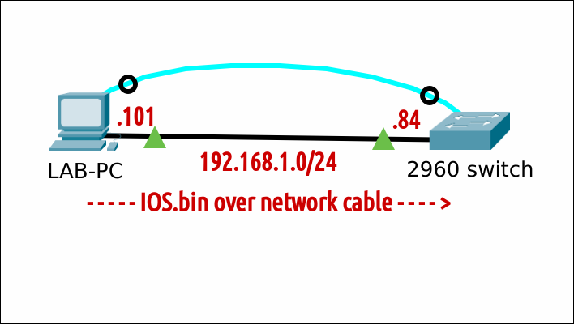

# (Re)install an IOS operating system on a Cisco 2960 switch

## Prereqs
- access to a [LAB-PC running Windows 11 or Linux Mint 21](../../tutorials/windows11-linuxmint21-dual-boot-bios-clonezilla/)
- Cisco 2960-24TT-L or Cisco 2960-Plus 24TC-L switch
- [direct local console access](../todo/)
- a [tFTP server](../todo/index.md), [SSH server](../todo/index.md) or [HTTP server](../todo/index.md)
- a [valid Cisco IOS image](../todo/)
- [privileged exec mode](../todo/index.md)

## Console access


### Working IOS

=== "Step1"
    Start with the [base switch setup](../todo/index.md). Check that there is enough space left on the Flash filesystem.

    ``` title='' hl_lines="9"
    Switch#dir flash:
    Directory of flash:/

        2  -rwx    15979136   Mar 1 1993 01:25:54 +00:00  c2960-lanbasek9-mz.152-7.E7.bin     <---- OLD image
        3  drwx         128   Mar 1 1993 00:06:45 +00:00  pnp-tech
        4  drwx           0   Mar 1 1993 00:01:03 +00:00  pnp-info
        5  -rwx        1048   Mar 1 1993 00:01:08 +00:00  multiple-fs

    65544192 bytes total (49417728 bytes free)
    Switch#
    ```

=== "Step2"
    Set the baud rate to 115200 to speed up the transfer. You will lose the connection after the last command. Some gibberish characters can emerge.

    ``` title='' hl_lines="4" 
    Switch#conf t
    Enter configuration commands, one per line.  End with CNTL/Z.
    Switch(config)#line con 0
    Switch(config-line)#speed 115200
    C�
    ```

=== "Step3"
    Adjust the settings in your terminal emulation program to match the new baud rate. For [minicom](../todo/index.md), press ++control+a++ and then ++z++. 
    Type ++o++ and choose "Serial port setup". Change setting ++e++ and ++enter++ twice. Exit.

    ``` title='' hl_lines="5 11"
    Switch#conf t                                                                                                    
    Enter configuration commands, one per line.  End with CNTL/Z.                                                    
    Swit+-----------------+---------[Comm Parameters]----------+----------------+                                    
    Swit| A -    Serial De|                                    |                |                                    
    C�  | B - Lockfile Loc|     Current:  9600 8N1             |                |                                    
        | C -   Callin Pro| Speed            Parity      Data  |                |                                    
        | D -  Callout Pro| A: <next>        L: None     S: 5  |                |                                    
        | E -    Bps/Par/B| B: <prev>        M: Even     T: 6  |                |                                    
        | F - Hardware Flo| C:   9600        N: Odd      U: 7  |                |                                    
        | G - Software Flo| D:  38400        O: Mark     V: 8  |                |                                    
        | H -     RS485 En| E: 115200        P: Space          |                |                                    
        | I -   RS485 Rts |                                    |                |                                    
        | J -  RS485 Rts A| Stopbits                           |                |                                    
        | K -  RS485 Rx Du| W: 1             Q: 8-N-1          |                |                                    
        | L -  RS485 Termi| X: 2             R: 7-E-1          |                |                                    
        | M - RS485 Delay |                                    |                |                                    
        | N - RS485 Delay |                                    |                |                                    
        |                 | Choice, or <Enter> to exit?        |                |                                    
        |    Change which +------------------------------------+                |                                    
        +-----------------------------------------------------------------------+
    ```

=== "Step4"
    Press ++enter++ The connection is back. Initiate an xMODEM transfer. Confirm the destination filename. The switch will then prompt you to start the transfer from your terminal emulator.

    ``` title=''
        Switch(config-line)#end
        Switch#copy xmodem: flash:c2960-lanbasek9-mz.152-7.E8.bin
        Destination filename [c2960-lanbasek9-mz.152-7.E8.bin]?     <----- press ENTER
        Begin the Xmodem or Xmodem-1K transfer now...
        CCC
    ```

=== "Step5"
    For minicom, press ++control+a++ and then ++z++. Type ++s++ (Send files) and select "xmodem". Navigate your way to the new [IOS file](../todo/index.md) (here /home/guru/Downloads). Press ++space++ to tag the file and press "Okay" to send.

    

=== "Step6"
    Grab a coffee. This can take a long time depending on the size of the IOS image. Wait for the transfer to complete and then press ++enter++ to quit.

    ``` title='' hl_lines="9"
    Switch#conf t                                                                                                         
    Enter configuration commands, one per line.  End with CNTL/Z.                                                         
    Switch(config)#line con 0                                                                                             
    Swit+----------------[xmodem upload - Press CTRL-C to quit]----------------+                                          
    C�  |l XMODEM receive command now.                                         |                                          
    Swit|Xmodem sectors/kbytes sent: 109625/13703kRetry 0: NAK on sector       |                                          
    Swit|Bytes Sent:15979776   BPS:8950                                        |                                          
    *Mar|                                                                      |                                          
    Swit|Transfer complete                                                     |                                          
    Dest|                                                                      |                                          
    Begi| READY: press any key to continue...                                  |                                          
    CCC +----------------------------------------------------------------------+                                          
    ```

=== "Step7"
    Make the switch boot from the newly transferred IOS image, verify and reboot.

    ``` title=''
    Switch(config)#boot system flash:/c2960-lanbasek9-mz.152-7.E8.bin
    Switch(config)#end
    Switch#show boot
    BOOT path-list      : flash:/c2960-lanbasek9-mz.152-7.E8.bin
    ...
    ...

    Switch#reload

    System configuration has been modified. Save? [yes/no]: no  <----- if asked
    Proceed with reload? [confirm]
    ```

=== "Step8"
    You have to adjust the settings in your terminal emulation program again, to match the default baud of 9600. Verify that the correct IOS image is loaded.

    ``` title='' hl_lines="2 8 14"
    Switch#show version
    Cisco IOS Software, C2960 Software (C2960-LANBASEK9-M), Version 15.2(7)E8, RELEASE SOFTWARE (fc1)
    Technical Support: http://www.cisco.com/techsupport
    Copyright (c) 1986-2023 by Cisco Systems, Inc.
    ...
    ...
    System returned to ROM by power-on
    System image file is "flash:/c2960-lanbasek9-mz.152-7.E8.bin"
    Last reload reason: Reload command
    ...
    ...
    Switch Ports Model                     SW Version            SW Image                 
    ------ ----- -----                     ----------            ----------               
    *    1 26    WS-C2960+24TC-L           15.2(7)E8             C2960-LANBASEK9-M
    ...
    ...
    ```

=== "Step9"
    If all went well, it's save to remove the old IOS image. Enjoy your new IOS!

    ``` title=''
    Switch#delete flash:c2960-lanbasek9-mz.152-7.E7.bin
    Delete filename [c2960-lanbasek9-mz.152-7.E7.bin]? 
    Delete flash:/c2960-lanbasek9-mz.152-7.E7.bin? [confirm]

    Switch#dir flash:
    Directory of flash:/

    2  -rwx    15979672   Mar 1 1993 00:25:20 +00:00  c2960-lanbasek9-mz.152-7.E8.bin
    3  drwx         128   Mar 1 1993 00:01:37 +00:00  pnp-tech
    4  drwx           0   Mar 1 1993 00:01:03 +00:00  pnp-info
    5  -rwx        1048   Mar 1 1993 00:01:08 +00:00  multiple-fs

    65544192 bytes total (49461248 bytes free)

    Switch#dir nvram:
    Directory of nvram:/

    65  -rw-           0                    <no date>  startup-config
    66  ----           0                    <no date>  private-config
    67  -rw-           0                    <no date>  underlying-config
     1  ----          71                    <no date>  persistent-data

    65536 bytes total (64460 bytes free)
    ```

### No working IOS
#### ROMMON-mode

=== "Step1"
    Start with the [base switch setup](../todo/index.md). Let's simulate a non-working IOS by "accidently" erasing the flash filesystem. Restart the switch afterwards.

    ``` title='' hl_lines="0"
    Switch#erase flash:
    Erasing the flash filesystem will remove all files! Continue? [confirm]
    flashfs[2]: 0 files, 1 directories
    flashfs[2]: 0 orphaned files, 0 orphaned directories
    flashfs[2]: Total bytes: 65544192
    flashfs[2]: Bytes used: 1024
    flashfs[2]: Bytes available: 65543168
    flashfs[2]: flashfs fsck took 25 seconds.
    Erase of flash: complete
    Switch#
    Switch#reload

    System configuration has been modified. Save? [yes/no]: no  <----- if asked
    Proceed with reload? [confirm]

    ```

=== "Step2"
    The BOOT environment variable is still set to boot c2960-lanbasek9-mz.152-7.E7.bin but it's not there. The switch will not be able to boot and will enter ROMMON-mode automatically.

    ``` title='' hl_lines="0"
    Welcome to minicom 2.8

    OPTIONS: I18n 
    Port /dev/ttyUSB0, 09:36:24

    Press CTRL-A Z for help on special keys


    Boot Sector Filesystem (bs) installed, fsid: 2
    Base ethernet MAC Address: 6c:41:0e:18:0b:00
    Xmodem file system is available.
    The password-recovery mechanism is enabled.
    Initializing Flash...
    flashfs[0]: 1 files, 1 directories
    flashfs[0]: 0 orphaned files, 0 orphaned directories
    flashfs[0]: Total bytes: 65544192
    flashfs[0]: Bytes used: 3584
    flashfs[0]: Bytes available: 65540608
    flashfs[0]: flashfs fsck took 18 seconds.
    ...done Initializing Flash.
    done.
    Loading "flash:/c2960-lanbasek9-mz.152-7.E7.bin"...flash:/c2960-lanbasek9-mz.152-7.E7.bin: no such file or directory

    Error loading "flash:/c2960-lanbasek9-mz.152-7.E7.bin"

    Interrupt within 5 seconds to abort boot process.
    Boot process failed...

    The system is unable to boot automatically.  The BOOT
    environment variable needs to be set to a bootable
    image.


    switch:
    ```

=== "Step3"
    If you _do_ have a working IOS, you can enter ROMMON-mode manually. First disconnect the power cable from the switch. Minicom gives no output yet.

    ``` title='' hl_lines="0"
    Welcome to minicom 2.8

    OPTIONS: I18n 
    Port /dev/ttyUSB0, 13:50:27

    Press CTRL-A Z for help on special keys

    <blinking_cursor>
    ```

=== "Step4"
    Now reconnect the power cable. The switch boots and while doing the POST, the SYST LED blinks green.
    This takes about X seconds. After POST, the blinking LED changes pattern. Press the Mode button once. The switch _does not_ initialize Flash and enters ROMMON-mode.

    ``` title='' hl_lines="0"
    Welcome to minicom 2.8

    OPTIONS: I18n 
    Port /dev/ttyUSB0, 09:44:08

    Press CTRL-A Z for help on special keys


    Boot Sector Filesystem (bs) installed, fsid: 2
    Base ethernet MAC Address: 6c:41:0e:18:0b:00
    Xmodem file system is available.
    The password-recovery mechanism is enabled.
    Initializing Flash...
    flashfs[0]: filesystem check interrupted!
    ...done Initializing Flash.

    The system has been interrupted, or encountered an error
    during initialization of the flash filesystem.  The following
    commands will initialize the flash filesystem, and finish
    loading the operating system software:

        flash_init
        boot


    switch:
    ```

=== "Step5"
    Initialize Flash manually.

    ``` title='' hl_lines="0"
    switch: flash_init
    Initializing Flash...
    flashfs[0]: 1 files, 1 directories
    flashfs[0]: 0 orphaned files, 0 orphaned directories
    flashfs[0]: Total bytes: 65544192
    flashfs[0]: Bytes used: 3584
    flashfs[0]: Bytes available: 65540608
    flashfs[0]: flashfs fsck took 18 seconds.
    ...done Initializing Flash.

    switch:
    ```
#### Transfer IOS

=== "Step1"
    Set the baud rate to 115200 to speed up the transfer. You will lose the connection after the last command. Some gibberish characters can emerge.

    ``` title='' hl_lines="0"
    switch: set BAUD 115200
                       � 
    ```

=== "Step2"
    Adjust the settings in your terminal emulation program to match the new baud rate. For minicom, press ++control+a++ and then ++z++. 
    Type ++o++ and choose "Serial port setup". Change setting ++e++ and ++enter++ twice. Exit.

    ``` title='' hl_lines="3 9"
    swit+-----------------+---------[Comm Parameters]----------+----------------+                                    
    swit| A -    Serial De|                                    |                |                                    
    C�  | B - Lockfile Loc|     Current:  9600 8N1             |                |                                    
        | C -   Callin Pro| Speed            Parity      Data  |                |                                    
        | D -  Callout Pro| A: <next>        L: None     S: 5  |                |                                    
        | E -    Bps/Par/B| B: <prev>        M: Even     T: 6  |                |                                    
        | F - Hardware Flo| C:   9600        N: Odd      U: 7  |                |                                    
        | G - Software Flo| D:  38400        O: Mark     V: 8  |                |                                    
        | H -     RS485 En| E: 115200        P: Space          |                |                                    
        | I -   RS485 Rts |                                    |                |                                    
        | J -  RS485 Rts A| Stopbits                           |                |                                    
        | K -  RS485 Rx Du| W: 1             Q: 8-N-1          |                |                                    
        | L -  RS485 Termi| X: 2             R: 7-E-1          |                |                                    
        | M - RS485 Delay |                                    |                |                                    
        | N - RS485 Delay |                                    |                |                                    
        |                 | Choice, or <Enter> to exit?        |                |                                    
        |    Change which +------------------------------------+                |                                    
        +-----------------------------------------------------------------------+ 
    ```

=== "Step3"
    Press ++enter++ The connection is back. Initiate an xMODEM transfer. The switch will then prompt you to start the transfer from your terminal emulator.

    ``` title='' hl_lines="0"
    switch: copy xmodem: flash:c2960-lanbasek9-mz.152-7.E8.bin                                                            
    Begin the Xmodem or Xmodem-1K transfer now...                                                                         
    CCC
    ```

=== "Step4"
    For minicom, press ++control+a++ and then ++z++. Type ++s++ (Send files) and select "xmodem". Navigate your way to the new [IOS file](../todo/index.md) (here /home/guru/Downloads). Press ++space++ to tag the file and press "Okay" to send.

    

=== "Step5"
    Grab a coffee. This can take a long time depending on the size of the IOS image. Wait for the transfer to complete and then press ++enter++ to quit.

    ``` title='' hl_lines="8"
    switch: copy xmodem: flash:c2960-lanbasek9-mz.152-7.E8.bin                                                                                                    
    Begin the Xmodem or Xmodem-1K transfer now...                                                                                                                 
    CCC +----------------[xmodem upload - Press CTRL-C to quit]----------------+                                                                                  
        |Sending c2960-lanbasek9-mz.152-7.E8.bin, 124841 blocks: Give your loca|                                                                                  
        |l XMODEM receive command now.                                         |                                                                                  
        |Bytes Sent:15979776   BPS:9379                                        |                                                                                  
        |                                                                      |                                                                                  
        |Transfer complete                                                     |                                                                                  
        |                                                                      |                                                                                  
        | READY: press any key to continue...                                  |                                                                                  
        +----------------------------------------------------------------------+ 
    ```

=== "Step6"
    Update the BOOT parameter to match the new IOS.

    ``` title='' hl_lines="0"
    Switch: set BOOT flash:c2960-lanbasek9-mz.152-7.E8.bin
    Switch:
    ```

=== "Step7"
    Set the BAUD rate back to the default (9600 bps). You have to adjust the settings in your terminal emulation program again. Press ++enter++ The connection is back.

    ``` title='' hl_lines="0"
    switch: unset BAUD                                                                                                                                            
                    }                                                                                                                                           
                                                                                                                                                                
    switch:
    ```

=== "Step8"
    Finally, boot the switch manually.

    ``` title='' hl_lines="0"
    switch: boot                                                                                                                                                  
    Loading "flash:c2960-lanbasek9-mz.152-7.E8.bin"...@@@@@@@@@@@@@@@@@
    ```

=== "Step9"
    Verify that the correct IOS image is loaded. Enjoy your new IOS!

    ``` title='' hl_lines="2 8 14"
    Switch#show version
    Cisco IOS Software, C2960 Software (C2960-LANBASEK9-M), Version 15.2(7)E8, RELEASE SOFTWARE (fc1)
    Technical Support: http://www.cisco.com/techsupport
    Copyright (c) 1986-2023 by Cisco Systems, Inc.
    ...
    ...
    System returned to ROM by power-on
    System image file is "flash:/c2960-lanbasek9-mz.152-7.E8.bin"
    Last reload reason: Reload command
    ...
    ...
    Switch Ports Model                     SW Version            SW Image                 
    ------ ----- -----                     ----------            ----------               
    *    1 26    WS-C2960+24TC-L           15.2(7)E8             C2960-LANBASEK9-M
    ...
    ... 
    ```

## Console + network access



### tFTP
=== "StepX"
    [Install a tFTP service](../todo/index.md) on the LAB-PC. Copy a [valid Cisco IOS image](../todo/index.md) file to the tFTP directory where files are served from. Adjust permissions.

    ``` title='' hl_lines="0"
    <TODO COPY AND PERMISSIONS>
    guru@pc:~$ ls -lh /srv/tftp/
    total 31M
    -rw-r--r-- 1 root root 16M May 17 13:14 c2960-lanbasek9-mz.152-7.E7.bin
    -rw-r--r-- 1 root root 16M May 17 13:14 c2960-lanbasek9-mz.152-7.E8.bin
    guru@pc:~$ 
    ```

=== "StepX"
    Start with the [base switch setup](../todo/index.md). Configure an IP address and subnet mask. Verify.

    ``` title='' hl_lines="0"
    Switch#conf t
    Enter configuration commands, one per line.  End with CNTL/Z.
    Switch(config)#int vlan 1
    Switch(config-if)#ip add 192.168.1.86 255.255.255.0
    Switch(config-if)#no shut
    Switch(config-if)#do show ip int br
    Interface              IP-Address      OK? Method Status                Protocol
    Vlan1                  192.168.1.86    YES manual up                    up      
    ...
    ```

=== "StepX"
    Optional (in this case): ensure that the TFTP session is sourced from the correct interface (here: VLAN 1).

    ``` title='' hl_lines="0"
    Switch(config-if)#exit
    Switch(config)#ip tftp source-interface vlan 1
    Switch(config)#end
    Switch#
    ```

=== "StepX"
    Copy the IOS image from the TFTP server to the switch's flash memory.

    ``` title='' hl_lines="0"
    Switch#copy tftp://192.168.1.101/c2960-lanbasek9-mz.152-7.E8.bin flash:
    Destination filename [c2960-lanbasek9-mz.152-7.E8.bin]?     <----- press ENTER
    Accessing tftp://192.168.1.101/c2960-lanbasek9-mz.152-7.E8.bin...
    Loading c2960-lanbasek9-mz.152-7.E8.bin from 192.168.1.101 (via Vlan1): !!!!!!!!!!!!!!!!!!!!!!!!!!!!!!!!!!!!!!!!!!!!!!!!!!!!!!!!!!!!!!!
    [OK - 15979672 bytes]

    15979672 bytes copied in 217.886 secs (73340 bytes/sec)
    Switch#
    ```
=== "StepX"
    Make the switch boot from the newly transferred IOS image, verify and reboot.

    ``` title=''
    Switch#conf t
    Enter configuration commands, one per line.  End with CNTL/Z.
    Switch(config)#boot system flash:/c2960-lanbasek9-mz.152-7.E8.bin
    Switch(config)#end
    Switch#show boot
    BOOT path-list      : flash:/c2960-lanbasek9-mz.152-7.E8.bin
    ...
    ...

    Switch#reload

    System configuration has been modified. Save? [yes/no]: no  <----- if asked
    Proceed with reload? [confirm]
    ```
=== "Step9"
    If all went well, it's save to remove the old IOS image. Enjoy your new IOS!

    ``` title=''
    Switch#delete flash:c2960-lanbasek9-mz.152-7.E7.bin
    Delete filename [c2960-lanbasek9-mz.152-7.E7.bin]? 
    Delete flash:/c2960-lanbasek9-mz.152-7.E7.bin? [confirm]

    Switch#dir flash:
    Directory of flash:/

    2  -rwx    15979672   Mar 1 1993 00:25:20 +00:00  c2960-lanbasek9-mz.152-7.E8.bin
    3  drwx         128   Mar 1 1993 00:01:37 +00:00  pnp-tech
    4  drwx           0   Mar 1 1993 00:01:03 +00:00  pnp-info
    5  -rwx        1048   Mar 1 1993 00:01:08 +00:00  multiple-fs

    65544192 bytes total (49461248 bytes free)

    Switch#dir nvram:
    Directory of nvram:/

    65  -rw-           0                    <no date>  startup-config
    66  ----           0                    <no date>  private-config
    67  -rw-           0                    <no date>  underlying-config
     1  ----          71                    <no date>  persistent-data

    65536 bytes total (64460 bytes free)
    ```