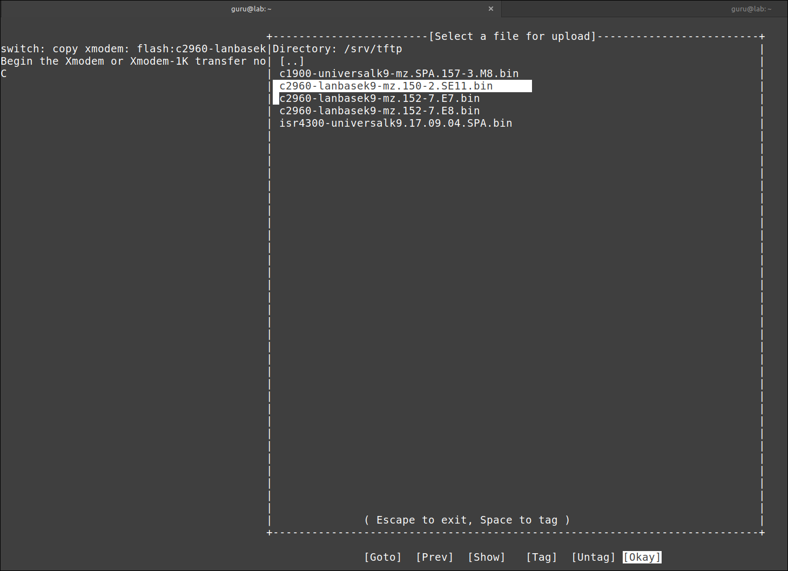

# (Re)install an IOS operating system on a Cisco 2960 switch

## Prereqs
- a PC ([BIOS](../../tutorials/windows11-linuxmint21-dual-boot-bios-clonezilla/)/[UEFI](../../tutorials/windows11-linuxmint21-dual-boot-uefi/)) running Linux Mint 21
    - [minicom](../use-minicom-linux-mint/index.md) terminal emulation software
    - (a [tFTP service](../install-tftp-linux-mint/index.md))
- a console cable
- (a network cable)
- a Cisco 2960 24TT-L or 24TC-L Plus switch

## Situation
At the time of writing, the latest IOS for...

- a "Cisco 2960 24TT-L switch" is "15.0(2)SE11"
- a "24TC-L Plus switch" is "15.2(7)E8"

Version "15.2(7)E8" does NOT run on a "Cisco 2960 24TT-L switch".
Version 15.0(2)SE11 runs on both switches. I'll use that version for the examples.

## IOS transfer over serial (xmodem)


### From IOS
=== "Step1"
    Verify that there is enough space left on the Flash filesystem to add an (additional) IOS. In this example, I will simulate a missing IOS by deleting it. Do not reload!

    ``` title='' hl_lines="1 11"
    Switch#dir flash:
    Directory of flash:/

        3  drwx         128  May 29 2024 10:34:46 +00:00  pnp-tech
        4  drwx           0   Mar 1 1993 00:01:03 +00:00  pnp-info
        9  -rwx    11832946  May 29 2024 11:35:59 +00:00  c2960-lanbasek9-mz.150-2.SE11.bin
    10  -rwx        1048  May 29 2024 11:37:31 +00:00  multiple-fs

    65544192 bytes total (53509632 bytes free)
    Switch#
    Switch#delete flash:/c2960-lanbasek9-mz.150-2.SE11.bin
    Delete filename [c2960-lanbasek9-mz.150-2.SE11.bin]? 
    Delete flash:/c2960-lanbasek9-mz.150-2.SE11.bin? [confirm]
    Switch#
    ```

=== "Step2"
    Set the baud rate to 115200 to speed up the transfer. You will lose the connection after the last command. Some gibberish characters can emerge.

    ``` title='' hl_lines="4" 
    Switch#configure terminal
    Enter configuration commands, one per line.  End with CNTL/Z.
    Switch(config)#line console 0
    Switch(config-line)#speed 115200
    C�
    ```

=== "Step3"
    Adjust the settings in your terminal emulation program to match the new baud rate. For [minicom](../use-minicom-linux-mint/index.md), press ++control+a++ and then ++z++. 
    Type ++o++ and choose "Serial port setup". Change setting ++e++ and ++enter++ twice. Exit.

    ``` title='' hl_lines="5 11"
    Switch#conf t                                                                                                    
    Enter configuration commands, one per line.  End with CNTL/Z.                                                    
    Swit+-----------------+---------[Comm Parameters]----------+----------------+                                    
    Swit| A -    Serial De|                                    |                |                                    
    C�  | B - Lockfile Loc|     Current:  9600 8N1             |                |                                    
        | C -   Callin Pro| Speed            Parity      Data  |                |                                    
        | D -  Callout Pro| A: <next>        L: None     S: 5  |                |                                    
        | E -    Bps/Par/B| B: <prev>        M: Even     T: 6  |                |                                    
        | F - Hardware Flo| C:   9600        N: Odd      U: 7  |                |                                    
        | G - Software Flo| D:  38400        O: Mark     V: 8  |                |                                    
        | H -     RS485 En| E: 115200        P: Space          |                |                                    
        | I -   RS485 Rts |                                    |                |                                    
        | J -  RS485 Rts A| Stopbits                           |                |                                    
        | K -  RS485 Rx Du| W: 1             Q: 8-N-1          |                |                                    
        | L -  RS485 Termi| X: 2             R: 7-E-1          |                |                                    
        | M - RS485 Delay |                                    |                |                                    
        | N - RS485 Delay |                                    |                |                                    
        |                 | Choice, or <Enter> to exit?        |                |                                    
        |    Change which +------------------------------------+                |                                    
        +-----------------------------------------------------------------------+
    ```

=== "Step4"
    Press ++enter++ The connection is back. Initiate an xMODEM transfer. Confirm the destination filename. The switch will then prompt you to start the transfer from your terminal emulator.

    ``` title='' hl_lines="2"
        Switch(config-line)#end
        Switch#copy xmodem: flash:c2960-lanbasek9-mz.150-2.SE11.bin
        Destination filename [c2960-lanbasek9-mz.150-2.SE11.bin]?     <----- press ENTER
        Begin the Xmodem or Xmodem-1K transfer now...
        CCC
    ```

=== "Step5"
    For minicom, press ++control+a++ and then ++z++. Type ++s++ (Send files) and select "xmodem". Navigate your way to the new [IOS file](../todo/index.md) (here /srv/tftp). Press ++space++ to tag the file and enter "Okay" to send.

    

=== "Step6"
    Grab a coffee. This can take a long time depending on the size of the IOS image. Wait for the transfer to complete and then press ++enter++ to quit.

    

=== "Step7"
    Make the switch boot from the newly transferred IOS image, verify and reboot.

    ``` title='' hl_lines="1 3 8"
    Switch(config)#boot system flash:/c2960-lanbasek9-mz.150-2.SE11.bin
    Switch(config)#end
    Switch#show boot
    BOOT path-list      : flash:/c2960-lanbasek9-mz.150-2.SE11.bin
    ...
    ...

    Switch#reload

    System configuration has been modified. Save? [yes/no]: no  <----- if asked
    Proceed with reload? [confirm]
    ```

=== "Step8"
    You have to adjust the settings in your terminal emulation program again, to match the default baud of 9600. Verify that the correct IOS image is loaded. Enjoy your new IOS!

    ``` title='' hl_lines="2 6 12"
    Switch#show version
    Cisco IOS Software, C2960 Software (C2960-LANBASEK9-M), Version 15.0(2)SE11, RELEASE SOFTWARE (fc3)
    ...
    ...
    System returned to ROM by power-on
    System image file is "flash:/c2960-lanbasek9-mz.150-2.SE11.bin"
    ...
    ...

    Switch Ports Model              SW Version            SW Image                 
    ------ ----- -----              ----------            ----------               
    *    1 26    WS-C2960+24TC-L    15.0(2)SE11           C2960-LANBASEK9-M        


    Configuration register is 0xF

    Switch#
    ```

### From ROMMON
First, [start the switch in ROMMON-mode](../todo/index.md).

=== "Step1"
    Verify that there is enough space left on the Flash filesystem to add an (additional) IOS. In this example, I will simulate a missing IOS by deleting it.

    ``` title='' hl_lines="1 11"
    switch: dir flash:
    Directory of flash:/

        2  -rwx  11832960  <date>               c2960-lanbasek9-mz.150-2.SE11.bin
        3  drwx  128       <date>               pnp-tech
        4  drwx  0         <date>               pnp-info
        10  -rwx  1048      <date>               multiple-fs

    53509632 bytes available (12034560 bytes used)

    switch: delete flash:c2960-lanbasek9-mz.150-2.SE11.bin
    Are you sure you want to delete "flash:c2960-lanbasek9-mz.150-2.SE11.bin" (y/n)?y
    File "flash:c2960-lanbasek9-mz.150-2.SE11.bin" deleted

    switch: 
    ```

=== "Step2"
    Set the baud rate to 115200 to speed up the transfer. You will lose the connection after the last command. Some gibberish characters can emerge.

    ``` title='' hl_lines="0"
    switch: set BAUD 115200
                       � 
    ```

=== "Step3"
    Adjust the settings in your terminal emulation program to match the new baud rate. For minicom, press ++control+a++ and then ++z++. 
    Type ++o++ and choose "Serial port setup". Change setting ++e++ to "115200" and ++enter++ twice. Exit the configuration menu.

    ``` title='' hl_lines="3 9"
    swit+-----------------+---------[Comm Parameters]----------+----------------+                                    
    swit| A -    Serial De|                                    |                |                                    
    C�  | B - Lockfile Loc|     Current:  9600 8N1             |                |                                    
        | C -   Callin Pro| Speed            Parity      Data  |                |                                    
        | D -  Callout Pro| A: <next>        L: None     S: 5  |                |                                    
        | E -    Bps/Par/B| B: <prev>        M: Even     T: 6  |                |                                    
        | F - Hardware Flo| C:   9600        N: Odd      U: 7  |                |                                    
        | G - Software Flo| D:  38400        O: Mark     V: 8  |                |                                    
        | H -     RS485 En| E: 115200        P: Space          |                |                                    
        | I -   RS485 Rts |                                    |                |                                    
        | J -  RS485 Rts A| Stopbits                           |                |                                    
        | K -  RS485 Rx Du| W: 1             Q: 8-N-1          |                |                                    
        | L -  RS485 Termi| X: 2             R: 7-E-1          |                |                                    
        | M - RS485 Delay |                                    |                |                                    
        | N - RS485 Delay |                                    |                |                                    
        |                 | Choice, or <Enter> to exit?        |                |                                    
        |    Change which +------------------------------------+                |                                    
        +-----------------------------------------------------------------------+ 
    ```

=== "Step4"
    Press ++enter++ The connection is back. Initiate an xMODEM transfer. The switch will then prompt you to start the transfer from your terminal emulator.

    ``` title='' hl_lines="0"
    switch: copy xmodem: flash:c2960-lanbasek9-mz.150-2.SE11.bin                                                            
    Begin the Xmodem or Xmodem-1K transfer now...                                                                         
    CCC
    ```

=== "Step5"
    For minicom, press ++control+a++ and then ++z++. Type ++s++ (Send files) and select "xmodem". Navigate your way to the new [IOS file](../todo/index.md) (here /home/guru/Downloads). Press ++space++ to tag the file and press "Okay" to send.

    

=== "Step6"
    Grab a coffee. This can take a long time depending on the size of the IOS image. Wait for the transfer to complete and then press ++enter++ to quit.

    

=== "Step7"
    Update the BOOT parameter to match the new IOS.

    ``` title='' hl_lines="6"
    switch: copy xmodem: flash:c2960-lanbasek9-mz.150-2.SE11.bin                                                            
    Begin the Xmodem or Xmodem-1K transfer now...                                                                         
    C...........................................................................................................................................................
    File "xmodem:" successfully copied to "flash:c2960-lanbasek9-mz.150-2.SE11.bin"                                         
                                                                                                                        
    switch: set BOOT flash:c2960-lanbasek9-mz.150-2.SE11.bin                                                                
                                                                                                                        
    switch: 
    ```

=== "Step8"
    Set the BAUD rate back to the default (9600 bps). You have to adjust the settings in your terminal emulation program again. Press ++enter++ The connection is back.

    ``` title='' hl_lines="0"
    switch: unset BAUD                                                                                                                                            
                    }                                                                                                                                           
                                                                                                                                                                
    switch:
    ```

=== "Step9"
    Finally, boot the switch manually.

    ``` title='' hl_lines="0"
    switch: boot                                                                                                                                                  
    Loading "flash:c2960-lanbasek9-mz.150-2.SE11.bin"...@@@@@@@@@@@@@@@@@
    ```

=== "Step10"
    Verify that the correct IOS image is loaded. Enjoy your new IOS!

    ``` title='' hl_lines="2 6 12"
    Switch#show version
    Cisco IOS Software, C2960 Software (C2960-LANBASEK9-M), Version 15.0(2)SE11, RELEASE SOFTWARE (fc3)
    ...
    ...
    System returned to ROM by power-on
    System image file is "flash:/c2960-lanbasek9-mz.150-2.SE11.bin"
    ...
    ...

    Switch Ports Model              SW Version            SW Image                 
    ------ ----- -----              ----------            ----------               
    *    1 26    WS-C2960+24TC-L    15.0(2)SE11           C2960-LANBASEK9-M        


    Configuration register is 0xF

    Switch#
    ```

## IOS transfer over network protocol
Transfer using a network protocol is only possible from IOS, not from ROMMON-mode.


### tFTP

=== "Step1"
    Verify that there is enough space left on the Flash filesystem to add an (additional) IOS. In this example, I will simulate a missing IOS by deleting it.

    ``` title='' hl_lines="1 11"
    Switch#dir flash:
    Directory of flash:/

        2  -rwx    11832946   Mar 1 1993 00:12:06 +00:00  c2960-lanbasek9-mz.150-2.SE11.bin
        3  -rwx        1048   Mar 1 1993 00:01:03 +00:00  multiple-fs

    32514048 bytes total (20678144 bytes free)


    Switch# delete flash:c2960-lanbasek9-mz.150-2.SE11.bin
    Are you sure you want to delete "flash:c2960-lanbasek9-mz.150-2.SE11.bin" (y/n)?y
    File "flash:c2960-lanbasek9-mz.150-2.SE11.bin" deleted

    Switch# 
    ```

=== "Step2"
    You need [a tFTP service](../todo/index.md) on the LAB-PC. Copy a [valid Cisco IOS image](../todo/index.md) file to the tFTP directory where files are served from. Adjust permissions.

    ``` title='' hl_lines="0"
    <TODO COPY AND PERMISSIONS>
    guru@lab:~$ ls -lh /srv/tftp/
    total 852M
    ...
    -rw-r--r-- 1 guru guru  12M sep  2  2021 c2960-lanbasek9-mz.150-2.SE11.bin
    ...
    guru@lab:~$ 
    ```

=== "Step3"
    Show the name of the network interface on the LAB-PC. Configure an temporary IP address and subnet mask. Verify.

    ``` title='' hl_lines="5 8 10"
    guru@lab:~$ sudo ip link show
    [sudo] password for guru:     
    1: lo: <LOOPBACK,UP,LOWER_UP> mtu 65536 qdisc noqueue state UNKNOWN mode DEFAULT group default qlen 1000
        link/loopback 00:00:00:00:00:00 brd 00:00:00:00:00:00
    2: enp0s25: <BROADCAST,MULTICAST,UP,LOWER_UP> mtu 1500 qdisc fq_codel state UP mode DEFAULT group default qlen 1000
        link/ether 90:1b:0e:18:b9:8e brd ff:ff:ff:ff:ff:ff

    guru@lab:~$ sudo ip address add 192.168.1.101/24 dev enp0s25

    guru@lab:~$ ip a
    ...
    2: enp0s25: <BROADCAST,MULTICAST,UP,LOWER_UP> mtu 1500 qdisc fq_codel state UP group default qlen 1000
        link/ether 90:1b:0e:18:b9:8e brd ff:ff:ff:ff:ff:ff
        inet 192.168.1.101/24 scope global enp0s25
        valid_lft forever preferred_lft forever
    ```

=== "Step4"
    Configure an IP address and subnet mask on the switch. Verify.

    ``` title='' hl_lines="0"
    Switch#conf t
    Enter configuration commands, one per line.  End with CNTL/Z.
    Switch(config)#int vlan 1
    Switch(config-if)#ip add 192.168.1.84 255.255.255.0
    Switch(config-if)#no shut
    Switch(config-if)#do show ip int br
    Interface              IP-Address      OK? Method Status                Protocol
    Vlan1                  192.168.1.84    YES manual up                    up      
    ...
    ```

=== "Step5"
    Optional (in this case): ensure that the TFTP session is sourced from the correct interface (here: VLAN 1).

    ``` title='' hl_lines="0"
    Switch(config-if)#exit
    Switch(config)#ip tftp source-interface vlan 1
    Switch(config)#end
    Switch#
    ```

=== "Step6"
    Verify connectivity between the LAB-PC and the switch.

    ``` title='' hl_lines="0"
    Switch#ping 192.168.1.101
    Type escape sequence to abort.
    Sending 5, 100-byte ICMP Echos to 192.168.1.101, timeout is 2 seconds:
    !!!!!
    Success rate is 100 percent (5/5), round-trip min/avg/max = 1/205/1015 ms
    Switch#
    ```

=== "Step7"
    Copy the IOS image from the TFTP server to the switch's flash memory.

    ``` title='' hl_lines="0"
    Switch#copy tftp://192.168.1.101/c2960-lanbasek9-mz.150-2.SE11.bin flash:
    Destination filename [c2960-lanbasek9-mz.150-2.SE11.bin]? 
    Accessing tftp://192.168.1.101/c2960-lanbasek9-mz.150-2.SE11.bin...
    Loading c2960-lanbasek9-mz.150-2.SE11.bin from 192.168.1.101 (via Vlan1): !!!!!!!!!!!!!!!!!!!!!!!!!!!!!!!!!!!!!!!!!!!!!!!
    [OK - 11832946 bytes]

    11832946 bytes copied in 144.938 secs (81641 bytes/sec)
    Switch#
    ```

=== "Step8"
    Make the switch boot from the newly transferred IOS image, verify and reboot.

    ``` title=''
    Switch(config)#boot system flash:/c2960-lanbasek9-mz.150-2.SE11.bin
    Switch(config)#end
    Switch#
    
    Switch#show boot
    BOOT path-list      : flash:/c2960-lanbasek9-mz.150-2.SE11.bin
    ...
    ...
    Switch#reload

    System configuration has been modified. Save? [yes/no]: no
    Proceed with reload? [confirm]
    ...
    ```

=== "Step9"
    Verify that the correct IOS image is loaded. Enjoy your new IOS!

    ``` title='' hl_lines="2 6 12"
    Switch#show version
    Cisco IOS Software, C2960 Software (C2960-LANBASEK9-M), Version 15.0(2)SE11, RELEASE SOFTWARE (fc3)
    ...
    ...
    System returned to ROM by power-on
    System image file is "flash:/c2960-lanbasek9-mz.150-2.SE11.bin"
    ...
    ...

    Switch Ports Model              SW Version            SW Image                 
    ------ ----- -----              ----------            ----------               
    *    1 26    WS-C2960+24TC-L    15.0(2)SE11           C2960-LANBASEK9-M        


    Configuration register is 0xF

    Switch#
    ```

### SSH (sFTP)

### HTTP
