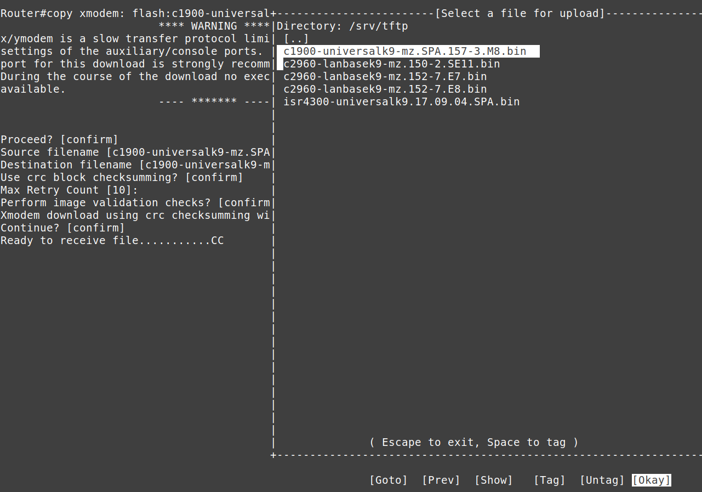

# Setup van een Cisco IOS besturingssysteem op een Cisco 1941 router

Het (her)installeren van Cisco IOS op een Cisco 1941 router is het proces van het kopiëren van het besturingssysteemimage naar het flashgeheugen. Dit kan op twee manieren:

- Via een consolekabel (directe seriële verbinding): Hierbij gebruik je het Xmodem-protocol om het IOS-bestand over te zetten, wat kan vanuit een werkend IOS of vanuit de ROM Monitor (ROMmon) modus als de router niet correct opstart.
- Via een netwerkkabel: Hierbij gebruik je netwerkprotocollen zoals TFTP, SFTP (via SSH), of HTTP om de image over te dragen. Deze methode is enkel mogelijk vanuit een reeds werkend IOS en niet vanuit ROMmon, aangezien er netwerkfunctionaliteit vereist is.

Na de overdracht wordt de router herstart om met het nieuwe of herstelde IOS-image op te starten.

## Vereisten
- een [PC met Linux Mint 22](../../tutorials/setup-windows11-linuxmint22-dual-boot-uefi/index.md ){:target="_blank"}
- [minicom](../setup-minicom-linuxmint22/index.md){:target="_blank"} terminal emulation software
- een console kabel en/of netwerk kabel
- een Cisco 1941 router (al dan niet toegankelijk)

## Demo
<iframe width="854" height="480" src="https://www.youtube.com/embed/xiRsG7-qaQY?autoplay=0&loop=0&mute=0" title="YouTube video player" frameborder="0" allow="accelerometer; autoplay; clipboard-write; encrypted-media; gyroscope; picture-in-picture; web-share" referrerpolicy="strict-origin-when-cross-origin" allowfullscreen></iframe>

## Situatie
Op het moment van schrijven is de nieuwste versie van IOS voor een Cisco 1941-router c1900-universalk9-mz.SPA.157-3.M8.bin.
Ik gebruik die versie voor de voorbeelden.

## IOS overdracht over serial (xmodem)


### Vanaf IOS
=== "Stap1"
    Controleer of er voldoende ruimte over is op het Flash-bestandssysteem om een ​​(extra) IOS toe te voegen. In dit voorbeeld maak ik voldoende plaats vrij door het bestaande IOS te verwijderen. Niet herladen!

    ``` title='' hl_lines="1 10"
    Router#dir flash:
    Directory of flash0:/

        1  -rw-    85053068  Nov 30 1983 00:00:00 +00:00  c1900-universalk9-mz.SPA.157-3.M8.bin
        2  -rw-          34   Apr 4 2022 10:30:50 +00:00  pnp-tech-time
        3  -rw-      138509   Apr 4 2022 10:31:02 +00:00  pnp-tech-discovery-summary

    256610304 bytes total (171413504 bytes free)
    Router#
    Router#delete flash:/c1900-universalk9-mz.SPA.157-3.M8.bin
    Delete filename [c1900-universalk9-mz.SPA.157-3.M8.bin]? 
    Delete flash0:/c1900-universalk9-mz.SPA.157-3.M8.bin? [confirm]
    Router#
    ```

=== "Stap2"
    Stel de baudrate in op 115200 om de overdracht te versnellen. De verbinding wordt verbroken na de laatste opdracht. Er kunnen wat onzinnige tekens verschijnen; dit is normaal.

    ``` title='' hl_lines="4" 
    Router#conf t
    Enter configuration commands, one per line.  End with CNTL/Z.
    Router(config)#line console 0
    Router(config-line)#speed 115200
    C�
    ```

=== "Stap3"
    Pas de instellingen in je terminal-emulatieprogramma aan de nieuwe baudrate aan. Voor [minicom](../setup-minicom-linuxmint22/index.md){:target="_blank"} druk je op ++control+a++ en vervolgens op ++z++.

    Typ ++o++ en kies "Serial port setup". Wijzig de instelling met ++e++ en druk tweemaal op ++enter++. Exit. Mogelijks moet je nogmaals een ++enter++ drukken om opnieuw toegang te verkrijgen tot de console.

    ``` title='' hl_lines="5 11"
    Router#conf t                                                                                                    
    Enter configuration commands, one per line.  End with CNTL/Z.                                                    
    Rout+-----------------+---------[Comm Parameters]----------+----------------+                                    
    Rout| A -    Serial De|                                    |                |                                    
    C�  | B - Lockfile Loc|     Current:  9600 8N1             |                |                                    
        | C -   Callin Pro| Speed            Parity      Data  |                |                                    
        | D -  Callout Pro| A: <next>        L: None     S: 5  |                |                                    
        | E -    Bps/Par/B| B: <prev>        M: Even     T: 6  |                |                                    
        | F - Hardware Flo| C:   9600        N: Odd      U: 7  |                |                                    
        | G - Software Flo| D:  38400        O: Mark     V: 8  |                |                                    
        | H -     RS485 En| E: 115200        P: Space          |                |                                    
        | I -   RS485 Rts |                                    |                |                                    
        | J -  RS485 Rts A| Stopbits                           |                |                                    
        | K -  RS485 Rx Du| W: 1             Q: 8-N-1          |                |                                    
        | L -  RS485 Termi| X: 2             R: 7-E-1          |                |                                    
        | M - RS485 Delay |                                    |                |                                    
        | N - RS485 Delay |                                    |                |                                    
        |                 | Choice, or <Enter> to exit?        |                |                                    
        |    Change which +------------------------------------+                |                                    
        +-----------------------------------------------------------------------+
    ```

=== "Stap4"
    Start een xMODEM-overdracht. Bevestig de doelbestandsnaam. De router vraagt ​je vervolgens om de overdracht te starten vanuit je terminalemulator.

    

=== "Stap5"
    Voor minicom, druk op ++control+a++ en vervolgens op ++z++. Typ ++s++ (Send files) en selecteer "xmodem". Navigeer naar het nieuwe [IOS-bestand](../todo/index.md) (hier /srv/tftp). Druk op ++space++ om het bestand te selecteren en druk "Oké" om te verzenden.

    

=== "Stap6"
    Neem een ​​kop koffie. Dit kan lang duren, afhankelijk van de grootte van de IOS-image. Wacht tot de overdracht is voltooid en druk ++enter++ om te stoppen.

    

=== "Stap7"
    Je zou kunnen `boot system flash:/...` gebruiken (zoals bij een Cisco 2960 switch), maar dit schrijft een regel weg in de running-config en dat willen we niet, want we wensen een lege configuratie.

    ``` title='' hl_lines="0"
    # niet nodig
    Router(config)#boot system flash:c1900-universalk9-mz.SPA.157-3.M8.bin
    Router(config)#exit
    Router#show running-config | include boot      
    boot-start-marker
    boot system flash:c1900-universalk9-mz.SPA.157-3.M8.bin
    boot-end-marker
    ```
 
=== "Stap8"
    Na een herstart zoekt/vindt de router wel een IOS op de flash. Je moet de instellingen in je terminal-emulatieprogramma opnieuw aanpassen aan de standaard baudrate van 9600. Controleer of de juiste IOS-image is geladen. Veel plezier met je nieuwe IOS!

    ``` title='' hl_lines="0"
    Router#show version | include System image file
    System image file is "flash0:c1900-universalk9-mz.SPA.157-3.M8.bin"
    Router#
    ```

### Vanaf ROMMON
In tegenstelling tot een Cisco 2960-switch is het, voor zover ik weet, niet mogelijk om xmodem vanaf de router te gebruiken in [ROMMON-mode](../toegang-cisco-rommon/index.md){:target="_blank"}.


## IOS-overdracht via netwerkprotocol
In tegenstelling tot een Cisco 2960-switch is overdracht via een netwerkprotocol mogelijk vanuit IOS *en* vanuit de ROMMON-modus.


### Vanaf IOS

#### tFTP

=== "Stap1"
    Controleer of er voldoende ruimte over is op het Flash-bestandssysteem om een ​​(extra) IOS toe te voegen. In dit voorbeeld simuleer ik een ontbrekend IOS door het te verwijderen.

    ``` title='' hl_lines="1 10"
    Router#dir flash:
    Directory of flash0:/

        1  -rw-    85053068  Jun 21 2024 06:40:02 +00:00  c1900-universalk9-mz.SPA.157-3.M8.bin
        2  -rw-          35  Jul 10 2024 11:36:02 +00:00  pnp-tech-time
        3  -rw-        3883  Jul 10 2024 11:36:06 +00:00  pnp-tech-discovery-summary

    261189632 bytes total (176128000 bytes free)

    Router#delete flash:/c1900-universalk9-mz.SPA.157-3.M8.bin
    Delete filename [c1900-universalk9-mz.SPA.157-3.M8.bin]? 
    Delete flash0:/c1900-universalk9-mz.SPA.157-3.M8.bin? [confirm]
    Router#
    ```

=== "Stap2"
    Je hebt [een tFTP-service](../todo/index.md){:target="_blank"} nodig op de LAB-PC. Kopieer een [geldige Cisco IOS-image](../todo/index.md){:target="_blank"} naar de tFTP-directory van waaruit de bestanden worden geserveerd. Pas de rechten aan.

    ``` title='' hl_lines="2"
    <TODO COPY AND PERMISSIONS>
    guru@lab:~$ ls -lh /srv/tftp/
    total 852M
    ...
    -rw-r--r-- 1 guru guru  82M sep  2  2021 c1900-universalk9-mz.SPA.157-3.M8.bin
    ...
    guru@lab:~$ 
    ```

=== "Stap3"
    - Toon de naam van de netwerkinterface op de LAB-PC (in dit geval: enp0s25)
    - Configureer een tijdelijk IP-adres en subnetmasker.
    - Controleer.

    ``` title='' hl_lines="1 8 10"
    guru@lab:~$ sudo ip link show
    [sudo] password for guru:     
    1: lo: <LOOPBACK,UP,LOWER_UP> mtu 65536 qdisc noqueue state UNKNOWN mode DEFAULT group default qlen 1000
        link/loopback 00:00:00:00:00:00 brd 00:00:00:00:00:00
    2: enp0s25: <BROADCAST,MULTICAST,UP,LOWER_UP> mtu 1500 qdisc fq_codel state UP mode DEFAULT group default qlen 1000
        link/ether 90:1b:0e:18:b9:8e brd ff:ff:ff:ff:ff:ff

    guru@lab:~$ sudo ip address add 192.168.1.101/24 dev enp0s25

    guru@lab:~$ ip a
    ...
    2: enp0s25: <BROADCAST,MULTICAST,UP,LOWER_UP> mtu 1500 qdisc fq_codel state UP group default qlen 1000
        link/ether 90:1b:0e:18:b9:8e brd ff:ff:ff:ff:ff:ff
        inet 192.168.1.101/24 scope global enp0s25
        valid_lft forever preferred_lft forever
    ```

=== "Stap4"
    Configureer een IP-adres en subnetmasker op de router. Controleer dit.

    ``` title='' hl_lines="3 8"
    Router#conf t
    Router(config)#int g0/0
    Router(config-if)#ip add 192.168.1.84 255.255.255.0
    Router(config-if)#no shut
    Router(config-if)#end
    Router#

    Router#show ip int br
    Interface                  IP-Address      OK? Method Status                Protocol
    ...   
    GigabitEthernet0/0         192.168.1.84    YES manual up                    up      
    ...
    Router#
    ```

=== "Stap5"
    Controleer de connectiviteit tussen de LAB-PC en de router.

    ``` title='' hl_lines="1"
    Router#ping 192.168.1.101
    Type escape sequence to abort.
    Sending 5, 100-byte ICMP Echos to 192.168.1.101, timeout is 2 seconds:
    !!!!!
    Success rate is 100 percent (5/5), round-trip min/avg/max = 1/1/4 ms
    Router#
    ```

=== "Stap6"
    Kopieer de IOS-image van de tFTP-server naar het flashgeheugen van de router.

    ``` title='' hl_lines="1"
    Router#copy tftp://192.168.1.101/c1900-universalk9-mz.SPA.157-3.M8.bin flash:
    Destination filename [c1900-universalk9-mz.SPA.157-3.M8.bin]? 
    Accessing tftp://192.168.1.101/c1900-universalk9-mz.SPA.157-3.M8.bin...
    Loading c1900-universalk9-mz.SPA.157-3.M8.bin from 192.168.1.101 (via GigabitEthernet0/0): !!!!!!!!!!!!!!!!!!!!!!!!!!!!!!!!!!!!!!!!!!!!!
    [OK - 85053068 bytes]

    85053068 bytes copied in 125.316 secs (678709 bytes/sec)

    Router#
    ```

=== "Stap7"
    Controleer en start opnieuw op.

    ``` title='' hl_lines="1 11"
    Router#dir flash:
    Directory of flash0:/

        1  -rw-    85053068  Jul 10 2024 11:51:18 +00:00  c1900-universalk9-mz.SPA.157-3.M8.bin
        2  -rw-          35  Jul 10 2024 11:36:02 +00:00  pnp-tech-time
        3  -rw-       51320  Jul 10 2024 11:36:10 +00:00  pnp-tech-discovery-summary

    261189632 bytes total (176078848 bytes free)
    Router#

    Router#reload

    Proceed with reload? [confirm]

    *Jul 10 11:53:13.439: %SYS-5-RELOAD: Reload requested by console. Reload Reason: Reload Command.
    ```

=== "Stap8"
    Controleer of de juiste IOS-image is geladen. Veel plezier met je nieuwe IOS!

    ``` title='' hl_lines="1 5"
    Router#show version
    Cisco IOS Software, C1900 Software (C1900-UNIVERSALK9-M), Version 15.7(3)M8, RELEASE SOFTWARE (fc1)
    ...
    ...
    System image file is "flash0:c1900-universalk9-mz.SPA.157-3.M8.bin"
    ...
    ```

#### SSH (sFTP)
todo

#### HTTP
todo

### From ROMMON
Start eerst de router in de [ROMMON-modus](../toegang-cisco-rommon/index.md){:target="_blank"}.

#### tFTP

=== "Stap1"
    Stel de benodigde parameters in om tFTP mogelijk te maken.

    ``` title='' hl_lines="0"
    rommon 1 > IP_ADDRESS=192.168.1.84
    rommon 2 > IP_SUBNET_MASK=255.255.255.0
    rommon 3 > DEFAULT_GATEWAY=192.168.1.254
    rommon 4 > TFTP_SERVER=192.168.1.101
    rommon 5 > TFTP_FILE=c1900-universalk9-mz.SPA.157-3.M8.bin
    rommon 6 >
    ```

=== "Stap2"
    Start de tFTP-overdracht.

    ``` title='' hl_lines="0"
    rommon 6 > tftpdnld

            IP_ADDRESS: 192.168.1.84
        IP_SUBNET_MASK: 255.255.255.0
        DEFAULT_GATEWAY: 192.168.1.254
            TFTP_SERVER: 192.168.1.101
            TFTP_FILE: c1900-universalk9-mz.SPA.157-3.M8.bin
            TFTP_MACADDR: d8:b1:90:63:85:60
        TFTP_DESTINATION: flash0:
                GE_PORT: Ge0/0
        TFTP_MEDIA_TYPE: Copper
            TFTP_VERBOSE: Progress
        TFTP_RETRY_COUNT: 20
            TFTP_TIMEOUT: 7200
        TFTP_CHECKSUM: Yes
        GE_SPEED_MODE: Auto Detect

    Invoke this command for disaster recovery only.
    WARNING: all existing data in all partitions on flash will be lost!
    Do you wish to continue? y/n:  [n]:  y

    Receiving c1900-universalk9-mz.SPA.157-3.M8.bin from 192.168.1.101 !!!!!!!!!!!!!!!!!!!!!!!!!!!!!!!!!!!!!!!!!!!!!!!!!!!!!!!!!!!!!!!!!!!!!
    File reception completed.
    IOS Image Load Test 
    ___________________ 
    Digitally Signed Release Software 

    Validating checksum.
    Copying file c1900-universalk9-mz.SPA.157-3.M8.bin to flash0:.
    program load complete, entry point: 0x80803000, size: 0x1b340

    Format: All system sectors written. OK...

    Format: Total sectors in formatted partition: 510944
    Format: Total bytes in formatted partition: %llu
    Format: Operation completed successfully.
    program load complete, entry point: 0x80803000, size: 0x1b340

    rommon 7 > 
    ```

=== "Stap3"
    Controleer Flash.

    ``` title='' hl_lines="0"
    rommon 7 > dir flash:
    program load complete, entry point: 0x80803000, size: 0x1b340
    Directory of flash:

    2      85053068  -rw-     c1900-universalk9-mz.SPA.157-3.M8.bin
    rommon 8 > 
    ```

=== "Stap4"
    Herstart de router.

    ``` title='' hl_lines="0"
    rommon 8 > reset

    System Bootstrap, Version 15.0(1r)M16, RELEASE SOFTWARE (fc1)
    ...
    ```