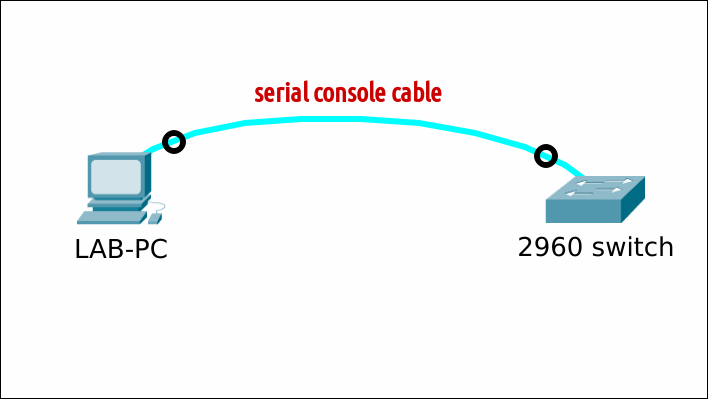

# Setup minicom op Linux Mint 22

Minicom is een populair terminalprogramma voor Unix-achtige besturingssystemen dat wordt gebruikt om te communiceren met seriële apparaten, zoals modems, routers en embedded systemen.

## Vereisten
- een [PC met Linux Mint 22](../../tutorials/setup-windows11-linuxmint22-dual-boot-uefi/index.md ){:target="_blank"}

## Demo
<iframe width="854" height="480" src="https://www.youtube.com/embed/xiRsG7-qaQY?autoplay=0&loop=0&mute=0" title="YouTube video player" frameborder="0" allow="accelerometer; autoplay; clipboard-write; encrypted-media; gyroscope; picture-in-picture; web-share" referrerpolicy="strict-origin-when-cross-origin" allowfullscreen></iframe>

## Setup


## Update pakketlijst
Vernieuw de lokale pakketlijst om je systeem op de hoogte te brengen van de nieuwste beschikbare pakketten en updates in de gekoppelde software repositories.

=== "guru@hp:~$_"

    ``` title='' hl_lines="0"
    sudo apt update
    ```

=== "output"

    ``` title='' hl_lines="0"
    guru@hp:~$ sudo apt update
    Hit:1 http://archive.ubuntu.com/ubuntu noble InRelease
    Ign:2 http://linux-mint.froonix.org xia InRelease
    Hit:3 http://security.ubuntu.com/ubuntu noble-security InRelease
    Hit:4 http://archive.ubuntu.com/ubuntu noble-updates InRelease
    Hit:5 http://linux-mint.froonix.org xia Release
    Hit:6 http://archive.ubuntu.com/ubuntu noble-backports InRelease
    Reading package lists... Done
    Building dependency tree... Done
    Reading state information... Done
    81 packages can be upgraded. Run 'apt list --upgradable' to see them.
    ```

## Installeer minicom
=== "guru@hp:~$_"

    ``` title='' hl_lines="0"
    sudo apt install minicom -y
    ```

=== "output"

    ``` title='' hl_lines="0"
    guru@hp:~$ sudo apt install minicom -y
    Reading package lists... Done
    Building dependency tree... Done
    Reading state information... Done
    The following additional packages will be installed:
      lrzsz
    The following NEW packages will be installed:
      lrzsz minicom
    0 upgraded, 2 newly installed, 0 to remove and 81 not upgraded.
    Need to get 339 kB of archives.
    After this operation, 1.358 kB of additional disk space will be used.
    Get:1 http://archive.ubuntu.com/ubuntu noble/universe amd64 lrzsz amd64 0.12.21-11build1 [78,1 kB]
    Get:2 http://archive.ubuntu.com/ubuntu noble/universe amd64 minicom amd64 2.9-4 [260 kB]
    Fetched 339 kB in 0s (1.171 kB/s)
    Selecting previously unselected package lrzsz.
    (Reading database ... 530479 files and directories currently installed.)
    Preparing to unpack .../lrzsz_0.12.21-11build1_amd64.deb ...
    Unpacking lrzsz (0.12.21-11build1) ...
    Selecting previously unselected package minicom.
    Preparing to unpack .../minicom_2.9-4_amd64.deb ...
    Unpacking minicom (2.9-4) ...
    Setting up minicom (2.9-4) ...
    Setting up lrzsz (0.12.21-11build1) ...
    Processing triggers for desktop-file-utils (0.27-2build1) ...
    Processing triggers for gnome-menus (3.36.0-1.1ubuntu3) ...
    Processing triggers for mate-menus (1.26.1+mint1) ...
    Processing triggers for man-db (2.12.0-4build2) ...
    Processing triggers for mailcap (3.70+nmu1ubuntu1) ...
    guru@hp:~$ 
    ```

## Identificeer de seriële poort
In dit voorbeeld is een Linux Mint LAB-PC met een seriële kabel verbonden met een Cisco router. Voer op die PC de volgende opdracht uit om de beschikbare seriële poorten weer te geven. Noteer de naam van de seriële poort die bij je apparaat hoort (in dit geval `/dev/ttyS0`).

=== "guru@hp:~$_"

    ``` title='' hl_lines="0"
    dmesg | grep tty
    ```

=== "output"

    ``` title='' hl_lines="3"
    guru@hp:~$ dmesg | grep tty
    [    0.058794] printk: legacy console [tty0] enabled
    [    0.411653] 00:02: ttyS0 at I/O 0x3f8 (irq = 4, base_baud = 115200) is a 16550A
    guru@hp:~$ 
    ```

## Configureer minicom
Bekijk tab "output" voor configuratie instructies.

=== "guru@hp:~$_"

    ``` title='' hl_lines="0"
    sudo minicom -s
    ```

=== "output"
    Gebruik in het configuratiemenu van Minicom de pijltjestoetsen om te navigeren en de instellingen te configureren.

    - Selecteer "Serial port setup"
    - Stel het seriële apparaat in op het apparaat dat je eerder hebt genoteerd (in dit geval "/dev/ttyS0")
    - Stel de baudrate in volgens de specificaties van je apparaat (bijv. "9600")
    - Laat de overige instellingen op de standaardwaarden staan, tenzij je specifieke vereisten hebt.
    - Klik op "Save setup as dfl" om de configuratie op te slaan.
    - Klik op "Exit from Minicom".

    Deze instellingen worden opgeslagen in het bestand `/etc/minicom/minirc.dfl` voor alle toekomstige uitvoeringen.

## Start minicom

=== "guru@hp:~$_"

    ``` title='' hl_lines="0"
    sudo minicom
    ```

=== "output"

    Druk op ++enter++ om de router-prompt te openen. Om Minicom af te sluiten, druk je op de sneltoets ++ctrl++ ++a++ gevolgd door de letter ++x++.

    ``` title='' hl_lines="0"
    Welcome to minicom 2.8

    OPTIONS: I18n 
    Port /dev/ttyS0, 14:06:27

    Press CTRL-A Z for help on special keys


    <press ENTER>

    Router>
    ```

## Alternatieve werkwijze
In plaats van eerst de configuratie uit te voeren, kan je ineens de juiste parameters opgeven via de opdrachtregel.

=== "guru@hp:~$_"

    ``` title='' hl_lines="0"
    sudo minicom -b 9600 -D /dev/ttyS0
    ```

=== "output"

    Druk op ++enter++ om de router-prompt te openen. Om Minicom af te sluiten, druk je op de sneltoets ++ctrl++ ++a++ gevolgd door de letter ++x++.

    ``` title='' hl_lines="0"
    Welcome to minicom 2.8

    OPTIONS: I18n 
    Port /dev/ttyS0, 14:06:27

    Press CTRL-A Z for help on special keys


    <press ENTER>

    Router>
    ```