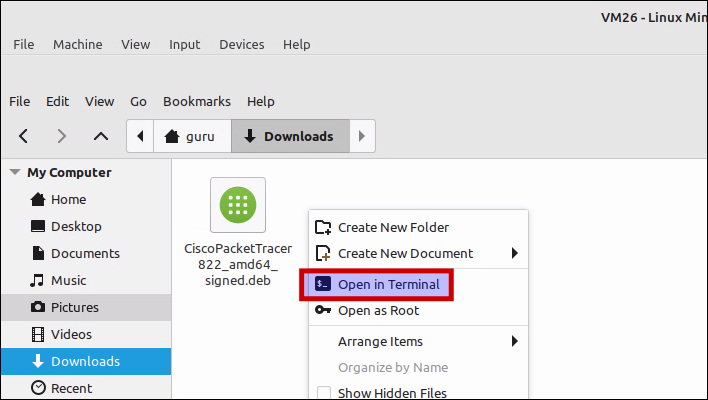
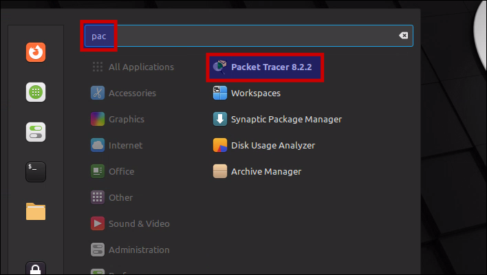
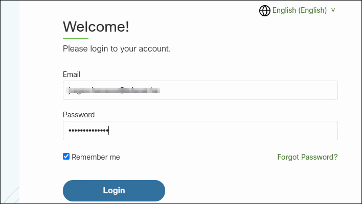
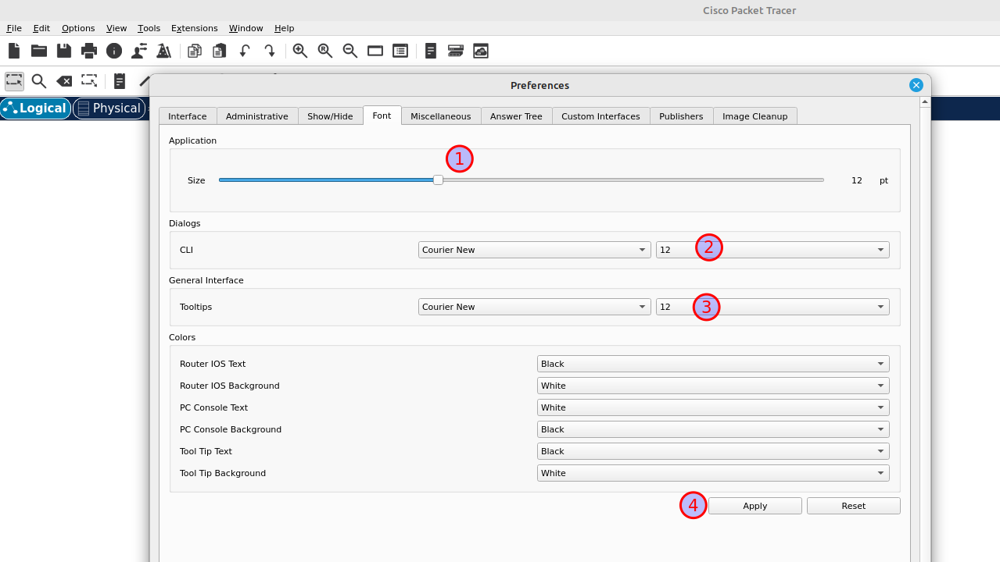

# Setup Packet Tracer 8.2.2 op Linux Mint 22

Cisco Packet Tracer is een gratis netwerksimulatietool ontwikkeld door Cisco Systems, waarmee je virtuele netwerktopologieën kunnen ontwerpen, bouwen, configureren en testen in een risicovrije omgeving. Het je in staat om met diverse netwerkapparaten zoals routers en switches te experimenteren, netwerkprotocollen te simuleren en problemen op te lossen, zonder de noodzaak van dure fysieke hardware.

## Vereisten
- een [PC met Linux Mint 22](../../tutorials/setup-windows11-linuxmint22-dual-boot-uefi/index.md ){:target="_blank"}
- internet verbinding

!!! danger "VDAB cursisten"
    Gebruik het Packet Tracer installatie-bestand `CiscoPacketTracer822_amd64_signed.deb` van in de `Download` folder in Google Classroom.

## Demo
<iframe width="854" height="480" src="https://www.youtube.com/embed/xiRsG7-qaQY?autoplay=0&loop=0&mute=0" title="YouTube video player" frameborder="0" allow="accelerometer; autoplay; clipboard-write; encrypted-media; gyroscope; picture-in-picture; web-share" referrerpolicy="strict-origin-when-cross-origin" allowfullscreen></iframe>

## Open Terminal
- Start de bestandsbeheerder `Nemo`
- Selecteer de map `Downloads`
- Klik met de rechtermuisknop *op een lege ruimte* en selecteer `Openen in Terminal`



## Download en installeer manueel een dependency
Wegens [deze bug](https://github.com/PetrusNoleto/Error-in-install-cisco-packet-tracer-in-ubuntu-23.10-Dependency-is-not-satisfiable-libgl1-mesa-glx){:target="_blank"} moet je eerst manueel een pakket installeren, dat niet meer in de Linux Mint 22 (Ubuntu) repository zit.

=== "guru@hp:~/Downloads$_"

    ``` title=''
    wget https://nl.archive.ubuntu.com/ubuntu/pool/universe/m/mesa/libgl1-mesa-glx_23.0.4-0ubuntu1~22.04.1_amd64.deb
    sudo apt install ./libgl1-mesa-glx_23.0.4-0ubuntu1~22.04.1_amd64.deb
    ```

=== "output"

    ``` title='' hl_lines="0"
    guru@hp:~/Downloads$ wget https://nl.archive.ubuntu.com/ubuntu/pool/universe/m/mesa/libgl1-mesa-glx_23.0.4-0ubuntu1~22.04.1_amd64.deb
    --2025-08-29 16:36:46--  https://nl.archive.ubuntu.com/ubuntu/pool/universe/m/mesa/libgl1-mesa-glx_23.0.4-0ubuntu1~22.04.1_amd64.deb
    Resolving nl.archive.ubuntu.com (nl.archive.ubuntu.com)... 213.136.12.213, 2001:7b8:3:37::21:3
    Connecting to nl.archive.ubuntu.com (nl.archive.ubuntu.com)|213.136.12.213|:443... connected.
    HTTP request sent, awaiting response... 200 OK
    Length: 5584 (5,5K) [application/vnd.debian.binary-package]
    Saving to: ‘libgl1-mesa-glx_23.0.4-0ubuntu1~22.04.1_amd64.deb’

    libgl1-mesa-glx_23.0.4-0ubuntu1~22.04.1_amd64.deb           100%[=========================================================================================================================================>]   5,45K  --.-KB/s    in 0s      

        2025-08-29 16:36:47 (227 MB/s) - ‘libgl1-mesa-glx_23.0.4-0ubuntu1~22.04.1_amd64.deb’ saved [5584/5584]

    guru@hp:~/Downloads$ sudo apt install ./libgl1-mesa-glx_23.0.4-0ubuntu1~22.04.1_amd64.deb
    [sudo] password for guru:     
    Reading package lists... Done
    Building dependency tree... Done
    Reading state information... Done
    Note, selecting 'libgl1-mesa-glx' instead of './libgl1-mesa-glx_23.0.4-0ubuntu1~22.04.1_amd64.deb'
    The following NEW packages will be installed:
      libgl1-mesa-glx
    0 upgraded, 1 newly installed, 0 to remove and 0 not upgraded.
    Need to get 0 B/5.584 B of archives.
    After this operation, 74,8 kB of additional disk space will be used.
    Get:1 /home/guru/Downloads/libgl1-mesa-glx_23.0.4-0ubuntu1~22.04.1_amd64.deb libgl1-mesa-glx amd64 23.0.4-0ubuntu1~22.04.1 [5.584 B]
    Selecting previously unselected package libgl1-mesa-glx:amd64.
    (Reading database ... 531896 files and directories currently installed.)
    Preparing to unpack .../libgl1-mesa-glx_23.0.4-0ubuntu1~22.04.1_amd64.deb ...
    Unpacking libgl1-mesa-glx:amd64 (23.0.4-0ubuntu1~22.04.1) ...
    Setting up libgl1-mesa-glx:amd64 (23.0.4-0ubuntu1~22.04.1) ...
    N: Download is performed unsandboxed as root as file '/home/guru/Downloads/libgl1-mesa-glx_23.0.4-0ubuntu1~22.04.1_amd64.deb' couldn't be accessed by user '_apt'. - pkgAcquire::Run (13: Permission denied)
    ```

## Installeer Packet Tracer
Installeer het .deb-pakket en geef het relatieve pad naar het pakketbestand op. APT herkent en installeert het pakket, inclusief eventuele afhankelijkheden.

=== "guru@hp:~/Downloads$_"

    ``` title='' hl_lines="0"
    sudo apt install ./CiscoPacketTracer822_amd64_signed.deb -y
    ```

=== "output"

    ``` title='' hl_lines="62"
    guru@hp:~/Downloads$ sudo apt install ./CiscoPacketTracer822_amd64_signed.deb -y
    Reading package lists... Done
    Building dependency tree... Done
    Reading state information... Done
    Note, selecting 'packettracer' instead of './CiscoPacketTracer822_amd64_signed.deb'
    The following additional packages will be installed:
      libpthread-stubs0-dev libxau-dev libxcb-xinerama0-dev libxcb1-dev libxdmcp-dev x11proto-dev xorg-sgml-doctools
    Suggested packages:
      libxcb-doc
    The following NEW packages will be installed:
      libpthread-stubs0-dev libxau-dev libxcb-xinerama0-dev libxcb1-dev libxdmcp-dev packettracer x11proto-dev xorg-sgml-doctools
    0 upgraded, 8 newly installed, 0 to remove and 0 not upgraded.
    Need to get 746 kB/284 MB of archives.
    After this operation, 2.676 kB of additional disk space will be used.
    Get:1 http://archive.ubuntu.com/ubuntu noble/main amd64 libpthread-stubs0-dev amd64 0.4-1build3 [4.746 B]
    Get:2 http://archive.ubuntu.com/ubuntu noble/main amd64 xorg-sgml-doctools all 1:1.11-1.1 [10,9 kB]
    Get:3 http://archive.ubuntu.com/ubuntu noble/main amd64 x11proto-dev all 2023.2-1 [602 kB]
    Get:4 http://archive.ubuntu.com/ubuntu noble/main amd64 libxau-dev amd64 1:1.0.9-1build6 [9.570 B]
    Get:5 http://archive.ubuntu.com/ubuntu noble/main amd64 libxdmcp-dev amd64 1:1.1.3-0ubuntu6 [26,5 kB]
    Get:6 http://archive.ubuntu.com/ubuntu noble/main amd64 libxcb1-dev amd64 1.15-1ubuntu2 [85,8 kB]
    Get:7 http://archive.ubuntu.com/ubuntu noble/main amd64 libxcb-xinerama0-dev amd64 1.15-1ubuntu2 [6.034 B]
    Get:8 /home/guru/Downloads/CiscoPacketTracer822_amd64_signed.deb packettracer amd64 8.2.2 [283 MB]
    Fetched 746 kB in 2s (486 kB/s)   
    Preconfiguring packages ...
    Selecting previously unselected package libpthread-stubs0-dev:amd64.
    (Reading database ... 531784 files and directories currently installed.)
    Preparing to unpack .../0-libpthread-stubs0-dev_0.4-1build3_amd64.deb ...
    Unpacking libpthread-stubs0-dev:amd64 (0.4-1build3) ...
    Selecting previously unselected package xorg-sgml-doctools.
    Preparing to unpack .../1-xorg-sgml-doctools_1%3a1.11-1.1_all.deb ...
    Unpacking xorg-sgml-doctools (1:1.11-1.1) ...
    Selecting previously unselected package x11proto-dev.
    Preparing to unpack .../2-x11proto-dev_2023.2-1_all.deb ...
    Unpacking x11proto-dev (2023.2-1) ...
    Selecting previously unselected package libxau-dev:amd64.
    Preparing to unpack .../3-libxau-dev_1%3a1.0.9-1build6_amd64.deb ...
    Unpacking libxau-dev:amd64 (1:1.0.9-1build6) ...
    Selecting previously unselected package libxdmcp-dev:amd64.
    Preparing to unpack .../4-libxdmcp-dev_1%3a1.1.3-0ubuntu6_amd64.deb ...
    Unpacking libxdmcp-dev:amd64 (1:1.1.3-0ubuntu6) ...
    Selecting previously unselected package libxcb1-dev:amd64.
    Preparing to unpack .../5-libxcb1-dev_1.15-1ubuntu2_amd64.deb ...
    Unpacking libxcb1-dev:amd64 (1.15-1ubuntu2) ...
    Selecting previously unselected package libxcb-xinerama0-dev:amd64.
    Preparing to unpack .../6-libxcb-xinerama0-dev_1.15-1ubuntu2_amd64.deb ...
    Unpacking libxcb-xinerama0-dev:amd64 (1.15-1ubuntu2) ...
    Selecting previously unselected package packettracer.
    Preparing to unpack .../7-CiscoPacketTracer822_amd64_signed.deb ...
    Unpacking packettracer (8.2.2) ...
    Setting up libpthread-stubs0-dev:amd64 (0.4-1build3) ...
    Setting up xorg-sgml-doctools (1:1.11-1.1) ...
    Processing triggers for man-db (2.12.0-4build2) ...
    Processing triggers for shared-mime-info (2.4-4) ...
    Processing triggers for sgml-base (1.31) ...
    Setting up x11proto-dev (2023.2-1) ...
    Setting up libxau-dev:amd64 (1:1.0.9-1build6) ...
    Setting up libxdmcp-dev:amd64 (1:1.1.3-0ubuntu6) ...
    Setting up libxcb1-dev:amd64 (1.15-1ubuntu2) ...
    Setting up libxcb-xinerama0-dev:amd64 (1.15-1ubuntu2) ...
    Setting up packettracer (8.2.2) ...
    gtk-update-icon-cache: No theme index file.
    N: Download is performed unsandboxed as root as file '/home/guru/Downloads/CiscoPacketTracer822_amd64_signed.deb' couldn't be accessed by user '_apt'. - pkgAcquire::Run (13: Permission denied)
    guru@hp:~/Downloads$ 
    ```

## License agreement
 Lees de `Software License Agreement`en ga akkoord.

## EULA terms
Accepteer de EULA voorwaarden.

## Notice
Negeer de waarschuwing "Notice" aan het einde van de installatie. Alles is goed gegaan.

``` title='' hl_lines="1"
N: Download is performed unsandboxed as root as file '/home/guru/Downloads/CiscoPacketTracer822_amd64_signed.deb' couldn't be accessed by user '_apt'. - pkgAcquire::Run (13: Permission denied)
guru@hp:~/Downloads$ 
```

## Activation link
Lid van Cisco Network Academy? Je hebt als het goed is een activeringslink ontvangen in je privé-e-mail. Activeer je account. Mogelijk heb je dit al eerder gedaan. Sla deze stap dan over.


## Mint menu
Selecteer "Menu" en begin met het typen van "pac". Start "PacketTracer 8.2.2".



## Multi-user
Antwoord "no".


## Sign-in
- Kies eerst `Keep me logged in (for 3 months)` 
- Selecteer vervolgens `Skills For All`. Je kunt de optie `Network Academy` op dit moment niet gebruiken. Na het samenvoegen van 'netacad.com' en 'skillsforall.com' is de Packet Tracer-applicatie nog niet goed ingesteld.


## Login
Vul je privé-e-mailadres in. Zet een vinkje bij `Remember me` en klik op `Login`. Het wachtwoordveld verschijnt. Vul je wachtwoord in.



## Font configuration
Persoonlijke voorkeur. Selecteer `Options -> Preferences -> Font`. Vergroot de lettergrootte naar 12 en klik op `Apply`.
Sluit vervolgens het venster.




