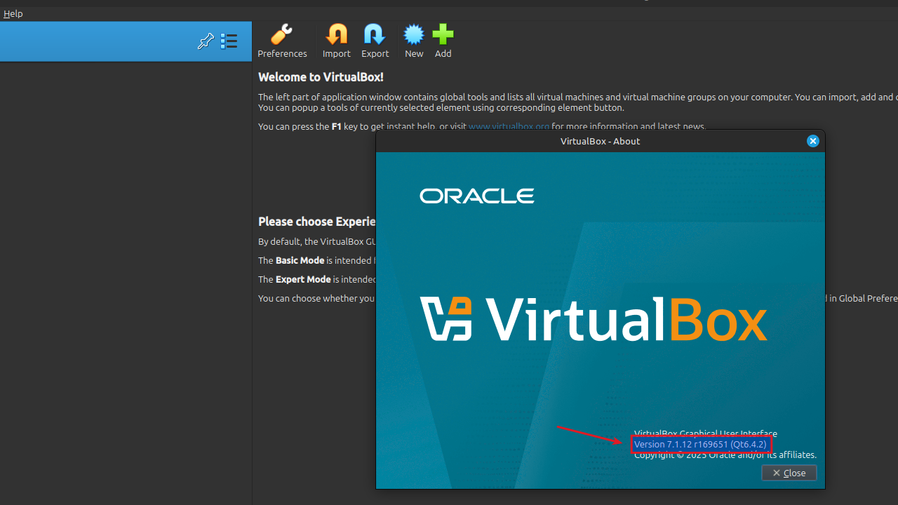

# Setup VirtualBox 7 op Linux Mint 22 (.deb pakket)

VirtualBox stelt je in staat om andere besturingssystemen (zoals Windows of een andere Linux-distributie) te draaien als virtuele machines binnen bv. een bestaande Linux Mint 22-omgeving. Dit gebeurt in een geïsoleerde en veilige virtuele omgeving, waardoor je software kunt testen of applicaties kunt gebruiken die niet native op Linux Mint draaien, zonder je hoofdinstallatie te beïnvloeden.

Voordelen van de installatie via een .deb pakket t.o.v. installatie [methode1](../setup-virtualbox7-linuxmint22-distributierepo/index.md){:target="_blank"} of [methode2](../setup-virtualbox7-linuxmint22-oraclerepo/index.md){:target="_blank"}:

- kies manueel een specifieke versie  
- geen afhankelijkheid van repo's
- vaste versie; geen automatische updates via APT

## Vereisten
- een [PC met Linux Mint 22](../../tutorials/setup-windows11-linuxmint22-dual-boot-uefi/index.md ){:target="_blank"}

## Demo
<iframe width="854" height="480" src="https://www.youtube.com/embed/O5uMXaO0TyQ?autoplay=0&loop=0&mute=0" title="YouTube video player" frameborder="0" allow="accelerometer; autoplay; clipboard-write; encrypted-media; gyroscope; picture-in-picture; web-share" referrerpolicy="strict-origin-when-cross-origin" allowfullscreen></iframe>

## Download pakket
We maken gebruik van VirtualBox 7.1.16, op moment van schrijven de meest recente stabiele 7.1 versie.


=== "guru@hp:~$_"

    ``` title='' hl_lines="0"
    cd Downloads/
    wget https://download.virtualbox.org/virtualbox/7.1.16/virtualbox-7.1_7.1.16-172425~Ubuntu~noble_amd64.deb
    ```

=== "output"

    ``` title='' hl_lines="0"
    guru@hp:~$ cd Downloads/
    guru@hp:~/Downloads$ wget https://download.virtualbox.org/virtualbox/7.1.16/virtualbox-7.1_7.1.16-172425~Ubuntu~noble_amd64.deb
    --2026-02-06 14:39:49--  https://download.virtualbox.org/virtualbox/7.1.16/virtualbox-7.1_7.1.16-172425~Ubuntu~noble_amd64.deb
    Resolving download.virtualbox.org (download.virtualbox.org)... 23.12.148.117
    Connecting to download.virtualbox.org (download.virtualbox.org)|23.12.148.117|:443... connected.
    HTTP request sent, awaiting response... 200 OK
    Length: 109154024 (104M) [application/octet-stream]
    Saving to: ‘virtualbox-7.1_7.1.16-172425~Ubuntu~noble_amd64.deb’

    virtualbox-7.1_7.1.16-172425~Ubuntu~noble 100%[====================================================================================>] 104,10M  51,7MB/s    in 2,0s    

    2026-02-06 14:39:51 (51,7 MB/s) - ‘virtualbox-7.1_7.1.16-172425~Ubuntu~noble_amd64.deb’ saved [109154024/109154024]

    guru@hp:~/Downloads$ 
    ```

## Installeer het pakket

=== "guru@hp:~/Downloads$_"

    ``` title='' hl_lines="0"
    sudo apt install ./virtualbox-7.1_7.1.16-172425~Ubuntu~noble_amd64.deb
    ```

=== "output"

    ``` title='' hl_lines="0"
    guru@hp:~/Downloads$ sudo apt install ./virtualbox-7.1_7.1.16-172425~Ubuntu~noble_amd64.deb
    [sudo] password for guru:     
    Reading package lists... Done
    Building dependency tree... Done
    Reading state information... Done
    Note, selecting 'virtualbox-7.1' instead of './virtualbox-7.1_7.1.16-172425~Ubuntu~noble_amd64.deb'
    The following packages were automatically installed and are no longer required:
      libdrm-radeon1:i386 libglapi-mesa:i386 libllvm19 libllvm19:i386 libnvidia-cfg1-575 libnvidia-common-575 libnvidia-compute-575 libnvidia-compute-575:i386
      libnvidia-decode-575 libnvidia-decode-575:i386 libnvidia-encode-575 libnvidia-encode-575:i386 libnvidia-extra-575 libnvidia-fbc1-575 libnvidia-fbc1-575:i386
      libnvidia-gl-575 libnvidia-gl-575:i386 libxcb-dri2-0:i386 nvidia-compute-utils-575 nvidia-dkms-575 nvidia-firmware-570-570.133.07 nvidia-firmware-575-575.64.03
      nvidia-kernel-common-575 nvidia-kernel-source-575 nvidia-utils-575 xserver-xorg-video-nvidia-575
    Use 'sudo apt autoremove' to remove them.
    The following additional packages will be installed:
      liblzf1 libqt6help6 libqt6printsupport6t64 libqt6sql6-sqlite libqt6sql6t64 libqt6statemachine6 libsdl-ttf2.0-0 libsdl1.2debian libtpms0
    The following NEW packages will be installed:
      liblzf1 libqt6help6 libqt6printsupport6t64 libqt6sql6-sqlite libqt6sql6t64 libqt6statemachine6 libsdl-ttf2.0-0 libsdl1.2debian libtpms0 virtualbox-7.1
    0 upgraded, 10 newly installed, 0 to remove and 4 not upgraded.
    Need to get 1.234 kB/110 MB of archives.
    After this operation, 245 MB of additional disk space will be used.
    Do you want to continue? [Y/n] 
    Get:1 http://archive.ubuntu.com/ubuntu noble/universe amd64 liblzf1 amd64 3.6-4 [7.624 B]
    Get:2 http://archive.ubuntu.com/ubuntu noble/universe amd64 libqt6sql6t64 amd64 6.4.2+dfsg-21.1build5 [141 kB]
    Get:3 http://archive.ubuntu.com/ubuntu noble/universe amd64 libqt6help6 amd64 6.4.2-3build3 [189 kB]
    Get:4 http://archive.ubuntu.com/ubuntu noble/universe amd64 libqt6printsupport6t64 amd64 6.4.2+dfsg-21.1build5 [222 kB]
    Get:5 http://archive.ubuntu.com/ubuntu noble/universe amd64 libqt6statemachine6 amd64 6.4.2-4build2 [128 kB]
    Get:6 http://archive.ubuntu.com/ubuntu noble-updates/main amd64 libtpms0 amd64 0.9.3-0ubuntu4.24.04.1 [373 kB]
    Get:7 http://archive.ubuntu.com/ubuntu noble/universe amd64 libqt6sql6-sqlite amd64 6.4.2+dfsg-21.1build5 [57,8 kB]
    Get:8 http://archive.ubuntu.com/ubuntu noble/universe amd64 libsdl1.2debian amd64 1.2.68-2 [101 kB]
    Get:9 http://archive.ubuntu.com/ubuntu noble/universe amd64 libsdl-ttf2.0-0 amd64 2.0.11-6 [15,1 kB]
    Get:10 /home/guru/Downloads/virtualbox-7.1_7.1.16-172425~Ubuntu~noble_amd64.deb virtualbox-7.1 amd64 7.1.16-172425~Ubuntu~noble [109 MB]
    Fetched 1.234 kB in 1s (2.230 kB/s)
    Preconfiguring packages ...
    Selecting previously unselected package liblzf1:amd64.
    (Reading database ... 621432 files and directories currently installed.)
    Preparing to unpack .../0-liblzf1_3.6-4_amd64.deb ...
    Unpacking liblzf1:amd64 (3.6-4) ...
    Selecting previously unselected package libqt6sql6t64:amd64.
    Preparing to unpack .../1-libqt6sql6t64_6.4.2+dfsg-21.1build5_amd64.deb ...
    Unpacking libqt6sql6t64:amd64 (6.4.2+dfsg-21.1build5) ...
    Selecting previously unselected package libqt6help6:amd64.
    Preparing to unpack .../2-libqt6help6_6.4.2-3build3_amd64.deb ...
    Unpacking libqt6help6:amd64 (6.4.2-3build3) ...
    Selecting previously unselected package libqt6printsupport6t64:amd64.
    Preparing to unpack .../3-libqt6printsupport6t64_6.4.2+dfsg-21.1build5_amd64.deb ...
    Unpacking libqt6printsupport6t64:amd64 (6.4.2+dfsg-21.1build5) ...
    Selecting previously unselected package libqt6statemachine6:amd64.
    Preparing to unpack .../4-libqt6statemachine6_6.4.2-4build2_amd64.deb ...
    Unpacking libqt6statemachine6:amd64 (6.4.2-4build2) ...
    Selecting previously unselected package libtpms0:amd64.
    Preparing to unpack .../5-libtpms0_0.9.3-0ubuntu4.24.04.1_amd64.deb ...
    Unpacking libtpms0:amd64 (0.9.3-0ubuntu4.24.04.1) ...
    Selecting previously unselected package virtualbox-7.1.
    Preparing to unpack .../6-virtualbox-7.1_7.1.16-172425~Ubuntu~noble_amd64.deb ...
    Unpacking virtualbox-7.1 (7.1.16-172425~Ubuntu~noble) ...
    Selecting previously unselected package libqt6sql6-sqlite:amd64.
    Preparing to unpack .../7-libqt6sql6-sqlite_6.4.2+dfsg-21.1build5_amd64.deb ...
    Unpacking libqt6sql6-sqlite:amd64 (6.4.2+dfsg-21.1build5) ...
    Selecting previously unselected package libsdl1.2debian:amd64.
    Preparing to unpack .../8-libsdl1.2debian_1.2.68-2_amd64.deb ...
    Unpacking libsdl1.2debian:amd64 (1.2.68-2) ...
    Selecting previously unselected package libsdl-ttf2.0-0:amd64.
    Preparing to unpack .../9-libsdl-ttf2.0-0_2.0.11-6_amd64.deb ...
    Unpacking libsdl-ttf2.0-0:amd64 (2.0.11-6) ...
    Setting up libqt6sql6t64:amd64 (6.4.2+dfsg-21.1build5) ...
    Setting up libqt6sql6-sqlite:amd64 (6.4.2+dfsg-21.1build5) ...
    Setting up liblzf1:amd64 (3.6-4) ...
    Setting up libsdl1.2debian:amd64 (1.2.68-2) ...
    Setting up libqt6printsupport6t64:amd64 (6.4.2+dfsg-21.1build5) ...
    Setting up libqt6statemachine6:amd64 (6.4.2-4build2) ...
    Setting up libtpms0:amd64 (0.9.3-0ubuntu4.24.04.1) ...
    Setting up libsdl-ttf2.0-0:amd64 (2.0.11-6) ...
    Setting up libqt6help6:amd64 (6.4.2-3build3) ...
    Setting up virtualbox-7.1 (7.1.16-172425~Ubuntu~noble) ...
    info: Selecting GID from range 100 to 999 ...
    info: Adding group `vboxusers' (GID 128) ...
    Processing triggers for desktop-file-utils (0.27-2build1) ...
    Processing triggers for hicolor-icon-theme (0.17-2) ...
    Processing triggers for gnome-menus (3.36.0-1.1ubuntu3) ...
    Processing triggers for mate-menus (1.26.1+mint1) ...
    Processing triggers for libc-bin (2.39-0ubuntu8.7) ...
    Processing triggers for shared-mime-info (2.4-4) ...
    Processing triggers for mailcap (3.70+nmu1ubuntu1) ...
    N: Download is performed unsandboxed as root as file '/home/guru/Downloads/virtualbox-7.1_7.1.16-172425~Ubuntu~noble_amd64.deb' couldn't be accessed by user '_apt'. - pkgAcquire::Run (13: Permission denied)
    guru@hp:~/Downloads$ 
    ```

## Vergrendel de versie ("hold") 
Voorkom dat het virtualbox pakket automatisch wordt bijgewerkt door de pakketbeheerder APT.

=== "guru@hp:~/Downloads$_"

    ``` title='' hl_lines="0"
    sudo apt-mark hold virtualbox
    ```

=== "output"

    ``` title='' hl_lines="0"
    guru@hp:~/Downloads$ sudo apt-mark hold virtualbox
    virtualbox set on hold.
    guru@hp:~/Downloads$ 
    ```

## Setup Extension Pack (optioneel)
### Installeer
Installeren van het [Extension Pack](../../explanations/todo/index.md) is nodig om extra functionaliteit zoals USB 2.0/3.0-ondersteuning, RDP-server, disk-encryptie en PXE boot toe te voegen aan VirtualBox.

=== "guru@hp:~/Downloads$_"
    In dit voorbeeld download en installeer je de specifieke versie 7.1.16

    ``` title=''
    wget -q https://download.virtualbox.org/virtualbox/7.1.16/Oracle_VirtualBox_Extension_Pack-7.1.16.vbox-extpack
    sudo VBoxManage extpack install ./Oracle_VirtualBox_Extension_Pack-7.1.16.vbox-extpack
    ```

=== "output"

    ``` title='' hl_lines="9"
    guru@hp:~/Downloads$ wget -q https://download.virtualbox.org/virtualbox/7.1.16/Oracle_VirtualBox_Extension_Pack-7.1.16.vbox-extpack

    guru@hp:~/Downloads$ sudo VBoxManage extpack install ./Oracle_VirtualBox_Extension_Pack-7.1.16.vbox-extpack
    VirtualBox Extension Pack Personal Use and Educational License (PUEL)

    License version 12, 22 July 2024

    <snip>

    Do you agree to these license terms and conditions (y/n)? y

    License accepted. For batch installation add
    --accept-license=eb31505e56e9b4d0fbca139104da41ac6f6b98f8e78968bdf01b1f3da3c4f9ae
    to the VBoxManage command line.

    0%...10%...20%...30%...40%...50%...60%...70%...80%...90%...100%
    Successfully installed "Oracle VirtualBox Extension Pack".
    guru@hp:~/Downloads$ 
    ```

### Verifieer
=== "guru@hp:~/Downloads$_"

    ``` title=''
    VBoxManage list extpacks
    ```

=== "output"

    ``` title='' hl_lines="4"
    guru@hp:~/Downloads$ VBoxManage list extpacks
    Extension Packs: 1
    Pack no. 0:   Oracle VirtualBox Extension Pack
    Version:        7.1.16
    Revision:       172425
    Edition:        
    Description:    Oracle Cloud Infrastructure integration, Host Webcam, VirtualBox RDP, PXE ROM, Disk Encryption, NVMe, full VM encryption.
    VRDE Module:    VBoxVRDP
    Crypto Module:  VBoxPuelCrypto
    Usable:         true
    Why unusable:   
    guru@hp:~/Downloads$ 
    ```

## Maak de Guest Additions ISO beschikbaar (optioneel)
Het voorzien van de [Guest Additions](../../explanations/todo/index.md) in een virtuele machine zorgt voor betere integratie tussen host en gast, zoals naadloze muisaanwijzer, gedeelde klemborden, schermresolutie-aanpassing en gedeelde mappen.

=== "guru@hp:~/Downloads$_"

    ``` title=''
    VERSION=$(VBoxManage --version | sed -E 's/^([0-9]+\.[0-9]+\.[0-9]+).*/\1/')
    ISO_URL="https://download.virtualbox.org/virtualbox/$VERSION/VBoxGuestAdditions_${VERSION}.iso"
    ISO_TMP="/tmp/VBoxGuestAdditions_${VERSION}.iso"
    ISO_DEST="/usr/share/virtualbox/VBoxGuestAdditions.iso"

    wget -q -O "$ISO_TMP" "$ISO_URL" && \
    sudo mkdir -p /usr/share/virtualbox && \
    if [ -f "$ISO_DEST" ]; then
      sudo mv "$ISO_DEST" "${ISO_DEST}.bak.$(date +%s)"
    fi && \
    sudo install -m 644 "$ISO_TMP" "$ISO_DEST" && \
    echo "VBoxGuestAdditions $VERSION geïnstalleerd in $ISO_DEST"
    ```

=== "output"

    ``` title='' hl_lines="13"
    guru@hp:~/Downloads$ VERSION=$(VBoxManage --version | sed -E 's/^([0-9]+\.[0-9]+\.[0-9]+).*/\1/')
    <snip>
    VBoxGuestAdditions 7.1.16 geïnstalleerd in /usr/share/virtualbox/VBoxGuestAdditions.iso
    guru@hp:~/Downloads$ 
    ```

## Voeg gebruiker toe aan vboxusers groep
Voeg je ingelogde gebruiker toe aan de groep `vboxusers`, zodat die toegang krijgt tot VirtualBox USB-apparaten en bepaalde virtuele hardwarefunctionaliteiten.

=== "guru@hp:~/Downloads$_"

    ``` title=''
    sudo usermod -aG vboxusers guru
    ```

=== "output"

    ``` title='' hl_lines="0"
    guru@hp:~/Downloads$ sudo usermod -aG vboxusers guru
    guru@hp:~/Downloads$ 
    ```

## Disable KVM
Er kunnen geen twee "kapiteins" tegelijkertijd het schip (de VT-x hardware-virtualisatie van je CPU) willen besturen. VirtualBox en KVM kunnen in de regel niet tegelijkertijd actief zijn. Mocht je KVM niet deactiveren, ga je een foutmelding krijgen ("VT-x is being used by another hypervisor (VERR_VMX_IN_VMX_ROOT_MODE).")

=== "guru@hp:~/Downloads$_"

    ``` title=''
    echo -e "blacklist kvm_intel\nblacklist kvm" | sudo tee /etc/modprobe.d/blacklist-kvm.conf
    ```

=== "output"

    ``` title='' hl_lines="0"
    guru@hp:~/Downloads$ echo -e "blacklist kvm_intel\nblacklist kvm" | sudo tee /etc/modprobe.d/blacklist-kvm.conf
    blacklist kvm_intel
    blacklist kvm
    guru@hp:~/Downloads$ 
    ```

## Reboot

=== "guru@hp:~/Downloads$_"

    ``` title=''
    sudo reboot
    ```

=== "output"

    ``` title='' hl_lines="0"
    guru@hp:~/Downloads$ sudo reboot
    ```
  
## Start VirtualBox
Klik op `Help -> About VirtualBox` en controleer de versie.

