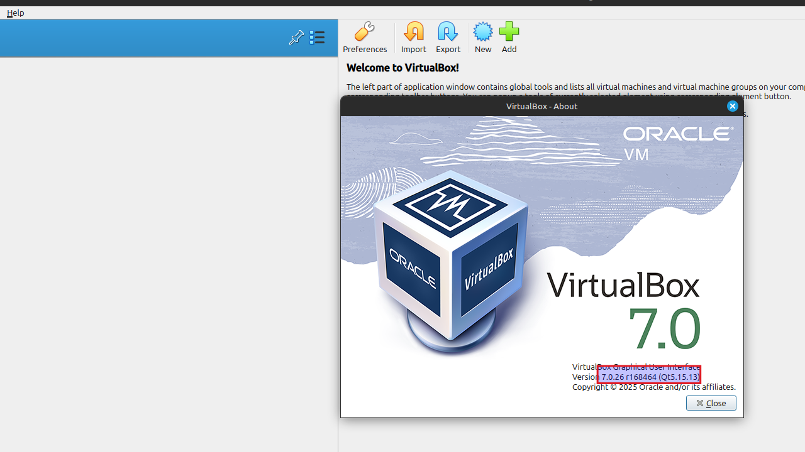
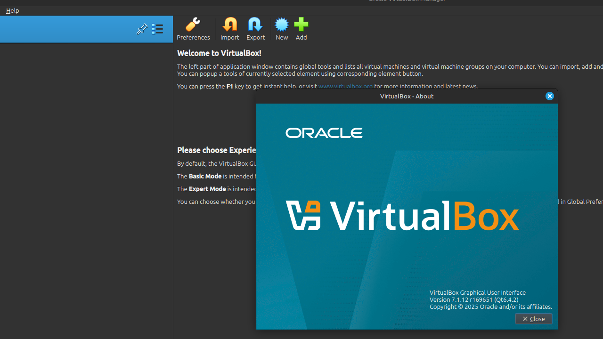

# Setup VirtualBox 7 op Linux Mint 22 (Oracle repository)

VirtualBox stelt je in staat om andere besturingssystemen (zoals Windows of een andere Linux-distributie) te draaien als virtuele machines binnen bv. een bestaande Linux Mint 22-omgeving. Dit gebeurt in een geïsoleerde en veilige virtuele omgeving, waardoor je software kunt testen of applicaties kunt gebruiken die niet native op Linux Mint draaien, zonder je hoofdinstallatie te beïnvloeden.

## Vereisten
- een [PC met Linux Mint 22](../../tutorials/windows11-linuxmint22-dual-boot-uefi/index.md ){:target="_blank"}

<iframe width="560" height="315" src="https://www.youtube.com/embed/xiRsG7-qaQY?autoplay=0&loop=0&mute=0" title="YouTube video player" frameborder="0" allow="accelerometer; autoplay; clipboard-write; encrypted-media; gyroscope; picture-in-picture; web-share" referrerpolicy="strict-origin-when-cross-origin" allowfullscreen></iframe>

Je kan kiezen tussen VirtualBox 7.0 (laatste stabiele maintenance release) of VirtualBox 7.1 (actief onderhouden).

## VirtualBox 7.0.X

### Voeg Oracle GPG-sleutel toe
Opgelet: deze [apt-key methode](../../explanations/apt-key-vs-gpg/index.md){:target="_blank"} is verouderd.

=== "guru@hp:~$_"

    ``` title=''
    wget -q https://www.virtualbox.org/download/oracle_vbox_2016.asc -O- | sudo apt-key add -
    ```

=== "output"

    ``` title='' hl_lines="0"
    guru@hp:~$ wget -q https://www.virtualbox.org/download/oracle_vbox_2016.asc -O- | sudo apt-key add -
    [sudo] password for guru:     
    Warning: apt-key is deprecated. Manage keyring files in trusted.gpg.d instead (see apt-key(8)).
    OK
    guru@hp:~$ 
    ```

### Voeg de Oracle repository toe

=== "guru@hp:~$_"

    ``` title=''
    echo "deb [arch=amd64] https://download.virtualbox.org/virtualbox/debian noble contrib" | sudo tee /etc/apt/sources.list.d/virtualbox.list
    ```

=== "output"

    ``` title='' hl_lines="0"
    guru@hp:~$ echo "deb [arch=amd64] https://download.virtualbox.org/virtualbox/debian noble contrib" | sudo tee /etc/apt/sources.list.d/virtualbox.list
    deb [arch=amd64] https://download.virtualbox.org/virtualbox/debian noble contrib
    guru@hp:~$ 
    ```

### Update pakketlijst
Vernieuw de lokale pakketlijst om je systeem op de hoogte te brengen van de nieuwste beschikbare pakketten en updates in de gekoppelde software repositories.

=== "guru@hp:~$_"

    ``` title=''
    sudo apt update
    ```

=== "output"

    ``` title='' hl_lines="15"
    guru@hp:~$ sudo apt update
    Ign:1 http://linux-mint.froonix.org xia InRelease
    Hit:2 http://linux-mint.froonix.org xia Release                                         
    Hit:3 http://security.ubuntu.com/ubuntu noble-security InRelease                                                                                 
    Get:5 https://download.virtualbox.org/virtualbox/debian noble InRelease [4.442 B]                                                                
    Hit:6 http://archive.ubuntu.com/ubuntu noble InRelease                          
    Hit:7 http://archive.ubuntu.com/ubuntu noble-updates InRelease
    Hit:8 http://archive.ubuntu.com/ubuntu noble-backports InRelease
    Get:9 https://download.virtualbox.org/virtualbox/debian noble/contrib amd64 Packages [2.024 B]
    Fetched 6.466 B in 1s (6.094 B/s)     
    Reading package lists... Done
    Building dependency tree... Done
    Reading state information... Done
    All packages are up to date.
    W: https://download.virtualbox.org/virtualbox/debian/dists/noble/InRelease: Key is stored in legacy trusted.gpg keyring (/etc/apt/trusted.gpg), see the DEPRECATION section in apt-key(8) for details.
    guru@hp:~$ 
    ```

### Verifieer versie in repository

=== "guru@hp:~$_"
    Opgelet: kies niet zoals [hier](../setup-virtualbox7-linuxmint22-distributierepo/index.md#verifieer-versie-in-repository){:target="_blank"} voor het pakket `virtualbox` maar kies expliciet `virtualbox-7.0`

    ``` title=''
    apt-cache policy virtualbox-7.0
    ```

=== "output"

    ``` title='' hl_lines="0"
    guru@hp:~$ apt-cache policy virtualbox-7.0
    virtualbox-7.0:
      Installed: (none)
      Candidate: 7.0.26-168464~Ubuntu~noble
      Version table:
         7.0.26-168464~Ubuntu~noble 500
            500 https://download.virtualbox.org/virtualbox/debian noble/contrib amd64 Packages
    guru@hp:~$ 
    ```

### Installeer VirtualBox
Installeer VirtualBox uit de gekoppelde software repositories.

=== "guru@hp:~$_"

    ``` title=''
    sudo apt install virtualbox-7.0 -y
    ```

=== "output"

    ``` title='' hl_lines="0"
    guru@hp:~$ sudo apt install virtualbox-7.0 -y
    Reading package lists... Done
    Building dependency tree... Done
    Reading state information... Done
    The following additional packages will be installed:
    liblzf1 libqt5help5 libqt5opengl5t64 libqt5printsupport5t64 libqt5sql5-sqlite libqt5sql5t64 libqt5x11extras5 libqt5xml5t64 libsdl-ttf2.0-0 libsdl1.2debian libtpms0
    The following NEW packages will be installed:
    liblzf1 libqt5help5 libqt5opengl5t64 libqt5printsupport5t64 libqt5sql5-sqlite libqt5sql5t64 libqt5x11extras5 libqt5xml5t64 libsdl-ttf2.0-0 libsdl1.2debian libtpms0 virtualbox-7.0
    0 upgraded, 12 newly installed, 0 to remove and 0 not upgraded.
    Need to get 95,0 MB of archives.
    After this operation, 226 MB of additional disk space will be used.
    Get:1 http://archive.ubuntu.com/ubuntu noble/universe amd64 liblzf1 amd64 3.6-4 [7.624 B]
    Get:2 http://archive.ubuntu.com/ubuntu noble/universe amd64 libqt5sql5t64 amd64 5.15.13+dfsg-1ubuntu1 [122 kB]
    Get:3 http://archive.ubuntu.com/ubuntu noble/universe amd64 libqt5help5 amd64 5.15.13-1 [161 kB]
    Get:4 http://archive.ubuntu.com/ubuntu noble/universe amd64 libqt5opengl5t64 amd64 5.15.13+dfsg-1ubuntu1 [150 kB]
    Get:5 https://download.virtualbox.org/virtualbox/debian noble/contrib amd64 virtualbox-7.0 amd64 7.0.26-168464~Ubuntu~noble [93,7 MB]
    Get:6 http://archive.ubuntu.com/ubuntu noble/universe amd64 libqt5printsupport5t64 amd64 5.15.13+dfsg-1ubuntu1 [208 kB]
    Get:7 http://archive.ubuntu.com/ubuntu noble/universe amd64 libqt5x11extras5 amd64 5.15.13-1 [10,9 kB]
    Get:8 http://archive.ubuntu.com/ubuntu noble/universe amd64 libqt5xml5t64 amd64 5.15.13+dfsg-1ubuntu1 [124 kB]
    Get:9 http://archive.ubuntu.com/ubuntu noble-updates/main amd64 libtpms0 amd64 0.9.3-0ubuntu4.24.04.1 [373 kB]
    Get:10 http://archive.ubuntu.com/ubuntu noble/universe amd64 libqt5sql5-sqlite amd64 5.15.13+dfsg-1ubuntu1 [51,5 kB]
    Get:11 http://archive.ubuntu.com/ubuntu noble/universe amd64 libsdl1.2debian amd64 1.2.68-2 [101 kB]
    Get:12 http://archive.ubuntu.com/ubuntu noble/universe amd64 libsdl-ttf2.0-0 amd64 2.0.11-6 [15,1 kB]
    Fetched 95,0 MB in 2s (46,8 MB/s)                                                  
    Preconfiguring packages ...
    Selecting previously unselected package liblzf1:amd64.
    (Reading database ... 530479 files and directories currently installed.)
    Preparing to unpack .../00-liblzf1_3.6-4_amd64.deb ...
    Unpacking liblzf1:amd64 (3.6-4) ...
    Selecting previously unselected package libqt5sql5t64:amd64.
    Preparing to unpack .../01-libqt5sql5t64_5.15.13+dfsg-1ubuntu1_amd64.deb ...
    Unpacking libqt5sql5t64:amd64 (5.15.13+dfsg-1ubuntu1) ...
    Selecting previously unselected package libqt5help5:amd64.
    Preparing to unpack .../02-libqt5help5_5.15.13-1_amd64.deb ...
    Unpacking libqt5help5:amd64 (5.15.13-1) ...
    Selecting previously unselected package libqt5opengl5t64:amd64.
    Preparing to unpack .../03-libqt5opengl5t64_5.15.13+dfsg-1ubuntu1_amd64.deb ...
    Unpacking libqt5opengl5t64:amd64 (5.15.13+dfsg-1ubuntu1) ...
    Selecting previously unselected package libqt5printsupport5t64:amd64.
    Preparing to unpack .../04-libqt5printsupport5t64_5.15.13+dfsg-1ubuntu1_amd64.deb ...
    Unpacking libqt5printsupport5t64:amd64 (5.15.13+dfsg-1ubuntu1) ...
    Selecting previously unselected package libqt5x11extras5:amd64.
    Preparing to unpack .../05-libqt5x11extras5_5.15.13-1_amd64.deb ...
    Unpacking libqt5x11extras5:amd64 (5.15.13-1) ...
    Selecting previously unselected package libqt5xml5t64:amd64.
    Preparing to unpack .../06-libqt5xml5t64_5.15.13+dfsg-1ubuntu1_amd64.deb ...
    Unpacking libqt5xml5t64:amd64 (5.15.13+dfsg-1ubuntu1) ...
    Selecting previously unselected package libtpms0:amd64.
    Preparing to unpack .../07-libtpms0_0.9.3-0ubuntu4.24.04.1_amd64.deb ...
    Unpacking libtpms0:amd64 (0.9.3-0ubuntu4.24.04.1) ...
    Selecting previously unselected package virtualbox-7.0.
    Preparing to unpack .../08-virtualbox-7.0_7.0.26-168464~Ubuntu~noble_amd64.deb ...
    Unpacking virtualbox-7.0 (7.0.26-168464~Ubuntu~noble) ...
    Selecting previously unselected package libqt5sql5-sqlite:amd64.
    Preparing to unpack .../09-libqt5sql5-sqlite_5.15.13+dfsg-1ubuntu1_amd64.deb ...
    Unpacking libqt5sql5-sqlite:amd64 (5.15.13+dfsg-1ubuntu1) ...
    Selecting previously unselected package libsdl1.2debian:amd64.
    Preparing to unpack .../10-libsdl1.2debian_1.2.68-2_amd64.deb ...
    Unpacking libsdl1.2debian:amd64 (1.2.68-2) ...
    Selecting previously unselected package libsdl-ttf2.0-0:amd64.
    Preparing to unpack .../11-libsdl-ttf2.0-0_2.0.11-6_amd64.deb ...
    Unpacking libsdl-ttf2.0-0:amd64 (2.0.11-6) ...
    Setting up libqt5x11extras5:amd64 (5.15.13-1) ...
    Setting up libqt5xml5t64:amd64 (5.15.13+dfsg-1ubuntu1) ...
    Setting up liblzf1:amd64 (3.6-4) ...
    Setting up libsdl1.2debian:amd64 (1.2.68-2) ...
    Setting up libqt5sql5t64:amd64 (5.15.13+dfsg-1ubuntu1) ...
    Setting up libqt5opengl5t64:amd64 (5.15.13+dfsg-1ubuntu1) ...
    Setting up libtpms0:amd64 (0.9.3-0ubuntu4.24.04.1) ...
    Setting up libsdl-ttf2.0-0:amd64 (2.0.11-6) ...
    Setting up libqt5printsupport5t64:amd64 (5.15.13+dfsg-1ubuntu1) ...
    Setting up libqt5sql5-sqlite:amd64 (5.15.13+dfsg-1ubuntu1) ...
    Setting up libqt5help5:amd64 (5.15.13-1) ...
    Setting up virtualbox-7.0 (7.0.26-168464~Ubuntu~noble) ...
    info: Selecting GID from range 100 to 999 ...
    info: Adding group `vboxusers' (GID 127) ...
    Processing triggers for desktop-file-utils (0.27-2build1) ...
    Processing triggers for hicolor-icon-theme (0.17-2) ...
    Processing triggers for gnome-menus (3.36.0-1.1ubuntu3) ...
    Processing triggers for mate-menus (1.26.1+mint1) ...
    Processing triggers for libc-bin (2.39-0ubuntu8.5) ...
    Processing triggers for shared-mime-info (2.4-4) ...
    Processing triggers for mailcap (3.70+nmu1ubuntu1) ...
    guru@hp:~$ 
    ```

## VirtualBox 7.1.X

### Download en converteer de Oracle GPG-sleutel naar een keyring-bestand

=== "guru@hp:~$_"
    Deze [gpg --dearmor](../../explanations/apt-key-vs-gpg/index.md){:target="_blank"} methode is moderner en veiliger dan de verouderde [apt-key methode](../../explanations/apt-key-vs-gpg/index.md){:target="_blank"}

    ``` title=''
    wget -O- https://www.virtualbox.org/download/oracle_vbox_2016.asc | sudo gpg --yes --output /usr/share/keyrings/oracle-virtualbox-2016.gpg --dearmor
    ```

=== "output"

    ``` title='' hl_lines="0"
    guru@hp:~$ wget -O- https://www.virtualbox.org/download/oracle_vbox_2016.asc | sudo gpg --yes --output /usr/share/keyrings/oracle-virtualbox-2016.gpg --dearmor
    --2025-09-02 15:07:32--  https://www.virtualbox.org/download/oracle_vbox_2016.asc
    [sudo] password for guru: Resolving www.virtualbox.org (www.virtualbox.org)... 23.219.242.198, 2a02:26f0:3900:48b::37b7, 2a02:26f0:3900:487::37b7
    Connecting to www.virtualbox.org (www.virtualbox.org)|23.219.242.198|:443... connected.
    HTTP request sent, awaiting response... 200 OK
    Length: 3157 (3,1K) [application/pgp-signature]
    Saving to: ‘STDOUT’

    -                                                           100%[=========================================================================================================================================>]   3,08K  --.-KB/s    in 0s      

    2025-09-02 15:07:33 (27,3 MB/s) - written to stdout [3157/3157]


    Sorry, try again.
    [sudo] password for guru:     
    guru@hp:~$     
    ```

### Voeg Oracle repository toe met sleutelverwijzing

=== "guru@hp:~$_"

    ``` title=''
    echo "deb [arch=amd64 signed-by=/usr/share/keyrings/oracle-virtualbox-2016.gpg] https://download.virtualbox.org/virtualbox/debian noble contrib" | sudo tee /etc/apt/sources.list.d/virtualbox.list
    ```

=== "output"

    ``` title='' hl_lines="0"
    guru@hp:~$ echo "deb [arch=amd64 signed-by=/usr/share/keyrings/oracle-virtualbox-2016.gpg] https://download.virtualbox.org/virtualbox/debian noble contrib" | sudo tee /etc/apt/sources.list.d/virtualbox.list
    deb [arch=amd64 signed-by=/usr/share/keyrings/oracle-virtualbox-2016.gpg] https://download.virtualbox.org/virtualbox/debian noble contrib
    guru@hp:~$ 
    ```

### Update pakketlijst
Vernieuw de lokale pakketlijst om je systeem op de hoogte te brengen van de nieuwste beschikbare pakketten en updates in de gekoppelde software repositories.

=== "guru@hp:~$_"

    ``` title=''
    sudo apt update
    ```

=== "output"

    ``` title='' hl_lines="8 9"
    guru@hp:~$ sudo apt update
    Ign:1 http://linux-mint.froonix.org xia InRelease
    Hit:2 http://linux-mint.froonix.org xia Release                                                                                   
    Hit:3 http://archive.ubuntu.com/ubuntu noble InRelease                                                                            
    Hit:4 http://archive.ubuntu.com/ubuntu noble-updates InRelease                                                       
    Hit:5 http://security.ubuntu.com/ubuntu noble-security InRelease                      
    Hit:6 http://archive.ubuntu.com/ubuntu noble-backports InRelease                      
    Get:7 https://download.virtualbox.org/virtualbox/debian noble InRelease [4.442 B]
    Get:9 https://download.virtualbox.org/virtualbox/debian noble/contrib amd64 Packages [2.024 B]
    Fetched 6.466 B in 1s (10,5 kB/s)
    Reading package lists... Done
    Building dependency tree... Done
    Reading state information... Done
    All packages are up to date.
    guru@hp:~$ 
    ```

### Verifieer versie in repository

=== "guru@hp:~$_"
    Opgelet: kies niet zoals [hier](../setup-virtualbox7-linuxmint22-distributierepo/index.md#verifieer-versie-in-repository){:target="_blank"} voor het pakket `virtualbox` maar kies expliciet `virtualbox-7.1`

    ``` title=''
    apt-cache policy virtualbox-7.1
    ```

=== "output"

    ``` title='' hl_lines="0"
    guru@hp:~$ apt-cache policy virtualbox-7.1
    virtualbox-7.1:
      Installed: 7.1.12-169651~Ubuntu~noble
      Candidate: 7.1.12-169651~Ubuntu~noble
      Version table:
     *** 7.1.12-169651~Ubuntu~noble 500
            500 https://download.virtualbox.org/virtualbox/debian noble/contrib amd64 Packages
            100 /var/lib/dpkg/status
    guru@hp:~$ 
    ```

### Installeer VirtualBox
Installeer VirtualBox uit de gekoppelde software repositories.

=== "guru@hp:~$_"

    ``` title=''
    sudo apt install virtualbox-7.1 -y
    ```

=== "output"

    ``` title='' hl_lines="0"
    guru@hp:~$ sudo apt install virtualbox-7.1 -y
    Reading package lists... Done
    Building dependency tree... Done
    Reading state information... Done
    The following additional packages will be installed:
    libb2-1 liblzf1 libqt6core6t64 libqt6dbus6t64 libqt6gui6t64 libqt6help6 libqt6network6t64 libqt6opengl6t64 libqt6printsupport6t64 libqt6qml6 libqt6qmlmodels6 libqt6quick6 libqt6sql6-sqlite libqt6sql6t64 libqt6statemachine6
    libqt6waylandclient6 libqt6waylandcompositor6 libqt6waylandeglclienthwintegration6 libqt6waylandeglcompositorhwintegration6 libqt6widgets6t64 libqt6wlshellintegration6 libqt6xml6t64 libsdl-ttf2.0-0 libsdl1.2debian libtpms0 libts0t64
    qt6-gtk-platformtheme qt6-qpa-plugins qt6-translations-l10n qt6-wayland
    Suggested packages:
    qt6-qmltooling-plugins
    The following NEW packages will be installed:
    libb2-1 liblzf1 libqt6core6t64 libqt6dbus6t64 libqt6gui6t64 libqt6help6 libqt6network6t64 libqt6opengl6t64 libqt6printsupport6t64 libqt6qml6 libqt6qmlmodels6 libqt6quick6 libqt6sql6-sqlite libqt6sql6t64 libqt6statemachine6
    libqt6waylandclient6 libqt6waylandcompositor6 libqt6waylandeglclienthwintegration6 libqt6waylandeglcompositorhwintegration6 libqt6widgets6t64 libqt6wlshellintegration6 libqt6xml6t64 libsdl-ttf2.0-0 libsdl1.2debian libtpms0 libts0t64
    qt6-gtk-platformtheme qt6-qpa-plugins qt6-translations-l10n qt6-wayland virtualbox-7.1
    0 upgraded, 31 newly installed, 0 to remove and 0 not upgraded.
    Need to get 126 MB of archives.
    After this operation, 312 MB of additional disk space will be used.
    Get:1 http://archive.ubuntu.com/ubuntu noble/universe amd64 liblzf1 amd64 3.6-4 [7.624 B]
    Get:2 http://archive.ubuntu.com/ubuntu noble/universe amd64 libb2-1 amd64 0.98.1-1.1build1 [45,0 kB]
    Get:3 http://archive.ubuntu.com/ubuntu noble/universe amd64 libqt6core6t64 amd64 6.4.2+dfsg-21.1build5 [1.789 kB]
    Get:4 http://archive.ubuntu.com/ubuntu noble/universe amd64 libqt6dbus6t64 amd64 6.4.2+dfsg-21.1build5 [267 kB]
    Get:5 http://archive.ubuntu.com/ubuntu noble/universe amd64 libts0t64 amd64 1.22-1.1build1 [63,8 kB]
    Get:6 http://archive.ubuntu.com/ubuntu noble/universe amd64 libqt6gui6t64 amd64 6.4.2+dfsg-21.1build5 [3.119 kB]
    Get:7 http://archive.ubuntu.com/ubuntu noble/universe amd64 libqt6sql6t64 amd64 6.4.2+dfsg-21.1build5 [141 kB]
    Get:8 http://archive.ubuntu.com/ubuntu noble/universe amd64 libqt6widgets6t64 amd64 6.4.2+dfsg-21.1build5 [2.648 kB]
    Get:9 http://archive.ubuntu.com/ubuntu noble/universe amd64 libqt6help6 amd64 6.4.2-3build3 [189 kB]
    Get:10 http://archive.ubuntu.com/ubuntu noble/universe amd64 libqt6printsupport6t64 amd64 6.4.2+dfsg-21.1build5 [222 kB]
    Get:11 http://archive.ubuntu.com/ubuntu noble/universe amd64 libqt6statemachine6 amd64 6.4.2-4build2 [128 kB]
    Get:12 http://archive.ubuntu.com/ubuntu noble/universe amd64 libqt6xml6t64 amd64 6.4.2+dfsg-21.1build5 [75,9 kB]
    Get:13 http://archive.ubuntu.com/ubuntu noble-updates/main amd64 libtpms0 amd64 0.9.3-0ubuntu4.24.04.1 [373 kB]
    Get:14 http://archive.ubuntu.com/ubuntu noble/universe amd64 libqt6network6t64 amd64 6.4.2+dfsg-21.1build5 [740 kB]
    Get:15 http://archive.ubuntu.com/ubuntu noble/universe amd64 libqt6opengl6t64 amd64 6.4.2+dfsg-21.1build5 [420 kB]
    Get:16 http://archive.ubuntu.com/ubuntu noble/universe amd64 libqt6qml6 amd64 6.4.2+dfsg-4build3 [1.619 kB]
    Get:17 http://archive.ubuntu.com/ubuntu noble/universe amd64 libqt6qmlmodels6 amd64 6.4.2+dfsg-4build3 [267 kB]
    Get:18 http://archive.ubuntu.com/ubuntu noble/universe amd64 libqt6quick6 amd64 6.4.2+dfsg-4build3 [2.001 kB]
    Get:19 http://archive.ubuntu.com/ubuntu noble/universe amd64 libqt6sql6-sqlite amd64 6.4.2+dfsg-21.1build5 [57,8 kB]
    Get:20 http://archive.ubuntu.com/ubuntu noble/universe amd64 libqt6waylandclient6 amd64 6.4.2-5build3 [251 kB]
    Get:21 http://archive.ubuntu.com/ubuntu noble/universe amd64 libqt6waylandcompositor6 amd64 6.4.2-5build3 [427 kB]
    Get:22 http://archive.ubuntu.com/ubuntu noble/universe amd64 libqt6waylandeglclienthwintegration6 amd64 6.4.2-5build3 [19,5 kB]
    Get:23 http://archive.ubuntu.com/ubuntu noble/universe amd64 libqt6waylandeglcompositorhwintegration6 amd64 6.4.2-5build3 [15,2 kB]
    Get:24 http://archive.ubuntu.com/ubuntu noble/universe amd64 libqt6wlshellintegration6 amd64 6.4.2-5build3 [38,0 kB]
    Get:25 http://archive.ubuntu.com/ubuntu noble/universe amd64 libsdl1.2debian amd64 1.2.68-2 [101 kB]
    Get:26 http://archive.ubuntu.com/ubuntu noble/universe amd64 libsdl-ttf2.0-0 amd64 2.0.11-6 [15,1 kB]
    Get:27 http://archive.ubuntu.com/ubuntu noble/universe amd64 qt6-gtk-platformtheme amd64 6.4.2+dfsg-21.1build5 [55,1 kB]
    Get:28 http://archive.ubuntu.com/ubuntu noble/universe amd64 qt6-qpa-plugins amd64 6.4.2+dfsg-21.1build5 [89,3 kB]
    Get:29 http://archive.ubuntu.com/ubuntu noble/universe amd64 qt6-translations-l10n all 6.4.2-1 [1.761 kB]
    Get:30 http://archive.ubuntu.com/ubuntu noble/universe amd64 qt6-wayland amd64 6.4.2-5build3 [127 kB]
    Get:31 https://download.virtualbox.org/virtualbox/debian noble/contrib amd64 virtualbox-7.1 amd64 7.1.12-169651~Ubuntu~noble [109 MB]
    Fetched 126 MB in 2s (57,7 MB/s)          
    Extracting templates from packages: 100%
    Preconfiguring packages ...
    Selecting previously unselected package liblzf1:amd64.
    (Reading database ... 530479 files and directories currently installed.)
    Preparing to unpack .../00-liblzf1_3.6-4_amd64.deb ...
    Unpacking liblzf1:amd64 (3.6-4) ...
    Selecting previously unselected package libb2-1:amd64.
    Preparing to unpack .../01-libb2-1_0.98.1-1.1build1_amd64.deb ...
    Unpacking libb2-1:amd64 (0.98.1-1.1build1) ...
    Selecting previously unselected package libqt6core6t64:amd64.
    Preparing to unpack .../02-libqt6core6t64_6.4.2+dfsg-21.1build5_amd64.deb ...
    Unpacking libqt6core6t64:amd64 (6.4.2+dfsg-21.1build5) ...
    Selecting previously unselected package libqt6dbus6t64:amd64.
    Preparing to unpack .../03-libqt6dbus6t64_6.4.2+dfsg-21.1build5_amd64.deb ...
    Unpacking libqt6dbus6t64:amd64 (6.4.2+dfsg-21.1build5) ...
    Selecting previously unselected package libts0t64:amd64.
    Preparing to unpack .../04-libts0t64_1.22-1.1build1_amd64.deb ...
    Unpacking libts0t64:amd64 (1.22-1.1build1) ...
    Selecting previously unselected package libqt6gui6t64:amd64.
    Preparing to unpack .../05-libqt6gui6t64_6.4.2+dfsg-21.1build5_amd64.deb ...
    Unpacking libqt6gui6t64:amd64 (6.4.2+dfsg-21.1build5) ...
    Selecting previously unselected package libqt6sql6t64:amd64.
    Preparing to unpack .../06-libqt6sql6t64_6.4.2+dfsg-21.1build5_amd64.deb ...
    Unpacking libqt6sql6t64:amd64 (6.4.2+dfsg-21.1build5) ...
    Selecting previously unselected package libqt6widgets6t64:amd64.
    Preparing to unpack .../07-libqt6widgets6t64_6.4.2+dfsg-21.1build5_amd64.deb ...
    Unpacking libqt6widgets6t64:amd64 (6.4.2+dfsg-21.1build5) ...
    Selecting previously unselected package libqt6help6:amd64.
    Preparing to unpack .../08-libqt6help6_6.4.2-3build3_amd64.deb ...
    Unpacking libqt6help6:amd64 (6.4.2-3build3) ...
    Selecting previously unselected package libqt6printsupport6t64:amd64.
    Preparing to unpack .../09-libqt6printsupport6t64_6.4.2+dfsg-21.1build5_amd64.deb ...
    Unpacking libqt6printsupport6t64:amd64 (6.4.2+dfsg-21.1build5) ...
    Selecting previously unselected package libqt6statemachine6:amd64.
    Preparing to unpack .../10-libqt6statemachine6_6.4.2-4build2_amd64.deb ...
    Unpacking libqt6statemachine6:amd64 (6.4.2-4build2) ...
    Selecting previously unselected package libqt6xml6t64:amd64.
    Preparing to unpack .../11-libqt6xml6t64_6.4.2+dfsg-21.1build5_amd64.deb ...
    Unpacking libqt6xml6t64:amd64 (6.4.2+dfsg-21.1build5) ...
    Selecting previously unselected package libtpms0:amd64.
    Preparing to unpack .../12-libtpms0_0.9.3-0ubuntu4.24.04.1_amd64.deb ...
    Unpacking libtpms0:amd64 (0.9.3-0ubuntu4.24.04.1) ...
    Selecting previously unselected package virtualbox-7.1.
    Preparing to unpack .../13-virtualbox-7.1_7.1.12-169651~Ubuntu~noble_amd64.deb ...
    Unpacking virtualbox-7.1 (7.1.12-169651~Ubuntu~noble) ...
    Selecting previously unselected package libqt6network6t64:amd64.
    Preparing to unpack .../14-libqt6network6t64_6.4.2+dfsg-21.1build5_amd64.deb ...
    Unpacking libqt6network6t64:amd64 (6.4.2+dfsg-21.1build5) ...
    Selecting previously unselected package libqt6opengl6t64:amd64.
    Preparing to unpack .../15-libqt6opengl6t64_6.4.2+dfsg-21.1build5_amd64.deb ...
    Unpacking libqt6opengl6t64:amd64 (6.4.2+dfsg-21.1build5) ...
    Selecting previously unselected package libqt6qml6:amd64.
    Preparing to unpack .../16-libqt6qml6_6.4.2+dfsg-4build3_amd64.deb ...
    Unpacking libqt6qml6:amd64 (6.4.2+dfsg-4build3) ...
    Selecting previously unselected package libqt6qmlmodels6:amd64.
    Preparing to unpack .../17-libqt6qmlmodels6_6.4.2+dfsg-4build3_amd64.deb ...
    Unpacking libqt6qmlmodels6:amd64 (6.4.2+dfsg-4build3) ...
    Selecting previously unselected package libqt6quick6:amd64.
    Preparing to unpack .../18-libqt6quick6_6.4.2+dfsg-4build3_amd64.deb ...
    Unpacking libqt6quick6:amd64 (6.4.2+dfsg-4build3) ...
    Selecting previously unselected package libqt6sql6-sqlite:amd64.
    Preparing to unpack .../19-libqt6sql6-sqlite_6.4.2+dfsg-21.1build5_amd64.deb ...
    Unpacking libqt6sql6-sqlite:amd64 (6.4.2+dfsg-21.1build5) ...
    Selecting previously unselected package libqt6waylandclient6:amd64.
    Preparing to unpack .../20-libqt6waylandclient6_6.4.2-5build3_amd64.deb ...
    Unpacking libqt6waylandclient6:amd64 (6.4.2-5build3) ...
    Selecting previously unselected package libqt6waylandcompositor6:amd64.
    Preparing to unpack .../21-libqt6waylandcompositor6_6.4.2-5build3_amd64.deb ...
    Unpacking libqt6waylandcompositor6:amd64 (6.4.2-5build3) ...
    Selecting previously unselected package libqt6waylandeglclienthwintegration6:amd64.
    Preparing to unpack .../22-libqt6waylandeglclienthwintegration6_6.4.2-5build3_amd64.deb ...
    Unpacking libqt6waylandeglclienthwintegration6:amd64 (6.4.2-5build3) ...
    Selecting previously unselected package libqt6waylandeglcompositorhwintegration6:amd64.
    Preparing to unpack .../23-libqt6waylandeglcompositorhwintegration6_6.4.2-5build3_amd64.deb ...
    Unpacking libqt6waylandeglcompositorhwintegration6:amd64 (6.4.2-5build3) ...
    Selecting previously unselected package libqt6wlshellintegration6:amd64.
    Preparing to unpack .../24-libqt6wlshellintegration6_6.4.2-5build3_amd64.deb ...
    Unpacking libqt6wlshellintegration6:amd64 (6.4.2-5build3) ...
    Selecting previously unselected package libsdl1.2debian:amd64.
    Preparing to unpack .../25-libsdl1.2debian_1.2.68-2_amd64.deb ...
    Unpacking libsdl1.2debian:amd64 (1.2.68-2) ...
    Selecting previously unselected package libsdl-ttf2.0-0:amd64.
    Preparing to unpack .../26-libsdl-ttf2.0-0_2.0.11-6_amd64.deb ...
    Unpacking libsdl-ttf2.0-0:amd64 (2.0.11-6) ...
    Selecting previously unselected package qt6-gtk-platformtheme:amd64.
    Preparing to unpack .../27-qt6-gtk-platformtheme_6.4.2+dfsg-21.1build5_amd64.deb ...
    Unpacking qt6-gtk-platformtheme:amd64 (6.4.2+dfsg-21.1build5) ...
    Selecting previously unselected package qt6-qpa-plugins:amd64.
    Preparing to unpack .../28-qt6-qpa-plugins_6.4.2+dfsg-21.1build5_amd64.deb ...
    Unpacking qt6-qpa-plugins:amd64 (6.4.2+dfsg-21.1build5) ...
    Selecting previously unselected package qt6-translations-l10n.
    Preparing to unpack .../29-qt6-translations-l10n_6.4.2-1_all.deb ...
    Unpacking qt6-translations-l10n (6.4.2-1) ...
    Selecting previously unselected package qt6-wayland:amd64.
    Preparing to unpack .../30-qt6-wayland_6.4.2-5build3_amd64.deb ...
    Unpacking qt6-wayland:amd64 (6.4.2-5build3) ...
    Setting up libb2-1:amd64 (0.98.1-1.1build1) ...
    Setting up libqt6core6t64:amd64 (6.4.2+dfsg-21.1build5) ...
    Setting up libts0t64:amd64 (1.22-1.1build1) ...
    Setting up libqt6sql6t64:amd64 (6.4.2+dfsg-21.1build5) ...
    Setting up libqt6dbus6t64:amd64 (6.4.2+dfsg-21.1build5) ...
    Setting up libqt6xml6t64:amd64 (6.4.2+dfsg-21.1build5) ...
    Setting up qt6-translations-l10n (6.4.2-1) ...
    Setting up libqt6sql6-sqlite:amd64 (6.4.2+dfsg-21.1build5) ...
    Setting up liblzf1:amd64 (3.6-4) ...
    Setting up libsdl1.2debian:amd64 (1.2.68-2) ...
    Setting up libqt6gui6t64:amd64 (6.4.2+dfsg-21.1build5) ...
    Setting up libqt6statemachine6:amd64 (6.4.2-4build2) ...
    Setting up libqt6network6t64:amd64 (6.4.2+dfsg-21.1build5) ...
    Setting up libtpms0:amd64 (0.9.3-0ubuntu4.24.04.1) ...
    Setting up libsdl-ttf2.0-0:amd64 (2.0.11-6) ...
    Setting up libqt6widgets6t64:amd64 (6.4.2+dfsg-21.1build5) ...
    Setting up qt6-qpa-plugins:amd64 (6.4.2+dfsg-21.1build5) ...
    Setting up libqt6help6:amd64 (6.4.2-3build3) ...
    Setting up libqt6qml6:amd64 (6.4.2+dfsg-4build3) ...
    Setting up libqt6opengl6t64:amd64 (6.4.2+dfsg-21.1build5) ...
    Setting up libqt6qmlmodels6:amd64 (6.4.2+dfsg-4build3) ...
    Setting up libqt6waylandclient6:amd64 (6.4.2-5build3) ...
    Setting up qt6-gtk-platformtheme:amd64 (6.4.2+dfsg-21.1build5) ...
    Setting up libqt6printsupport6t64:amd64 (6.4.2+dfsg-21.1build5) ...
    Setting up libqt6quick6:amd64 (6.4.2+dfsg-4build3) ...
    Setting up virtualbox-7.1 (7.1.12-169651~Ubuntu~noble) ...
    info: Selecting GID from range 100 to 999 ...
    info: Adding group `vboxusers' (GID 127) ...
    Setting up libqt6wlshellintegration6:amd64 (6.4.2-5build3) ...
    Setting up libqt6waylandcompositor6:amd64 (6.4.2-5build3) ...
    Setting up libqt6waylandeglcompositorhwintegration6:amd64 (6.4.2-5build3) ...
    Setting up libqt6waylandeglclienthwintegration6:amd64 (6.4.2-5build3) ...
    Setting up qt6-wayland:amd64 (6.4.2-5build3) ...
    Processing triggers for hicolor-icon-theme (0.17-2) ...
    Processing triggers for gnome-menus (3.36.0-1.1ubuntu3) ...
    Processing triggers for mate-menus (1.26.1+mint1) ...
    Processing triggers for libc-bin (2.39-0ubuntu8.5) ...
    Processing triggers for man-db (2.12.0-4build2) ...
    Processing triggers for shared-mime-info (2.4-4) ...
    Processing triggers for mailcap (3.70+nmu1ubuntu1) ...
    Processing triggers for desktop-file-utils (0.27-2build1) ...
    guru@hp:~$ 
    ```

## Setup Extension Pack (optioneel)
### Installeer
Installeren van het [Extension Pack](../../explanations/todo/index.md) is nodig om extra functionaliteit zoals USB 2.0/3.0-ondersteuning, RDP-server, disk-encryptie en PXE boot toe te voegen aan VirtualBox.

=== "guru@hp:~$_"

    ``` title=''
    VERSION=$(VBoxManage --version | sed -E 's/^([0-9]+\.[0-9]+\.[0-9]+).*/\1/')

    # Bepaal correcte bestandsnaam afhankelijk van major.minor versie
    BASE=$(echo "$VERSION" | cut -d. -f1-2)
    if [ "$BASE" = "7.0" ]; then
        FILENAME="Oracle_VM_VirtualBox_Extension_Pack-${VERSION}.vbox-extpack"
    else
        FILENAME="Oracle_VirtualBox_Extension_Pack-${VERSION}.vbox-extpack"
    fi

    URL="https://download.virtualbox.org/virtualbox/${VERSION}/${FILENAME}"

    # Download, installeer en verwijder
    wget -q "$URL" -O "/tmp/${FILENAME}" && \
    sudo VBoxManage extpack install --replace "/tmp/${FILENAME}" && \
    rm "/tmp/${FILENAME}"
    ```

=== "output"

    ``` title='' hl_lines="0"
    guru@hp:~$ VERSION=$(VBoxManage --version | sed -E 's/^([0-9]+\.[0-9]+\.[0-9]+).*/\1/')

    # Bepaal correcte bestandsnaam afhankelijk van major.minor versie
    BASE=$(echo "$VERSION" | cut -d. -f1-2)
    if [ "$BASE" = "7.0" ]; then
        FILENAME="Oracle_VM_VirtualBox_Extension_Pack-${VERSION}.vbox-extpack"
    else
        FILENAME="Oracle_VirtualBox_Extension_Pack-${VERSION}.vbox-extpack"
    fi

    URL="https://download.virtualbox.org/virtualbox/${VERSION}/${FILENAME}"

    # Download, installeer en verwijder
    wget -q "$URL" -O "/tmp/${FILENAME}" && \
    sudo VBoxManage extpack install --replace "/tmp/${FILENAME}" && \
    rm "/tmp/${FILENAME}"
    VirtualBox Extension Pack Personal Use and Educational License (PUEL)

    License version 12, 22 July 2024

    PLEASE READ THE FOLLOWING ORACLE VIRTUALBOX EXTENSION PACK PERSONAL USE
    AND EDUCATIONAL LICENSE CAREFULLY BEFORE DOWNLOADING OR USING THE ORACLE
    SOFTWARE. THESE TERMS AND CONDITIONS CONSTITUTE A LEGAL AGREEMENT BETWEEN
    YOU AND ORACLE.

    <snip>

    Do you agree to these license terms and conditions (y/n)? y

    License accepted. For batch installation add
    --accept-license=eb31505e56e9b4d0fbca139104da41ac6f6b98f8e78968bdf01b1f3da3c4f9ae
    to the VBoxManage command line.

    0%...10%...20%...30%...40%...50%...60%...70%...80%...90%...100%
    Successfully installed "Oracle VirtualBox Extension Pack".
    guru@hp:~$ 
    ```
### Verifieer
=== "guru@hp:~$_"

    ``` title=''
    VBoxManage list extpacks
    ```

=== "output VirtualBox 7.0"

    ``` title='' hl_lines="4"
    guru@hp:~$ VBoxManage list extpacks
    Extension Packs: 1
    Pack no. 0:   Oracle VM VirtualBox Extension Pack
    Version:        7.0.26
    Revision:       168464
    Edition:        
    Description:    Oracle Cloud Infrastructure integration, Host Webcam, VirtualBox RDP, PXE ROM, Disk Encryption, NVMe, full VM encryption.
    VRDE Module:    VBoxVRDP
    Crypto Module:  VBoxPuelCrypto
    Usable:         true
    Why unusable:   
    guru@hp:~$ 
    ```

=== "output VirtualBox 7.1"

    ``` title='' hl_lines="4"
    guru@hp:~$ VBoxManage list extpacks
    Extension Packs: 1
    Pack no. 0:   Oracle VirtualBox Extension Pack
    Version:        7.1.12
    Revision:       169651
    Edition:        
    Description:    Oracle Cloud Infrastructure integration, Host Webcam, VirtualBox RDP, PXE ROM, Disk Encryption, NVMe, full VM encryption.
    VRDE Module:    VBoxVRDP
    Crypto Module:  VBoxPuelCrypto
    Usable:         true
    Why unusable:   
    guru@hp:~$ 
    ```

## Maak de Guest Additions ISO beschikbaar (optioneel)
Het voorzien van de [Guest Additions](../../explanations/todo/index.md) in een virtuele machine zorgt voor betere integratie tussen host en gast, zoals naadloze muisaanwijzer, gedeelde klemborden, schermresolutie-aanpassing en gedeelde mappen.

=== "guru@hp:~$_"

    ``` title=''
    VERSION=$(VBoxManage --version | sed -E 's/^([0-9]+\.[0-9]+\.[0-9]+).*/\1/')
    ISO_URL="https://download.virtualbox.org/virtualbox/$VERSION/VBoxGuestAdditions_${VERSION}.iso"
    ISO_TMP="/tmp/VBoxGuestAdditions_${VERSION}.iso"
    ISO_DEST="/usr/share/virtualbox/VBoxGuestAdditions.iso"

    wget -q -O "$ISO_TMP" "$ISO_URL" && \
    sudo mkdir -p /usr/share/virtualbox && \
    if [ -f "$ISO_DEST" ]; then
      sudo mv "$ISO_DEST" "${ISO_DEST}.bak.$(date +%s)"
    fi && \
    sudo install -m 644 "$ISO_TMP" "$ISO_DEST" && \
    echo "VBoxGuestAdditions $VERSION geïnstalleerd in $ISO_DEST"
    ```

=== "output VirtualBox 7.0"

    ``` title='' hl_lines="13"
    guru@hp:~$ VERSION=$(VBoxManage --version | sed -E 's/^([0-9]+\.[0-9]+\.[0-9]+).*/\1/')
    ISO_URL="https://download.virtualbox.org/virtualbox/$VERSION/VBoxGuestAdditions_${VERSION}.iso"
    ISO_TMP="/tmp/VBoxGuestAdditions_${VERSION}.iso"
    ISO_DEST="/usr/share/virtualbox/VBoxGuestAdditions.iso"

    wget -q -O "$ISO_TMP" "$ISO_URL" && \
    sudo mkdir -p /usr/share/virtualbox && \
    if [ -f "$ISO_DEST" ]; then
    sudo mv "$ISO_DEST" "${ISO_DEST}.bak.$(date +%s)"
    fi && \
    sudo install -m 644 "$ISO_TMP" "$ISO_DEST" && \
    echo "VBoxGuestAdditions $VERSION geïnstalleerd in $ISO_DEST"
    VBoxGuestAdditions 7.0.26 geïnstalleerd in /usr/share/virtualbox/VBoxGuestAdditions.iso
    guru@hp:~$ 
    ```


=== "output VirtualBox 7.1"

    ``` title='' hl_lines="13"
    guru@hp:~$ VERSION=$(VBoxManage --version | sed -E 's/^([0-9]+\.[0-9]+\.[0-9]+).*/\1/')
    ISO_URL="https://download.virtualbox.org/virtualbox/$VERSION/VBoxGuestAdditions_${VERSION}.iso"
    ISO_TMP="/tmp/VBoxGuestAdditions_${VERSION}.iso"
    ISO_DEST="/usr/share/virtualbox/VBoxGuestAdditions.iso"

    wget -q -O "$ISO_TMP" "$ISO_URL" && \
    sudo mkdir -p /usr/share/virtualbox && \
    if [ -f "$ISO_DEST" ]; then
      sudo mv "$ISO_DEST" "${ISO_DEST}.bak.$(date +%s)"
    fi && \
    sudo install -m 644 "$ISO_TMP" "$ISO_DEST" && \
    echo "VBoxGuestAdditions $VERSION geïnstalleerd in $ISO_DEST"
    VBoxGuestAdditions 7.1.12 geïnstalleerd in /usr/share/virtualbox/VBoxGuestAdditions.iso
    guru@hp:~$ 
    ```

## Voeg gebruiker toe aan vboxusers groep
Voeg je ingelogde gebruiker toe aan de groep `vboxusers`, zodat die toegang krijgt tot VirtualBox USB-apparaten en bepaalde virtuele hardwarefunctionaliteiten.

=== "guru@hp:~$_"

    ``` title=''
    sudo usermod -aG vboxusers guru
    ```

=== "output"

    ``` title='' hl_lines="0"
    guru@hp:~$ sudo usermod -aG vboxusers guru
    guru@hp:~$ 
    ```

## Reboot

=== "guru@hp:~$_"

    ``` title=''
    sudo reboot
    ```

=== "output"

    ``` title='' hl_lines="0"
    guru@hp:~$ sudo reboot
    ```
  
## Start VirtualBox
Klik op `Help -> About VirtualBox` en controleer de versie.

=== "output VirtualBox 7.0"

    

=== "output VirtualBox 7.1"

    
