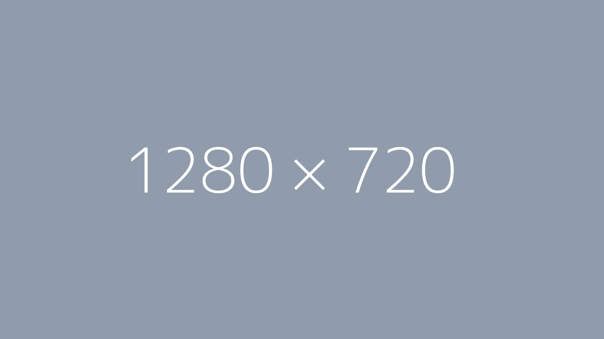

# Title

## Use tabs for a task that has more than 1 step with a picture.
(Optional) task explanation.

=== "Step1"
    (Optional) step explanation.
    
    

=== "StepX"
    (Optional) step explanation.
    
    

## No need for tabs for a task with only 1 step with a picture.

(Optional) task explanation.


## A shell command shows the syntax + output in tabs.
(Optional) task explanation.

=== "guru@hp:~$_"
    (Optional) step explanation.

    ``` title='' hl_lines="0"
    sudo <execute some command>
    ```

=== "output"
    (Optional) step explanation.

    ``` title='' hl_lines="0"
    guru@hp:~$ sudo <execute some command>
    [sudo] password for guru:     
    ...
    ...
    ```

## Een Windows Powershell commando
(Optional) task explanation.

=== ""PS C:\Users\guru06\Downloads>_"
    (Optional) step explanation.

    ``` title='' hl_lines="0"
    <execute some command>
    ```

=== "output"
    (Optional) step explanation.

    ``` title='' hl_lines="0"
    "PS C:\Users\guru06\Downloads>_ <execute some command>
    ...
    ...
    ```

## Changing contents of a file shows the command and the contents of that file in tabs.
(Optional) task explanation.

=== "guru@hp:~$_"
    (Optional) step explanation.

    ``` title=''
    sudo <edit some file>
    ```

=== "/path/to/that/file"
    (Optional) step explanation.

    ``` title='' hl_lines="0"
    ...
    ...
    ...
    ...
    ```

