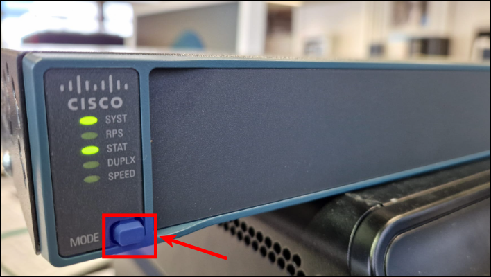

# Toegang krijgen tot een Cisco-apparaat in ROMMON-modus.

De ROMMON-modus (ROM Monitor) is essentieel omdat het fungeert als een noodhulpprogramma voor Cisco-apparaten. Je hebt het nodig wanneer je een wachtwoord bent vergeten of het apparaat niet normaal kan opstarten, bijvoorbeeld door een corrupt of ontbrekend IOS-besturingssysteem of een verkeerde boot-configuratie. Vanuit deze low-level modus kun je cruciale herstelacties uitvoeren, zoals een nieuw IOS-image inladen, boot-parameters aanpassen, of een vergeten beheerderswachtwoord resetten, om zo het netwerkapparaat weer volledig operationeel te krijgen.

## Vereisten
- een [PC met Linux Mint 22](../../tutorials/setup-windows11-linuxmint22-dual-boot-uefi/index.md ){:target="_blank"}
- [minicom](../setup-minicom-linuxmint22/index.md){:target="_blank"} terminal emulation software
- een console cable
- een Cisco 2960 24TT-L of 24TC-L Plus switch
- een Cisco 1941 router

## Demo
<iframe width="854" height="480" src="https://www.youtube.com/embed/xiRsG7-qaQY?autoplay=0&loop=0&mute=0" title="YouTube video player" frameborder="0" allow="accelerometer; autoplay; clipboard-write; encrypted-media; gyroscope; picture-in-picture; web-share" referrerpolicy="strict-origin-when-cross-origin" allowfullscreen></iframe>

## Cisco 2960 switch
### Setup


### Vanuit IOS

=== "Stap1"
    Standaard start de switch automatisch het geconfigureerde opstartimage op, zonder te wachten op invoer van de gebruiker.

    ``` title='' hl_lines="2 6"
    Switch#show boot
    BOOT path-list      : flash:c2960-lanbasek9-mz.150-2.SE11.bin
    Config file         : flash:/config.text
    Private Config file : flash:/private-config.text
    Enable Break        : yes
    Manual Boot         : no
    ...
    ```

=== "Stap2"
    Sla het normale opstartproces over en ga direct bij het opnieuw opstarten naar de ROMMON-modus.

    ``` title='' hl_lines="3 11"
    Switch#configure terminal
    Enter configuration commands, one per line.  End with CNTL/Z.
    Switch(config)#boot manual 
    Switch(config)#end
    
    Switch#show boot
    BOOT path-list      : flash:c2960-lanbasek9-mz.150-2.SE11.bin
    Config file         : flash:/config.text
    Private Config file : flash:/private-config.text
    Enable Break        : yes
    Manual Boot         : yes
    ...

    Switch#reload

    System configuration has been modified. Save? [yes/no]: no      <----- indien gevraagd
    Proceed with reload? [confirm]                                  <----- druk <Enter>

    *Mar  1 16:21:22.615: %SYS-5-RELOAD: Reload requested by console. Reload Reason: Reload command.
    ...
    ```

=== "Stap3"
    We zijn in de ROMMON-modus. Dat zie je ook aan de prompt `switch:`.

    ``` title='' hl_lines="22"
    Boot Sector Filesystem (bs) installed, fsid: 2
    Base ethernet MAC Address: bc:f1:f2:59:06:00
    Xmodem file system is available.
    The password-recovery mechanism is disabled.
    Initializing Flash...
    flashfs[0]: 6 files, 3 directories
    flashfs[0]: 0 orphaned files, 0 orphaned directories
    flashfs[0]: Total bytes: 65544192
    flashfs[0]: Bytes used: 16074240
    flashfs[0]: Bytes available: 49469952
    flashfs[0]: flashfs fsck took 18 seconds.
    ...done Initializing Flash.
    done.

    The system is not configured to boot automatically.  The
    following command will finish loading the operating system
    software:

        boot


    switch: 
    ```
=== "(Stap4)"
    Om het handmatig opstarten ongedaan te maken en terug te keren naar iOS, heb je twee opties:

    - verwijder eerst de variabele vanuit ROMMON en start op in IOS
    - start op in IOS en verwijder de opstartvariabele vanuit IOS

    ``` title='' hl_lines="1 13"
    # optie1
    switch: set
    !=-
    ...
    MANUAL_BOOT=yes
    ...
    switch: unset MANUAL_BOOT
    switch: boot
    Loading "flash:c2960-lanbasek9-mz.150-2.SE11.bin"...@@@@@@@@
    ...
    Switch#

    # optie2
    switch: boot
    Loading "flash:c2960-lanbasek9-mz.150-2.SE11.bin"...@@@@@@@@
    ...

    Switch#configure terminal
    Switch(config)#no boot manual
    Switch(config)#end
    Switch#
    ```


### Ontbrekende of corrupte iOS

=== "Stap1"
    Laten we een niet-werkend IOS simuleren door "per ongeluk" het flash-bestandssysteem te wissen. Herstart daarna de switch.

    ``` title='' hl_lines="1 14"
    Switch#erase flash:
    Erasing the flash filesystem will remove all files! Continue? [confirm]
    flashfs[2]: 0 files, 1 directories
    flashfs[2]: 0 orphaned files, 0 orphaned directories
    flashfs[2]: Total bytes: 65544192
    flashfs[2]: Bytes used: 1024
    flashfs[2]: Bytes available: 65543168
    flashfs[2]: flashfs fsck took 25 seconds.
    Erase of flash: complete
    
    Switch#dir flash:
    Directory of flash:/

    No files in directory

    65544192 bytes total (65543168 bytes free)

    Switch#reload

    System configuration has been modified. Save? [yes/no]: no          <----- indien gevraagd
    Proceed with reload? [confirm]                                      <----- druk <Enter>

    *Mar  1 00:28:22.946: %SYS-5-RELOAD: Reload requested by console. Reload Reason: Reload command.
    ...
    ```

=== "Stap2"
    De BOOT-omgevingsvariabele is nog steeds ingesteld om `c2960-lanbasek9-mz.150-2.SE11.bin` op te starten, maar deze is niet aanwezig. De switch kan niet opstarten en schakelt automatisch over naar de ROMMON-modus.

    ``` title='' hl_lines="24 34"
    Welcome to minicom 2.8

    OPTIONS: I18n 
    Port /dev/ttyUSB0, 09:36:24

    Press CTRL-A Z for help on special keys


    Boot Sector Filesystem (bs) installed, fsid: 2
    Base ethernet MAC Address: bc:f1:f2:59:06:00
    Xmodem file system is available.
    The password-recovery mechanism is enabled.                     ---> or "disabled"
    Initializing Flash...
    flashfs[0]: 3 files, 1 directories
    flashfs[0]: 0 orphaned files, 0 orphaned directories
    flashfs[0]: Total bytes: 65544192
    flashfs[0]: Bytes used: 12800
    flashfs[0]: Bytes available: 65531392
    flashfs[0]: flashfs fsck took 18 seconds.
    ...done Initializing Flash.
    done.
    Loading "flash:c2960-lanbasek9-mz.150-2.SE11.bin"...flash:c2960-lanbasek9-mz.150-2.SE11.bin: no such file or directory

    Error loading "flash:c2960-lanbasek9-mz.150-2.SE11.bin"

    Interrupt within 5 seconds to abort boot process.
    Boot process failed...

    The system is unable to boot automatically.  The BOOT
    environment variable needs to be set to a bootable
    image.


    switch: 

    ```

=== "(Stap3)"
    Om opnieuw te kunnen opstarten, moet je [IOS opnieuw installeren](../setup-ios-cisco2960/index.md){:target="_blank"}

### Break sequence

=== "Stap1"
    - Als je toegang hebt tot een werkend IOS, controleer dan of het `break sequence` mechanisme is ingeschakeld. Zo niet, schakel het dan in.
    - Als je geen toegang hebt tot een werkend IOS, kun je alleen "proberen" of of het `break sequence` mechanisme werkt. Zo niet, dan moet je de [cold start-methode](../toegang-cisco-rommon/index.md#cold-start) gebruiken.
    
    ``` title='' hl_lines="1 6 9"
    Switch#show boot | include Break
    Enable Break        : no
    
    Switch#configure terminal 
    Enter configuration commands, one per line.  End with CNTL/Z.
    Switch(config)#boot enable-break 
    Switch(config)#end

    Switch#show boot | include Break
    Enable Break        : yes
    ```


=== "Stap2"
    Schakel de switch uit en weer in of herlaad hem vanuit een draaiend IOS. Direct nadat de switch is opgestart (binnen de eerste X seconden), verstuur je de [break-sequence](../../explanations/break-sequence-mechanism/index.md){:target="_blank"} vanuit je terminalemulator. Voor Minicom druk je op ++ctrl++ + ++a++ en vervolgens op ++f++. De switch zou moeten reageren door het opstartproces te stoppen en de ROMMON-modus te activeren, zoals aangegeven door de prompt `switch:`

    ``` title='' hl_lines="1 8"
    Switch#reload
    Proceed with reload? [confirm]

    *Mar  1 00:13:45.539: %SYS-5-RELOAD: Reload requested by console. Reload Reason: Reload command.
    Boot Sector Filesystem (bs) installed, fsid: 2
    Base ethernet MAC Address: b0:c5:3c:26:a0:80
    Xmodem file system is available.
    ################# Ik heb het break-signaal hier gestuurd #################
    The password-recovery mechanism is enabled.
    Initializing Flash...
    flashfs[0]: filesystem check interrupted!
    ...done Initializing Flash.

    The system has been interrupted, or encountered an error
    during initialization of the flash filesystem.  The following
    commands will initialize the flash filesystem, and finish
    loading the operating system software:

        flash_init
        boot


    switch: 
    ```

=== "Stap3"
    Flash is niet geïnitialiseerd. Je moet dat handmatig doen.

    ``` title='' hl_lines="1"
    switch: flash_init
    Initializing Flash...
    flashfs[0]: 2 files, 1 directories
    flashfs[0]: 0 orphaned files, 0 orphaned directories
    flashfs[0]: Total bytes: 65544192
    flashfs[0]: Bytes used: 11835904
    flashfs[0]: Bytes available: 53708288
    flashfs[0]: flashfs fsck took 19 seconds.
    ...done Initializing Flash.

    switch: 
    ```

=== "(Stap4)"
    Om terug te keren naar IOS, start je de switch gewoon op.

    ``` title='' hl_lines="1"
    switch: boot
    Loading "flash:c2960-lanbasek9-mz.150-2.SE11.bin"...@@@@@@@
    ...
    Switch#
    ```

### Cold start

=== "Stap1"
    Koppel eerst de stroomkabel los van de switch. Minicom geeft nog geen output.

    ``` title='' hl_lines="0"
    Welcome to minicom 2.8

    OPTIONS: I18n 
    Port /dev/ttyUSB0, 13:50:27

    Press CTRL-A Z for help on special keys

    <blinking_cursor>
    ```

=== "Stap2"
    Sluit nu de stroomkabel weer aan. De switch start op en tijdens de POST knippert de SYST-led groen.
    Dit duurt ongeveer X seconden. Na de POST verandert het knipperende ledpatroon. Druk éénmaal op de `Mode-knop`.

    

=== "Stap3a"
    Als het [mechanisme voor wachtwoordherstel](../fabrieksinstellingen-herstellen-cisco2960/index.md#wachtwoordherstelmechanisme-inschakelen){:target="_blank"} is *ingeschakeld*, wordt Flash niet automatisch geïnitialiseerd; dat moet je handmatig doen. Je kan er op dit moment voor kiezen, om het [mechanisme voor wachtwoordherstel](../fabrieksinstellingen-herstellen-cisco2960/index.md#wachtwoordherstelmechanisme-inschakelen){:target="_blank"} *uit te schakelen*.

    ``` title='' hl_lines="12 14 28"
    Welcome to minicom 2.8

    OPTIONS: I18n 
    Port /dev/ttyUSB0, 09:44:08

    Press CTRL-A Z for help on special keys


    Boot Sector Filesystem (bs) installed, fsid: 2
    Base ethernet MAC Address: bc:f1:f2:59:06:00
    Xmodem file system is available.
    The password-recovery mechanism is enabled.
    Initializing Flash...
    flashfs[0]: filesystem check interrupted!
    ...done Initializing Flash.

    The system has been interrupted, or encountered an error
    during initialization of the flash filesystem.  The following
    commands will initialize the flash filesystem, and finish
    loading the operating system software:

        flash_init
        boot


    switch: 

    switch: flash_init
    Initializing Flash...
    flashfs[0]: 6 files, 3 directories
    flashfs[0]: 0 orphaned files, 0 orphaned directories
    flashfs[0]: Total bytes: 65544192
    flashfs[0]: Bytes used: 16081408
    flashfs[0]: Bytes available: 49462784
    flashfs[0]: flashfs fsck took 19 seconds.
    ...done Initializing Flash.

    switch: 
    ```

=== "Stap3b"
    Als het [mechanisme voor wachtwoordherstel](../fabrieksinstellingen-herstellen-cisco2960/index.md#wachtwoordherstelmechanisme-inschakelen){:target="_blank"} is *uitgeschakeld*, verlies je alles uit de startup configuratie! (switch naam, IP adres VLAN, wachtwoorden, ...) Flash wordt voor jou geïnitialiseerd. Kies "y" bij de prompt. Je kan er op dit moment voor kiezen, om het [mechanisme voor wachtwoordherstel](../fabrieksinstellingen-herstellen-cisco2960/index.md#wachtwoordherstelmechanisme-inschakelen){:target="_blank"} *in te schakelen*.

    ``` title='' hl_lines="12 31"
    Welcome to minicom 2.8

    OPTIONS: I18n 
    Port /dev/ttyUSB0, 09:44:08

    Press CTRL-A Z for help on special keys


    Boot Sector Filesystem (bs) installed, fsid: 2
    Base ethernet MAC Address: bc:f1:f2:59:06:00
    Xmodem file system is available.
    The password-recovery mechanism is disabled.
    Initializing Flash...
    flashfs[0]: 6 files, 3 directories
    flashfs[0]: 0 orphaned files, 0 orphaned directories
    flashfs[0]: Total bytes: 65544192
    flashfs[0]: Bytes used: 16131584
    flashfs[0]: Bytes available: 49412608
    flashfs[0]: flashfs fsck took 19 seconds.
    ...done Initializing Flash.
    done.


    The password-recovery mechanism has been triggered, but
    is currently disabled.  Access to the boot loader prompt
    through the password-recovery mechanism is disallowed at
    this point.  However, if you agree to let the system be
    reset back to the default system configuration, access
    to the boot loader prompt can still be allowed.

    Would you like to reset the system back to the default configuration (y/n)?y            ---> answer "y"

    The system has been interrupted, and the config file
    has been deleted.  The following command will finish
    loading the operating system software:

    boot


    switch: 
    ```

=== "(Stap4)"
    Om terug te keren naar IOS, start je de switch gewoon op.

    ``` title='' hl_lines="1"
    switch: boot
    Loading "flash:c2960-lanbasek9-mz.150-2.SE11.bin"...@@@@@@@
    ...
    Switch#
    ```


## Cisco 1941 router
### Setup


### Vanuit IOS

=== "Stap1"
    De opdracht `show boot` is niet beschikbaar op een Cisco 1941-router, zoals wel het geval is voor een Cisco 2960-switch. Je kan de opstartsysteemopdrachten nog steeds weergeven in de actieve configuratie, indien aanwezig.

    ``` title='' hl_lines="1 6"
    # als er geen boot statement aanwezig is, zal er op flash naar een IOS gezocht worden
    Router#show running-config | include boot
    boot-start-marker
    boot-end-marker

    # als er wél een boot-instructie aanwezig is, zal dat IOS worden opgestart
    Router#configure terminal
    Enter configuration commands, one per line.  End with CNTL/Z.
    Router(config)#boot system flash:c1900-universalk9-mz.SPA.157-3.M8.bin
    Router(config)#end

    Router#show running-config | include boot
    boot-start-marker
    boot system flash:c1900-universalk9-mz.SPA.157-3.M8.bin
    boot-end-marker
    Router#
    ```

=== "Stap2"
    Er is ook geen `boot manual`-opdracht; je moet het configuratie-register in IOS wijzigen om in ROMMON op te starten.

    ``` title='' hl_lines="1 6 10"
    Router#show version | include Configuration register
    Configuration register is 0x2102

    Router#configure terminal 
    Enter configuration commands, one per line.  End with CNTL/Z.
    Router(config)#config-register 0x0
    Router(config)#end
    
    Router#show version | include Configuration register
    Configuration register is 0x2102 (will be 0x0 at next reload)

    Router#reload

    System configuration has been modified. Save? [yes/no]: no          <--- Ik zal de opdracht "boot system" voorlopig niet opslaan
    Proceed with reload? [confirm]                                      <--- druk <Enter>
    ```

=== "Stap3"
    We zijn in de ROMMON-modus. Dat zie je ook aan de prompt `rommon 1 >`

    ``` title='' hl_lines="11"
    System Bootstrap, Version 15.0(1r)M16, RELEASE SOFTWARE (fc1)
    Technical Support: http://www.cisco.com/techsupport
    Copyright (c) 2012 by cisco Systems, Inc.

    Total memory size = 512 MB - On-board = 512 MB, DIMM0 = 0 MB
    CISCO1941/K9 platform with 524288 Kbytes of main memory
    Main memory is configured to 64/-1(On-board/DIMM0) bit mode with ECC disabled


    Readonly ROMMON initialized
    rommon 1 > 
    ```

=== "(Stap4)"
    Om terug te keren naar IOS heb je twee opties. Of:

    - zet eerst het configuratieregister terug naar de beginwaarde vanuit ROMMON en start vervolgens op in IOS (snelst).
    - start op in IOS, zet het configuratieregister terug naar de beginwaarde vanuit IOS en laad het opnieuw (langzaamst).

    ``` title='' hl_lines="1 10"
    # optie1
    rommon 1 > confreg 0x2102

    You must reset or power cycle for new config to take effect

    rommon 2 > reset
    ...
    Router#

    # optie2
    rommon 1 > boot
    program load complete, entry point: 0x80803000, size: 0x1b340
    program load complete, entry point: 0x80803000, size: 0x1b340
    ...

    Router#show version | include Configuration register
    Configuration register is 0x0

    Router#configure terminal
    Enter configuration commands, one per line.  End with CNTL/Z.
    Router(config)#config-register 0x2102
    Router(config)#end
    
    Router#show ver | include Configuration register
    Configuration register is 0x0 (will be 0x2102 at next reload)
    
    Router#reload
    ...
    ```


### Ontbrekend of corrupt IOS

=== "Stap1"
    Laten we een niet-werkend IOS simuleren door "per ongeluk" het "flash"-bestandssysteem te wissen. Je kunt de opdracht `erase (/all) flash:` niet gebruiken zoals bij een Cisco 2960-switch. Je moet hem "formatteren". Start de router daarna opnieuw op.

    ``` title='' hl_lines="1 15 22"
    Router#format flash:
    Format operation may take a while. Continue? [confirm]
    Format operation will destroy all data in "flash:".  Continue? [confirm]
    Writing Monlib sectors.....
    Monlib write complete 

    Format: All system sectors written. OK...

    Format: Total sectors in formatted partition: 501728
    Format: Total bytes in formatted partition: 256884736
    Format: Operation completed successfully.

    Format of flash0: complete

    Router#dir flash:
    Directory of flash0:/

    No files in directory

    256475136 bytes total (256475136 bytes free)

    Router#reload
    ...
    ```

=== "Stap2"
    De router kan niet opstarten en gaat automatisch in de ROMMON-modus. 

    ``` title='' hl_lines="12 15"
    System Bootstrap, Version 15.0(1r)M16, RELEASE SOFTWARE (fc1)
    Technical Support: http://www.cisco.com/techsupport
    Copyright (c) 2012 by cisco Systems, Inc.

    Total memory size = 512 MB - On-board = 512 MB, DIMM0 = 0 MB
    CISCO1941/K9 platform with 524288 Kbytes of main memory
    Main memory is configured to 64/-1(On-board/DIMM0) bit mode with ECC disabled


    Readonly ROMMON initialized
    program load complete, entry point: 0x80803000, size: 0x1b340
    boot: cannot determine first executable file name ondevice "flash0:"
    ...
    ...
    rommon 1 >
    ```

=== "(Stap3)"
    Je kan enkel terug naar een werkende IOS door deze [opnieuw te installeren](../todo/index.md).


### Break sequence

=== "Stap1"
    Voor zover ik weet, is er geen mechanisme voor de break-sequence op een Cisco 1941-router zoals op een Cisco 2960-switch. Er bestaat niet zoiets als `boot enable-break` om het break-sequence gedrag in of uit te schakelen. Je kunt de router gewoon uitzetten of "opnieuw laden" vanuit een draaiend IOS.

    ``` title='' hl_lines="0"
    Router#reload
    Proceed with reload? [confirm]

    *Mar 16 14:04:39.603: %SYS-5-RELOAD: Reload requested by console. Reload Reason: Reload Command.
    ```

=== "Stap2"
    Direct nadat de router is opgestart (binnen de eerste X seconden), verstuur je de [break sequence](../../explanations/break-sequence-mechanism/index.md){:target="_blank"} vanuit je terminalemulator. Voor Minicom druk je op ++ctrl++ + ++a++ en vervolgens op ++f++ De router zou moeten reageren door het opstarten te stoppen en de ROMMON-modus te activeren, wat wordt aangegeven door de `rommon 1>`-prompt.

    ``` title='' hl_lines="5"
    System Bootstrap, Version 15.0(1r)M16, RELEASE SOFTWARE (fc1)
    Technical Support: http://www.cisco.com/techsupport
    Copyright (c) 2012 by cisco Systems, Inc.

    ### ik stuurde de break-sequence hier ergens ###

    Total memory size = 512 MB - On-board = 512 MB, DIMM0 = 0 MB
    CISCO1941/K9 platform with 524288 Kbytes of main memory
    Main memory is configured to 64/-1(On-board/DIMM0) bit mode with ECC disabled


    Readonly ROMMON initialized
    program load complete, entry point: 0x80803000, size: 0x1b340
    program load complete, entry point: 0x80803000, size: 0x1b340


    monitor: command "boot" aborted due to user interrupt
    rommon 1 > 

    ```

=== "(Stap3)"
    Om terug te keren naar IOS, start je IOS via `boot`.

    ``` title='' hl_lines="1"
    rommon 1 > boot
    program load complete, entry point: 0x80803000, size: 0x1b340
    program load complete, entry point: 0x80803000, size: 0x1b340


    IOS Image Load Test 
    ___________________ 
    Digitally Signed Release Software 
    program load complete, entry point: 0x81000000, size: 0x511cb54
    ...

    ```


### Cold start
Er is geen "MODE-knop" zoals bij een Cisco 2960-switch waarmee de opstartvolgorde kan worden onderbroken.