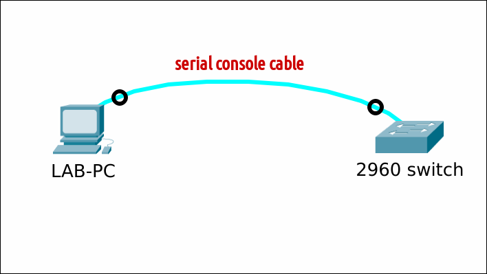

# Use minicom on Linux Mint 21

## Prereqs
- a PC ([BIOS](../../tutorials/windows11-linuxmint21-dual-boot-bios-clonezilla/)/[UEFI](../../tutorials/windows11-linuxmint21-dual-boot-uefi/)) running Linux Mint 21
- internet connection
- a serial cable / console cable
- a Cisco device (switch, router)

## Console access


## Install minicom
Refresh the cache and install the package.
=== "guru@hp:~$_"

    ``` title='' hl_lines="0"
    sudo apt update; sudo apt install minicom -y
    ```

=== "output"

    ``` title='' hl_lines="0"
    guru@hp:~$ sudo apt update; sudo apt install minicom -y
    [sudo] password for guru:     
    Hit:1 http://security.ubuntu.com/ubuntu jammy-security InRelease
    Hit:2 http://archive.ubuntu.com/ubuntu jammy InRelease
    Ign:3 https://mintlinux.mirror.wearetriple.com/packages vera InRelease                  
    Hit:4 http://archive.ubuntu.com/ubuntu jammy-updates InRelease                          
    Hit:5 https://mintlinux.mirror.wearetriple.com/packages vera Release
    Hit:6 http://archive.ubuntu.com/ubuntu jammy-backports InRelease
    Reading package lists... Done
    Building dependency tree... Done
    Reading state information... Done
    1 package can be upgraded. Run 'apt list --upgradable' to see it.
    Reading package lists... Done
    Building dependency tree... Done
    Reading state information... Done
    The following packages were automatically installed and are no longer required:
    linux-headers-5.15.0-69 linux-headers-5.15.0-69-generic linux-image-5.15.0-69-generic linux-modules-5.15.0-69-generic linux-modules-extra-5.15.0-69-generic
    Use 'sudo apt autoremove' to remove them.
    The following additional packages will be installed:
    lrzsz
    The following NEW packages will be installed:
    lrzsz minicom
    0 upgraded, 2 newly installed, 0 to remove and 1 not upgraded.
    Need to get 328 kB of archives.
    After this operation, 1.603 kB of additional disk space will be used.
    Get:1 http://archive.ubuntu.com/ubuntu jammy/universe amd64 lrzsz amd64 0.12.21-10 [74,8 kB]
    Get:2 http://archive.ubuntu.com/ubuntu jammy/universe amd64 minicom amd64 2.8-2 [253 kB]
    Fetched 328 kB in 0s (1.146 kB/s)
    Selecting previously unselected package lrzsz.
    (Reading database ... 645621 files and directories currently installed.)
    Preparing to unpack .../lrzsz_0.12.21-10_amd64.deb ...
    Unpacking lrzsz (0.12.21-10) ...
    Selecting previously unselected package minicom.
    Preparing to unpack .../minicom_2.8-2_amd64.deb ...
    Unpacking minicom (2.8-2) ...
    Setting up minicom (2.8-2) ...
    Setting up lrzsz (0.12.21-10) ...
    Processing triggers for desktop-file-utils (0.26+mint2+vera) ...
    Processing triggers for gnome-menus (3.36.0-1ubuntu3) ...
    Processing triggers for man-db (2.10.2-1) ...
    Processing triggers for mailcap (3.70+nmu1ubuntu1) ...
    guru@hp:~$ 
    ```

## Identify serial port
Connect your device to the Linux Mint PC using a serial cable. In the terminal, run the following command to list the available serial ports. Note down the name of the serial port (e.g. "/dev/ttyUSB0") corresponding to your device.

=== "guru@hp:~$_"

    ``` title='' hl_lines="0"
    dmesg | grep tty
    ```

=== "output"

    ``` title='' hl_lines="3"
    guru@hp:~$ dmesg | grep tty
    [    0.206150] printk: console [tty0] enabled
    [18977.539042] usb 1-4: pl2303 converter now attached to ttyUSB0
    guru@hp:~$ 
    ```

## Configure minicom
In the terminal, run the following command to start the Minicom configuration:

=== "guru@hp:~$_"

    ``` title='' hl_lines="0"
    sudo minicom -s
    ```

=== "output"
    In the Minicom configuration menu, use the arrow keys to navigate and configure the settings as follows:

    - Select "Serial port setup"
    - Set the serial device to the one you noted down earlier (e.g. "/dev/ttyUSB0")
    - Set the baud rate according to your device's specifications (e.g. "9600")
    - Leave other settings at their default values, unless you have specific requirements
    - Press "Save setup as dfl" to save the configuration.
    - Press "Exit from Minicom". 

    These settings will be saved in file /etc/minicom/minirc.dfl for all future runs.

## Use minicom
Instead of doing the setup first, you can give the correct parameters on the commandline instead. Minicom will open and display the terminal window.


=== "guru@hp:~$_"

    ``` title='' hl_lines="0"
    sudo minicom -b 9600 -D /dev/ttyUSB0
    ```

=== "output"
    Press ++enter++ to access the switch/router prompt. To exit Minicom, press the keyboard shortcut ++ctrl++ ++a++ followed by the letter ++x++

    ``` title='' hl_lines="0"
    Welcome to minicom 2.8

    OPTIONS: I18n 
    Port /dev/ttyUSB0, 14:06:27

    Press CTRL-A Z for help on special keys


    <press ENTER>

    Switch>
    ```
