# Create a Windows 11 bootable USB flash drive

## Prereqs
- USB flash drive that can hold the Windows 11 installation files
- a PC ([BIOS](../../tutorials/windows11-linuxmint21-dual-boot-bios-clonezilla/)/[UEFI](../../tutorials/windows11-linuxmint21-dual-boot-uefi/)) running Windows 11 or Linux Mint 21
- internet connection

## Download ISO
=== "Step1"
    Use your favorite search engine to search for the Windows 11 iso and choose the official Microsoft website.
    **(VDAB users: download from your Google Drive!)**

    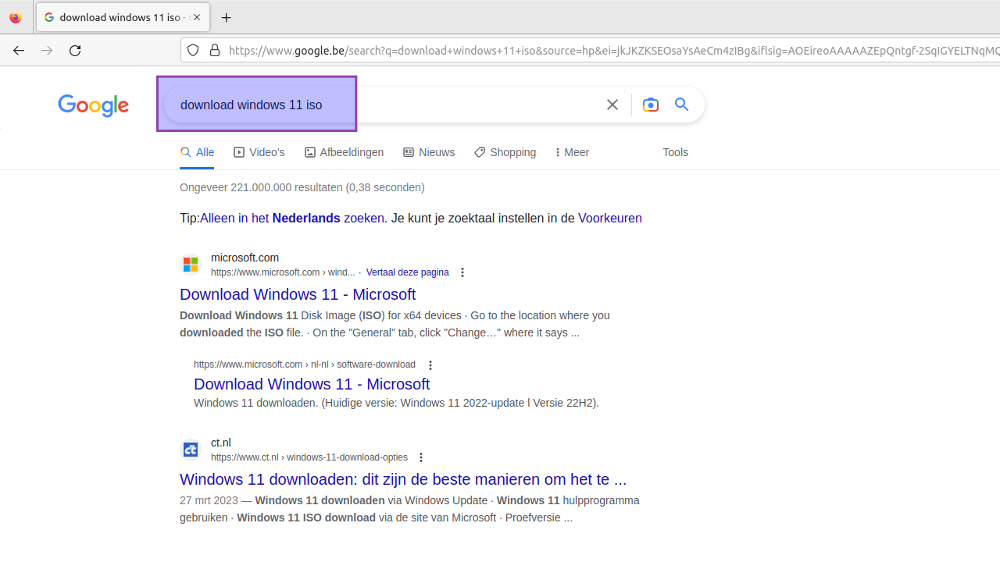

=== "Step2"
    Select "Windows 11 (multi-edition ISO for x64 devices)" from the drop down menu and click "Download".

    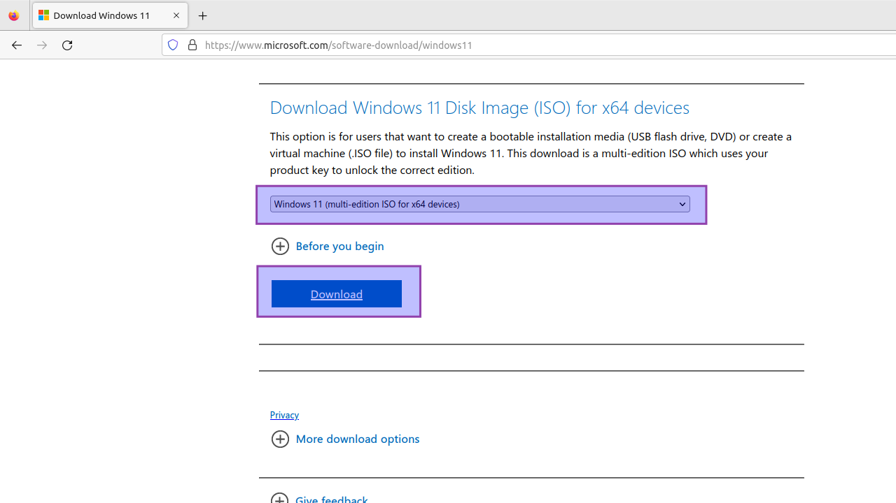

=== "Step3"
    Select "English (United States)" as the product language and click "Confirm".

    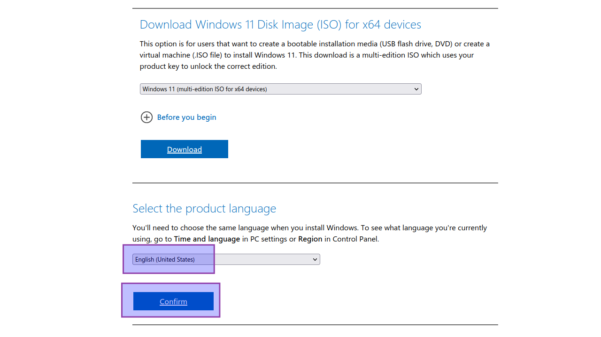

=== "Step4"
    Click "64-bit Download". The ISO file will be saved to your local disk.

    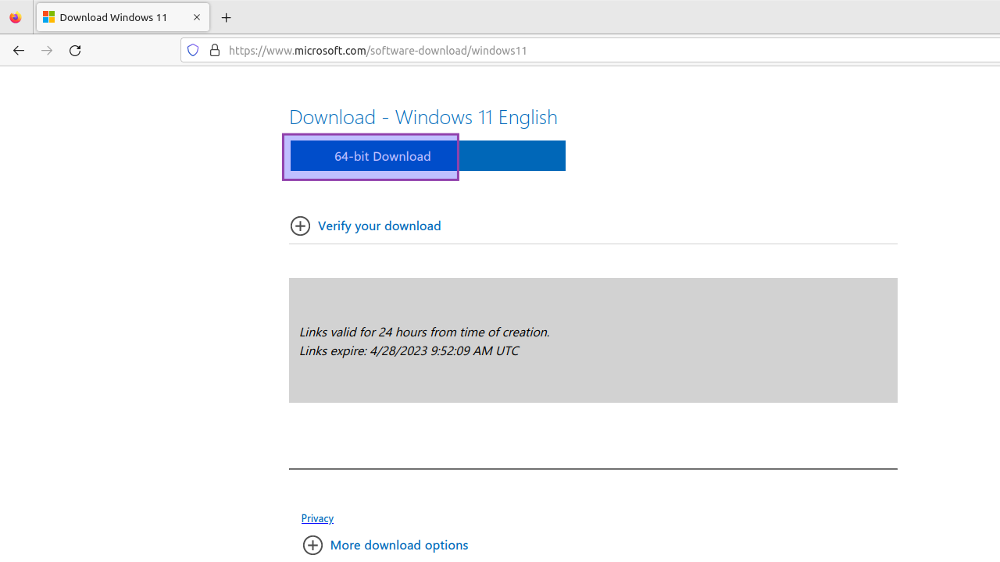

## On Windows 11
### With Rufus
#### Download and install Rufus
=== "Step1"
    Use your favorite search engine to search for Rufus and choose the official website.

    

=== "Step2"
    Click the current "standard" installer version. The file will be saved to your local disk.

    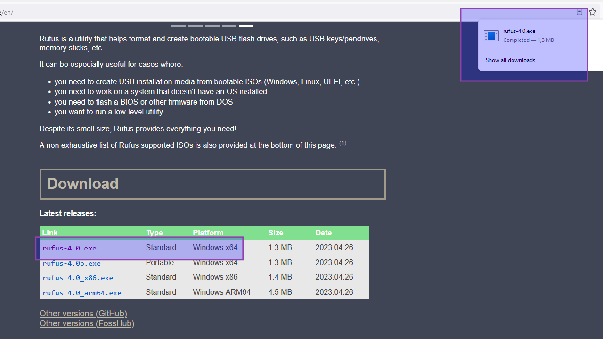

=== "Step3"
    Execute the installer and allow for changes.

    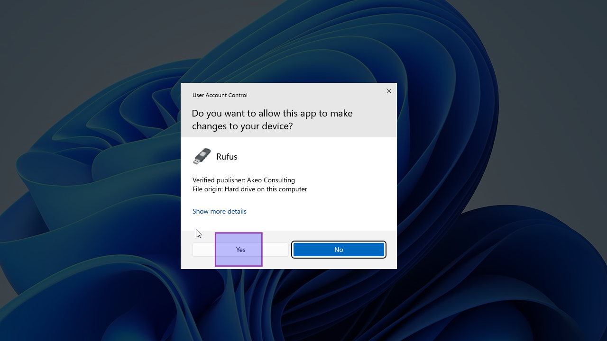

=== "Step4"
    Allow Rufus to check for updates.

    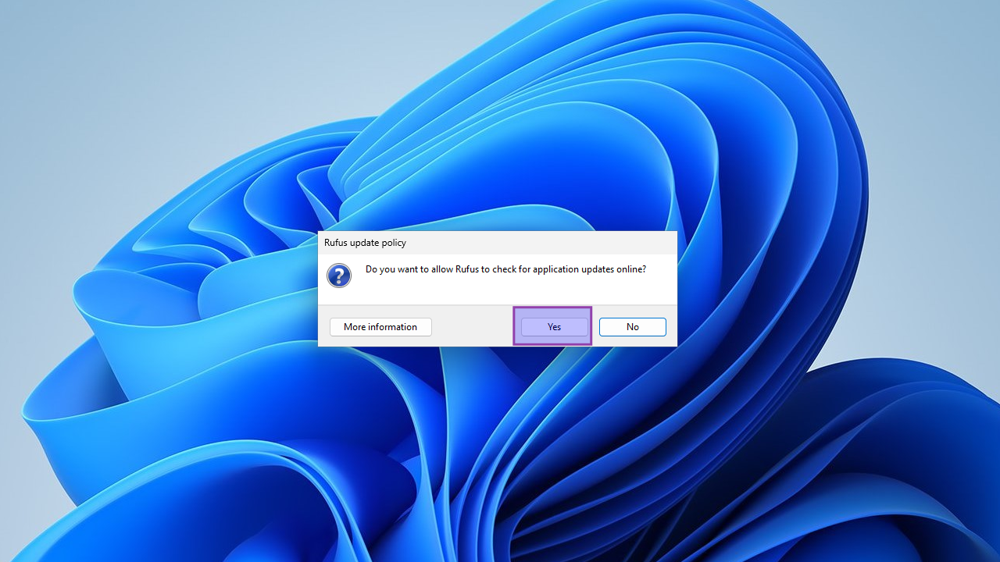

=== "Step5"
    Done. Installation finished.

    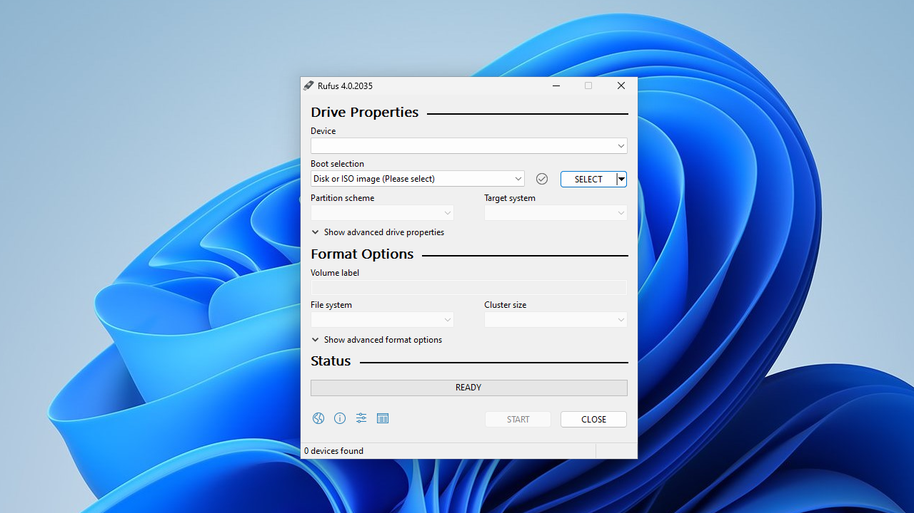

#### For BIOS (or UEFI-CSM)
=== "Step1"
    
    
    
    1. Insert the USB flash drive
    2. Navigate to and select the Windows 11 ISO file
    3. Choose "Windows standard installation" as image option
    4. Choose "MBR" as partition scheme
    5. Select "BIOS (or UEFI-CSM)" as target system
    6. Select "NTFS" as file system
    7. Click "Start"

=== "Step2"
    Clear all check marks. We want the Windows installation the same as the official Microsoft installation.

    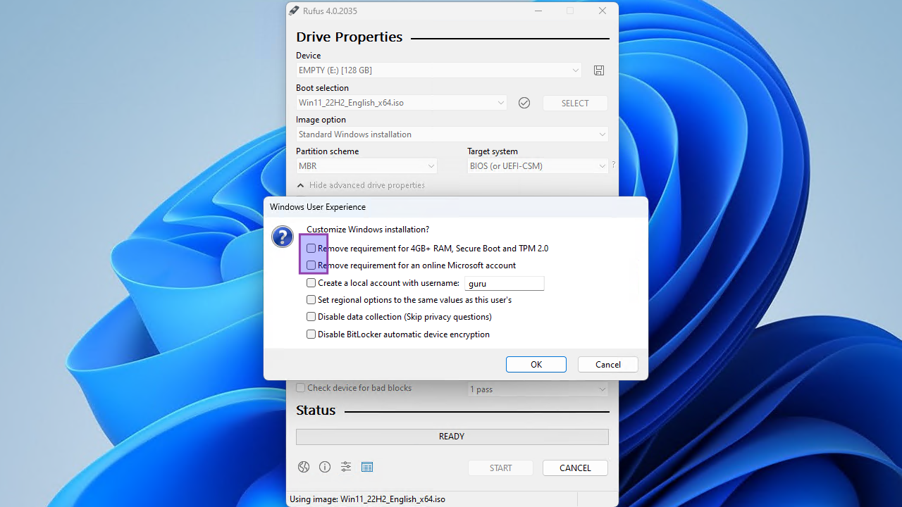

=== "Step3"
    Click "OK" to confirm the USB’s deletion and the bootable drive’s creation.

    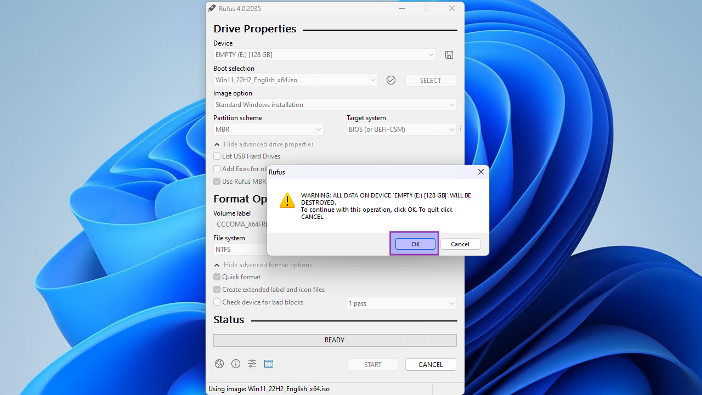

=== "Step4"
    Time to grab a coffee. Wait until the status is "Ready".

    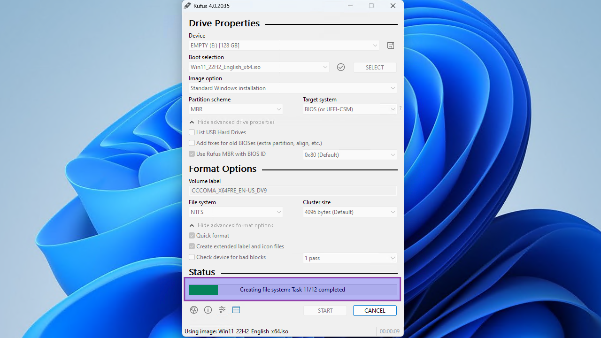

=== "Step5"
    Close Rufus and eject the USB media.

    

#### For UEFI (non-CSM)
=== "Step1"
    
    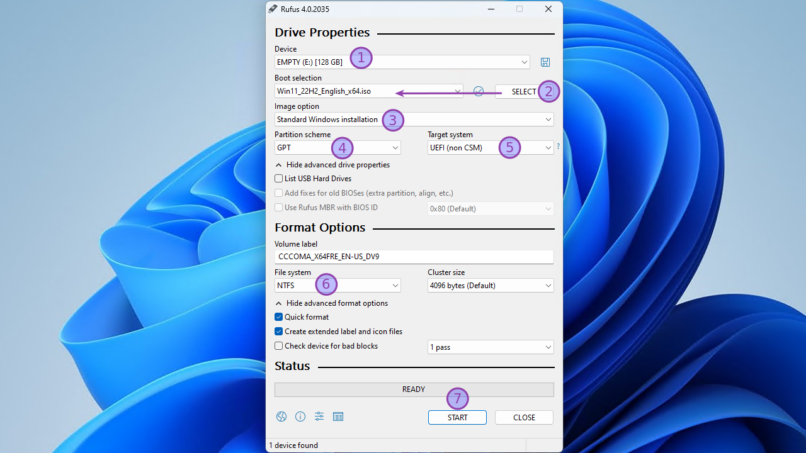
    
    1. Insert the USB flash drive
    2. Navigate to and select the Windows 11 ISO file
    3. Choose "Windows standard installation" as image option
    4. Choose "GPT" as partition scheme
    5. Select "UEFI (non-CSM)" as target system
    6. Select "NTFS" as file system
    7. Click "Start"

=== "Step2"
    Clear all check marks. We want the Windows installation the same as the official Microsoft installation.

    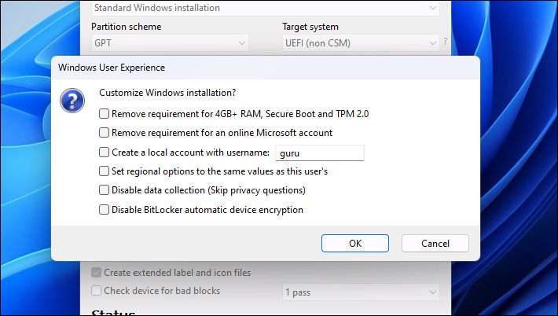

=== "Step3"
    Click "OK" to confirm the USB’s deletion and the bootable drive’s creation.

    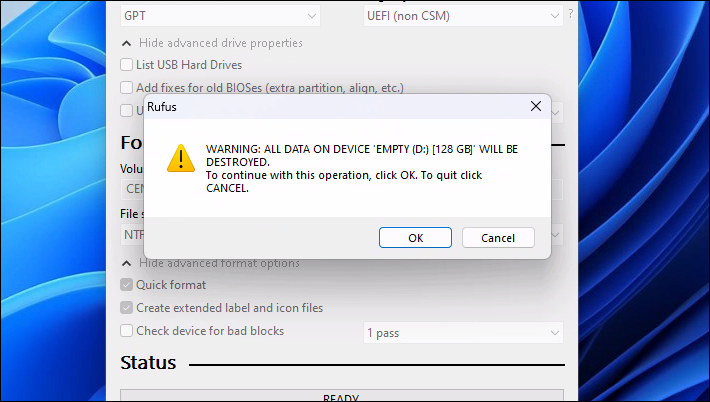

=== "Step4"
    Time to grab a coffee. Wait until the status is "Ready".

    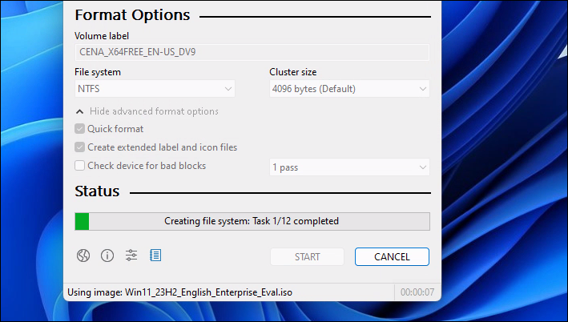

=== "Step5"
    Close Rufus and eject the USB media.

    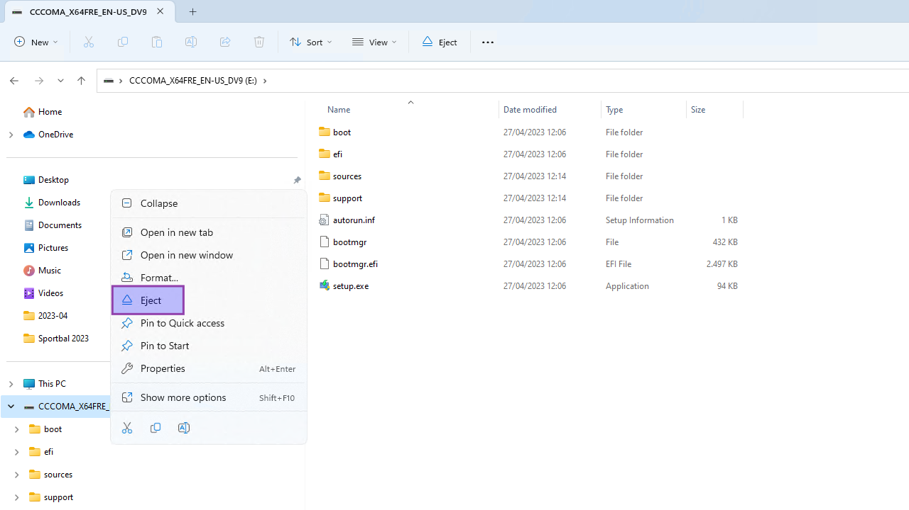

### With Etcher
Todo...
<!--- start comment
#### Download and install Etcher
tab1 screenshot
tab2 screenshot
tab3 screenshot
tab4 screenshot
#### For BIOS (or UEFI-CSM)
tab1 screenshot
tab2 screenshot
tab3 screenshot
tab4 screenshot
#### For UEFI (non-CSM)
tab1 screenshot
tab2 screenshot
tab3 screenshot
tab4 screenshot
-->

## On Linux Mint 21
Todo...
<!--- start comment
### With tool X
#### Download and install tool X
tab1 screenshot
tab2 screenshot
tab3 screenshot
tab4 screenshot
#### For BIOS (or UEFI-CSM)
tab1 screenshot
tab2 screenshot
tab3 screenshot
tab4 screenshot
#### For UEFI (non-CSM)
tab1 screenshot
tab2 screenshot
tab3 screenshot
tab4 screenshot
### With tool Y
#### Download and install tool Y
tab1 screenshot
tab2 screenshot
tab3 screenshot
tab4 screenshot
#### For BIOS (or UEFI-CSM)
tab1 screenshot
tab2 screenshot
tab3 screenshot
tab4 screenshot
#### For UEFI (non-CSM)
tab1 screenshot
tab2 screenshot
tab3 screenshot
tab4 screenshot
-->