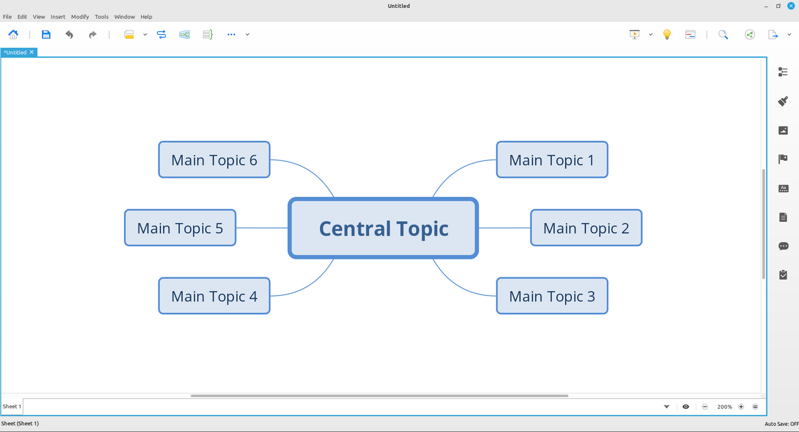

---
hide:
  - toc
---

# Welcome!

<!---
// inline CSS to not display section title

-->

<!--- BLOG TEMPLATE 

> *September 26, 2022 - in [Blogs](blogs/index.md) - 5 min read*

Cras elementum metus quis est luctus, vitae tincidunt orci consequat. Maecenas at ipsum ac dui venenatis convallis. Morbi lobortis, purus vitae lobortis vehicula, metus velit cursus nisi, a placerat mi nunc id enim.

[Continue reading](blogs/YYYY/blog.md)
 
 
--->

<!--- TUTORIAL TEMPLATE

> *September 26, 2022 - in [Tutorials](tutorials/index.md) - 20 min lesson*

Cras elementum metus quis est luctus, vitae tincidunt orci consequat. Maecenas at ipsum ac dui venenatis convallis. Morbi lobortis, purus vitae lobortis vehicula, metus velit cursus nisi, a placerat mi nunc id enim.

[Continue reading](tutorials/tutorial/index.md)
 
 
--->

<!--- HOWTO TEMPLATE

> *September 26, 2022 - in [Howtos](howtos/index.md) - 7 min guide*

Cras elementum metus quis est luctus, vitae tincidunt orci consequat. Maecenas at ipsum ac dui venenatis convallis. Morbi lobortis, purus vitae lobortis vehicula, metus velit cursus nisi, a placerat mi nunc id enim.

[Continue reading](howtos/howto_template/index.md)
 
 
--->

<!--- HOWTO XMIND-8 --->

> *September 26, 2022 - in [Howtos](howtos/index.md) - 7 min guide*

XMind is a mind mapping and brainstorming software. At the time of writing, the current downloadable version is XMind 2022 (12.0.2 evaluation version).
If you happen to have some old .xmind files lying around...

[Continue reading](howtos/install-xmind-linux-mint/index.md)
 
 
