---
hide:
  - toc
  - navigation
---

# Home { style="display: none;" }

Van *kernel* tot *kabel*; tutorials en howto's over Linux en Cisco computernetwerken. Gebruik de "Search" rechtsboven.

=== "1"

    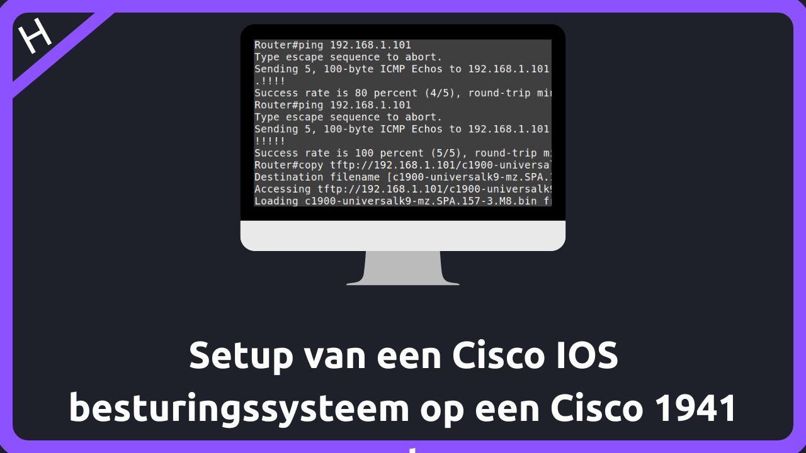{ align=left width="320" height="180" }
    > *17 September 2025 - in [Howtos](howtos/index.md) - 5 min instructie*

    Het (her)installeren van Cisco IOS op een Cisco 1941 router is het proces van het kopiëren van het besturingssysteemimage naar het flashgeheugen. Dit kan op twee manieren...

    [Lees verder](howtos/setup-ios-cisco1941/index.md){:target="_blank"}
     
     

    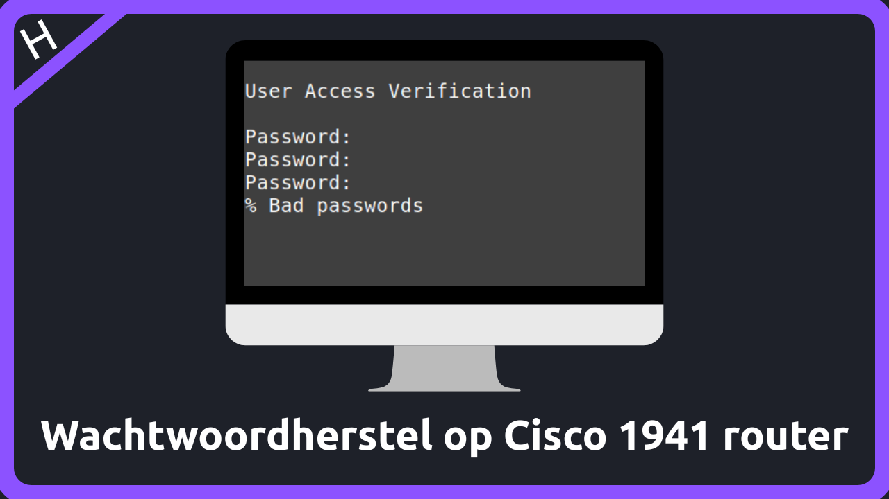{ align=left width="320" height="180" }
    > *15 September 2025 - in [Howtos](howtos/index.md) - 5 min instructie*

    Je doet een wachtwoordherstel op een Cisco 1941 router, wanneer het console-wachtwoord of het enable exec-mode wachtwoord (of beide) verloren of vergeten zijn...

    [Lees verder](howtos/wachtwoordherstel-cisco1941/index.md){:target="_blank"}
     
     

    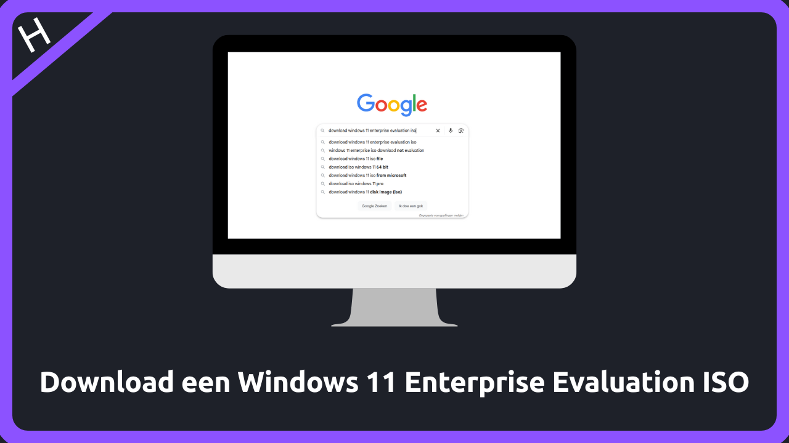{ align=left width="320" height="180" }
    > *09 September 2025 - in [Howtos](howtos/index.md) - 1 min instructie*

    Een Windows 11 Enterprise Evaluation ISO-bestand is een speciale installatieversie van Windows 11 Enterprise die Microsoft aanbiedt voor proef- en evaluatiedoeleinden (90 dagen)...

    [Lees verder](howtos/download-windows11-evaluation-iso/index.md){:target="_blank"}
     
     

    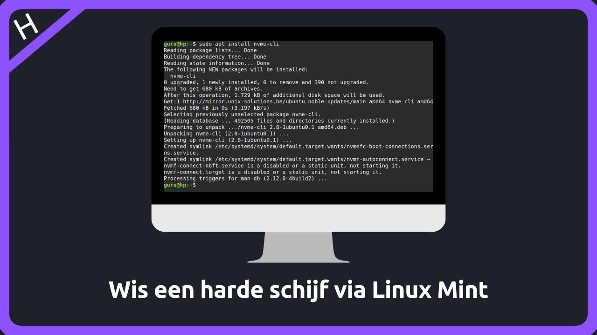{ align=left width="320" height="180" }
    > *03 September 2025 - in [Howtos](howtos/index.md) - 10 min instructie*

    Binnen Linux Mint kun je een Solid State Drive (SSD) grondig en veilig wissen via de ingebouwde terminal, zonder dat je daarvoor de computer opnieuw hoeft op te starten naar de BIOS of UEFI...

    [Lees verder](howtos/wis-harde-schijf-linuxmint/index.md){:target="_blank"}
     
     

    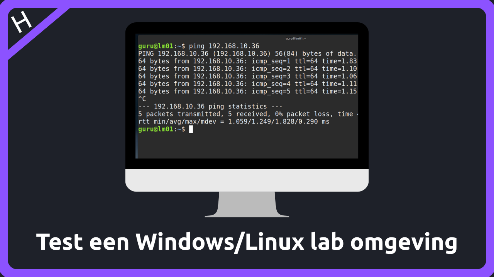{ align=left width="320" height="180" }
    > *31 Augustus 2025 - in [Howtos](howtos/index.md) - 4 min instructie*

    Deze howto is de afsluiting van je labopzet en laat zien hoe je de functionaliteit van je gemengde virtuele omgeving test. Je leert hoe...

    [Lees verder](howtos/test-lab-vm-virtualbox/index.md){:target="_blank"}
     
     

    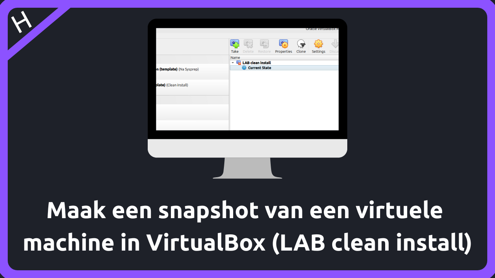{ align=left width="320" height="180" }
    > *31 Augustus 2025 - in [Howtos](howtos/index.md) - 4 min instructie*

    Het doel van een snapshot van een virtuele machine (VM) in VirtualBox is het vastleggen van de exacte toestand van de VM op een specifiek moment...

    [Lees verder](howtos/maak-snapshot-vm-virtualbox-labclean/index.md){:target="_blank"}
     
     

    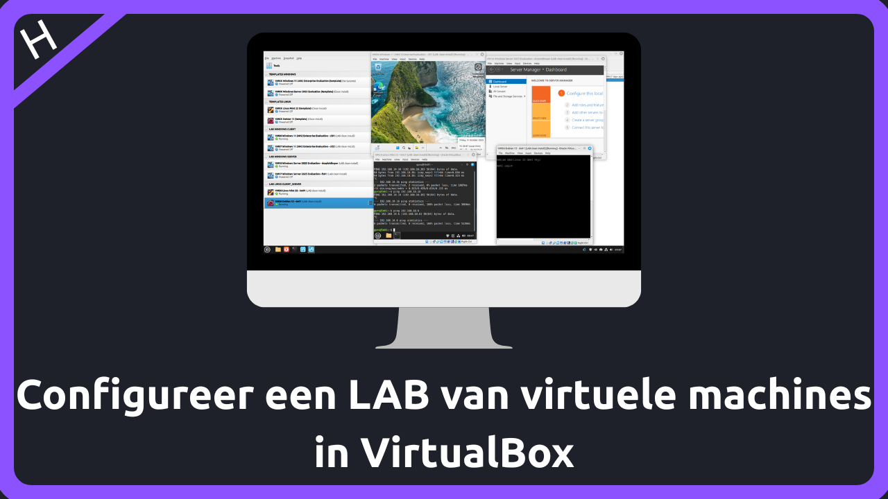{ align=left width="320" height="180" }
    > *31 Augustus 2025 - in [Howtos](howtos/index.md) - 4 min instructie*

    Deze praktische videohandleiding toont hoe je snel een compleet virtueel lab bouwt in VirtualBox door gebruik te maken van je bestaande templates...

    [Lees verder](howtos/configureer-lab-vm-virtualbox/index.md){:target="_blank"}
     
     

    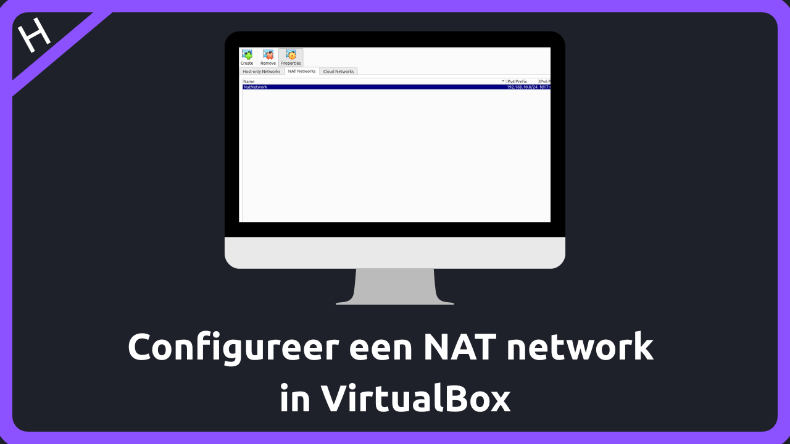{ align=left width="320" height="180" }
    > *31 Augustus 2025 - in [Howtos](howtos/index.md) - 4 min instructie*

    Deze howto demonstreert hoe je een "NAT Network" aanmaakt en configureert in VirtualBox. Dit type netwerk stelt al je virtuele machines (VM's) in staat om...

    [Lees verder](howtos/configureer-natnetwork-virtualbox/index.md){:target="_blank"}
     
     

    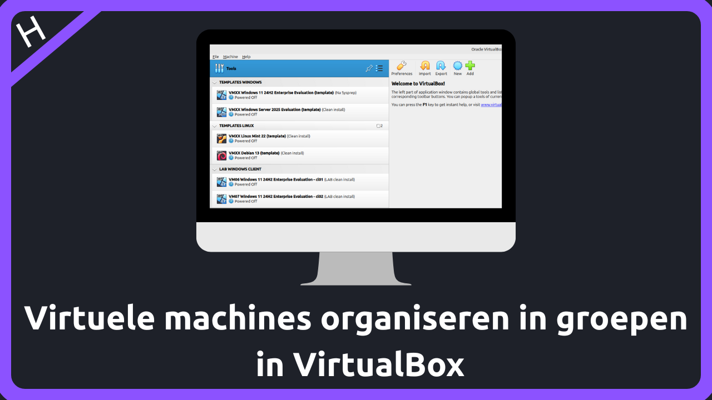{ align=left width="320" height="180" }
    > *26 Augustus 2025 - in [Howtos](howtos/index.md) - 2 min instructie*

    Deze korte howto laat zien hoe je efficiënt orde schept in je groeiende lijst van virtuele machines (VM's) in VirtualBox door ze te groeperen...

    [Lees verder](howtos/maak-groep-vm-virtualbox/index.md){:target="_blank"}
     
     

    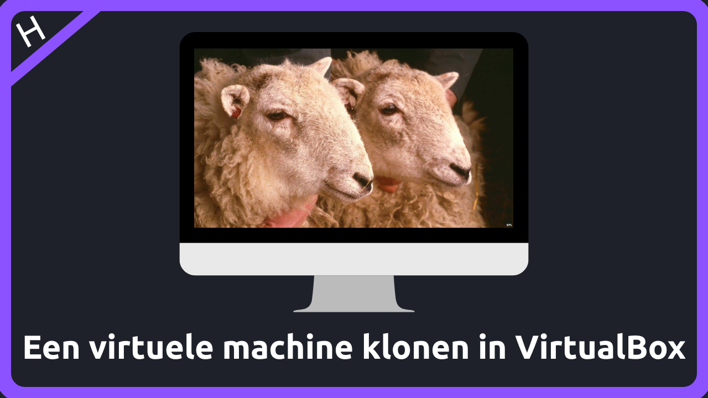{ align=left width="320" height="180" }
    > *23 Augustus 2025 - in [Howtos](howtos/index.md) - 4 min instructie*

    Deze how-to video toont je het stap-voor-stap proces om een bestaande virtuele machine (VM) in VirtualBox te klonen. Dit is essentieel voor het veilig aanmaken van meerdere, identieke...

    [Lees verder](howtos/maak-clone-vm-virtualbox/index.md){:target="_blank"}
     
     

=== "2"

    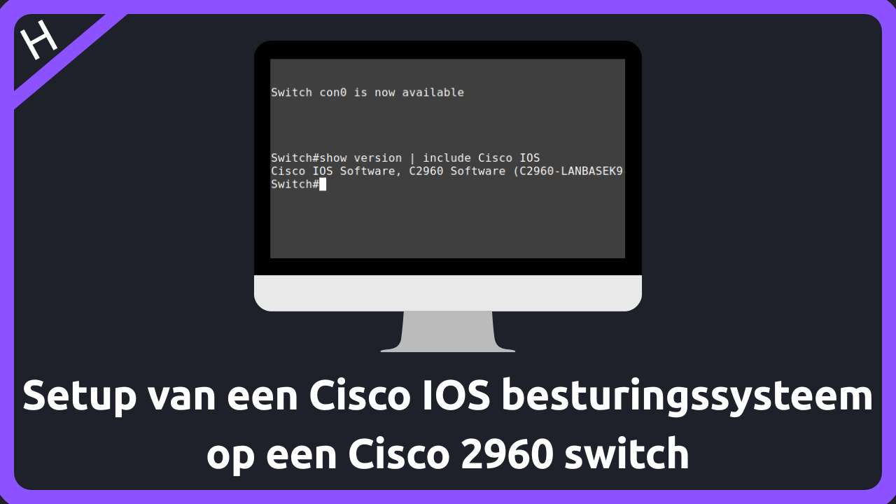{ align=left width="320" height="180" }
    > *22 Augustus 2025 - in [Howtos](howtos/index.md) - X min instructie*

    Het (her)installeren van Cisco IOS op een Cisco 2960 switch is het proces van het kopiëren van het besturingssysteemimage naar het flashgeheugen...

    [Lees verder](howtos/setup-ios-cisco2960/index.md){:target="_blank"}
     
     

    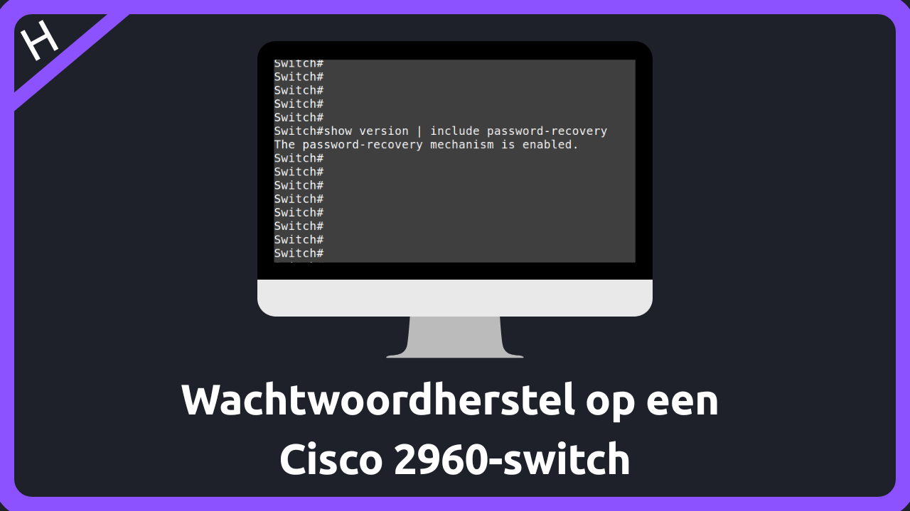{ align=left width="320" height="180" }
    > *18 Augustus 2025 - in [Howtos](howtos/index.md) - X min instructie*

    Je doet een wachtwoordherstel op een Cisco Catalyst 2960 switch, wanneer het console-wachtwoord of het enable exec-mode wachtwoord (of beide) verloren of vergeten zijn.

    [Lees verder](howtos/wachtwoordherstel-cisco2960/index.md){:target="_blank"}
     
     

    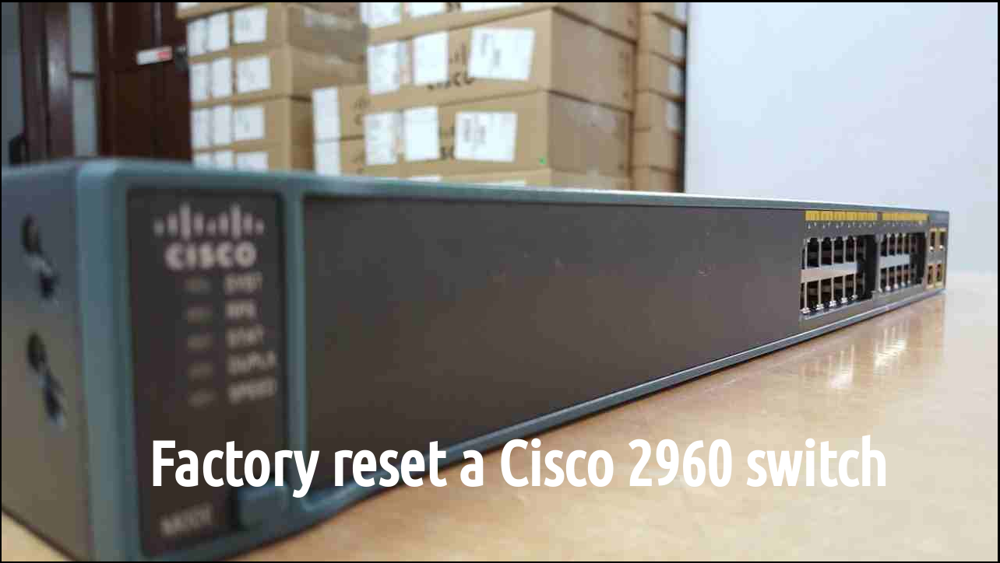{ align=left width="320" height="180" }
    > *15 Augustus 2025 - in [Howtos](howtos/index.md) - X min instructie*

    Het herstellen van de fabrieksinstellingen op een Cisco Catalyst 2960-switch zorgt ervoor dat alle aangepaste instellingen zoals IP-adressen, ...

    [Lees verder](howtos/fabrieksinstellingen-herstellen-cisco2960/index.md){:target="_blank"}
     
     

    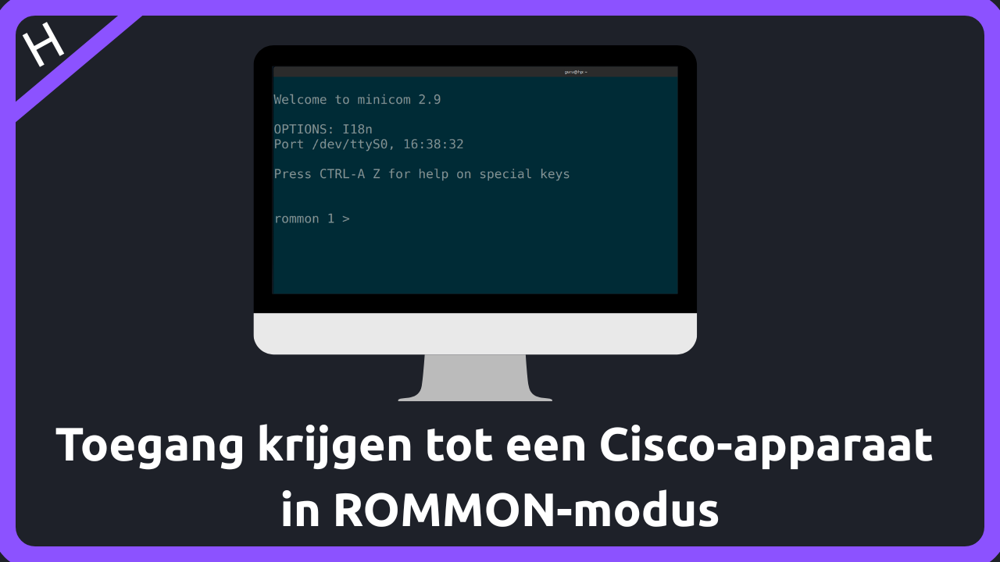{ align=left width="320" height="180" }
    > *11 Augustus 2025 - in [Howtos](howtos/index.md) - 2 min instructie*

    De ROMMON-modus (ROM Monitor) is essentieel omdat het fungeert als een noodhulpprogramma voor Cisco-apparaten. Je hebt het nodig wanneer het apparaat niet...

    [Lees verder](howtos/toegang-cisco-rommon/index.md){:target="_blank"}
     
     

    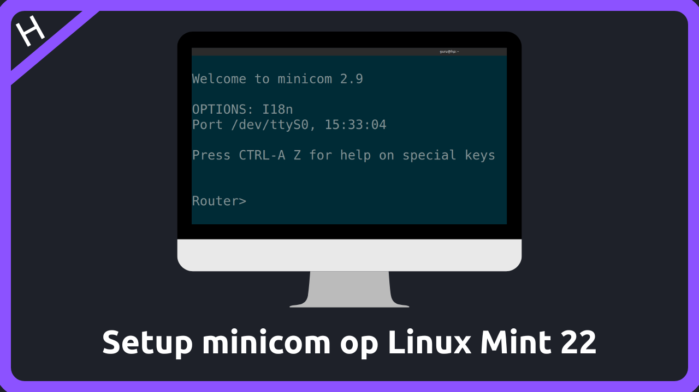{ align=left width="320" height="180" }
    > *07 Augustus 2025 - in [Howtos](howtos/index.md) - 2 min instructie*

    Minicom is een populair terminalprogramma voor Unix-achtige besturingssystemen dat wordt gebruikt om te communiceren met seriële apparaten, zoals routers, ...

    [Lees verder](howtos/setup-minicom-linuxmint22/index.md){:target="_blank"}
     
     

    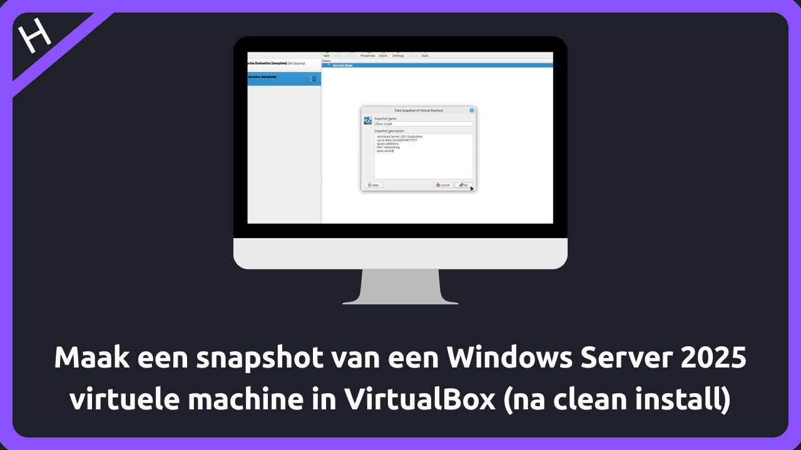{ align=left width="320" height="180" }
    > *02 Augustus 2025 - in [Howtos](howtos/index.md) - 2 min instructie*

    Het doel van een snapshot van een virtuele machine (VM) in VirtualBox is het vastleggen van de exacte toestand van de VM op een specifiek moment, inclusief...

    [Lees verder](howtos/maak-snapshot-windows-server2025-vm-virtualbox-clean/index.md){:target="_blank"}
     
     

    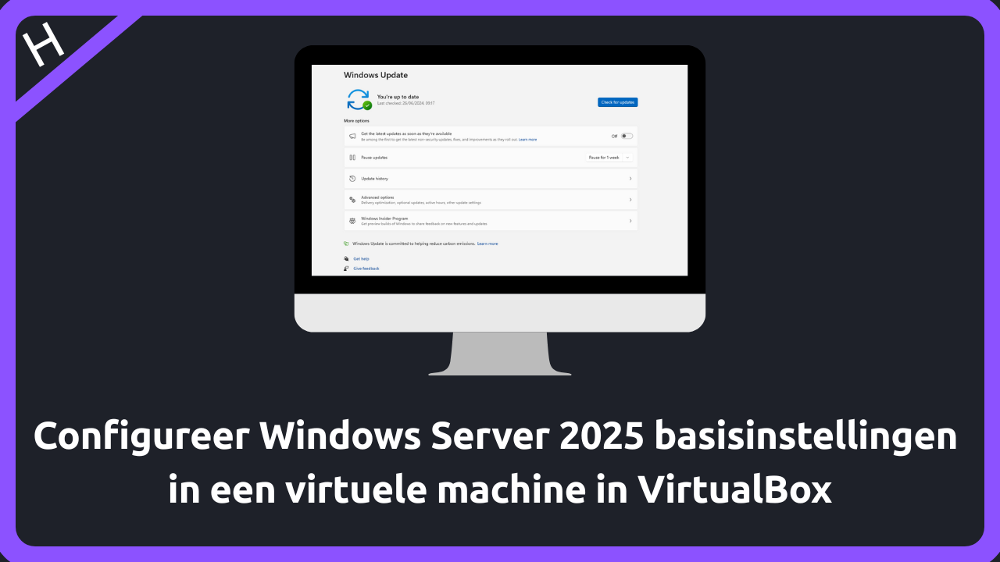{ align=left width="320" height="180" }
    > *02 Augustus 2025 - in [Howtos](howtos/index.md) - 2 min instructie*

    Na de installatie van Windows Server 2025 configureer je de basisinstellingen door eerst de Windows Updates te controleren en te installeren om...

    [Lees verder](howtos/configureer-windows-server2025-basisinstellingen-vm-virtualbox/index.md){:target="_blank"}
     
     

    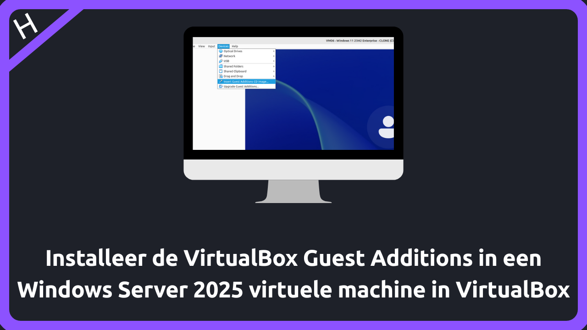{ align=left width="320" height="180" }
    > *31 Juli 2025 - in [Howtos](howtos/index.md) - 2 min instructie*

    Na de installatie van Windows Server 2025 voorzie je de Guest Additions. Deze zorgen voor de installatie van speciale stuurprogramma's voor de virtuele hardware...

    [Lees verder](howtos/installeer-guest-additions-windows-server2025-vm-virtualbox/index.md){:target="_blank"}
     
     

    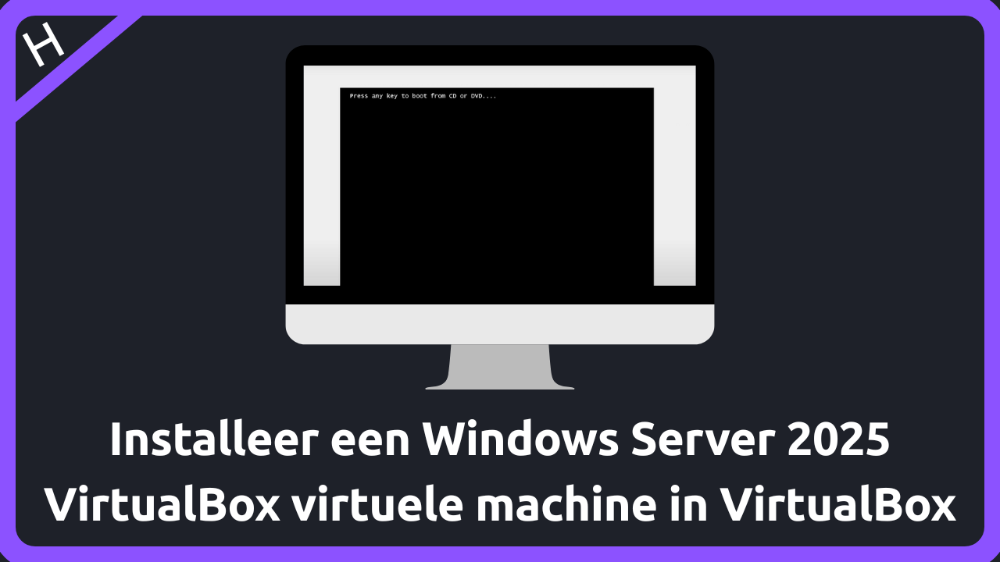{ align=left width="320" height="180" }
    > *29 Juli 2025 - in [Howtos](howtos/index.md) - 3 min instructie*

    Nadat de virtuele machine (VM) is aangemaakt en geconfigureerd, start je deze voor de eerste keer op, waarbij de opstartvolgorde ervoor zorgt dat...

    [Lees verder](howtos/installeer-windows-server2025-os-vm-virtualbox/index.md){:target="_blank"}
     
     

    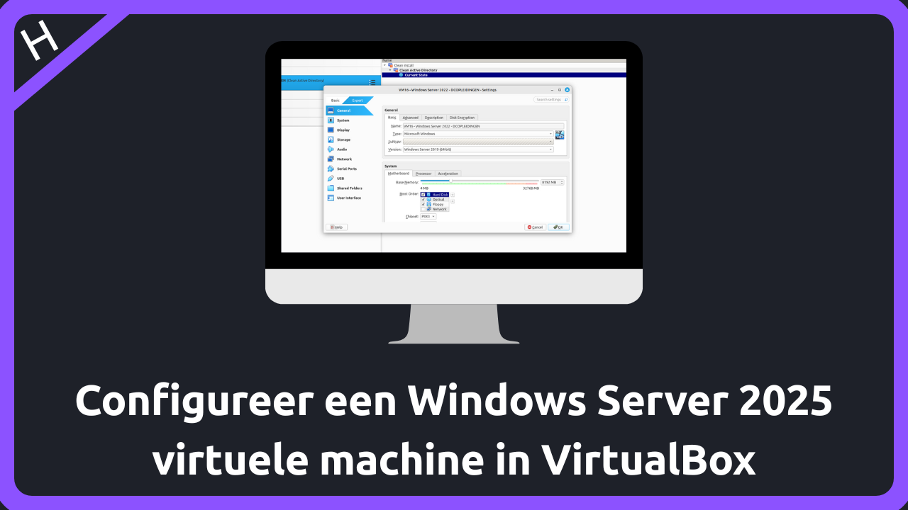{ align=left width="320" height="180" }
    > *27 Juli 2025 - in [Howtos](howtos/index.md) - 2 min instructie*

    Na het initiële aanmaken van de virtuele machine (VM) kun je, vóór de eerste opstart, de VM-instellingen raadplegen en fijnafstemmen om de werking te optimaliseren en aan specifieke behoeften aan te passen.

    [Lees verder](howtos/configureer-windows-server2025-vm-virtualbox/index.md){:target="_blank"}
     
     

=== "3"

    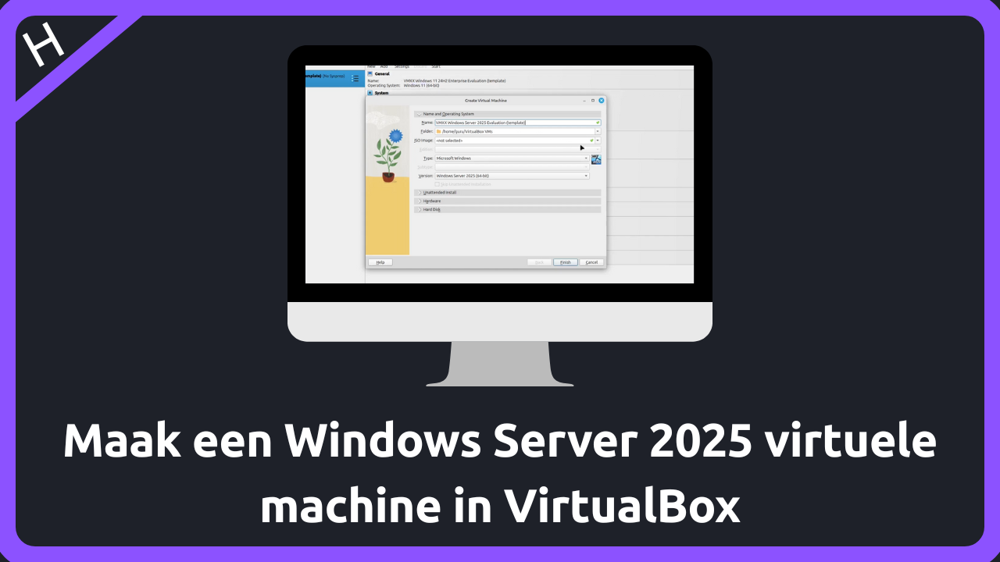{ align=left width="320" height="180" }
    > *26 Juli 2025 - in [Howtos](howtos/index.md) - 1 min instructie*

    Het aanmaken van een lege virtuele machine (VM) voor Windows Server 2025 omvat het reserveren van virtuele hardware binnen de hypervisor VirtualBox.

    [Lees verder](howtos/maak-windows-server2025-vm-virtualbox/index.md){:target="_blank"}
     
     

    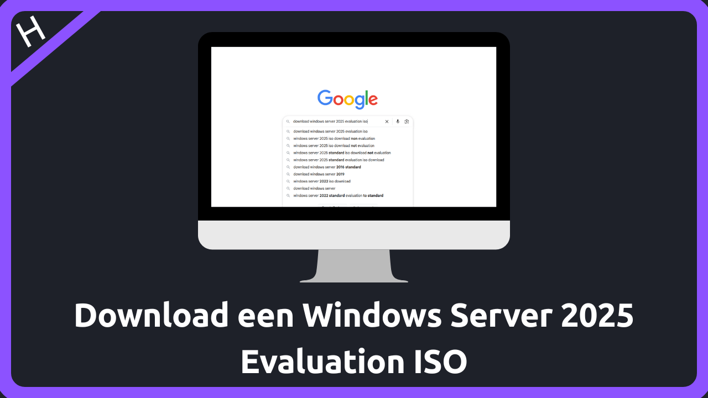{ align=left width="320" height="180" }
    > *23 Juli 2025 - in [Howtos](howtos/index.md) - 1 min instructie*

    Een Windows Server 2025 ISO-bestand is een speciale installatieversie van Windows Server die Microsoft aanbiedt voor proef- en evaluatiedoeleinden (180 dagen). Het is specifiek bedoeld voor...

    [Lees verder](howtos/download-windows-server2025-evaluation-iso/index.md){:target="_blank"}
     
     

    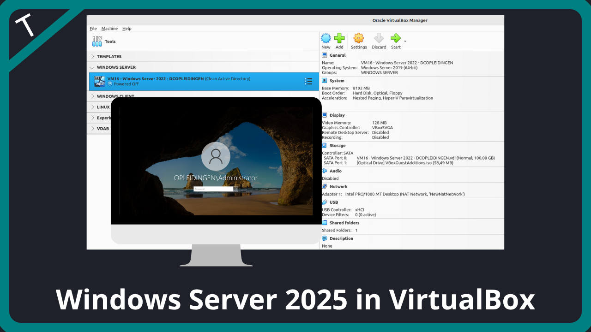{ align=left width="320" height="180" }
    > *22 Juli 2025 - in [Tutorials](tutorials/index.md) - 60 min handleiding*

    Deze handleiding begeleidt je stap voor stap bij het opzetten van een virtuele machine met Windows Server 2025 in VirtualBox. Je leert hoe je de virtuele machine aanmaakt, ...

    [Lees verder](tutorials/setup-windows-server2025-vm-virtualbox/index.md){:target="_blank"}
     
     

    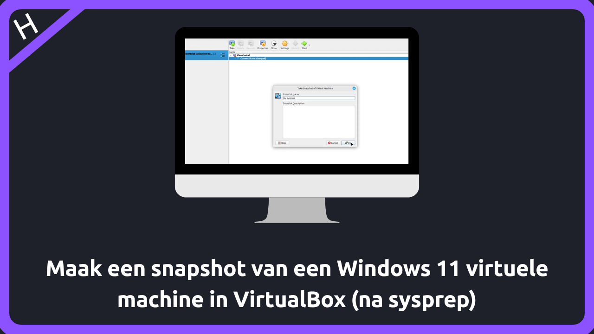{ align=left width="320" height="180" }
    > *22 Juli 2025 - in [Howtos](howtos/index.md) - 1 min instructie*

    Het doel van een snapshot van een virtuele machine (VM) in VirtualBox is het vastleggen van de exacte toestand van de VM op een specifiek moment, inclusief...

    [Lees verder](howtos/maak-snapshot-windows11-vm-virtualbox-sysprep/index.md){:target="_blank"}
     
     

    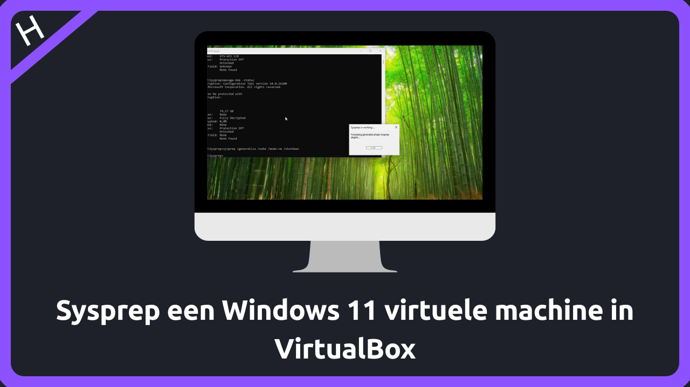{ align=left width="320" height="180" }
    > *20 Juli 2025 - in [Howtos](howtos/index.md) - 4 min instructie*

    Sysprep verwijdert specifieke systeeminformatie, zoals de computer-SID, waardoor elke nieuwe virtuele machine die je aanmaakt een unieke identiteit heeft...

    [Lees verder](howtos/sysprep-windows11-vm-virtualbox/index.md){:target="_blank"}
     
     

    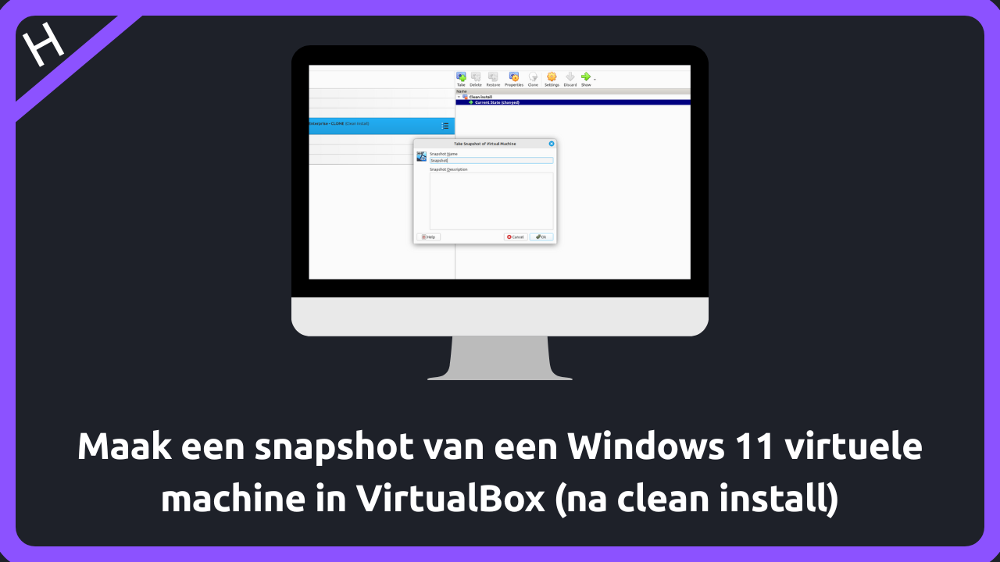{ align=left width="320" height="180" }
    > *14 Juli 2025 - in [Howtos](howtos/index.md) - 2 min instructie*

    Het doel van een snapshot van een virtuele machine (VM) in VirtualBox is het vastleggen van de exacte toestand van de VM op een specifiek moment, inclusief...

    [Lees verder](howtos/maak-snapshot-windows11-vm-virtualbox-clean/index.md){:target="_blank"}
     
     

    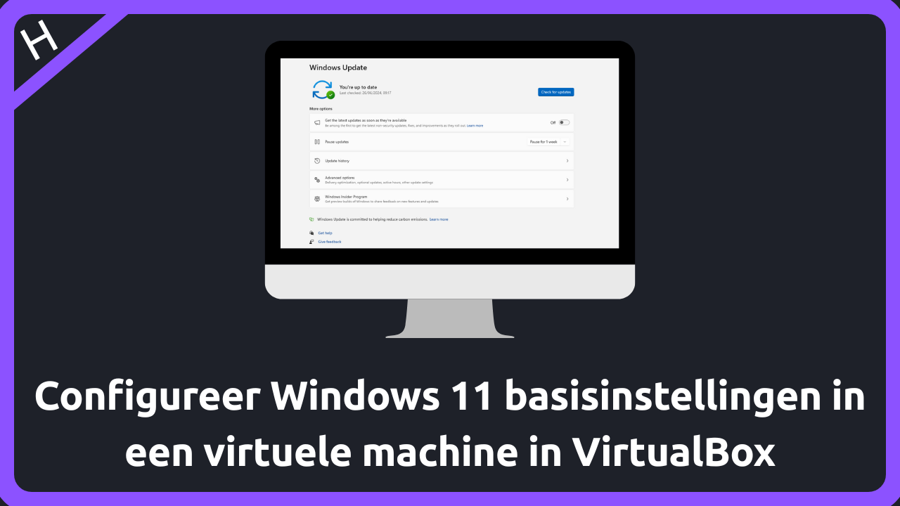{ align=left width="320" height="180" }
    > *14 Juli 2025 - in [Howtos](howtos/index.md) - 1 min instructie*

    Na de installatie van Windows 11 configureer je de basisinstellingen door eerst de Windows Updates te controleren en te installeren om zeker te zijn...

    [Lees verder](howtos/configureer-windows11-basisinstellingen-vm-virtualbox/index.md){:target="_blank"}
     
     

    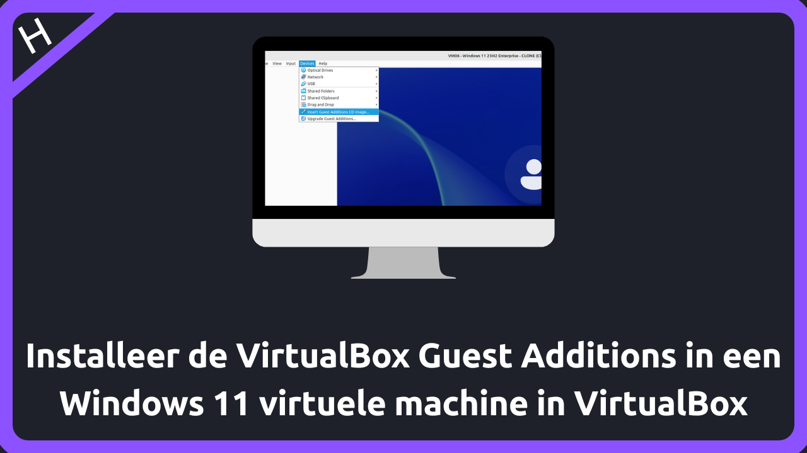{ align=left width="320" height="180" }
    > *12 Juli 2025 - in [Howtos](howtos/index.md) - 2 min instructie*

    Na de installatie van Windows 11 voorzie je de Guest Additions. Deze zorgen voor de installatie van speciale stuurprogramma's voor de virtuele hardware, ...

    [Lees verder](howtos/installeer-guest-additions-windows11-vm-virtualbox/index.md){:target="_blank"}
     
     

    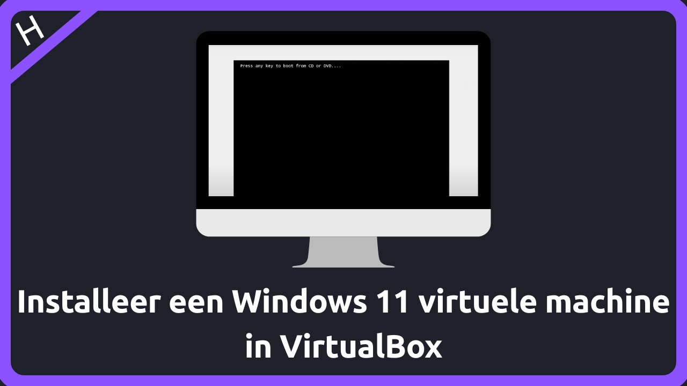{ align=left width="320" height="180" }
    > *11 Juli 2025 - in [Howtos](howtos/index.md) - 5 min instructie*

    Nadat de virtuele machine (VM) is aangemaakt en geconfigureerd, start je deze voor de eerste keer op, waarbij de opstartvolgorde ervoor zorgt dat...

    [Lees verder](howtos/installeer-windows11-os-vm-virtualbox/index.md){:target="_blank"}
     
     

    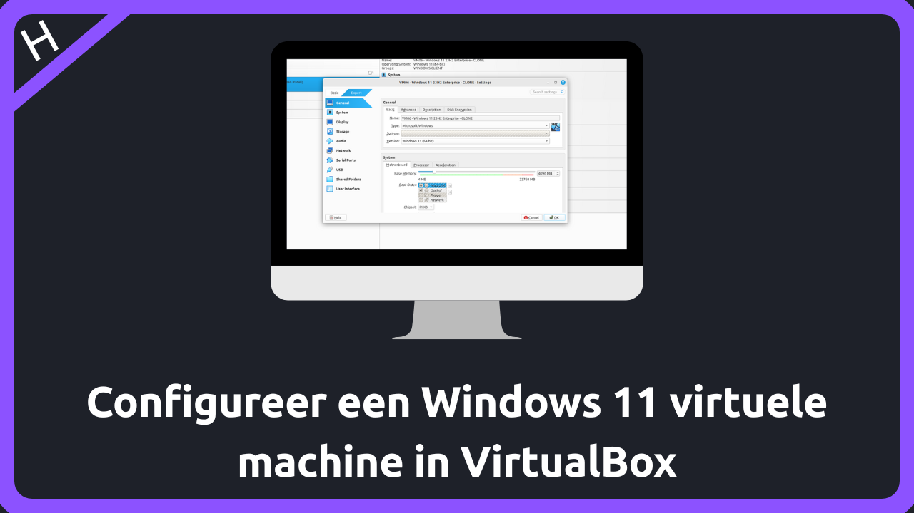{ align=left width="320" height="180" }
    > *10 Juli 2025 - in [Howtos](howtos/index.md) - 2 min instructie*

    Na het initiële aanmaken van de virtuele machine (VM) kun je, vóór de eerste opstart, de VM-instellingen raadplegen en fijnafstemmen om de werking te optimaliseren en aan specifieke behoeften aan te passen. Dit omvat...

    [Lees verder](howtos/configureer-windows11-vm-virtualbox/index.md){:target="_blank"}
     
     

=== "4"

    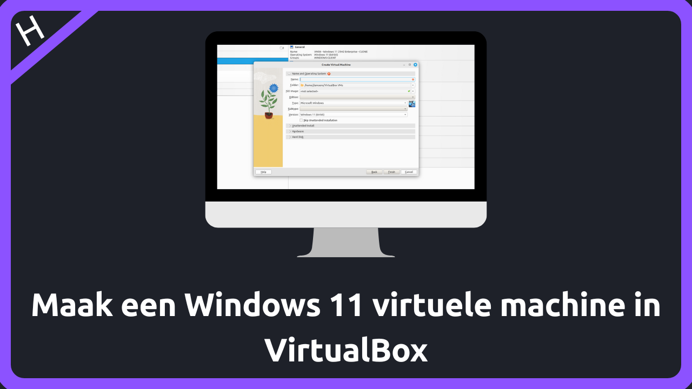{ align=left width="320" height="180" }
    > *10 Juli 2025 - in [Howtos](howtos/index.md) - 2 min instructie*

    Het aanmaken van een lege virtuele machine (VM) voor Windows 11 omvat het reserveren van virtuele hardware binnen de hypervisor VirtualBox. Je moet de VM een naam geven...

    [Lees verder](howtos/maak-windows11-vm-virtualbox/index.md){:target="_blank"}
     
     

    { align=left width="320" height="180" }
    > *09 Juli 2025 - in [Howtos](howtos/index.md) - 1 min instructie*

    Een Windows 11 Enterprise Evaluation ISO-bestand is een speciale installatieversie van Windows 11 Enterprise die Microsoft aanbiedt voor proef- en evaluatiedoeleinden (90 dagen)...

    [Lees verder](howtos/download-windows11-evaluation-iso/index.md){:target="_blank"}
     
     

    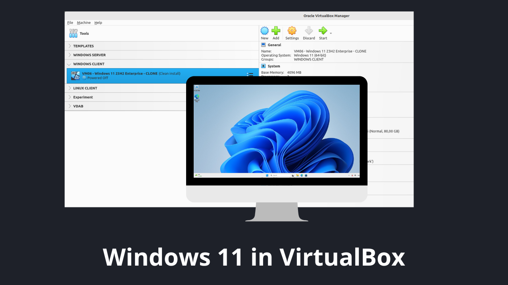{ align=left width="320" height="180" }
    > *09 Juli 2025 - in [Tutorials](tutorials/index.md) - 60 min handleiding*

    Deze handleiding begeleidt je stap voor stap bij het opzetten van een virtuele machine met Windows 11 in VirtualBox. Je leert hoe je de virtuele machine aanmaakt, ...

    [Lees verder](tutorials/setup-windows11-vm-virtualbox/index.md){:target="_blank"}
     
     

    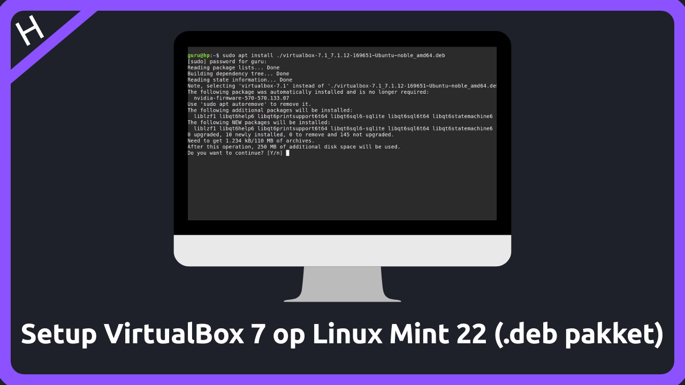{ align=left width="320" height="180" }
    > *23 Juli 2025 - in [Howtos](howtos/index.md) - 2 min instructie*

    VirtualBox stelt je in staat om andere besturingssystemen (zoals Windows of een andere Linux-distributie) te draaien als virtuele machines binnen bv. een bestaande Linux Mint 22-omgeving...

    [Lees verder](howtos/setup-virtualbox7-linuxmint22-oracledeb/index.md){:target="_blank"}
     
     

    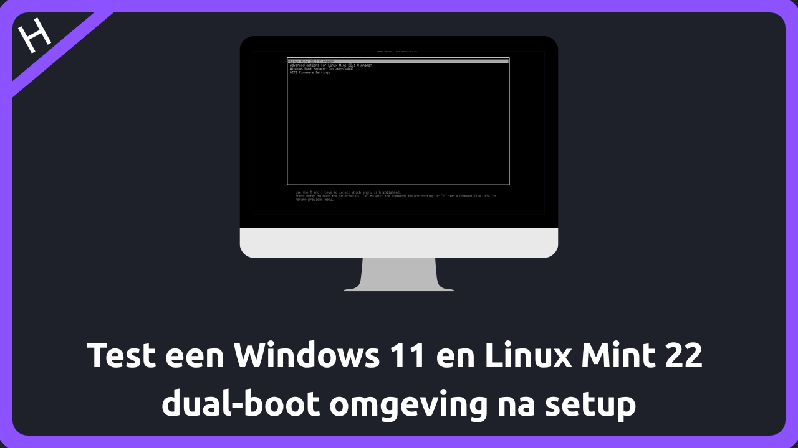{ align=left width="320" height="180" }
    > *08 Juli 2025 - in [Howtos](howtos/index.md) - 2 min instructie*

    Om een dual-boot omgeving te testen, start je je computer opnieuw op en let je goed op het opstartmenu (meestal GRUB of Windows Boot Manager) dat verschijnt.

    [Lees verder](howtos/test-dualboot-windows11-linuxmint22/index.md){:target="_blank"}
     
     

    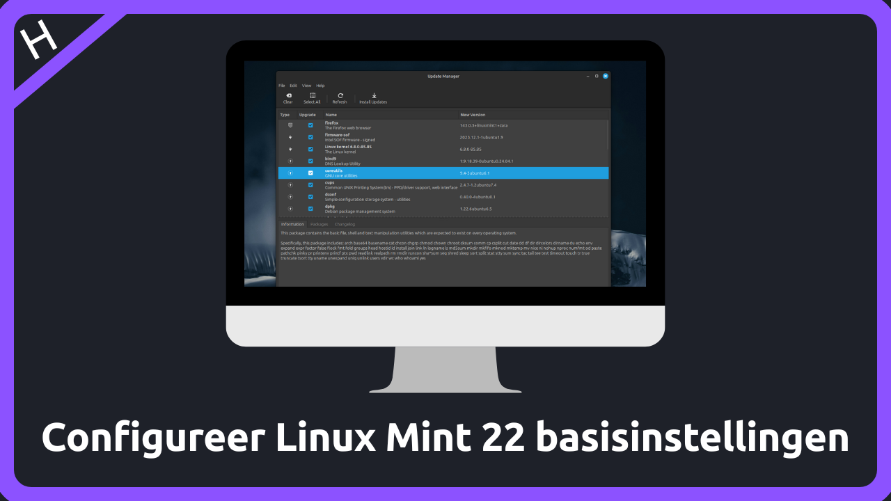{ align=left width="320" height="180" }
    > *07 Juli 2025 - in [Howtos](howtos/index.md) - 6 min instructie*

    Na de installatie van Linux Mint 22 configureer je de basisinstellingen door direct de Updatebeheerder te openen om alle beschikbare systeemupdates en beveiligingspatches te installeren...

    [Lees verder](howtos/configureer-linuxmint22-basisinstellingen/index.md){:target="_blank"}
     
     

    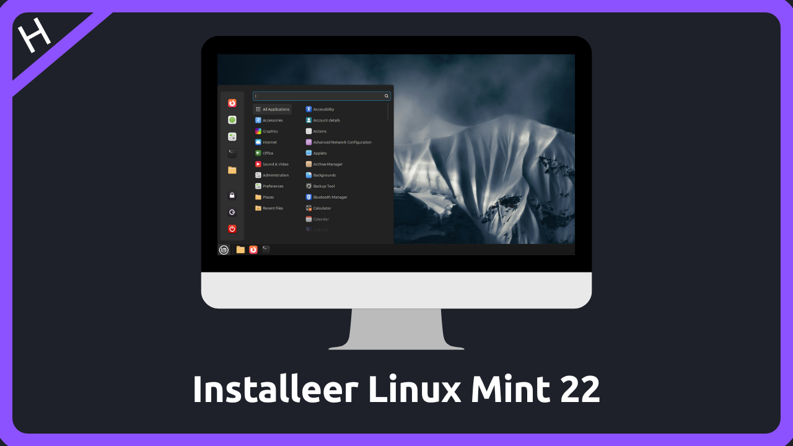{ align=left width="320" height="180" }
    > *05 Juli 2025 - in [Howtos](howtos/index.md) - 3 min instructie*

    Je installeert Linux Mint 22 voor een stabiel, veilig en gebruiksvriendelijk besturingssysteem dat een uitstekend alternatief biedt voor Windows of macOS...

    [Lees verder](howtos/installeer-linuxmint22/index.md){:target="_blank"}
     
     

    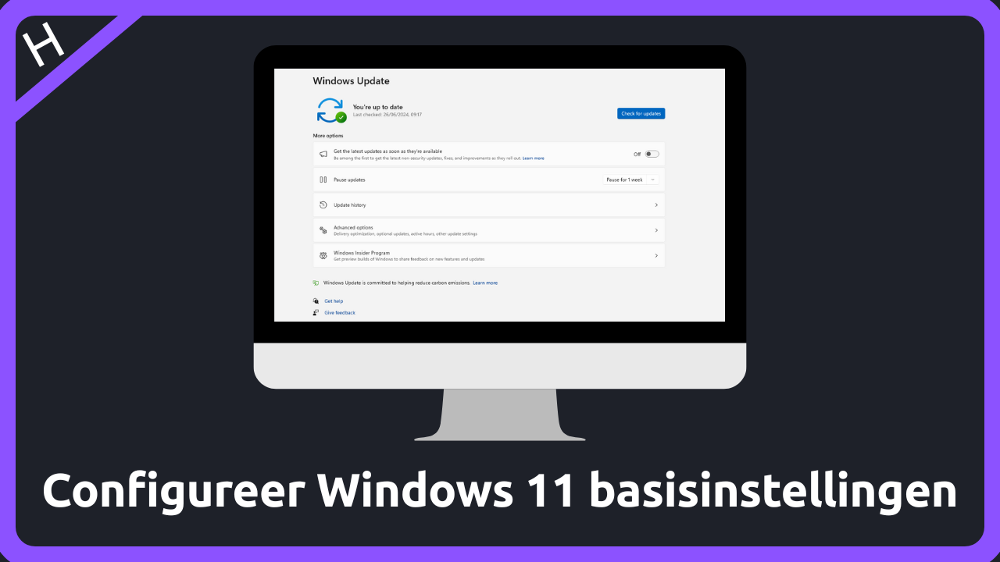{ align=left width="320" height="180" }
    > *04 Juli 2025 - in [Howtos](howtos/index.md) - 1 min instructie*

    Na de installatie van Windows 11 configureer je de basisinstellingen door eerst de Windows Updates te controleren en te installeren om zeker te zijn van...

    [Lees verder](howtos/configureer-windows11-basisinstellingen/index.md){:target="_blank"}
     
     

    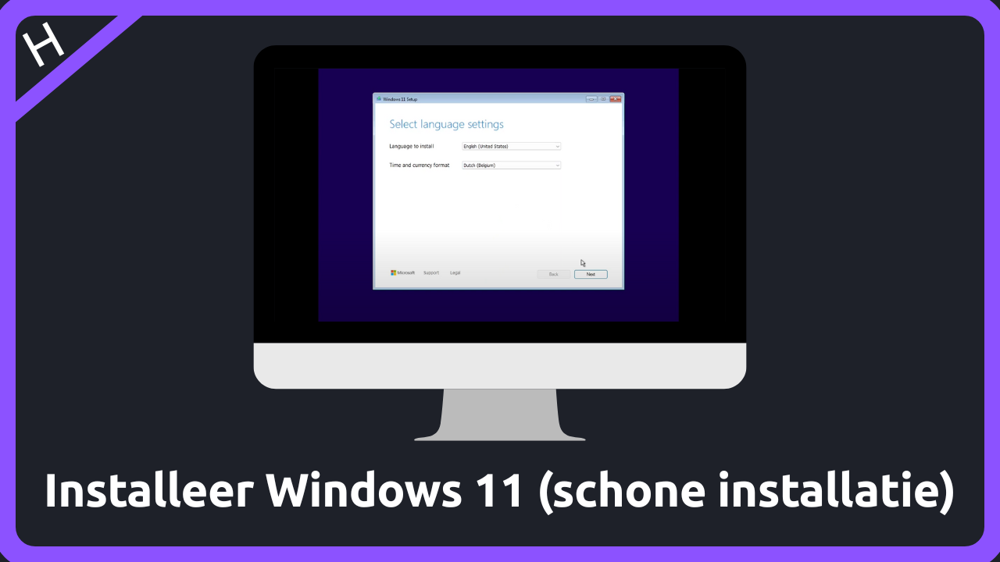{ align=left width="320" height="180" }
    > *02 Juli 2025 - in [Howtos](howtos/index.md) - 4 min instructie*

    Een schone installatie van Windows 11 is de meest grondige manier om het besturingssysteem te installeren, omdat het alle bestaande gegevens van de harde schijf wist en Windows 11 opnieuw installeert.

    [Lees verder](howtos/installeer-windows11/index.md){:target="_blank"}
     
     

    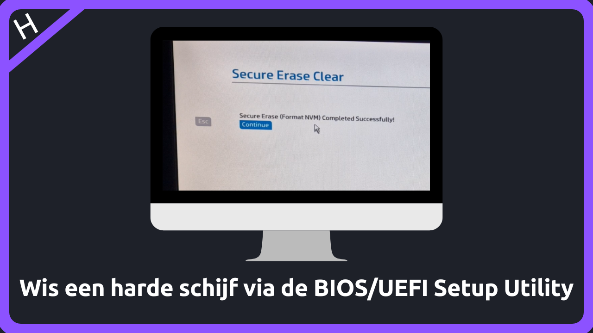{ align=left width="320" height="180" }
    > *30 Juni 2025 - in [Howtos](howtos/index.md) - 2 min instructie*

    Veel moderne UEFI-firmware (vooral op laptops en desktops van fabrikanten zoals bv. HP, Dell, Lenovo en bij sommige moederbordfabrikanten) bevat...

    [Lees verder](howtos/wis-harde-schijf-bios-uefi/index.md){:target="_blank"}
     
     

=== "5"

    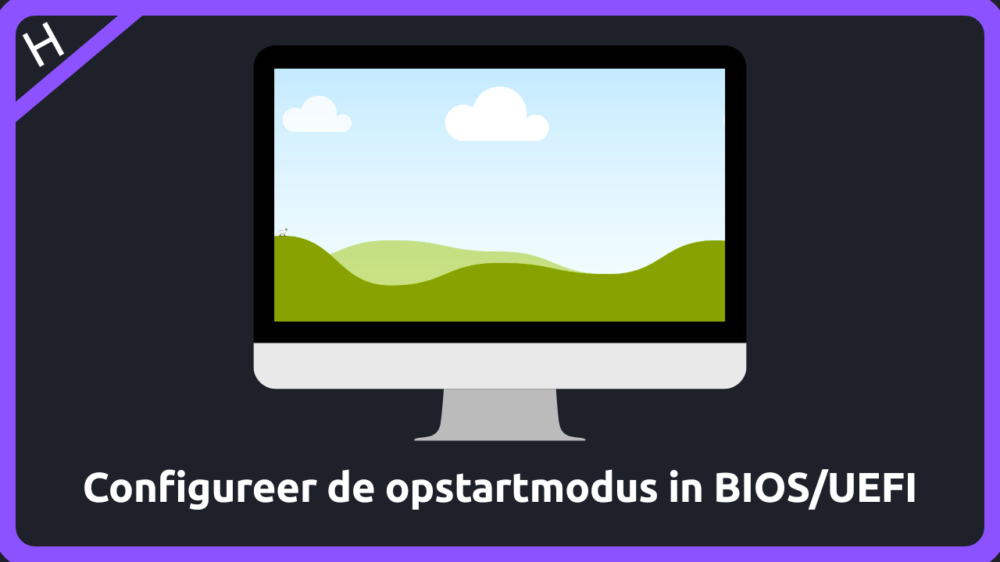{ align=left width="320" height="180" }
    > *29 Juni 2025 - in [Howtos](howtos/index.md) - 1 min instructie*

    Binnen de BIOS/UEFI utility kun je belangrijke opstartinstellingen beheren, waaronder de Boot Mode, waarbij je kunt schakelen tussen UEFI...

    [Lees verder](howtos/configureer-opstartmodus-bios-uefi/index.md){:target="_blank"}
     
     

    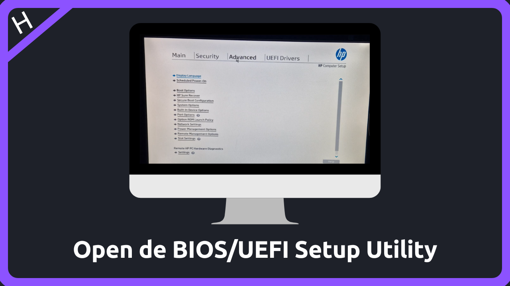{ align=left width="320" height="180" }
    > *27 Juni 2025 - in [Howtos](howtos/index.md) - 1 min instructie*

    Binnen een BIOS/UEFI utility, dat toegankelijk is tijdens het opstarten van de computer, kun je essentiële hardware-instellingen configureren...

    [Lees verder](howtos/open-bios-uefi-setup-utility/index.md){:target="_blank"}
     
     

    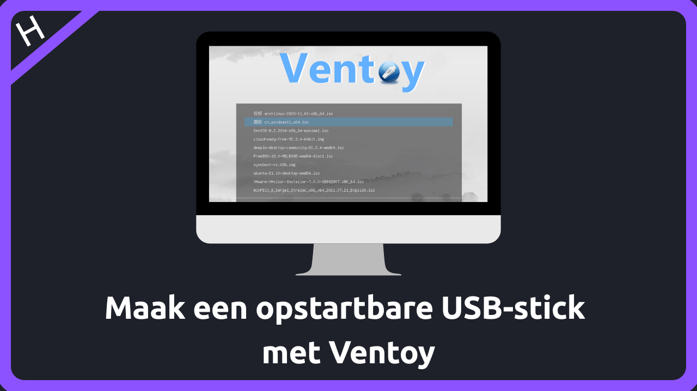{ align=left width="320" height="180" }
    > *26 Juni 2025 - in [Howtos](howtos/index.md) - 5 min instructie*

    Je hebt een opstartbare USB-stick voor Windows of Linux Mint nodig om het besturingssysteem te installeren op een nieuwe pc, een beschadigde installatie te repareren, ...

    [Lees verder](howtos/maak-opstartbare-usb-stick-ventoy/index.md){:target="_blank"}
     
     

    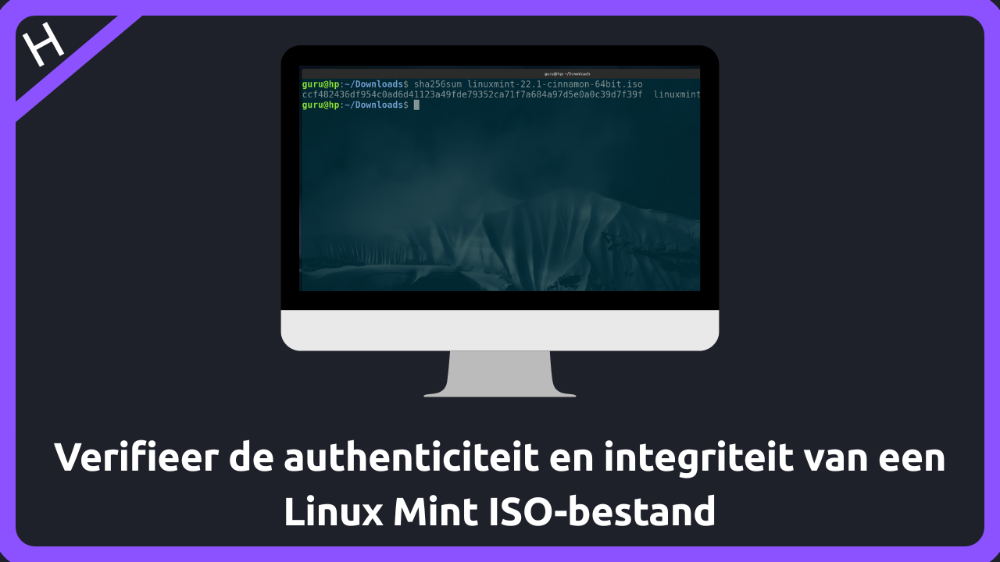{ align=left width="320" height="180" }
    > *25 Juni 2025 - in [Howtos](howtos/index.md) - 5 min instructie*

    Een gedownload Linux Mint 22 ISO-bestand kan je best verifiëren op authenticiteit en integriteit. Deze stappen maken gebruik van cryptografische sleutels...

    [Lees verder](howtos/verifieer-linuxmint22-iso/index.md){:target="_blank"}
     
     

    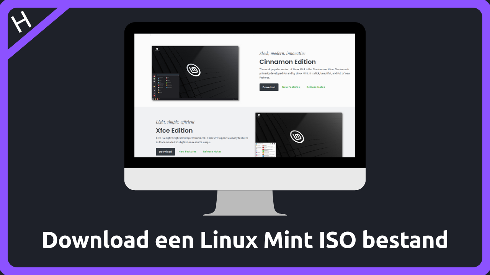{ align=left width="320" height="180" }
    > *23 Juni 2025 - in [Howtos](howtos/index.md) - 2 min instructie*

    Download een Linux Mint ISO-installatiebestand om het besturingssysteem te verkrijgen in een handig, zelfstandig bestand, essentieel voor het maken...

    [Lees verder](howtos/download-linuxmint22-iso/index.md){:target="_blank"}
     
     

    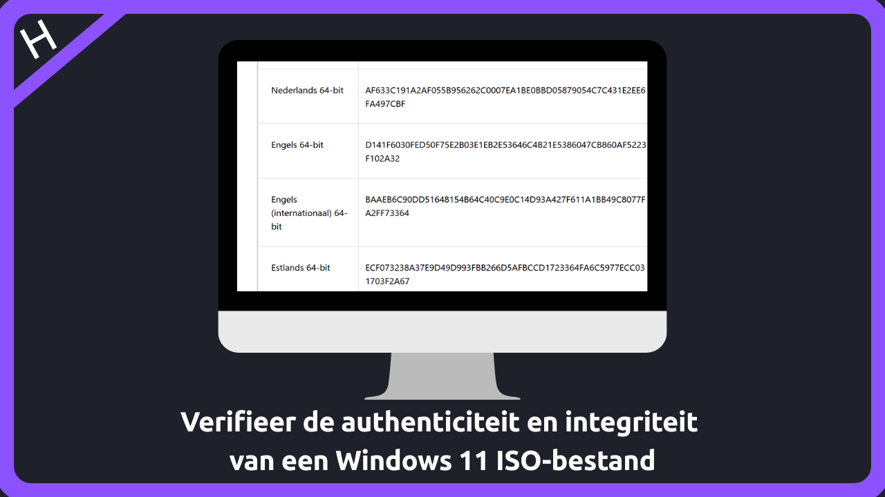{ align=left width="320" height="180" }
    > *20 Juni 2025 - in [Howtos](howtos/index.md) - 5 min instructie*

    Een gedownload Windows 11 ISO-bestand kan je best verifiëren op authenticiteit en integriteit. Hier vind je een stappenplan voor zowel Windows als Linux Mint.

    [Lees verder](howtos/verifieer-windows-iso/index.md){:target="_blank"}
     
     

    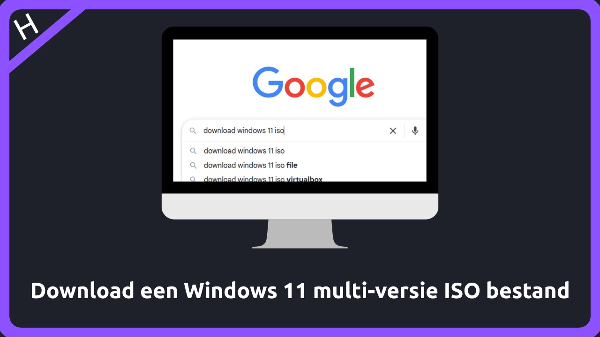{ align=left width="320" height="180" }
    > *18 Juni 2025 - in [Howtos](howtos/index.md) - 1 min instructie*

    Download een Windows 11 multi-versie ISO-bestand om het besturingssysteem te verkrijgen in een enkel, comprimeerbaar bestand, geschikt voor het creëren...

    [Lees verder](howtos/download-windows11-multi-versie-iso/index.md){:target="_blank"}
     
     

    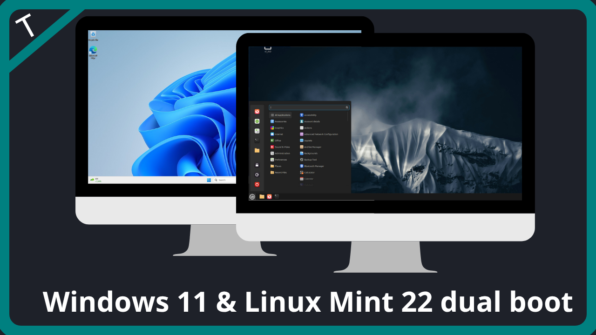{ align=left width="320" height="180" }
    > *15 Juni 2025 - in [Tutorials](tutorials/index.md) - 120 min handleiding*

    Deze handleiding begeleidt je stap voor stap bij het opzetten van een dual boot systeem met Windows 11 en Linux Mint 22 op één computer, specifiek geconfigureerd voor UEFI.

    [Lees verder](tutorials/setup-windows11-linuxmint22-dual-boot-uefi/index.md){:target="_blank"}
     
     