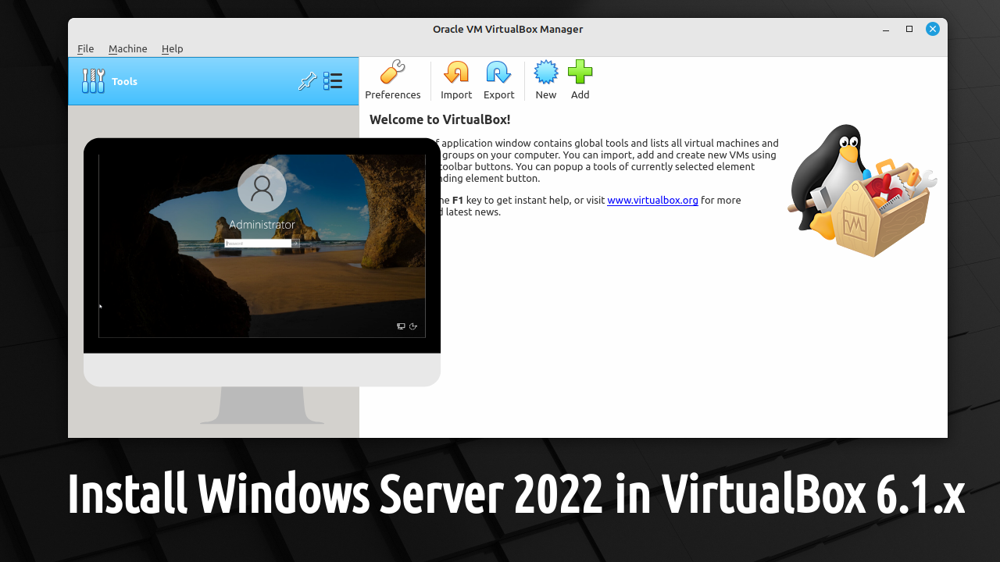
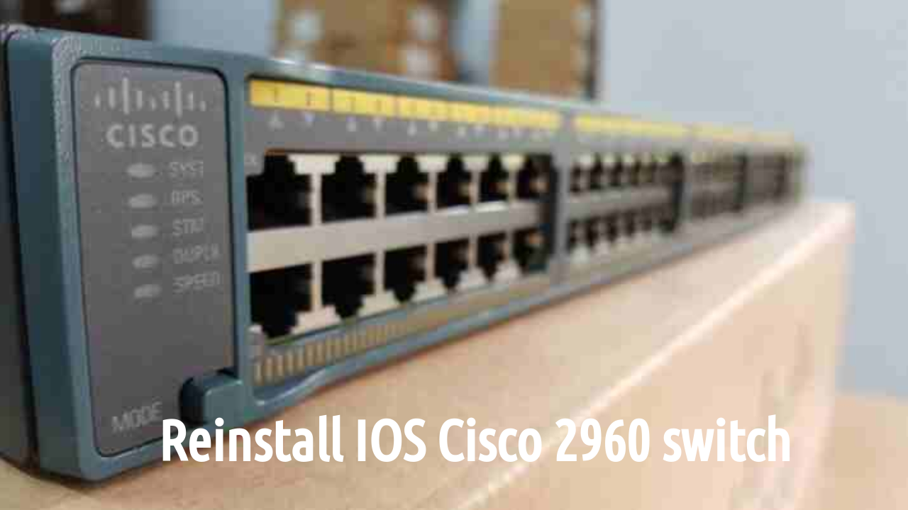

---
hide:
  - toc
---

# Welcome!

<!---
// inline CSS to not display section title

-->

<!--- BLOG TEMPLATE 

> *September 26, 2022 - in [Blogs](blogs/index.md) - 5 min read*

Cras elementum metus quis est luctus, vitae tincidunt orci consequat. Maecenas at ipsum ac dui venenatis convallis. Morbi lobortis, purus vitae lobortis vehicula, metus velit cursus nisi, a placerat mi nunc id enim.

[Continue reading](blogs/YYYY/blog.md)
 
 
--->

<!--- TUTORIAL TEMPLATE

> *September 26, 2022 - in [Tutorials](tutorials/index.md) - 20 min lesson*

Cras elementum metus quis est luctus, vitae tincidunt orci consequat. Maecenas at ipsum ac dui venenatis convallis. Morbi lobortis, purus vitae lobortis vehicula, metus velit cursus nisi, a placerat mi nunc id enim.

[Continue reading](tutorials/tutorial/index.md)
 
 
--->

<!--- HOWTO TEMPLATE

> *September 26, 2022 - in [Howtos](howtos/index.md) - 7 min guide*

Cras elementum metus quis est luctus, vitae tincidunt orci consequat. Maecenas at ipsum ac dui venenatis convallis. Morbi lobortis, purus vitae lobortis vehicula, metus velit cursus nisi, a placerat mi nunc id enim.

[Continue reading](howtos/howto_template/index.md)
 
 
--->

=== "1"

    <!--- HOWTO install VirtualBox 7 on Linux Mint 21 --->
    
    > *Jun 06, 2023 - in [Howtos](howtos/index.md) - 20 min guide*

    VirtualBox is a powerful virtualization software that allows you to create and run virtual machines on your computer. Developed by Oracle, VirtualBox enables you to emulate multiple operating systems within a single physical machine.

    [Continue reading](howtos/install-virtualbox7-linux-mint21/index.md)
     
     

    <!--- HOWTO install Minicom on Linux Mint 21 --->
    
    > *Sep 10, 2023 - in [Howtos](howtos/index.md) - 5 min guide*

    Minicom is an open source clone of the MS-DOS "Telix" communication program. It emulates ANSI and VT102 terminals, has a dialing directory and auto zmodem download.

    [Continue reading](howtos/install-minicom-linux-mint/index.md)
     
     

=== "2"

    <!--- HOWTO install Packet Tracer 8 on Linux Mint 21 --->
    
    > *Jun 08, 2023 - in [Howtos](howtos/index.md) - 5 min guide*

    Packet Tracer is a cross-platform visual simulation tool designed by Cisco Systems that allows users to create network topologies and imitate modern computer networks. It simulates, not emulates, the configuration of Cisco routers and switches.

    [Continue reading](howtos/install-packettracer-linux-mint/index.md)
     
     

    <!--- TUTORIAL Windows 11 & Linux Mint 21 dual boot BIOS--->
    
    > *Apr 05, 2023 - in [Tutorials](tutorials/index.md) - 90 min lesson*

    Operating systems can coexist without (too many) conflicts, as long as you careful partition and follow installation procedures. Windows for software compatibility, multimedia and gaming. Linux for development, customization, security, ...

    [Continue reading](tutorials/windows11-linuxmint21-dual-boot-bios-clonezilla/index.md)
     
     

    <!--- TUTORIAL Windows client/server testlab in VirtualBox --->
    
    > *Apr 05, 2024 - in [Tutorials](tutorials/index.md) - 180 min lesson*

    Setting up a Windows client/server test lab in VirtualBox provides a cost-effective and efficient way to experiment with various network configurations, software installations, and system setups without the need for physical hardware...

    [Continue reading](tutorials/windows11-virtualbox/index.md)
     
     

    <!--- TUTORIAL Windows Server 2022 in VirtualBox 6.1.x --->
    
    > *Jun 15, 2023 - in [Tutorials](tutorials/index.md) - 90 min lesson*

    Virtualizing an OS is interesting because it allows for the creation of isolated and self-contained virtual environments that can run on a single physical machine, enabling efficient resource utilization and flexibility in testing, development...

    [Continue reading](tutorials/windows-server-2022-virtualbox/index.md)
     
     

    <!--- TUTORIAL Windows 11 in VirtualBox 6.1.x --->
    
    > *Jun 15, 2023 - in [Tutorials](tutorials/index.md) - 120 min lesson*

    Virtualizing an OS is interesting because it allows for the creation of isolated and self-contained virtual environments that can run on a single physical machine, enabling efficient resource utilization and flexibility in testing, development...

    [Continue reading](tutorials/windows11-virtualbox/index.md)
     
     

=== "3"

    <!--- HOWTO install Google Chrome browser on Linux Mint 21 --->
    
    > *Jun 08, 2023 - in [Howtos](howtos/index.md) - 10 min guide*

    Google Chrome browser is a popular web browser developed by Google that offers a fast, secure, and feature-rich browsing experience. It is based on the open-source Chromium project and supports a wide range of extensions and platforms.

    [Continue reading](howtos/install-chrome-browser-linux-mint/index.md)
     
     

    <!--- HOWTO install VirtualBox 6.1.44 on Linux Mint 21 --->
    
    > *Jun 06, 2023 - in [Howtos](howtos/index.md) - 20 min guide*

    VirtualBox is a powerful virtualization software that allows you to create and run virtual machines on your computer. Developed by Oracle, VirtualBox enables you to emulate multiple operating systems within a single physical machine.

    [Continue reading](howtos/install-virtualbox-linux-mint/index.md)
     
     

    <!--- TUTORIAL Windows 11 & Linux Mint 21 dual boot --->
    
    > *Jun 03, 2023 - in [Tutorials](tutorials/index.md) - 90 min lesson*

    Operating systems can coexist without (too many) conflicts, as long as you careful partition and follow installation procedures. Windows for software compatibility, multimedia and gaming. Linux for development, customization, security, ...

    [Continue reading](tutorials/windows11-linuxmint21-dual-boot-uefi/index.md)
     
     

    <!--- HOWTO factory reset a Cisco 2960 switch --->
    
    > *May 28, 2023 - in [Howtos](howtos/index.md) - 20 min guide*

    Factory reset = restore to default settings. Erase all configuration settings, including IP addresses, hostname, passwords, VLANs and other settings. Ready for network deployment, troubleshooting, resale or decommissioning.

    [Continue reading](howtos/factory-reset-cisco2960/index.md)
     
     

    <!--- HOWTO access a Cisco device ROMMON --->
    
    > *May 25, 2023 - in [Howtos](howtos/index.md) - 10 min guide*

    ROMMON is a seperate firmware component embedded in the hardware of Cisco devices, a small program that runs - after POST - when a device is powered on or during the boot process. It is responsible for providing basic boot and recovery functionality.

    [Continue reading](howtos/access-cisco-device-rommon/index.md)
     
     

=== "4"

    <!--- HOWTO do a password recovery on a Cisco 2960 switch --->
    
    > *May 18, 2023 - in [Howtos](howtos/index.md) - 15 min guide*

    Cisco switches have a password recovery procedure that involves booting the switch into a special mode that allows you to reset the password. If you are unable to recover the password, you can perform a factory reset of the switch.

    [Continue reading](howtos/password-recovery-cisco2960/index.md)
     
     

    <!--- HOWTO Linux Mint 21 bootable usb flash drive --->
    
    > *March 10, 2023 - in [Howtos](howtos/index.md) - 10 min guide*

    Creating a Linux Mint 21 bootable USB flash drive is useful for a variety of purposes, including installing or trying out Linux Mint on a new computer or repairing a malfunctioning installation.

    [Continue reading](howtos/linuxmint21-bootable-usb-flash-drive/index.md)
     
     

    <!--- HOWTO (Re)install an IOS operating system on a Cisco 2960 switch --->
    
    > *March 07, 2023 - in [Howtos](howtos/index.md) - 20 min guide*

    Upgrading to a new version. Recovery from software corruption. Factory reset. Configuration compatibility. License activation. There are a variety of reasons why it is sometimes necessary to (re)install an IOS on a Cisco 2960 switch.

    [Continue reading](howtos/reinstall-ios-cisco2960/index.md)
     
     

    <!--- HOWTO Windows 11 bootable usb flash drive --->
    
    >*February 2, 2023 - in [Howtos](howtos/index.md) - 12 min guide*

    A Windows 11 bootable USB flash drive is a removable storage device that has been configured to contain all the necessary files and software to launch a Windows 11 installation or repair process.

    [Continue reading](howtos/windows11-bootable-usb-flash-drive/index.md)
     
     

    <!--- HOWTO XMIND-8 --->
    
    >*September 26, 2022 - in [Howtos](howtos/index.md) - 7 min guide*

    XMind is a mind mapping and brainstorming software. At the time of writing, the current downloadable version is XMind 2022 (12.0.2 evaluation version).
    If you happen to have some old .xmind files lying around...

    [Continue reading](howtos/install-xmind-linux-mint/index.md)
     
     