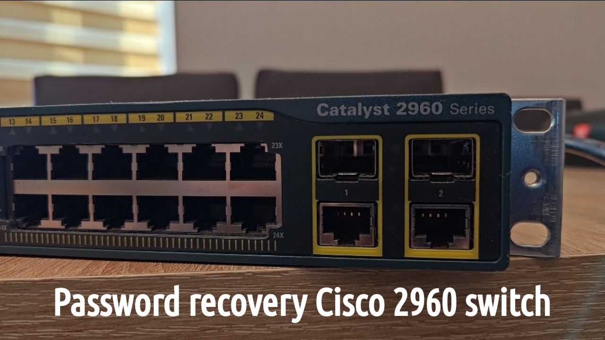

---
hide:
  - toc
---

# Welcome!

<!---
// inline CSS to not display section title

-->

<!--- BLOG TEMPLATE 

> *September 26, 2022 - in [Blogs](blogs/index.md) - 5 min read*

Cras elementum metus quis est luctus, vitae tincidunt orci consequat. Maecenas at ipsum ac dui venenatis convallis. Morbi lobortis, purus vitae lobortis vehicula, metus velit cursus nisi, a placerat mi nunc id enim.

[Continue reading](blogs/YYYY/blog.md)
 
 
--->

<!--- TUTORIAL TEMPLATE

> *September 26, 2022 - in [Tutorials](tutorials/index.md) - 20 min lesson*

Cras elementum metus quis est luctus, vitae tincidunt orci consequat. Maecenas at ipsum ac dui venenatis convallis. Morbi lobortis, purus vitae lobortis vehicula, metus velit cursus nisi, a placerat mi nunc id enim.

[Continue reading](tutorials/tutorial/index.md)
 
 
--->

<!--- HOWTO TEMPLATE

> *September 26, 2022 - in [Howtos](howtos/index.md) - 7 min guide*

Cras elementum metus quis est luctus, vitae tincidunt orci consequat. Maecenas at ipsum ac dui venenatis convallis. Morbi lobortis, purus vitae lobortis vehicula, metus velit cursus nisi, a placerat mi nunc id enim.

[Continue reading](howtos/howto_template/index.md)
 
 
--->

=== "1"

    <!--- HOWTO do a password recovery on a Cisco 2960 switch --->
    
    > *May 18, 2023 - in [Howtos](howtos/index.md) - 15 min guide*

    Cisco switches have a password recovery procedure that involves booting the switch into a special mode that allows you to reset the password. If you are unable to recover the password, you can perform a factory reset of the switch.

    [Continue reading](howtos/password-recovery-cisco2960/index.md)
     
     

    <!--- HOWTO Linux Mint 21 bootable usb flash drive --->
    
    > *March 10, 2023 - in [Howtos](howtos/index.md) - 10 min guide*

    Creating a Linux Mint 21 bootable USB flash drive is useful for a variety of purposes, including installing or trying out Linux Mint on a new computer or repairing a malfunctioning installation.

    [Continue reading](howtos/linuxmint21-bootable-usb-flash-drive/index.md)
     
     

    <!--- HOWTO (Re)install an IOS operating system on a Cisco 2960 switch --->
    
    > *March 07, 2023 - in [Howtos](howtos/index.md) - 20 min guide*

    Upgrading to a new version. Recovery from software corruption. Factory reset. Configuration compatibility. License activation. There are a variety of reasons why it is sometimes necessary to (re)install an IOS on a Cisco 2960 switch.

    [Continue reading](howtos/reinstall-ios-cisco2960/index.md)
     
     

    <!--- HOWTO Windows 11 bootable usb flash drive --->
    
    >*February 2, 2023 - in [Howtos](howtos/index.md) - 12 min guide*

    A Windows 11 bootable USB flash drive is a removable storage device that has been configured to contain all the necessary files and software to launch a Windows 11 installation or repair process.

    [Continue reading](howtos/windows11-bootable-usb-flash-drive/index.md)
     
     

    <!--- HOWTO XMIND-8 --->
    
    >*September 26, 2022 - in [Howtos](howtos/index.md) - 7 min guide*

    XMind is a mind mapping and brainstorming software. At the time of writing, the current downloadable version is XMind 2022 (12.0.2 evaluation version).
    If you happen to have some old .xmind files lying around...

    [Continue reading](howtos/install-xmind-linux-mint/index.md)
     
     