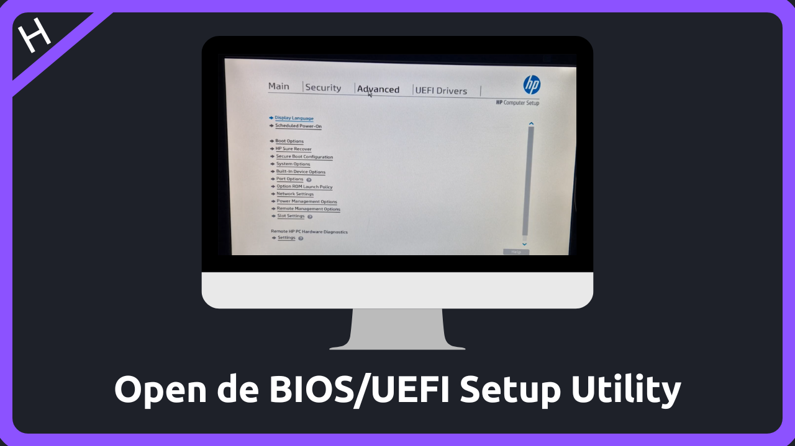
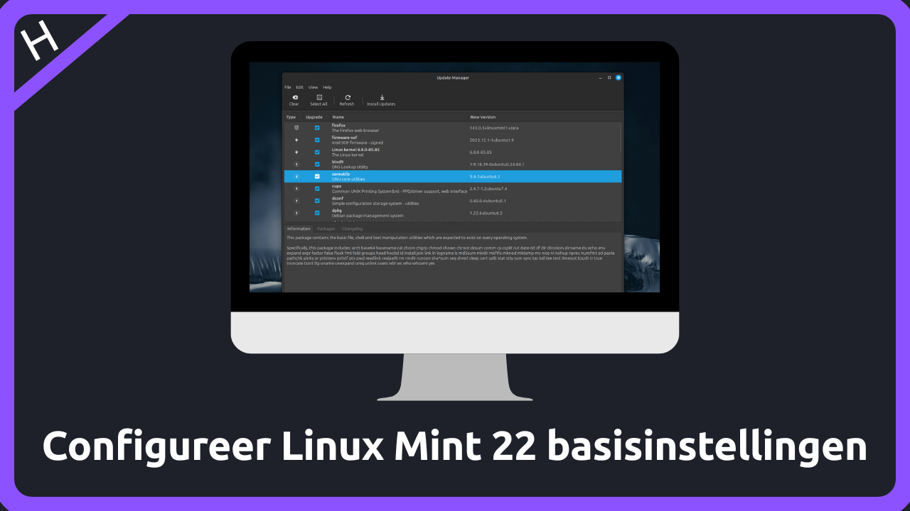
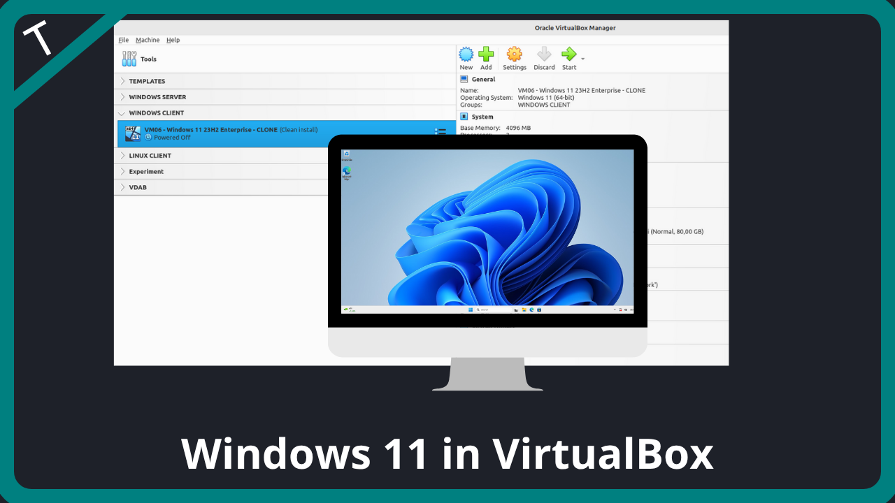
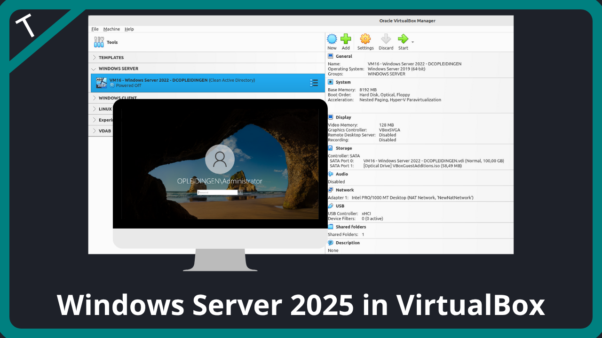

---
hide:
  - toc
---

# Welkom!
Van *kernel* tot *kabel*; tutorials en howto's over Linux en Cisco computernetwerken. Gebruik de "Search" rechtsboven.

<!---
// inline CSS to not display section title

-->

<!--- BLOG TEMPLATE 

> *September 26, 2022 - in [Blogs](blogs/index.md) - 5 min read*

Cras elementum metus quis est luctus, vitae tincidunt orci consequat. Maecenas at ipsum ac dui venenatis convallis. Morbi lobortis, purus vitae lobortis vehicula, metus velit cursus nisi, a placerat mi nunc id enim.

[Continue reading](blogs/YYYY/blog.md)
 
 
--->

<!--- TUTORIAL TEMPLATE

> *DD/MM/YY - in [Tutorials](tutorials/index.md) - X min handleiding*

Cras elementum metus quis est luctus, vitae tincidunt orci consequat. Maecenas at ipsum ac dui venenatis convallis. Morbi lobortis, purus vitae lobortis vehicula, metus velit cursus nisi, a placerat mi nunc id enim.

[Lees verder](tutorials/tutorial/index.md)
 
 
--->

<!--- ---------------------------------------------------------------------------------------------------------------- --->

<!--- HOWTO TEMPLATE

> *DD/MM/YY - in [Howtos](howtos/index.md) - X min instructie*

Cras elementum metus quis est luctus, vitae tincidunt orci consequat. Maecenas at ipsum ac dui venenatis convallis. Morbi lobortis, purus vitae lobortis vehicula, metus velit cursus nisi, a placerat mi nunc id enim.

[Lees verder](howtos/howto/index.md){:target="_blank"}
 
 
--->

=== "1"

    <!--- ---------------------------------------------------------------------------------------------------------------- --->

    
    > *15 Juni 2025 - in [Tutorials](tutorials/index.md) - 120 min handleiding*

    Deze handleiding begeleidt je stap voor stap bij het opzetten van een dual boot systeem met Windows 11 en Linux Mint 22 op één computer, specifiek geconfigureerd voor UEFI.

    [Lees verder](tutorials/setup-windows11-linuxmint22-dual-boot-uefi/index.md){:target="_blank"}
     
     

    <!--- ---------------------------------------------------------------------------------------------------------------- --->

    
    > *18 Juni 2025 - in [Howtos](howtos/index.md) - 1 min instructie*

    Download een Windows 11 multi-versie ISO-bestand om het besturingssysteem te verkrijgen in een enkel, comprimeerbaar bestand, geschikt voor het creëren...

    [Lees verder](howtos/download-windows11-multi-versie-iso/index.md){:target="_blank"}
     
     

    <!--- ---------------------------------------------------------------------------------------------------------------- --->

    
    > *20 Juni 2025 - in [Howtos](howtos/index.md) - 5 min instructie*

    Een gedownload Windows 11 ISO-bestand kan je best verifiëren op authenticiteit en integriteit. Hier vind je een stappenplan voor zowel Windows als Linux Mint.

    [Lees verder](howtos/verifieer-windows-iso/index.md){:target="_blank"}
     
     

    <!--- ---------------------------------------------------------------------------------------------------------------- --->

    
    > *22 Juni 2025 - in [Howtos](howtos/index.md) - 5 min instructie*

    Je hebt een opstartbare USB-stick voor Windows 11 nodig om het besturingssysteem te installeren op een nieuwe pc, een beschadigde installatie te repareren, ...

    [Lees verder](howtos/maak-opstartbare-usb-stick-windows11/index.md){:target="_blank"}
     
     

    <!--- ---------------------------------------------------------------------------------------------------------------- --->

    
    > *23 Juni 2025 - in [Howtos](howtos/index.md) - 2 min instructie*

    Download een Linux Mint ISO-installatiebestand om het besturingssysteem te verkrijgen in een handig, zelfstandig bestand, essentieel voor het maken...

    [Lees verder](howtos/download-linuxmint22-iso/index.md){:target="_blank"}
     
     

    <!--- ---------------------------------------------------------------------------------------------------------------- --->

    
    > *25 Juni 2025 - in [Howtos](howtos/index.md) - 5 min instructie*

    Een gedownload Linux Mint 22 ISO-bestand kan je best verifiëren op authenticiteit en integriteit. Deze stappen maken gebruik van cryptografische sleutels...

    [Lees verder](howtos/verifieer-linuxmint22-iso/index.md){:target="_blank"}
     
     

    <!--- ---------------------------------------------------------------------------------------------------------------- --->

    
    > *26 Juni 2025 - in [Howtos](howtos/index.md) - 5 min instructie*

    Je hebt een opstartbare USB-stick voor Linux Mint nodig om het besturingssysteem te installeren op een nieuwe pc, een beschadigde installatie te repareren, ...

    [Lees verder](howtos/maak-opstartbare-usb-stick-linuxmint22/index.md){:target="_blank"}
     
     

    <!--- ---------------------------------------------------------------------------------------------------------------- --->

    
    > *27 Juni 2025 - in [Howtos](howtos/index.md) - 1 min instructie*

    Binnen een BIOS/UEFI utility, dat toegankelijk is tijdens het opstarten van de computer, kun je essentiële hardware-instellingen configureren...

    [Lees verder](howtos/open-bios-uefi-setup-utility/index.md){:target="_blank"}
     
     

    <!--- ---------------------------------------------------------------------------------------------------------------- --->

    
    > *29 Juni 2025 - in [Howtos](howtos/index.md) - 1 min instructie*

    Binnen de BIOS/UEFI utility kun je belangrijke opstartinstellingen beheren, waaronder de Boot Mode, waarbij je kunt schakelen tussen UEFI...

    [Lees verder](howtos/configureer-opstartmodus-bios-uefi/index.md){:target="_blank"}
     
     

    <!--- ---------------------------------------------------------------------------------------------------------------- --->

    
    > *30 Juni 2025 - in [Howtos](howtos/index.md) - 2 min instructie*

    Veel moderne UEFI-firmware (vooral op laptops en desktops van fabrikanten zoals bv. HP, Dell, Lenovo en bij sommige moederbordfabrikanten) bevat...

    [Lees verder](howtos/wis-harde-schijf-bios-uefi/index.md){:target="_blank"}
     
     

=== "2"

    <!--- ---------------------------------------------------------------------------------------------------------------- --->

    
    > *02 Juli 2025 - in [Howtos](howtos/index.md) - 4 min instructie*

    Een schone installatie van Windows 11 is de meest grondige manier om het besturingssysteem te installeren, omdat...

    [Lees verder](howtos/installeer-windows11/index.md){:target="_blank"}
     
     

    <!--- ---------------------------------------------------------------------------------------------------------------- --->

    
    > *04 Juli 2025 - in [Howtos](howtos/index.md) - 1 min instructie*

    Na de installatie van Windows 11 configureer je de basisinstellingen door eerst de Windows Updates te controleren en te installeren om zeker te zijn van...

    [Lees verder](howtos/configureer-windows11-basisinstellingen/index.md){:target="_blank"}
     
     

    <!--- ---------------------------------------------------------------------------------------------------------------- --->

    
    > *05 Juli 2025 - in [Howtos](howtos/index.md) - 3 min instructie*

    Je installeert Linux Mint 22 voor een stabiel, veilig en gebruiksvriendelijk besturingssysteem dat een uitstekend alternatief biedt voor Windows of macOS...

    [Lees verder](howtos/installeer-linuxmint22/index.md){:target="_blank"}
     
     

    <!--- ---------------------------------------------------------------------------------------------------------------- --->

    
    > *07 Juli 2025 - in [Howtos](howtos/index.md) - 6 min instructie*

    Na de installatie van Linux Mint 22 configureer je de basisinstellingen door direct de Updatebeheerder te openen om...

    [Lees verder](howtos/configureer-linuxmint22-basisinstellingen/index.md){:target="_blank"}
     
     

    <!--- ---------------------------------------------------------------------------------------------------------------- --->

    
    > *08 Juli 2025 - in [Howtos](howtos/index.md) - 2 min instructie*

    Om een dual-boot omgeving te testen, start je je computer opnieuw op en let je goed op het opstartmenu (meestal GRUB of Windows Boot Manager) dat verschijnt.

    [Lees verder](howtos/test-dualboot-windows11-linuxmint22/index.md){:target="_blank"}
     
     

    <!--- ---------------------------------------------------------------------------------------------------------------- --->

    
    > *23 Juli 2025 - in [Howtos](howtos/index.md) - 2 min instructie*

    VirtualBox stelt je in staat om andere besturingssystemen (zoals Windows of een andere Linux-distributie) te draaien als virtuele machines binnen bv. een bestaande Linux Mint 22-omgeving...

    [Lees verder](howtos/setup-virtualbox7-linuxmint22-oracledeb/index.md){:target="_blank"}
     
     

    <!--- ---------------------------------------------------------------------------------------------------------------- --->

    
    > *09 Juli 2025 - in [Tutorials](tutorials/index.md) - 60 min handleiding*

    Deze handleiding begeleidt je stap voor stap bij het opzetten van een virtuele machine met Windows 11 in VirtualBox. Je leert hoe je de virtuele machine aanmaakt, ...

    [Lees verder](tutorials/setup-windows11-vm-virtualbox/index.md){:target="_blank"}
     
     

    <!--- ---------------------------------------------------------------------------------------------------------------- --->

    
    > *09 Juli 2025 - in [Howtos](howtos/index.md) - 1 min instructie*

    Een Windows 11 Enterprise Evaluation ISO-bestand is een speciale installatieversie van Windows 11 Enterprise die Microsoft aanbiedt voor proef- en evaluatiedoeleinden (90 dagen)...

    [Lees verder](howtos/download-windows11-evaluation-iso/index.md){:target="_blank"}
     
     

    <!--- ---------------------------------------------------------------------------------------------------------------- --->

    
    > *10 Juli 2025 - in [Howtos](howtos/index.md) - 2 min instructie*

    Het aanmaken van een lege virtuele machine (VM) voor Windows 11 omvat het reserveren van virtuele hardware binnen de hypervisor VirtualBox. Je moet de VM een naam geven...

    [Lees verder](howtos/maak-windows11-vm-virtualbox/index.md){:target="_blank"}
     
     

    <!--- ---------------------------------------------------------------------------------------------------------------- --->

    
    > *10 Juli 2025 - in [Howtos](howtos/index.md) - 2 min instructie*

    Na het initiële aanmaken van de virtuele machine (VM) kun je, vóór de eerste opstart, de VM-instellingen raadplegen en fijnafstemmen om de werking te optimaliseren en aan specifieke behoeften aan te passen. Dit omvat...

    [Lees verder](howtos/configureer-windows11-vm-virtualbox/index.md){:target="_blank"}
     
     

=== "3"

    <!--- ---------------------------------------------------------------------------------------------------------------- --->

    
    > *11 Juli 2025 - in [Howtos](howtos/index.md) - 5 min instructie*

    Nadat de virtuele machine (VM) is aangemaakt en geconfigureerd, start je deze voor de eerste keer op, waarbij de opstartvolgorde ervoor zorgt dat...

    [Lees verder](howtos/installeer-windows11-os-vm-virtualbox/index.md){:target="_blank"}
     
     

    <!--- ---------------------------------------------------------------------------------------------------------------- --->

    
    > *12 Juli 2025 - in [Howtos](howtos/index.md) - 2 min instructie*

    Na de installatie van Windows 11 voorzie je de Guest Additions. Deze zorgen voor de installatie van speciale stuurprogramma's voor de virtuele hardware, ...

    [Lees verder](howtos/installeer-guest-additions-windows11-vm-virtualbox/index.md){:target="_blank"}
     
     

    <!--- ---------------------------------------------------------------------------------------------------------------- --->

    
    > *14 Juli 2025 - in [Howtos](howtos/index.md) - 1 min instructie*

    Na de installatie van Windows 11 configureer je de basisinstellingen door eerst de Windows Updates te controleren en te installeren om zeker te zijn...

    [Lees verder](howtos/configureer-windows11-basisinstellingen-vm-virtualbox/index.md){:target="_blank"}
     
     

    <!--- ---------------------------------------------------------------------------------------------------------------- --->

    
    > *14 Juli 2025 - in [Howtos](howtos/index.md) - 2 min instructie*

    Het doel van een snapshot van een virtuele machine (VM) in VirtualBox is het vastleggen van de exacte toestand van de VM op een specifiek moment, inclusief...

    [Lees verder](howtos/maak-snapshot-windows11-vm-virtualbox-clean/index.md){:target="_blank"}
     
     

    <!--- ---------------------------------------------------------------------------------------------------------------- --->

    
    > *20 Juli 2025 - in [Howtos](howtos/index.md) - 4 min instructie*

    Sysprep verwijdert specifieke systeeminformatie, zoals de computer-SID, waardoor elke nieuwe virtuele machine die je aanmaakt een unieke identiteit heeft...

    [Lees verder](howtos/sysprep-windows11-vm-virtualbox/index.md){:target="_blank"}
     
     

    <!--- ---------------------------------------------------------------------------------------------------------------- --->

    
    > *22 Juli 2025 - in [Howtos](howtos/index.md) - 1 min instructie*

    Het doel van een snapshot van een virtuele machine (VM) in VirtualBox is het vastleggen van de exacte toestand van de VM op een specifiek moment, inclusief...

    [Lees verder](howtos/maak-snapshot-windows11-vm-virtualbox-sysprep/index.md){:target="_blank"}
     
     

    <!--- ---------------------------------------------------------------------------------------------------------------- --->

    
    > *22 Juli 2025 - in [Tutorials](tutorials/index.md) - 60 min handleiding*

    Deze handleiding begeleidt je stap voor stap bij het opzetten van een virtuele machine met Windows Server 2025 in VirtualBox. Je leert hoe je de virtuele machine aanmaakt, ...

    [Lees verder](tutorials/setup-windows-server2025-vm-virtualbox/index.md){:target="_blank"}
     
     

    <!--- ---------------------------------------------------------------------------------------------------------------- --->

    
    > *23 Juli 2025 - in [Howtos](howtos/index.md) - 1 min instructie*

    Een Windows Server 2025 ISO-bestand is een speciale installatieversie van Windows Server die Microsoft aanbiedt voor proef- en evaluatiedoeleinden (180 dagen). Het is specifiek bedoeld voor...

    [Lees verder](howtos/download-windows-server2025-evaluation-iso/index.md){:target="_blank"}
     
     

    <!--- ---------------------------------------------------------------------------------------------------------------- --->

    
    > *26 Juli 2025 - in [Howtos](howtos/index.md) - 1 min instructie*

    Het aanmaken van een lege virtuele machine (VM) voor Windows Server 2025 omvat het reserveren van virtuele hardware binnen de hypervisor VirtualBox.

    [Lees verder](howtos/maak-windows-server2025-vm-virtualbox/index.md){:target="_blank"}
     
     

    <!--- ---------------------------------------------------------------------------------------------------------------- --->

    
    > *27 Juli 2025 - in [Howtos](howtos/index.md) - 2 min instructie*

    Na het initiële aanmaken van de virtuele machine (VM) kun je, vóór de eerste opstart, de VM-instellingen raadplegen en fijnafstemmen om de werking te optimaliseren en aan specifieke behoeften aan te passen.

    [Lees verder](howtos/configureer-windows-server2025-vm-virtualbox/index.md){:target="_blank"}
     
     

=== "4"

    <!--- ---------------------------------------------------------------------------------------------------------------- --->

    
    > *29 Juli 2025 - in [Howtos](howtos/index.md) - 3 min instructie*

    Nadat de virtuele machine (VM) is aangemaakt en geconfigureerd, start je deze voor de eerste keer op, waarbij de opstartvolgorde ervoor zorgt dat de VM vanaf de gekoppelde Windows Server 2025 installatie-ISO opstart. 

    [Lees verder](howtos/installeer-windows-server2025-os-vm-virtualbox/index.md){:target="_blank"}
     
     

    <!--- ---------------------------------------------------------------------------------------------------------------- --->

    
    > *31 Juli 2025 - in [Howtos](howtos/index.md) - 2 min instructie*

    Na de installatie van Windows Server 2025 voorzie je de Guest Additions. Deze zorgen voor de installatie van speciale stuurprogramma's voor de virtuele hardware, waardoor cruciale functies zoals...

    [Lees verder](howtos/installeer-guest-additions-windows-server2025-vm-virtualbox/index.md){:target="_blank"}
     
     

    <!--- ---------------------------------------------------------------------------------------------------------------- --->

    
    > *02 Augustus 2025 - in [Howtos](howtos/index.md) - 2 min instructie*

    Na de installatie van Windows Server 2025 configureer je de basisinstellingen door eerst de Windows Updates te controleren en te installeren om zeker te zijn van de nieuwste beveiligingspatches en functionaliteiten.

    [Lees verder](howtos/configureer-windows-server2025-basisinstellingen-vm-virtualbox/index.md){:target="_blank"}
     
     

    <!--- ---------------------------------------------------------------------------------------------------------------- --->

    
    > *02 Augustus 2025 - in [Howtos](howtos/index.md) - 2 min instructie*

    Het doel van een snapshot van een virtuele machine (VM) in VirtualBox is het vastleggen van de exacte toestand van de VM op een specifiek moment, inclusief alle bestanden en instellingen.

    [Lees verder](howtos/maak-snapshot-windows-server2025-vm-virtualbox-clean/index.md){:target="_blank"}
     
     

    <!--- ---------------------------------------------------------------------------------------------------------------- --->

    
    > *07 Augustus 2025 - in [Howtos](howtos/index.md) - 2 min instructie*

    Minicom is een populair terminalprogramma voor Unix-achtige besturingssystemen dat wordt gebruikt om te communiceren met seriële apparaten, zoals routers, ...

    [Lees verder](howtos/setup-minicom-linuxmint22/index.md){:target="_blank"}
     
     

    <!--- ---------------------------------------------------------------------------------------------------------------- --->

    
    > *11 Augustus 2025 - in [Howtos](howtos/index.md) - 2 min instructie*

    De ROMMON-modus (ROM Monitor) is essentieel omdat het fungeert als een noodhulpprogramma voor Cisco-apparaten. Je hebt het nodig wanneer het apparaat niet normaal kan opstarten...

    [Lees verder](howtos/toegang-cisco-rommon/index.md){:target="_blank"}
     
     
