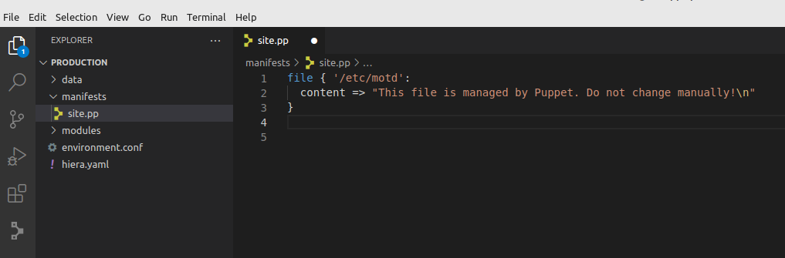

# Install Visual Studio Code

## step1: enable Microsoft repo and refresh package list
``` bash title="guru1@vm1:-$ _"
wget -qO- https://packages.microsoft.com/keys/microsoft.asc | gpg --dearmor > packages.microsoft.gpg
sudo install -o root -g root -m 644 packages.microsoft.gpg /etc/apt/trusted.gpg.d/
sudo sh -c 'echo "deb [arch=amd64,arm64,armhf signed-by=/etc/apt/trusted.gpg.d/packages.microsoft.gpg] https://packages.microsoft.com/repos/code stable main" > /etc/apt/sources.list.d/vscode.list'
rm -f packages.microsoft.gpg
sudo apt-get update
```

## step2: install the package
``` bash title="guru1@vm1:-$ _"
sudo apt-get install code
```

## step3: only 'root' can write in the "manifest and modules" directories
=== "command"

    ``` bash title="guru1@vm1:-$ _"
    sudo apt-get install tree
    tree -ugp /etc/puppetlabs/code/environments/production/
    ```

=== "output"

    ``` bash title="/etc/puppetlabs/code/environments/production/"
    ├── [drwxr-xr-x root     root    ]  data
    ├── [-rw-r--r-- root     root    ]  environment.conf
    ├── [-rw-r--r-- root     root    ]  hiera.yaml
    ├── [drwxr-xr-x root     root    ]  manifests
    └── [drwxr-xr-x root     root    ]  modules

    3 directories, 2 files
    ```

## step4: quick fix
``` bash title="guru1@vm1:-$ _"
sudo chmod o+w /etc/puppetlabs/code/environments/production/{manifests,modules}
```

## step5: open Visual Studio Code in the production directory
``` bash title="guru1@vm1:-$ _"
cd /etc/puppetlabs/code/environments/production/
code .
```

## step6: configure Visual Studio Code
- Trust the author of all files...
- Close the "Get Started" tab
- Create site.pp + Search marketplace
- Select "Puppet: the Official Puppet VSCode extension
- Click "Install"
- Click "Don't show again"
- Close the "Extension: Puppet" tab

## step7: writing your first main manifest
- Don't forget to File -> Save (All)

<kbd> [](../../assets/images/puppet/hands-on-5/first-manifest.png) </kbd>

## step8: run puppet manually (apply catalog)
``` bash title="guru2@vm2:-$ _"
sudo puppet agent --server=vm1.opensysadmins.lab --no-daemonize --verbose --onetime
```