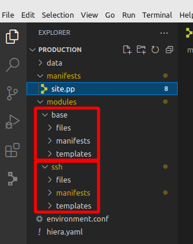
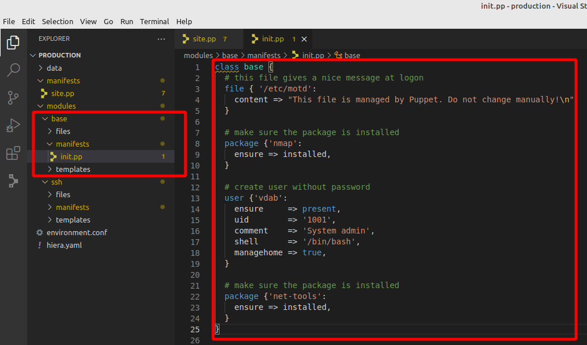
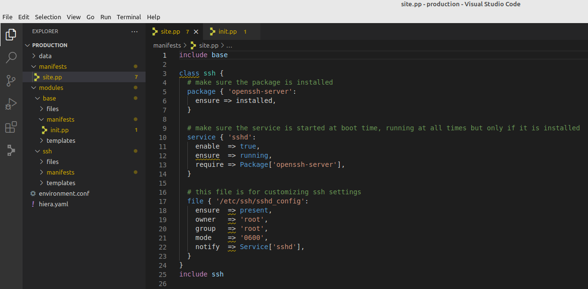
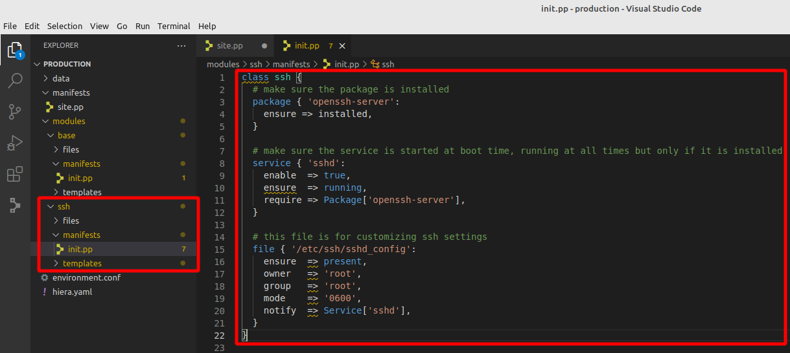
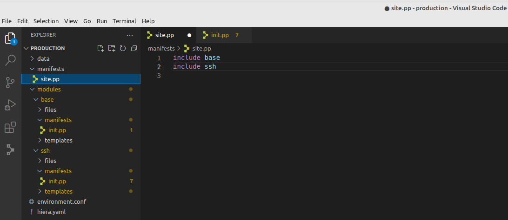
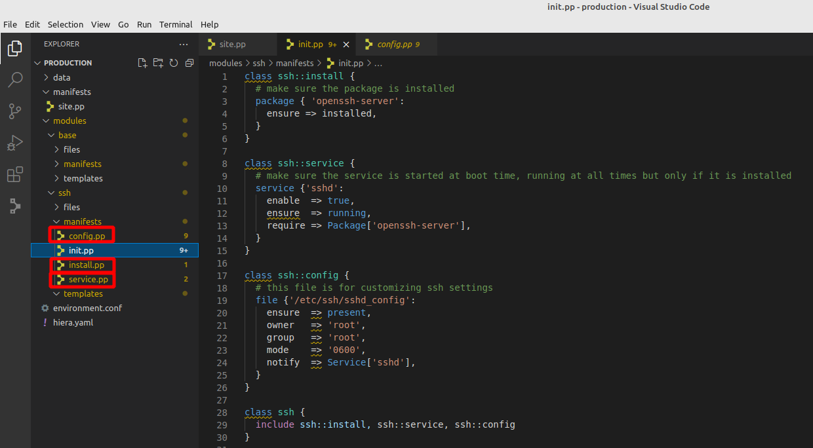
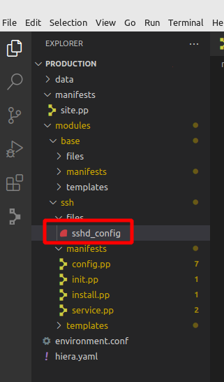
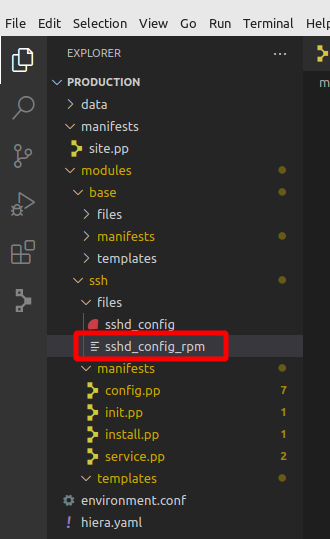

# Expand manifest and refactor

## step1: document your code
``` puppet title="site.pp"
# this file gives a nice message at logon
file { '/etc/motd':
  content => "This file is managed by Puppet. Do not change manually!\n"
}
```

## step2: add a package resource
``` puppet title="site.pp"
# this file gives a nice message at logon
file { '/etc/motd':
  content => "This file is managed by Puppet. Do not change manually!\n"
}

# make sure the package is installed
package { 'nmap':
  ensure => installed,
}
```

## step3: add another package
``` puppet title="site.pp"
# this file gives a nice message at logon
file { '/etc/motd':
  content => "This file is managed by Puppet. Do not change manually!\n"
}

# make sure the package is installed
package { 'nmap':
  ensure => installed,
}

# make sure the package is installed
package { 'net-tools':
  ensure => installed,
}
```

## step4: refactor - bundle packages
``` puppet title="site.pp"
# this file gives a nice message at logon
file { '/etc/motd':
  content => "This file is managed by Puppet. Do not change manually!\n"
}

# make sure the packages are installed
package {[  'nmap',
            'net-tools' ]:
  ensure => installed,
}
```

## step5: create an user resource
``` puppet title="site.pp"
# this file gives a nice message at logon
file { '/etc/motd':
  content => "This file is managed by Puppet. Do not change manually!\n"
}

# make sure the packages are installed
package {[  'nmap',
            'net-tools' ]:
  ensure => installed,
}

# create user without password
user { 'vdab':
  ensure     => present,
  uid        => '1001',
  comment    => 'System admin',
  shell      => '/bin/bash',
  managehome => true,
}
```

## step6: add a package (that runs a service)
``` puppet title="site.pp"
# this file gives a nice message at logon
file { '/etc/motd':
  content => "This file is managed by Puppet. Do not change manually!\n"
}

# make sure the packages are installed
package {[  'nmap',
            'net-tools' ]:
  ensure => installed,
}

# create user without password
user { 'vdab':
  ensure     => present,
  uid        => '1001',
  comment    => 'System admin',
  shell      => '/bin/bash',
  managehome => true,
}

# make sure the package is installed
package { 'openssh-server':
  ensure => installed,
```

## step7: manage the service - first time "dependency"
``` puppet title="site.pp"
# this file gives a nice message at logon
file { '/etc/motd':
  content => "This file is managed by Puppet. Do not change manually!\n"
}

# make sure the packages are installed
package {[  'nmap',
            'net-tools' ]:
  ensure => installed,
}

# create user without password
user { 'vdab':
  ensure     => present,
  uid        => '1001',
  comment    => 'System admin',
  shell      => '/bin/bash',
  managehome => true,
}

# make sure the package is installed
package { 'openssh-server':
  ensure => installed,

# make sure the service is started at boot time, running at all times but only if it is installed
service { 'sshd':
  enable  => true,
  ensure  => running,
  require => Package['openssh-server'],
}
```

## step8: manage the configuration of the service
``` puppet title="site.pp"
# this file gives a nice message at logon
file { '/etc/motd':
  content => "This file is managed by Puppet. Do not change manually!\n"
}

# make sure the packages are installed
package {[  'nmap',
            'net-tools' ]:
  ensure => installed,
}

# create user without password
user { 'vdab':
  ensure     => present,
  uid        => '1001',
  comment    => 'System admin',
  shell      => '/bin/bash',
  managehome => true,
}

# make sure the package is installed
package { 'openssh-server':
  ensure => installed,
}

# make sure the service is started at boot time, running at all times but only if it is installed
service { 'sshd':
  enable  => true,
  ensure  => running,
  require => Package['openssh-server'],
}

# this file is for customizing ssh settings
file { '/etc/ssh/sshd_config':
  ensure  => present,
  owner   => 'root',
  group   => 'root',
  mode    => '0600',
  notify  => Service['sshd'],
}
```

## step9: bundle base resources into a base class
``` puppet title="site.pp"
class base {
  # this file gives a nice message at logon
  file { '/etc/motd':
    content => "This file is managed by Puppet. Do not change manually!\n"
  }

  # make sure the packages are installed
  package {[  'nmap',
              'net-tools' ]:
    ensure => installed,
  }

  # create user without password
  user { 'vdab':
    ensure     => present,
    uid        => '1001',
    comment    => 'System admin',
    shell      => '/bin/bash',
    managehome => true,
  }
}
include base

# make sure the package is installed
package { 'openssh-server':
  ensure => installed,
}

# make sure the service is started at boot time, running at all times but only if it is installed
service { 'sshd':
  enable  => true,
  ensure  => running,
  require => Package['openssh-server'],
}

# this file is for customizing ssh settings
file { '/etc/ssh/sshd_config':
  ensure  => present,
  owner   => 'root',
  group   => 'root',
  mode    => '0600',
  notify  => Service['sshd'],
}
```

## step10: bundle ssh resources into a ssh class
``` puppet title="site.pp"
class base {
  # this file gives a nice message at logon
  file { '/etc/motd':
    content => "This file is managed by Puppet. Do not change manually!\n"
  }

  # make sure the packages are installed
  package {[  'nmap',
              'net-tools' ]:
    ensure => installed,
  }

  # create user without password
  user { 'vdab':
    ensure     => present,
    uid        => '1001',
    comment    => 'System admin',
    shell      => '/bin/bash',
    managehome => true,
  }
}
include base

class ssh {
  # make sure the package is installed
  package { 'openssh-server':
    ensure => installed,
  }

  # make sure the service is started at boot time, running at all times but only if it is installed
  service { 'sshd':
    enable  => true,
    ensure  => running,
    require => Package['openssh-server'],
  }

  # this file is for customizing ssh settings
  file { '/etc/ssh/sshd_config':
    ensure  => present,
    owner   => 'root',
    group   => 'root',
    mode    => '0600',
    notify  => Service['sshd'],
  }
}
include ssh
```

## step11: create this folder structure
<kbd> [](../../assets/images/puppet/hands-on-6/refactor1.png) </kbd>

## step12: extract the base class
=== "init.pp"

    Create a file "init.pp" in directory "base/manifests", cut the "base" class code out of site.pp and paste into init.pp

    <kbd> [](../../assets/images/puppet/hands-on-6/refactor2a.png) </kbd>

=== "site.pp"

    Left over after cutting the "base" class.

    <kbd> [](../../assets/images/puppet/hands-on-6/refactor2b.png) </kbd>

## step13: extract the ssh class
=== "init.pp"

    Create a file "init.pp" in directory "ssh/manifests", cut the "ssh" class code out of site.pp and paste into init.pp

    <kbd> [](../../assets/images/puppet/hands-on-6/refactor3a.png) </kbd>

=== "site.pp"

    Left over after cutting the "ssh" class.

    <kbd> [](../../assets/images/puppet/hands-on-6/refactor3b.png) </kbd>


## step14: introduction to "node"
``` puppet title="site.pp"
node 'vm2.opensysadmins.lab' {
  include base
  include ssh
}
```

## step15: let's refactor the ssh class further
- Create new empty files install.pp, service.pp and configure.pp
- Adjust ssh/manifests/init.pp with the "name space syntax"

<kbd> [](../../assets/images/puppet/hands-on-6/refactor4.png) </kbd>

## step16: extract the install, service and config class into their files
=== "init.pp"

    ``` puppet title=""
    class ssh {
        include ssh::install, ssh::service, ssh::config
    }
    ```

=== "install.pp"

    ``` puppet title=""
    class ssh::install {
        # make sure the package is installed
        package { 'openssh-server':
            ensure => installed,
        }
    }
    ```

=== "service.pp"

    ``` puppet title=""
    class ssh::service {
        # make sure the service is started at boot time, running at all times but only if it is installed
        service {'sshd':
            enable  => true,
            ensure  => running,
            require => Package['openssh-server'],
        }
    }
    ```

=== "config.pp"

    ``` puppet title=""
    class ssh::config {
        # this file is for customizing ssh settings
        file {'/etc/ssh/sshd_config':
            ensure  => present,
            owner   => 'root',
            group   => 'root',
            mode    => '0600',
            notify  => Service['sshd'],
        }
    }
    ```

## step17: push a file to the puppet-agent
=== "file"
    - Create new empty file sshd_config
    - Fill it with the "contents"

    <kbd> [](../../assets/images/puppet/hands-on-6/push-ssh-config.png) </kbd>

=== "contents"
    - Added header
    - Changed listening port

    ``` bash title="sshd_config" hl_lines="1 2 3 18"
    #
    # This file is managed by Puppet. Any changes will be overwritten!!!
    #
    #	$OpenBSD: sshd_config,v 1.103 2018/04/09 20:41:22 tj Exp $

    # This is the sshd server system-wide configuration file.  See
    # sshd_config(5) for more information.

    # This sshd was compiled with PATH=/usr/bin:/bin:/usr/sbin:/sbin

    # The strategy used for options in the default sshd_config shipped with
    # OpenSSH is to specify options with their default value where
    # possible, but leave them commented.  Uncommented options override the
    # default value.

    Include /etc/ssh/sshd_config.d/*.conf

    Port 2222
    #AddressFamily any
    #ListenAddress 0.0.0.0
    #ListenAddress ::

    #HostKey /etc/ssh/ssh_host_rsa_key
    #HostKey /etc/ssh/ssh_host_ecdsa_key
    #HostKey /etc/ssh/ssh_host_ed25519_key

    # Ciphers and keying
    #RekeyLimit default none

    # Logging
    #SyslogFacility AUTH
    #LogLevel INFO

    # Authentication:

    #LoginGraceTime 2m
    #PermitRootLogin prohibit-password
    #StrictModes yes
    #MaxAuthTries 6
    #MaxSessions 10

    #PubkeyAuthentication yes

    # Expect .ssh/authorized_keys2 to be disregarded by default in future.
    #AuthorizedKeysFile	.ssh/authorized_keys .ssh/authorized_keys2

    #AuthorizedPrincipalsFile none

    #AuthorizedKeysCommand none
    #AuthorizedKeysCommandUser nobody

    # For this to work you will also need host keys in /etc/ssh/ssh_known_hosts
    #HostbasedAuthentication no
    # Change to yes if you don't trust ~/.ssh/known_hosts for
    # HostbasedAuthentication
    #IgnoreUserKnownHosts no
    # Don't read the user's ~/.rhosts and ~/.shosts files
    #IgnoreRhosts yes

    # To disable tunneled clear text passwords, change to no here!
    #PasswordAuthentication yes
    #PermitEmptyPasswords no

    # Change to yes to enable challenge-response passwords (beware issues with
    # some PAM modules and threads)
    ChallengeResponseAuthentication no

    # Kerberos options
    #KerberosAuthentication no
    #KerberosOrLocalPasswd yes
    #KerberosTicketCleanup yes
    #KerberosGetAFSToken no

    # GSSAPI options
    #GSSAPIAuthentication no
    #GSSAPICleanupCredentials yes
    #GSSAPIStrictAcceptorCheck yes
    #GSSAPIKeyExchange no

    # Set this to 'yes' to enable PAM authentication, account processing,
    # and session processing. If this is enabled, PAM authentication will
    # be allowed through the ChallengeResponseAuthentication and
    # PasswordAuthentication.  Depending on your PAM configuration,
    # PAM authentication via ChallengeResponseAuthentication may bypass
    # the setting of "PermitRootLogin without-password".
    # If you just want the PAM account and session checks to run without
    # PAM authentication, then enable this but set PasswordAuthentication
    # and ChallengeResponseAuthentication to 'no'.
    UsePAM yes

    #AllowAgentForwarding yes
    #AllowTcpForwarding yes
    #GatewayPorts no
    X11Forwarding yes
    #X11DisplayOffset 10
    #X11UseLocalhost yes
    #PermitTTY yes
    PrintMotd no
    #PrintLastLog yes
    #TCPKeepAlive yes
    #PermitUserEnvironment no
    #Compression delayed
    #ClientAliveInterval 0
    #ClientAliveCountMax 3
    #UseDNS no
    #PidFile /var/run/sshd.pid
    #MaxStartups 10:30:100
    #PermitTunnel no
    #ChrootDirectory none
    #VersionAddendum none

    # no default banner path
    #Banner none

    # Allow client to pass locale environment variables
    AcceptEnv LANG LC_*

    # override default of no subsystems
    Subsystem	sftp	/usr/lib/openssh/sftp-server

    # Example of overriding settings on a per-user basis
    #Match User anoncvs
    #	X11Forwarding no
    #	AllowTcpForwarding no
    #	PermitTTY no
    #	ForceCommand cvs server
    ```

## step18: adjust config
``` puppet title="config.pp" hl_lines="9"
    class ssh::config {
    # this file is for customizing ssh settings
    file {'/etc/ssh/sshd_config':
        ensure  => present,
        owner   => 'root',
        group   => 'root',
        mode    => '0600',
        notify  => Service['sshd'],
        source  => 'puppet:///modules/ssh/sshd_config',
    }
    }
```

## step19: push a file to the puppet-agent based on OS
=== "file"
    - Create new empty file sshd_config_rpm
    - Fill it with the "contents"

    <kbd> [](../../assets/images/puppet/hands-on-6/push-ssh-config-rpm.png) </kbd>

=== "contents"
    - Added header

    ``` bash title="sshd_config" hl_lines="1 2 3"
    #
    # This file is managed by Puppet. Any changes will be overwritten!!!
    #
    #	$OpenBSD: sshd_config,v 1.103 2018/04/09 20:41:22 tj Exp $

    # This is the sshd server system-wide configuration file.  See
    # sshd_config(5) for more information.

    # This sshd was compiled with PATH=/usr/local/bin:/usr/bin:/usr/local/sbin:/usr/sbin

    # The strategy used for options in the default sshd_config shipped with
    # OpenSSH is to specify options with their default value where
    # possible, but leave them commented.  Uncommented options override the
    # default value.

    # If you want to change the port on a SELinux system, you have to tell
    # SELinux about this change.
    # semanage port -a -t ssh_port_t -p tcp #PORTNUMBER
    #
    #Port 22
    #AddressFamily any
    #ListenAddress 0.0.0.0
    #ListenAddress ::

    HostKey /etc/ssh/ssh_host_rsa_key
    HostKey /etc/ssh/ssh_host_ecdsa_key
    HostKey /etc/ssh/ssh_host_ed25519_key

    # Ciphers and keying
    #RekeyLimit default none

    # This system is following system-wide crypto policy. The changes to
    # crypto properties (Ciphers, MACs, ...) will not have any effect here.
    # They will be overridden by command-line options passed to the server
    # on command line.
    # Please, check manual pages for update-crypto-policies(8) and sshd_config(5).

    # Logging
    #SyslogFacility AUTH
    SyslogFacility AUTHPRIV
    #LogLevel INFO

    # Authentication:

    #LoginGraceTime 2m
    PermitRootLogin yes
    #StrictModes yes
    #MaxAuthTries 6
    #MaxSessions 10

    #PubkeyAuthentication yes

    # The default is to check both .ssh/authorized_keys and .ssh/authorized_keys2
    # but this is overridden so installations will only check .ssh/authorized_keys
    AuthorizedKeysFile	.ssh/authorized_keys

    #AuthorizedPrincipalsFile none

    #AuthorizedKeysCommand none
    #AuthorizedKeysCommandUser nobody

    # For this to work you will also need host keys in /etc/ssh/ssh_known_hosts
    #HostbasedAuthentication no
    # Change to yes if you don't trust ~/.ssh/known_hosts for
    # HostbasedAuthentication
    #IgnoreUserKnownHosts no
    # Don't read the user's ~/.rhosts and ~/.shosts files
    #IgnoreRhosts yes

    # To disable tunneled clear text passwords, change to no here!
    #PasswordAuthentication yes
    #PermitEmptyPasswords no
    PasswordAuthentication yes

    # Change to no to disable s/key passwords
    #ChallengeResponseAuthentication yes
    ChallengeResponseAuthentication no

    # Kerberos options
    #KerberosAuthentication no
    #KerberosOrLocalPasswd yes
    #KerberosTicketCleanup yes
    #KerberosGetAFSToken no
    #KerberosUseKuserok yes

    # GSSAPI options
    GSSAPIAuthentication yes
    GSSAPICleanupCredentials no
    #GSSAPIStrictAcceptorCheck yes
    #GSSAPIKeyExchange no
    #GSSAPIEnablek5users no

    # Set this to 'yes' to enable PAM authentication, account processing,
    # and session processing. If this is enabled, PAM authentication will
    # be allowed through the ChallengeResponseAuthentication and
    # PasswordAuthentication.  Depending on your PAM configuration,
    # PAM authentication via ChallengeResponseAuthentication may bypass
    # the setting of "PermitRootLogin without-password".
    # If you just want the PAM account and session checks to run without
    # PAM authentication, then enable this but set PasswordAuthentication
    # and ChallengeResponseAuthentication to 'no'.
    # WARNING: 'UsePAM no' is not supported in Fedora and may cause several
    # problems.
    UsePAM yes

    #AllowAgentForwarding yes
    #AllowTcpForwarding yes
    #GatewayPorts no
    X11Forwarding yes
    #X11DisplayOffset 10
    #X11UseLocalhost yes
    #PermitTTY yes

    # It is recommended to use pam_motd in /etc/pam.d/sshd instead of PrintMotd,
    # as it is more configurable and versatile than the built-in version.
    PrintMotd no

    #PrintLastLog yes
    #TCPKeepAlive yes
    #PermitUserEnvironment no
    #Compression delayed
    #ClientAliveInterval 0
    #ClientAliveCountMax 3
    #UseDNS no
    #PidFile /var/run/sshd.pid
    #MaxStartups 10:30:100
    #PermitTunnel no
    #ChrootDirectory none
    #VersionAddendum none

    # no default banner path
    #Banner none

    # Accept locale-related environment variables
    AcceptEnv LANG LC_CTYPE LC_NUMERIC LC_TIME LC_COLLATE LC_MONETARY LC_MESSAGES
    AcceptEnv LC_PAPER LC_NAME LC_ADDRESS LC_TELEPHONE LC_MEASUREMENT
    AcceptEnv LC_IDENTIFICATION LC_ALL LANGUAGE
    AcceptEnv XMODIFIERS

    # override default of no subsystems
    Subsystem	sftp	/usr/libexec/openssh/sftp-server

    # Example of overriding settings on a per-user basis
    #Match User anoncvs
    #	X11Forwarding no
    #	AllowTcpForwarding no
    #	PermitTTY no
    #	ForceCommand cvs server
    ```

## step20: use conditional logic to determine file source
``` puppet title="config.pp" hl_lines="9 10 11"
    class ssh::config {
    # this file is for customizing ssh settings
    file {'/etc/ssh/sshd_config':
        ensure  => present,
        owner   => 'root',
        group   => 'root',
        mode    => '0600',
        notify  => Service['sshd'],
        source  => $osfamily ? {
        /(Ubuntu|Debian)/        => 'puppet:///modules/ssh/sshd_config',
        /(RedHat|CentOS|Fedora)/ => 'puppet:///modules/ssh/sshd_config_rpm',
        },
    }
    }
```