# Installation VirtualBox

## Download
Huidige versie: 6.1.34 (op 25/4/22)

<kbd> [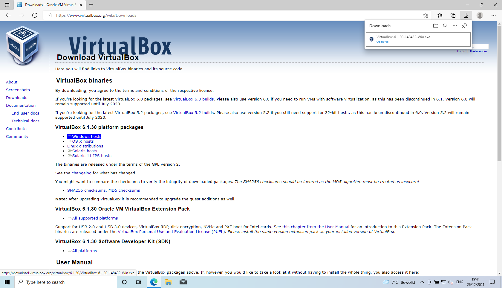](../../assets/images/virtualbox-windows/install-vb/download.png) </kbd>

## Welcome
<kbd> [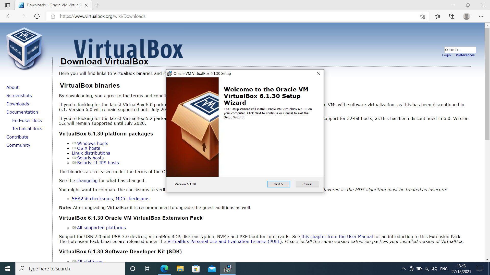](../../assets/images/virtualbox-windows/install-vb/welcome.png) </kbd>

## Features
<kbd> [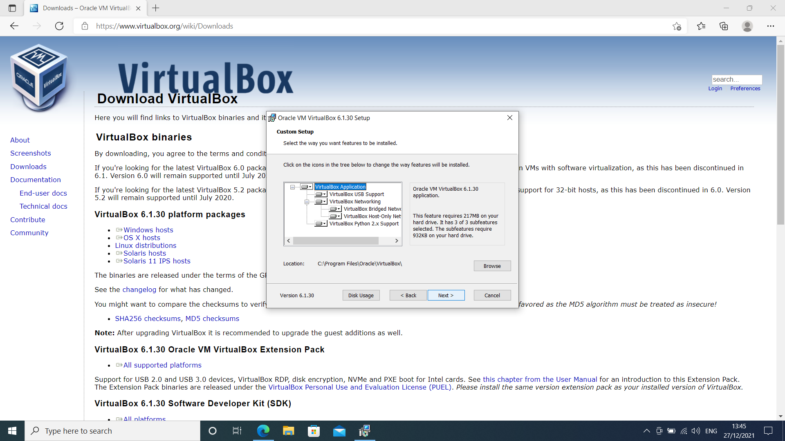](../../assets/images/virtualbox-windows/install-vb/features.png) </kbd>

## Options
<kbd> [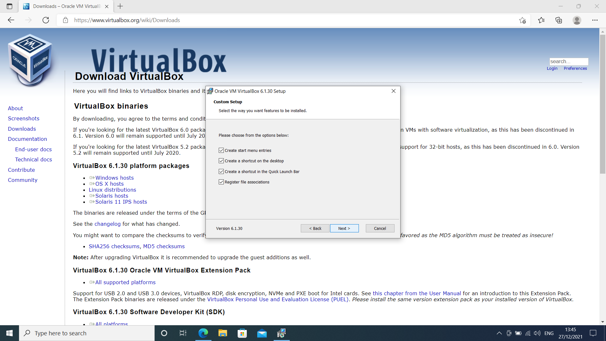](../../assets/images/virtualbox-windows/install-vb/options.png) </kbd>

## Network warning
<kbd> [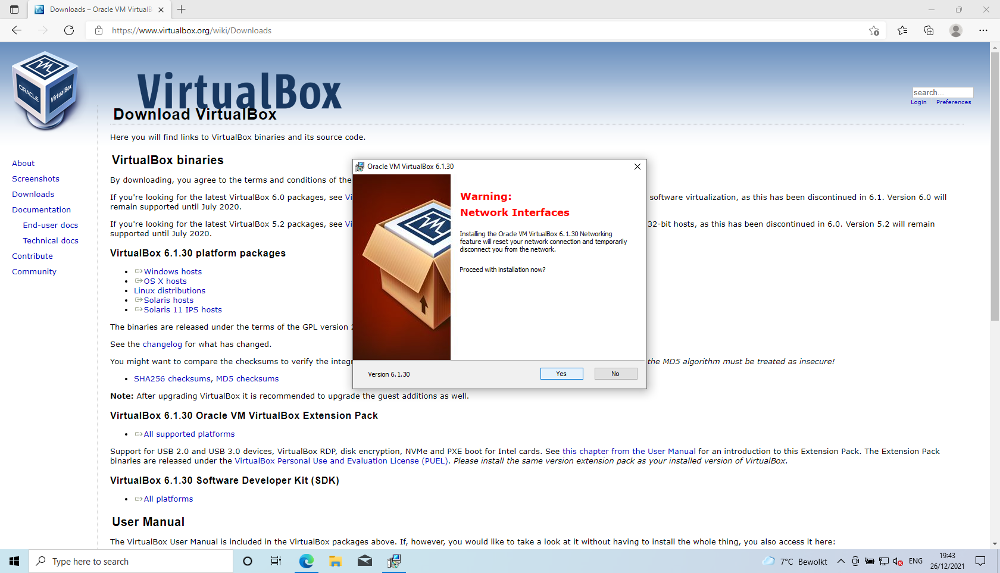](../../assets/images/virtualbox-windows/install-vb/network-warning.png) </kbd>

## Ready to install
<kbd> [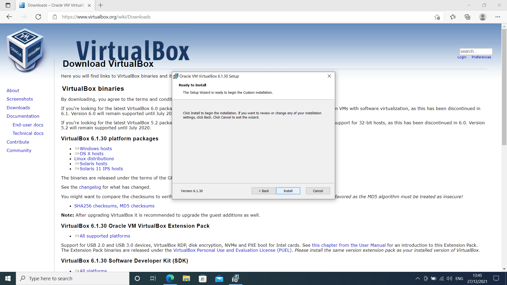](../../assets/images/virtualbox-windows/install-vb/ready-to-install.png) </kbd>

## Trust Oracle Corporation
<kbd> [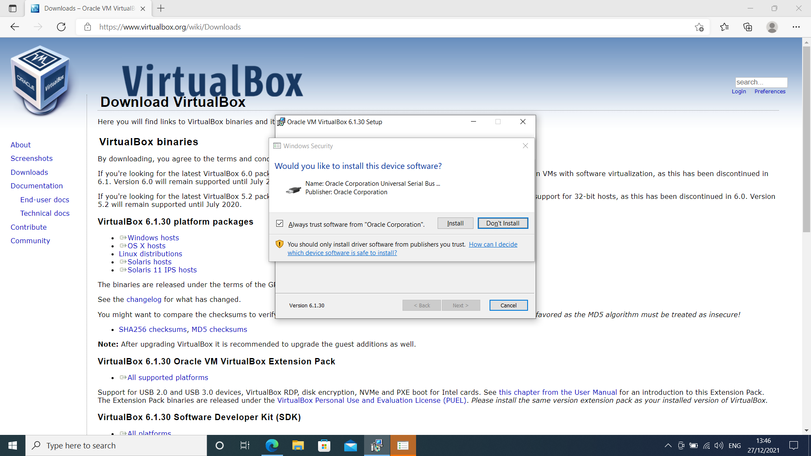](../../assets/images/virtualbox-windows/install-vb/trust-oracle-corporation.png) </kbd>

## Microsoft Windows UAC
<kbd> [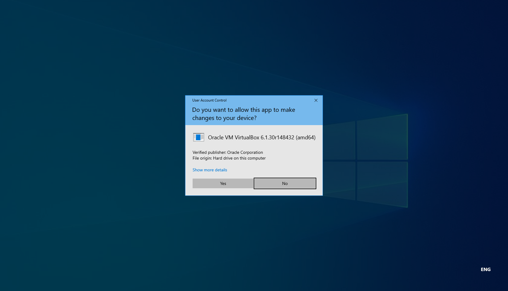](../../assets/images/virtualbox-windows/install-vb/microsoft-windows-uac.png) </kbd>

## Installing
<kbd> [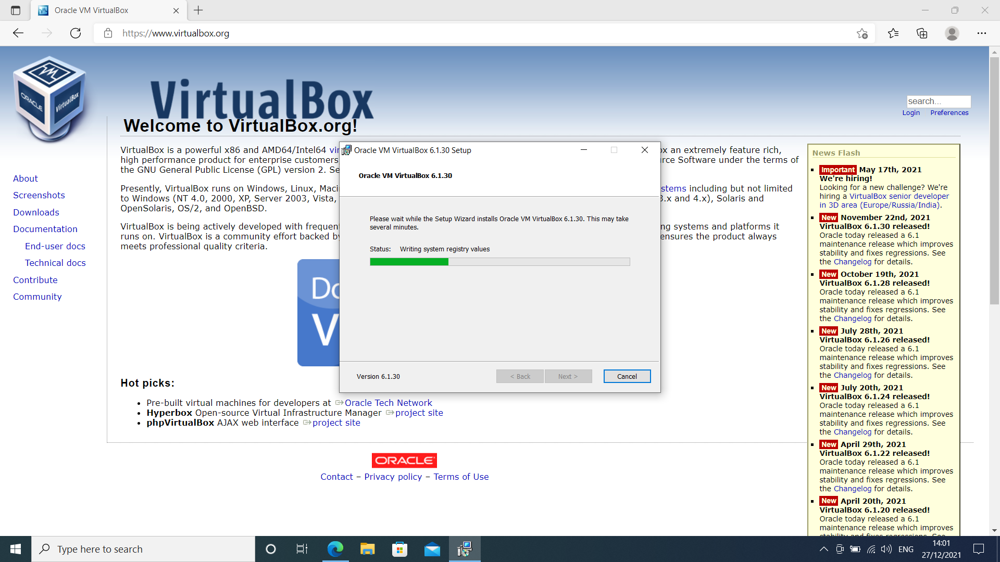](../../assets/images/virtualbox-windows/install-vb/installing.png) </kbd>

## Completed
<kbd> [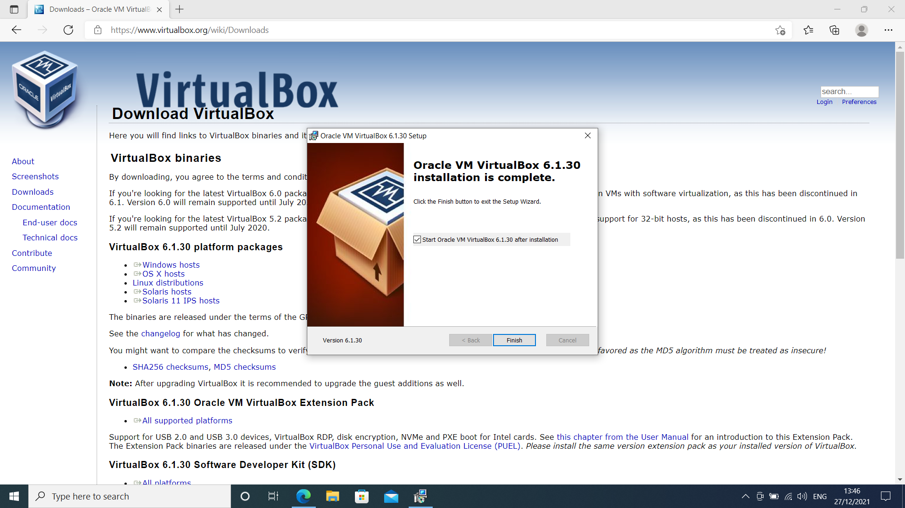](../../assets/images/virtualbox-windows/install-vb/completed.png) </kbd>

## Clean VirtualBox
<kbd> [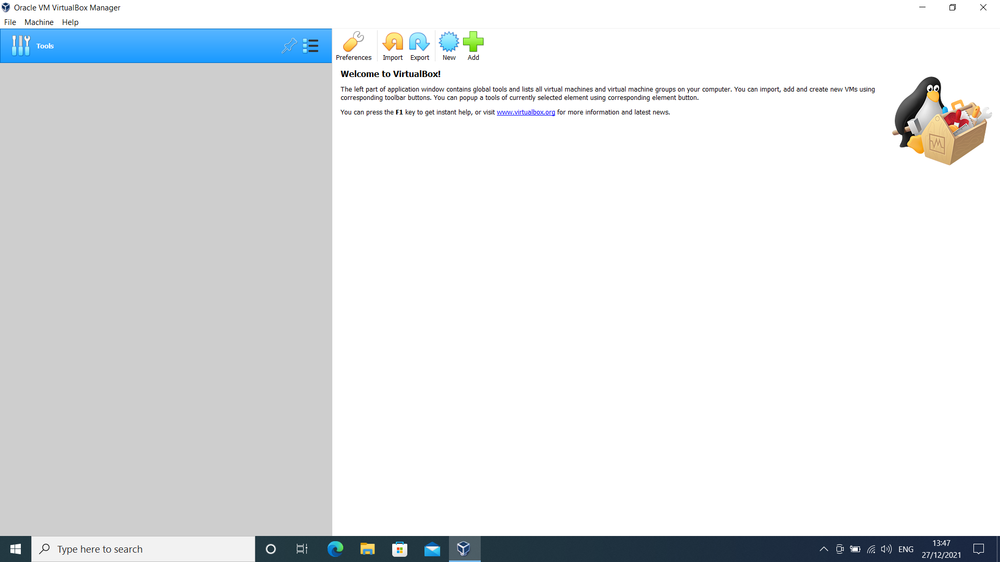](../../assets/images/virtualbox-windows/install-vb/clean-virtualbox.png) </kbd>