# Creation virtual machines

## Linux Mint 20.x

=== "Step1"

    <kbd>  </kbd>

=== "Step2"

    <kbd> [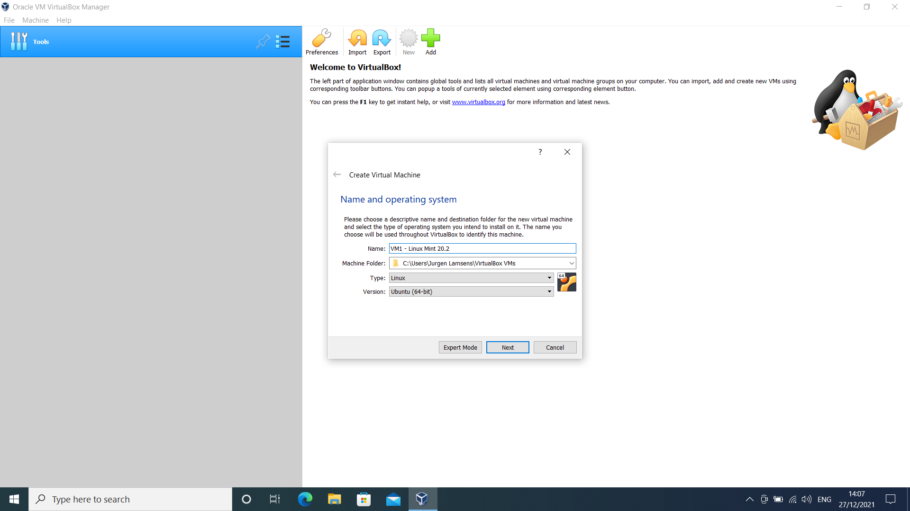](../../assets/images/virtualbox-windows/create-vm/mint/name-and-os.png) </kbd>

=== "Step3"

    <kbd>  </kbd>

=== "Step4"

    <kbd> [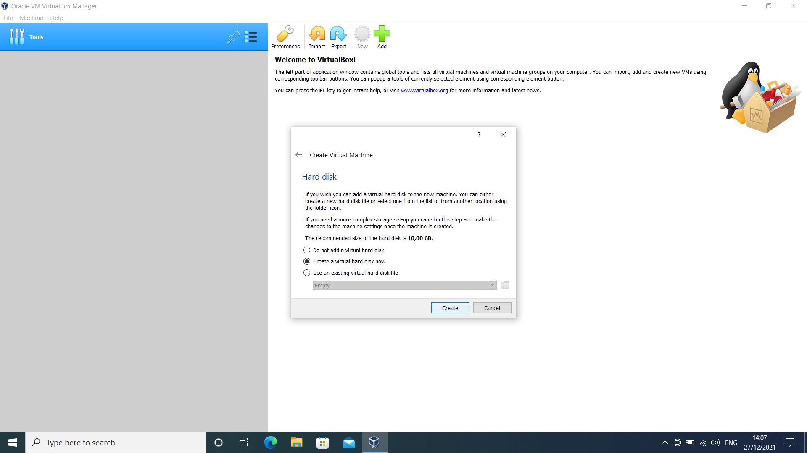](../../assets/images/virtualbox-windows/create-vm/mint/create-harddisk.png) </kbd>

=== "Step5"

    <kbd>  </kbd>

=== "Step6"

    <kbd> [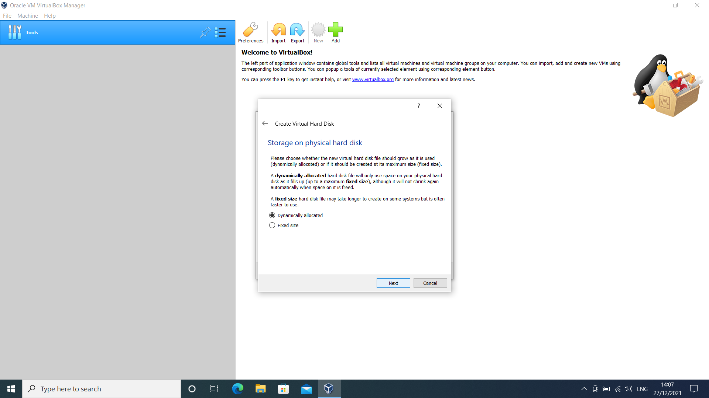](../../assets/images/virtualbox-windows/create-vm/mint/storage-type.png) </kbd>

=== "Step7"

    <kbd>  </kbd>

=== "Step8"

    <kbd> [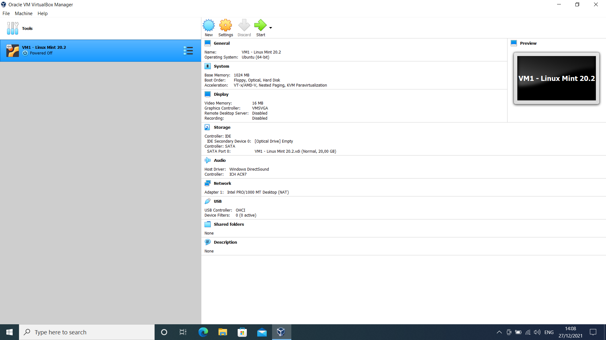](../../assets/images/virtualbox-windows/create-vm/mint/virtual-machine-details.png) </kbd>

## Debian 11.x

=== "Step1"

    <kbd> [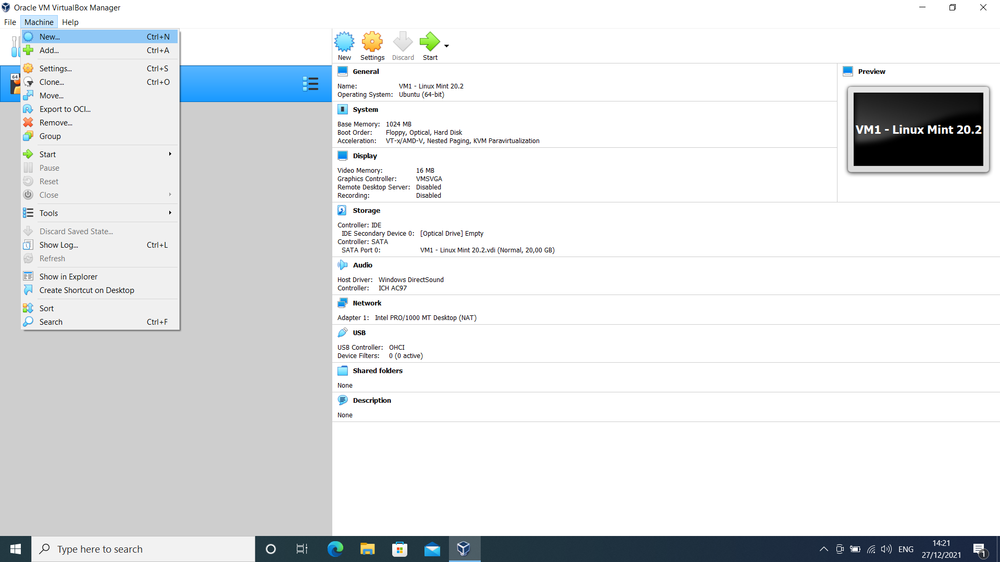](../../assets/images/virtualbox-windows/create-vm/debian/new.png) </kbd>

=== "Step2"

    <kbd> [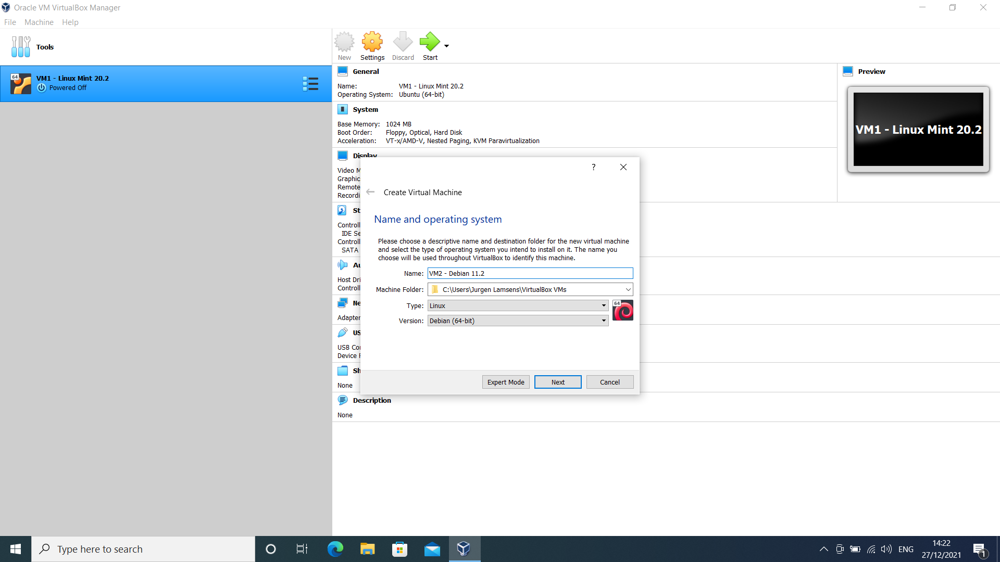](../../assets/images/virtualbox-windows/create-vm/debian/name-and-os.png) </kbd>

=== "Step3"

    <kbd> [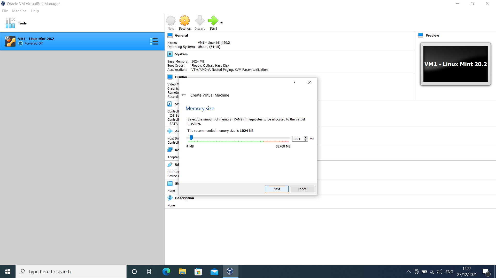](../../assets/images/virtualbox-windows/create-vm/debian/memory-size.png) </kbd>

=== "Step4"

    <kbd> [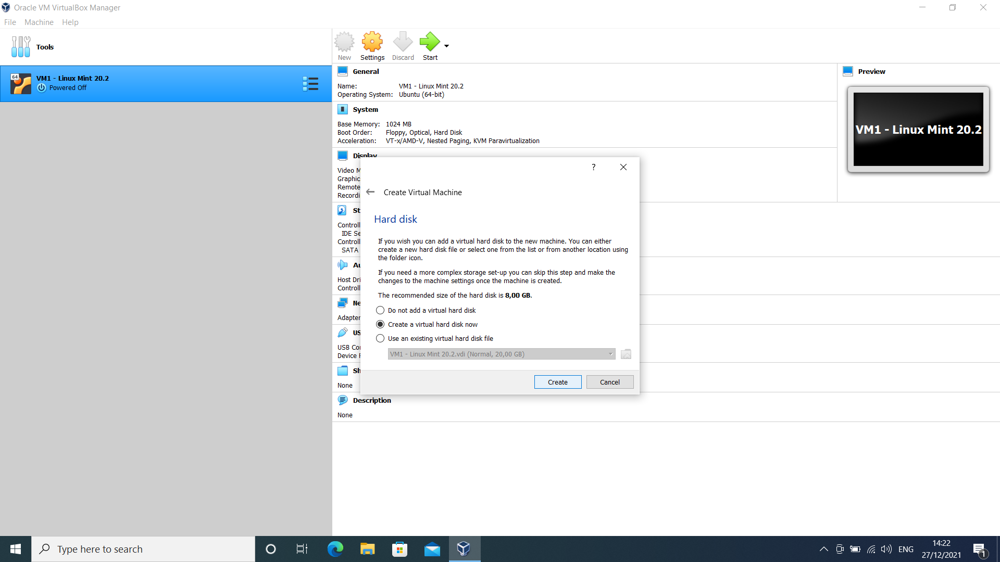](../../assets/images/virtualbox-windows/create-vm/debian/create-harddisk.png) </kbd>

=== "Step5"

    <kbd> [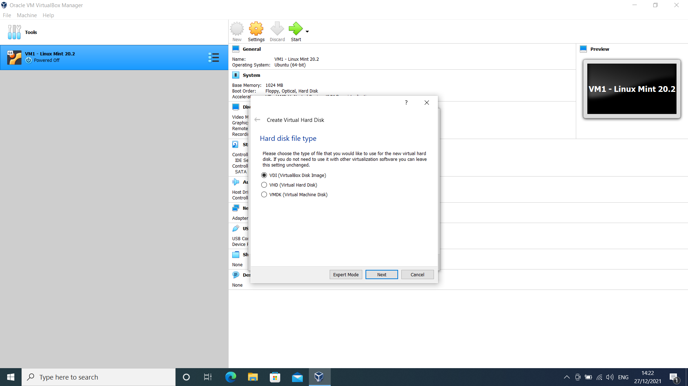](../../assets/images/virtualbox-windows/create-vm/debian/harddisk-type.png) </kbd>

=== "Step6"

    <kbd> [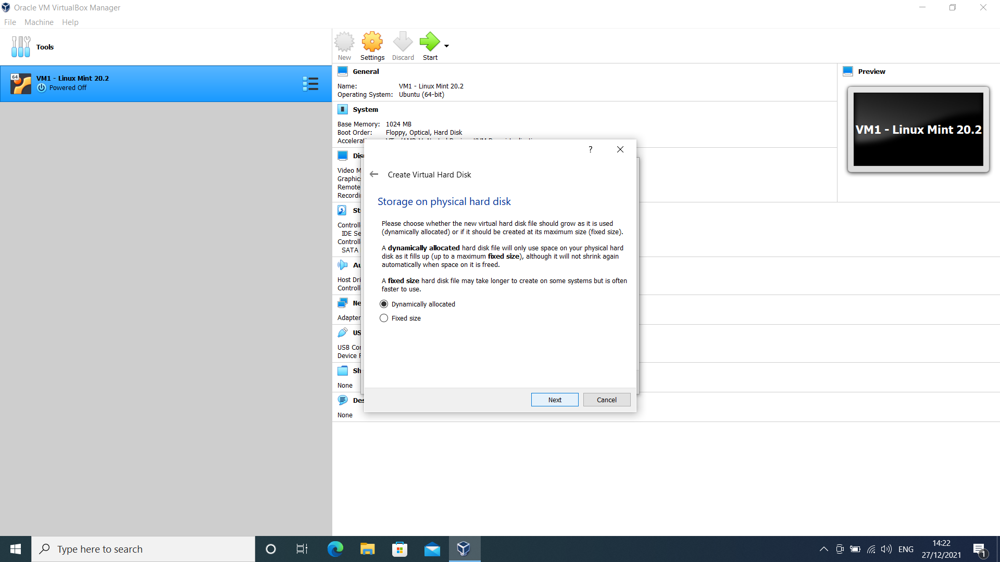](../../assets/images/virtualbox-windows/create-vm/debian/storage-type.png) </kbd>

=== "Step7"

    <kbd> [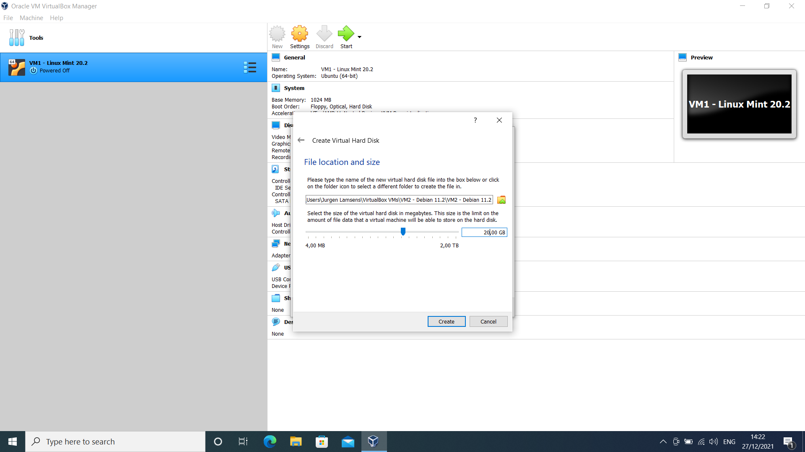](../../assets/images/virtualbox-windows/create-vm/debian/harddisk-location-and-size.png) </kbd>

=== "Step8"

    <kbd>  </kbd>

## Rocky Linux 8.x

=== "Step1"

    <kbd> [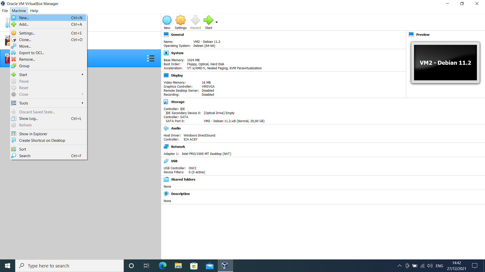](../../assets/images/virtualbox-windows/create-vm/rocky/new.png) </kbd>

=== "Step2"

    <kbd> [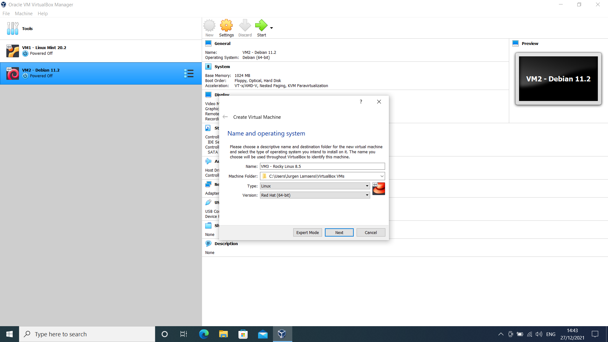](../../assets/images/virtualbox-windows/create-vm/rocky/name-and-os.png) </kbd>

=== "Step3"

    <kbd> [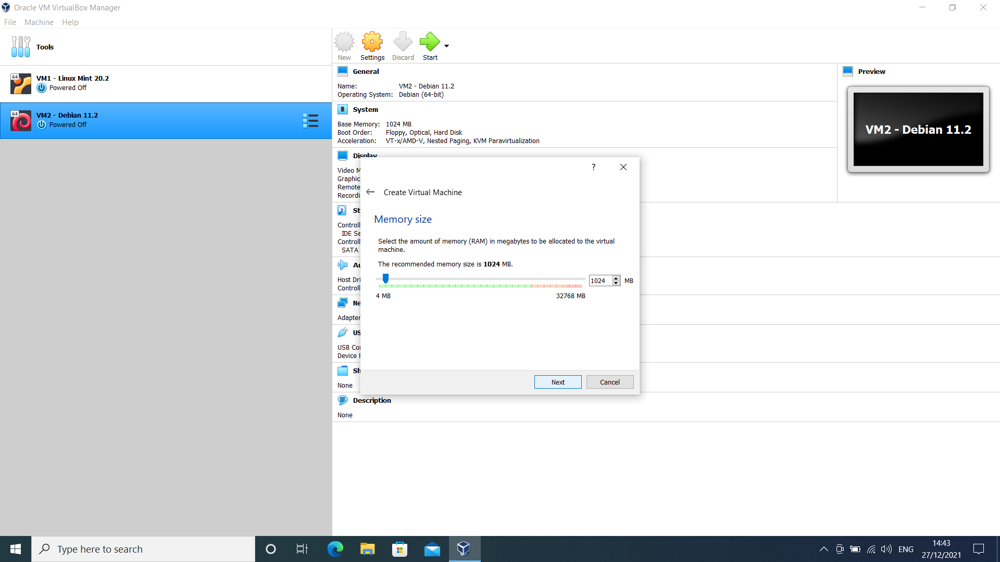](../../assets/images/virtualbox-windows/create-vm/rocky/memory-size.png) </kbd>

=== "Step4"

    <kbd> [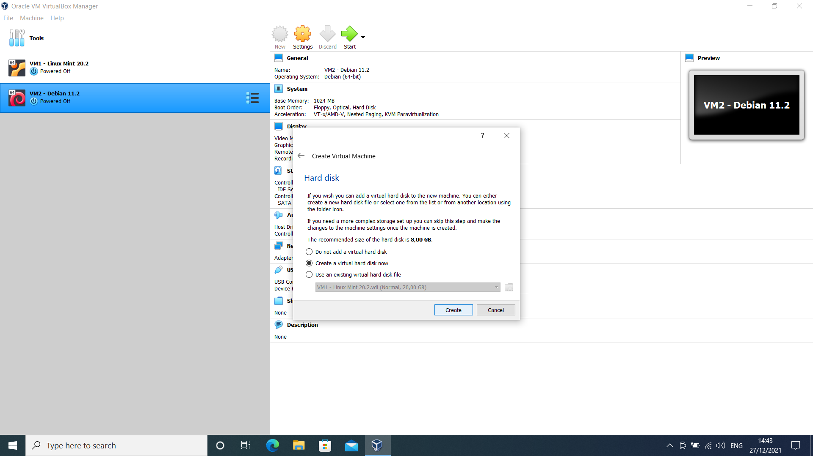](../../assets/images/virtualbox-windows/create-vm/rocky/create-harddisk.png) </kbd>

=== "Step5"

    <kbd>  </kbd>

=== "Step6"

    <kbd> [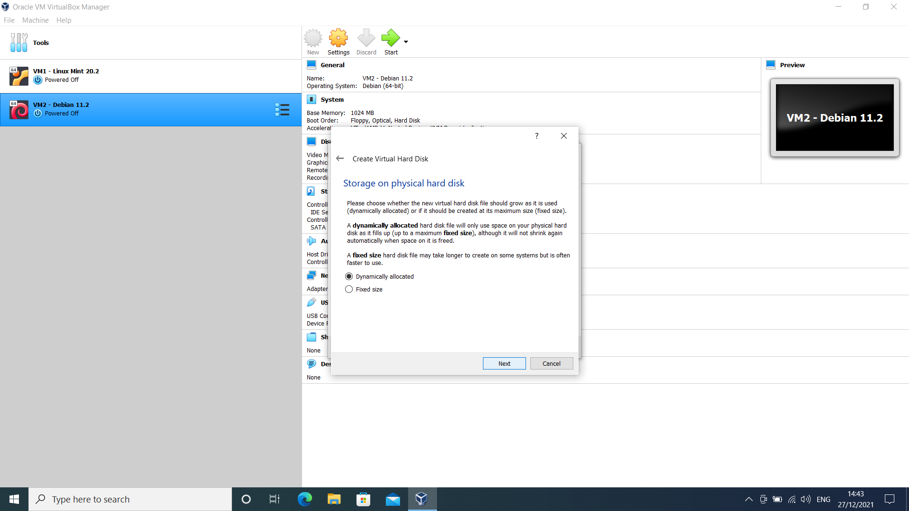](../../assets/images/virtualbox-windows/create-vm/rocky/storage-type.png) </kbd>

=== "Step7"

    <kbd> [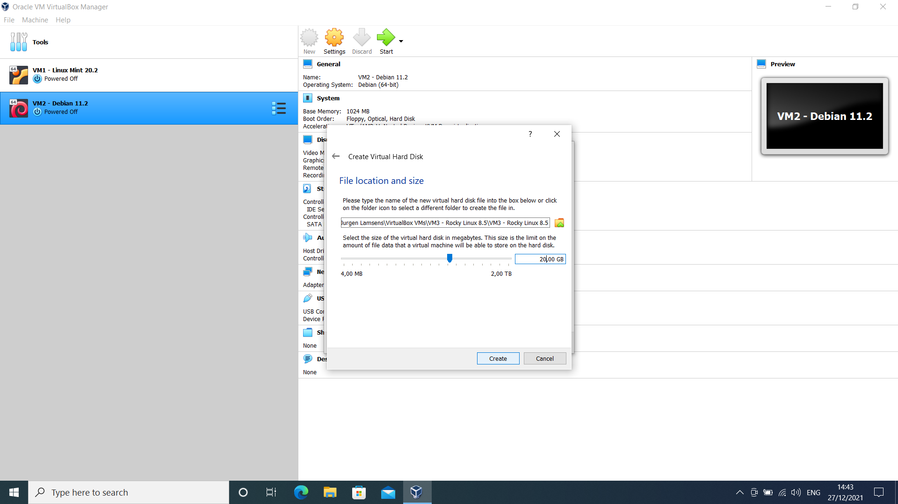](../../assets/images/virtualbox-windows/create-vm/rocky/harddisk-location-and-size.png) </kbd>

=== "Step8"

    <kbd> [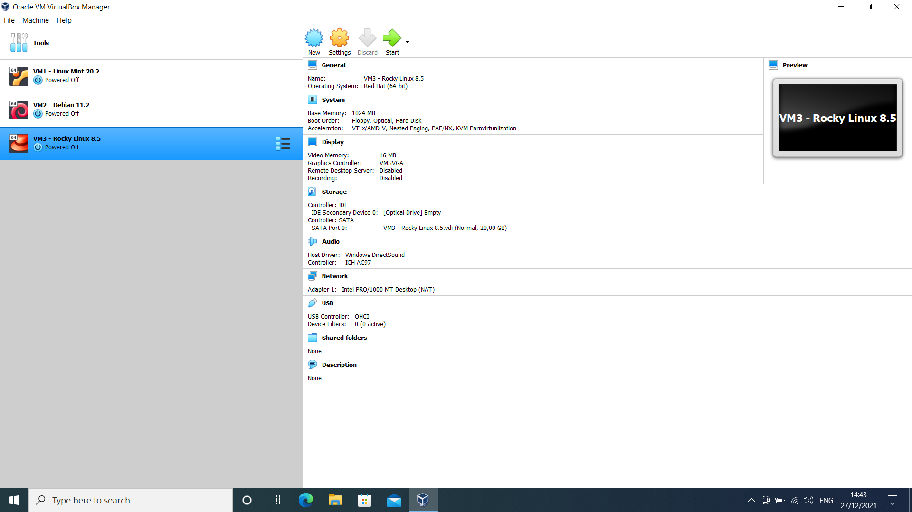](../../assets/images/virtualbox-windows/create-vm/rocky/virtual-machine-details.png) </kbd>