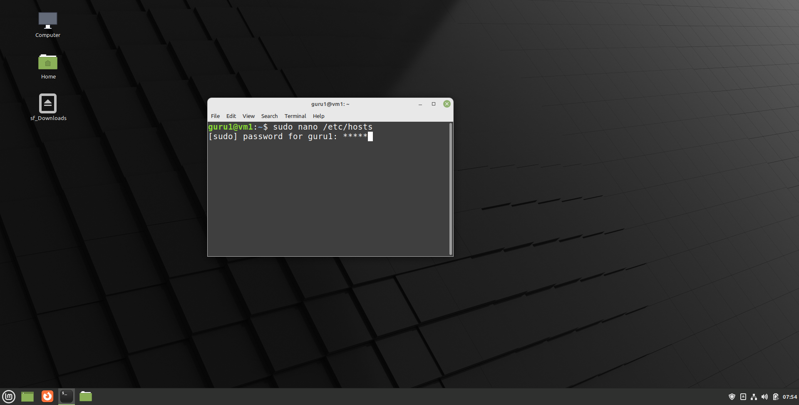

# Configuration operating system

## Linux Mint 20.X

### IPv4/default gateway/DNS

=== "Step1"
    Rechtsklik op het "netwerk icoontje".

    <kbd>  </kbd>

=== "Step2"

    <kbd>  </kbd>

=== "Step3"
    Gebruik de "schuif button" bij "Wired" om de connectie te activeren. Mocht de "Connection established" niet verschijnen, moet je mogelijks "herstarten".

    <kbd>  </kbd>

### Full update 1 / 2

=== "Step1"

    <kbd>  </kbd>

=== "Step2"

    <kbd>  </kbd>

=== "Step3"
    Klik voorlopig op "No" in de blauwe balk.

    <kbd>  </kbd>

=== "Step4"

    <kbd>  </kbd>

=== "Step5"
    Mogelijks is een nieuwe versie van de "Update Manager" beschikbaar. Doe de update.

    <kbd>  </kbd>

=== "Step6"
    Reminder: password is "guru1".

    <kbd>  </kbd>

### Full update 2 / 2

=== "Step7"

    <kbd>  </kbd>

=== "Step8"

    <kbd>  </kbd>

=== "Step9"
    Reminder: paswoord is "guru1".

    <kbd>  </kbd>

=== "Step10"

    <kbd>  </kbd>

=== "Step11"

    <kbd>  </kbd>

=== "Step12"

    <kbd>  </kbd>

### Ignore system reports

=== "Step1"
    Menu -> Administration -> System Reports. Selecteer telkens "Ignore this report" bij alle openstaande "reports".

    <kbd>  </kbd>

=== "Step2"

    <kbd>  </kbd>

### Resolving host names

=== "Step1"
    Reminder: password is "guru1".

    <kbd>  </kbd>

=== "Step2"
    Text editor "nano" wijst zichzelf uit. Gebruikers van "vi", laat je gaan!

    <kbd>  </kbd>

### Shutdown
We verwijderen nog gauw even onze commando historiek en zetten de machine uit.

<kbd>  </kbd>

## Debian 11.X

### IPv4/default gateway/DNS

=== "Step1"
    Login met gebruiker "guru2". Password is ook "guru2".

    <kbd>  </kbd>

=== "Step2"
    De netwerkinterface heet "enp0s3". We gaan die configureren.

    <kbd>  </kbd>

=== "Step3"
    Neem onderstaande configuratie over.

    <kbd>  </kbd>

=== "Step4"
    Instellen nameserver.

    <kbd>  </kbd>

=== "Step5"
    Neem onderstaande configuratie over.

    <kbd>  </kbd>

=== "Step6"
    Herstart de netwerk service. Vervolgens zou de ping moeten lukken.

    <kbd>  </kbd>

### Full update

=== "Step1"
    Configuratie van de package source file.

    <kbd>  </kbd>

=== "Step2"
    Dit wordt het meeste typwerk. Geen fouten maken! ;-)

    <kbd>  </kbd>

=== "Step3"
    Bijwerken van de lijst met beschikbare pakketten en hun versies.

    <kbd>  </kbd>

=== "Step4"
    Uitvoeren van de effectieve "upgrade" van alle geïnstalleerde pakketten.

    <kbd>  </kbd>

### Resolving host names

=== "Step1"

    <kbd>  </kbd>

=== "Step2"

    <kbd>  </kbd>

### Shutdown

<kbd>  </kbd>

## Rocky Linux 8.X

### IPv4/default gateway/DNS

=== "Step1"
    Inloggen met "guru3". Password is ook "guru3".

    <kbd>  </kbd>

=== "Step2"

    <kbd>  </kbd>

=== "Step3"
    Neem onderstaande configuratie over. Sommige regels zijn reeds aanwezig (en/of moeten aangepast worden).

    <kbd>  </kbd>

=== "Step4"
    Herstart de netwerk service. Vervolgens zou de ping moeten lukken.

    <kbd>  </kbd>

### Full update

=== "Step1"

    <kbd>  </kbd>

=== "Step2"

    <kbd>  </kbd>

=== "Step3"

    <kbd>  </kbd>

### Resolving host names

=== "Step1"
    Of gebruik "nano" indien meer comfortabel.

    <kbd>  </kbd>

=== "Step2"

    <kbd>  </kbd>

=== "Step3"

    <kbd>  </kbd>

=== "Step4"

    <kbd>  </kbd>

### Shutdown

<kbd>  </kbd>