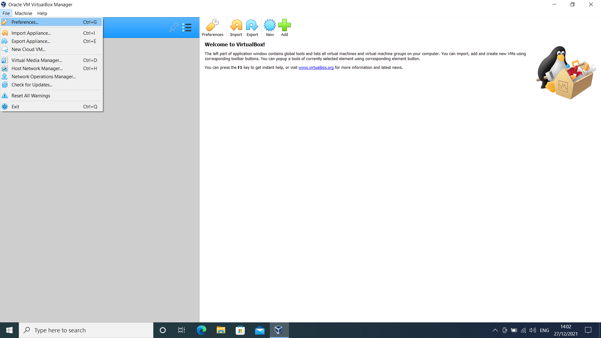
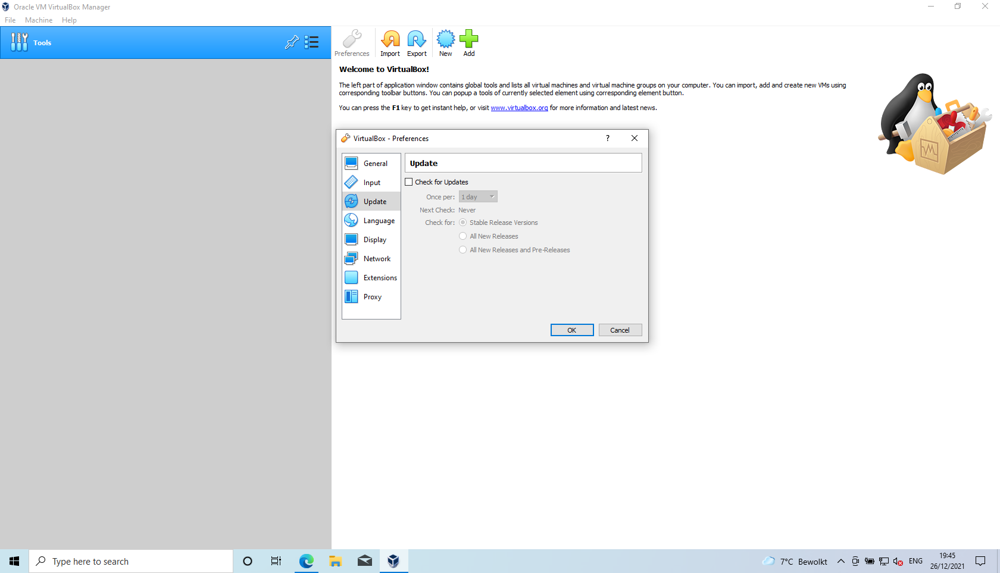
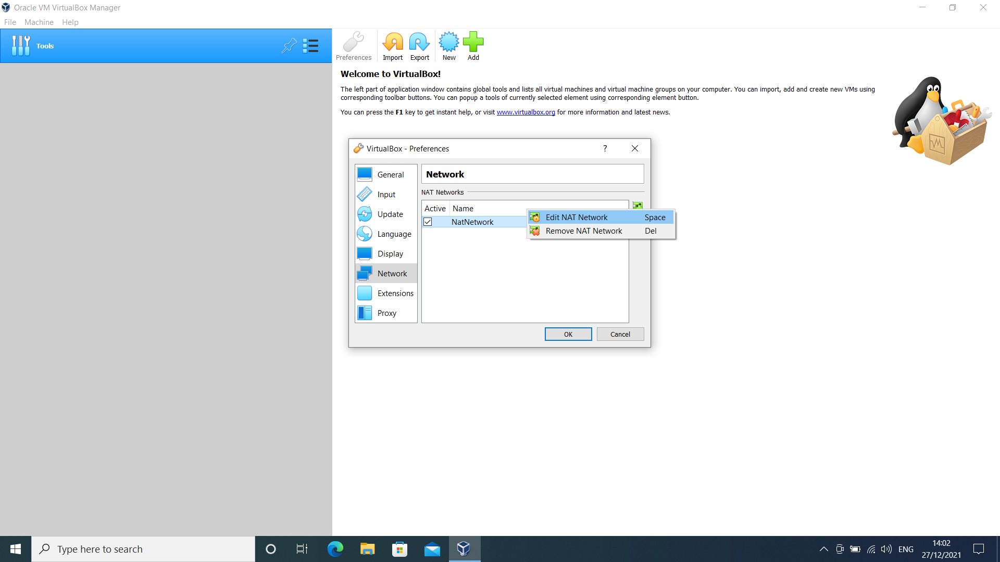
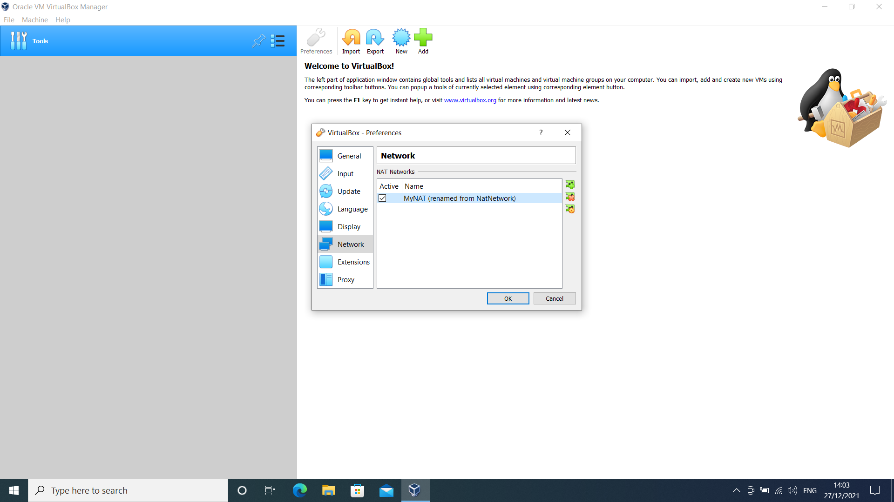

# Configuration VirtualBox

## Preferences
<kbd>  </kbd>

## No updates
<kbd>  </kbd>

## Add NAT network
<kbd>  </kbd>

## Edit NAT network
<kbd>  </kbd>

## NAT network details
<kbd>  </kbd>

## NAT network renamed
<kbd>  </kbd>