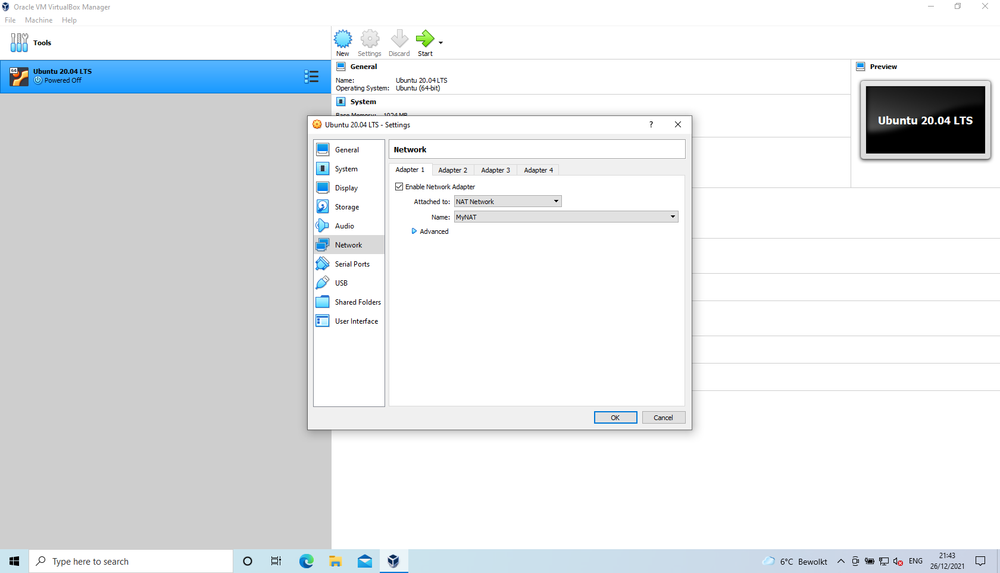
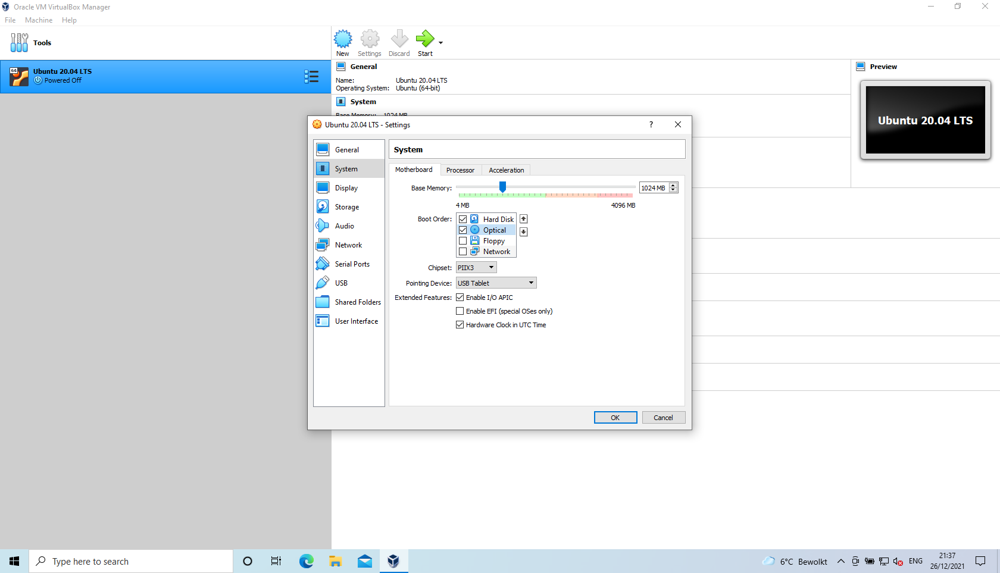
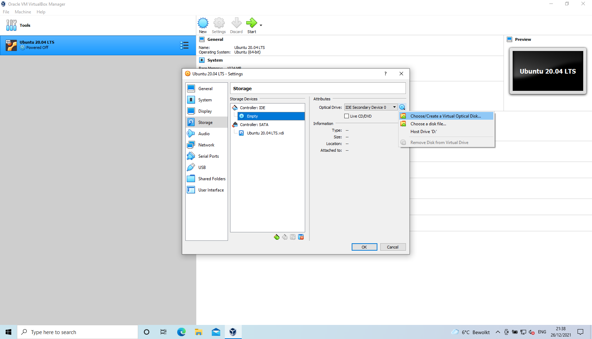
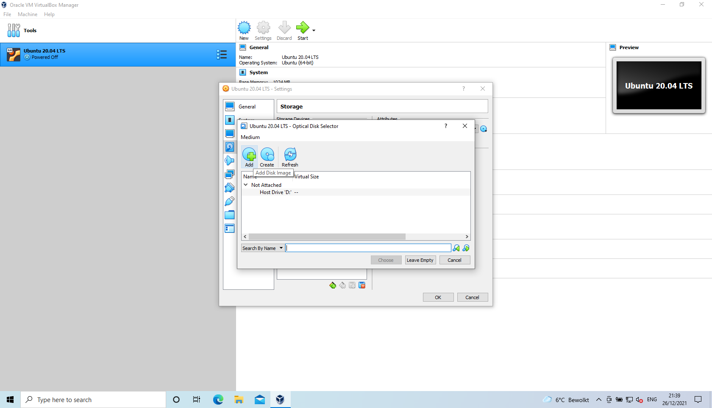
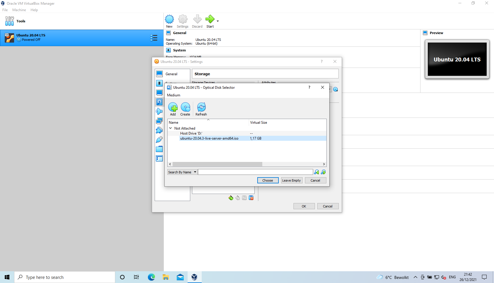
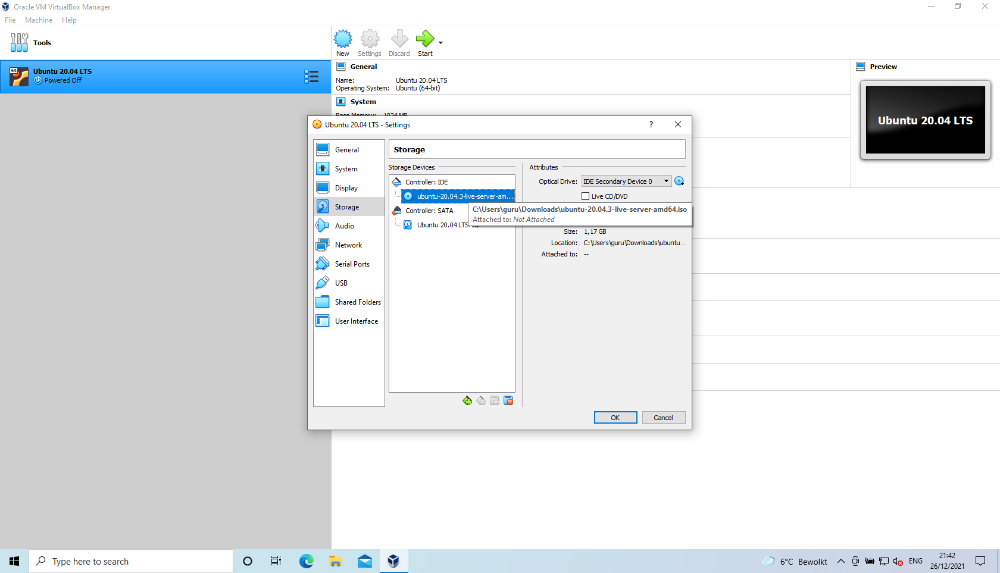
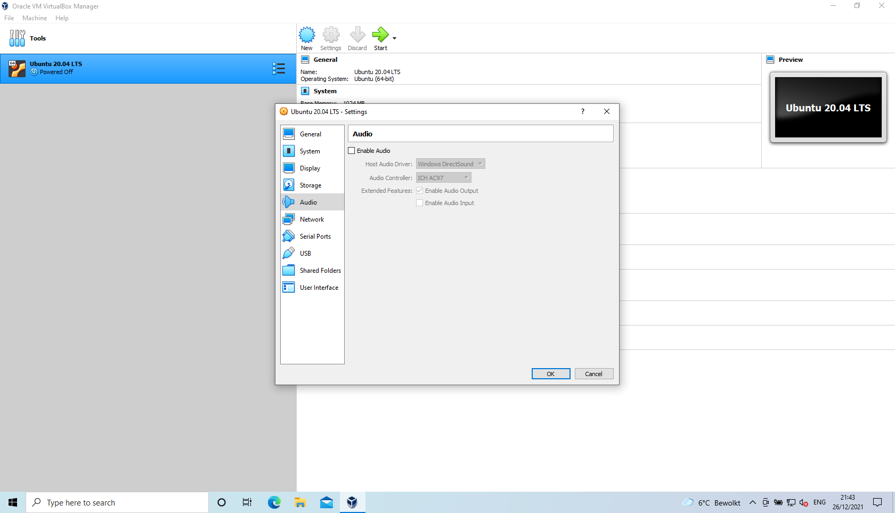
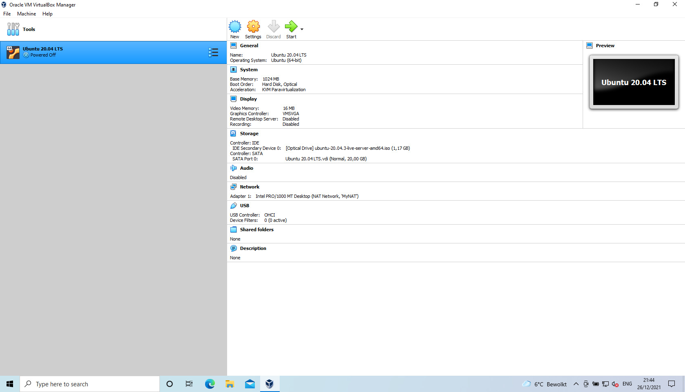

# Configuration virtual machine

## Download Ubuntu ISO
<kbd>  </kbd>

## Settings
<kbd>  </kbd>

## Clipboard
<kbd>  </kbd>

## Boot order
<kbd>  </kbd>

## Insert ISO
<kbd>  </kbd>

## Add disk image
<kbd>  </kbd>

## Select ISO
<kbd>  </kbd>

## Optical disk selector
<kbd>  </kbd>

## ISO attached
<kbd>  </kbd>

## Disable audio
<kbd>  </kbd>

## NAT network
<kbd>  </kbd>

## Virtual machine details
<kbd>  </kbd>