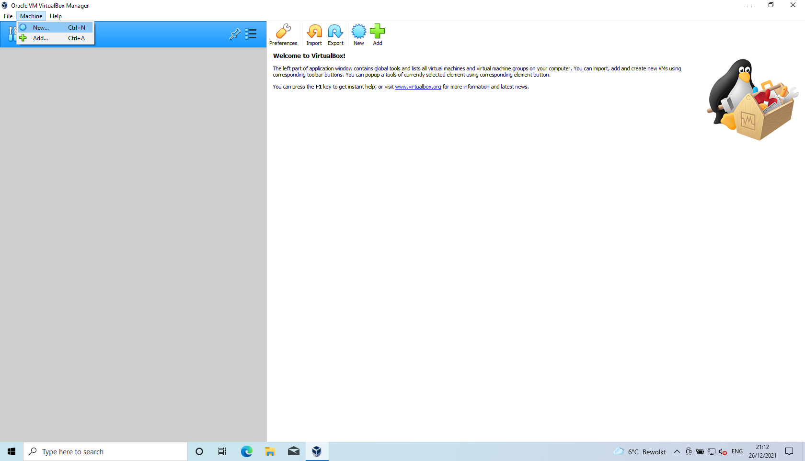
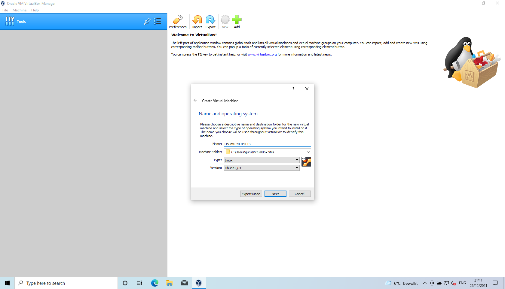
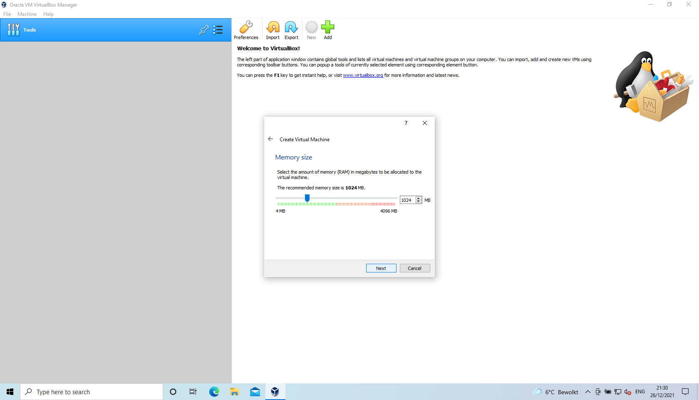
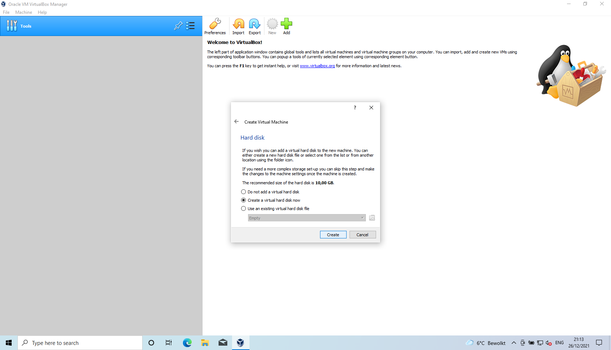
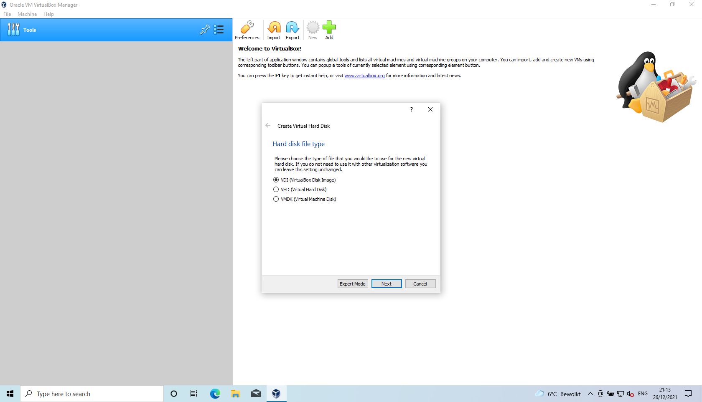
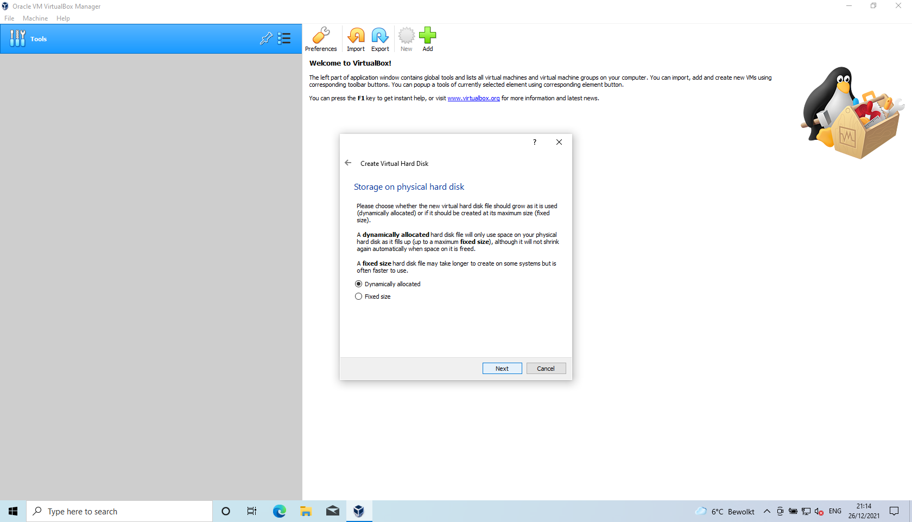
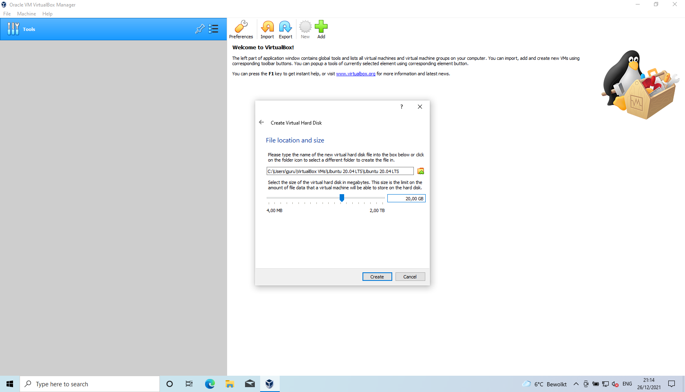
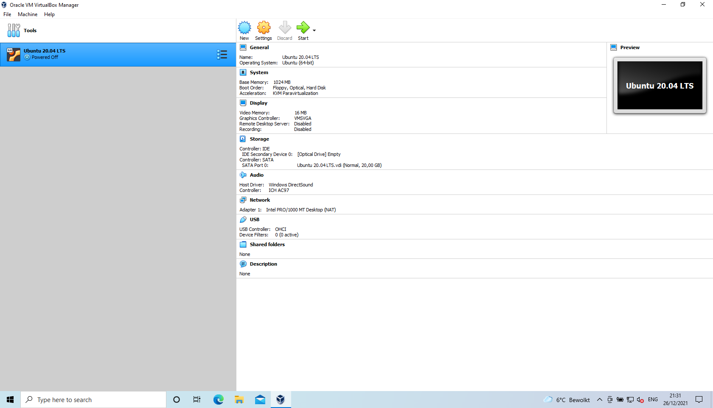

# Creation virtual machine

## New
<kbd>  </kbd>

## Name and OS
<kbd>  </kbd>

## Memory size
<kbd>  </kbd>

## Create harddisk
<kbd>  </kbd>

## Harddisk type
<kbd>  </kbd>

## Storage type
<kbd>  </kbd>

## Harddisk location and type
<kbd>  </kbd>

## Virtual machine details
<kbd>  </kbd>