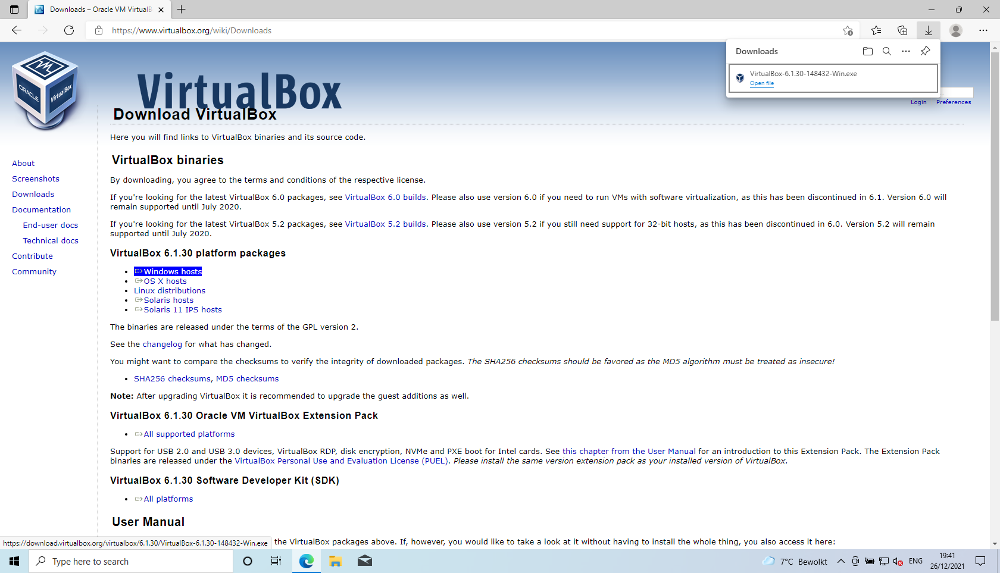
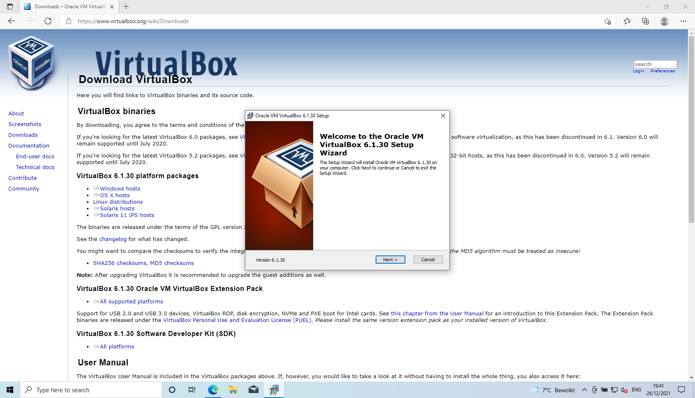
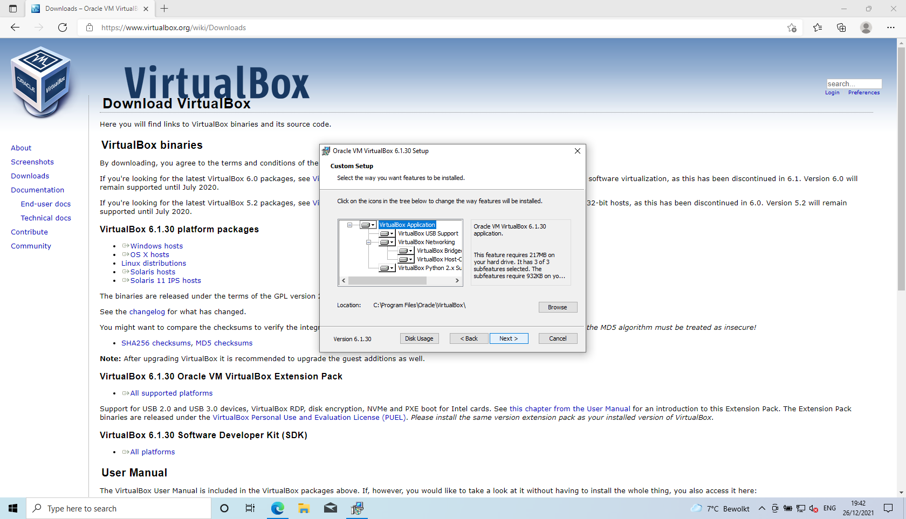
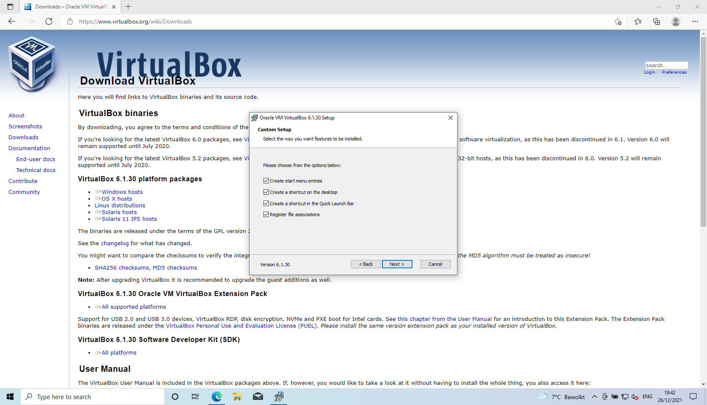
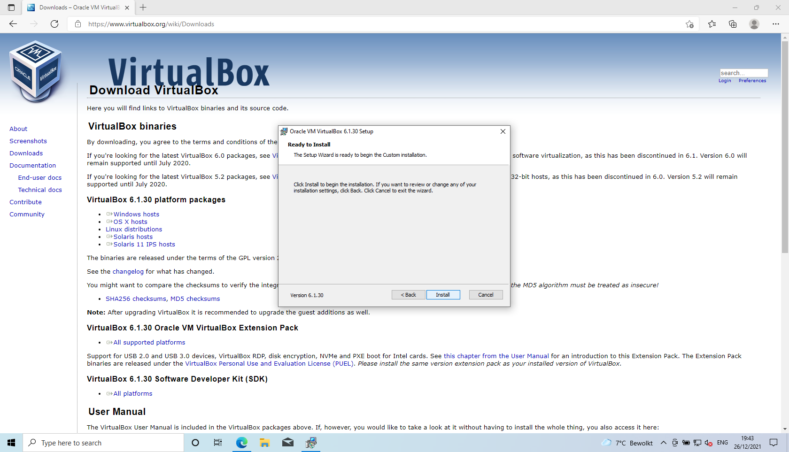
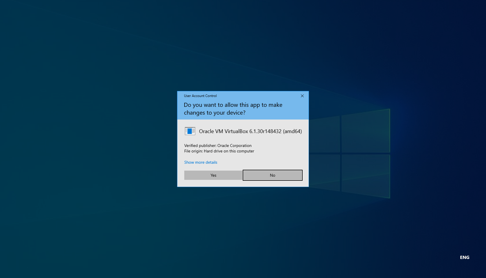
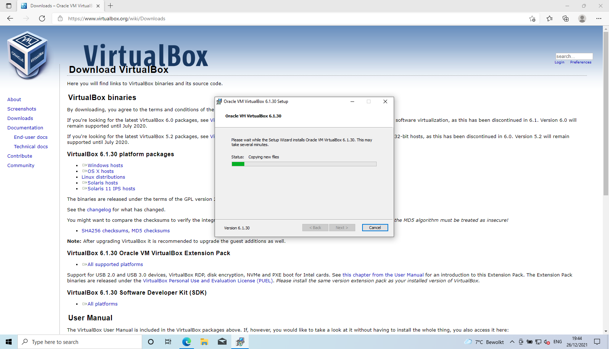

# Section title

## Download
<kbd>  </kbd>

## Welcome
<kbd>  </kbd>

## Options
<kbd>  </kbd>

## Features
<kbd>  </kbd>

## Network warning
<kbd>  </kbd>

## Ready to install
<kbd>  </kbd>

## Microsoft Windows UAC
<kbd>  </kbd>

## Installing
<kbd>  </kbd>

## Complete
<kbd>  </kbd>