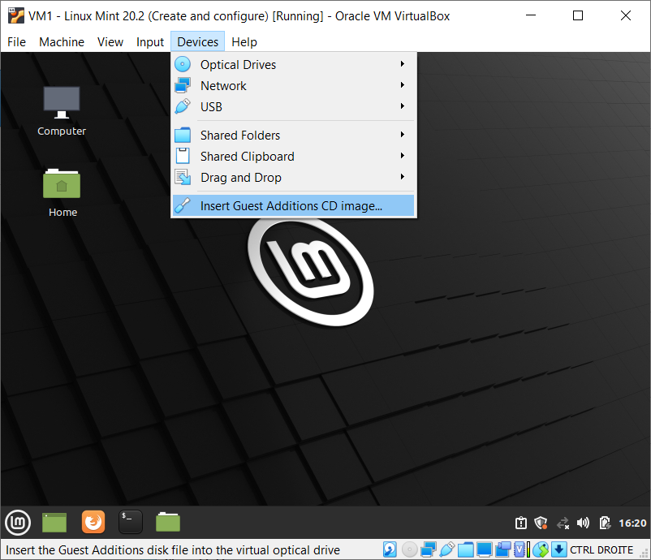
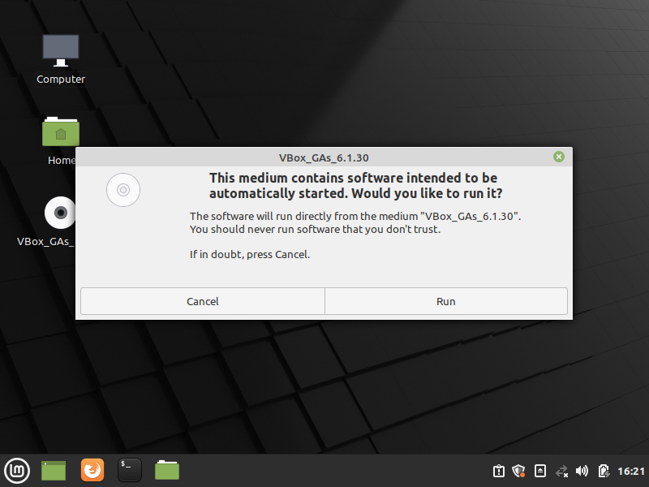
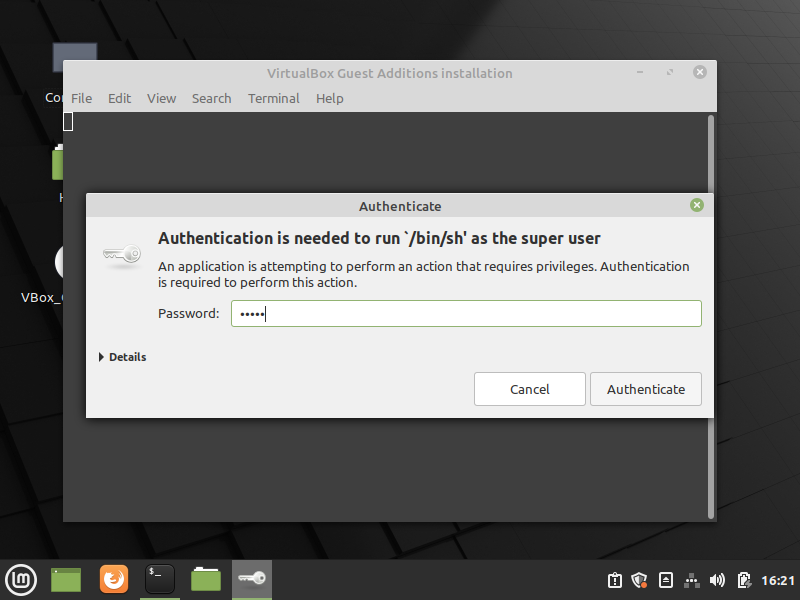
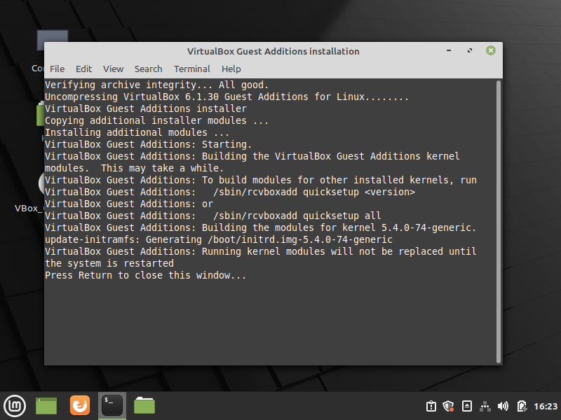
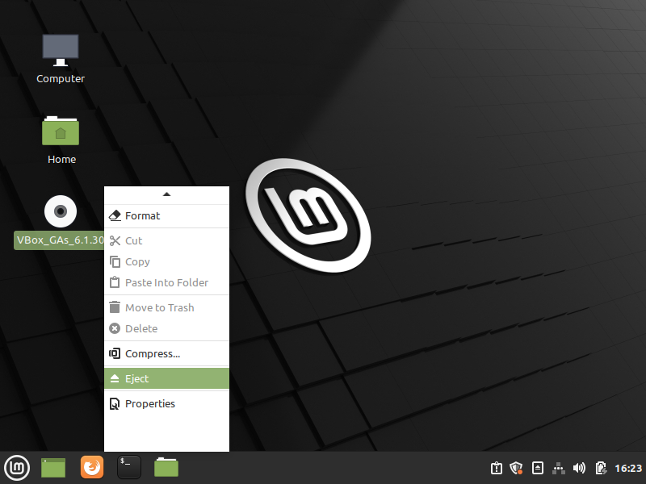
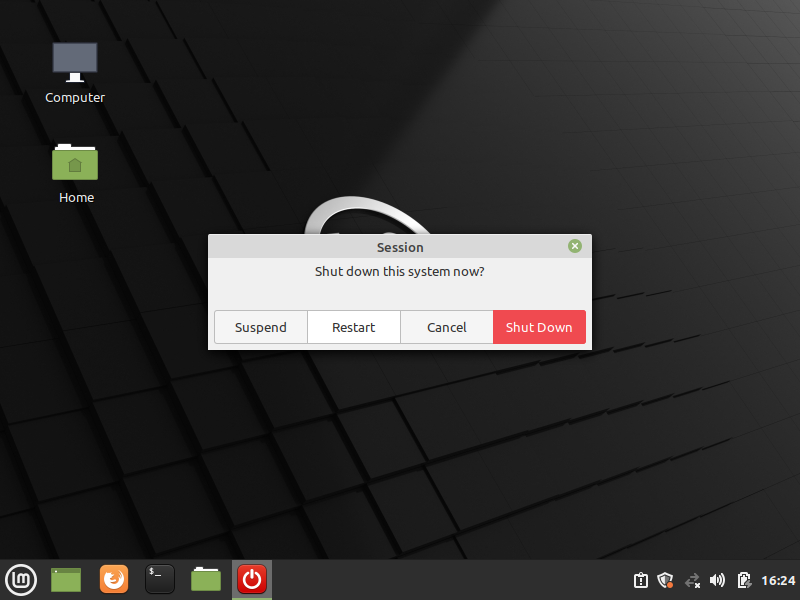
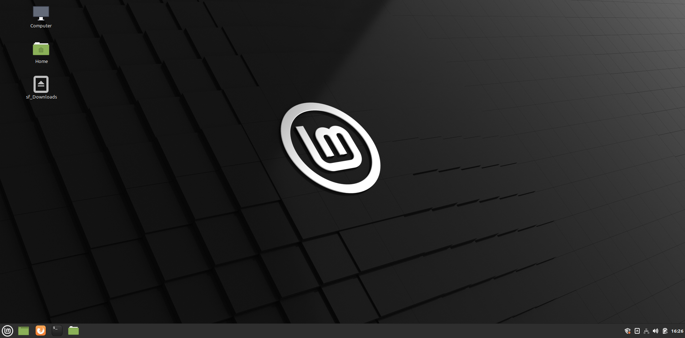
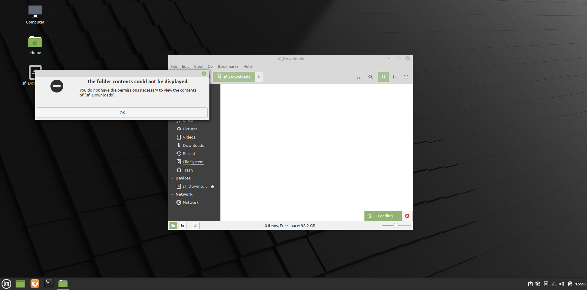
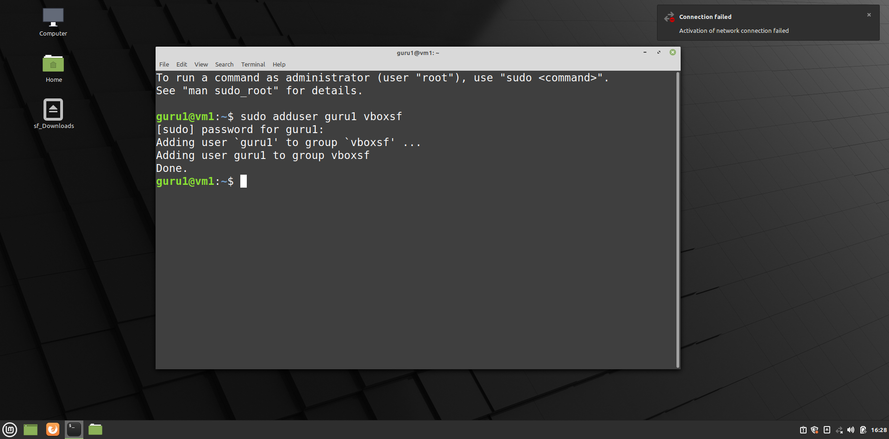
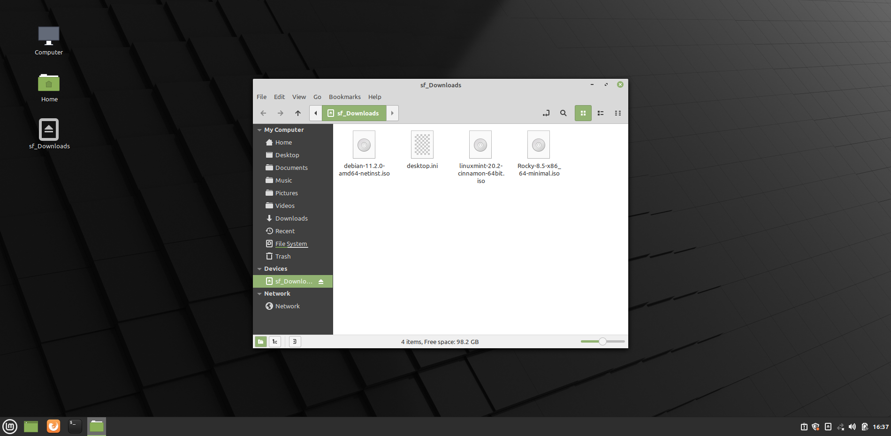

# Pre-configuration operating system

## Linux Mint 20.X

### Guest additions and shared folder: steps 1 --> 4

=== "Step1"

    <kbd>  </kbd>

=== "Step2"

    <kbd>  </kbd>

=== "Step3"

    <kbd>  </kbd>

=== "Step4"

    <kbd>  </kbd>

### Guest additions and shared folder: steps 5 --> 10

=== "Step5"

    <kbd>  </kbd>

=== "Step6"

    <kbd>  </kbd>

=== "Step7"

    <kbd>  </kbd>

=== "Step8"

    <kbd>  </kbd>

=== "Step9"
    
    <kbd>  </kbd>

=== "Step10"
    The shared folder will only be accessible after a loggoff and logon.

    <kbd>  </kbd>

## Debian 11.X

No pre-configuration here.

## Rocky Linux 8.X

No pre-configuration here.